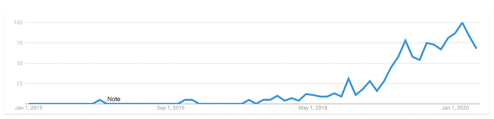
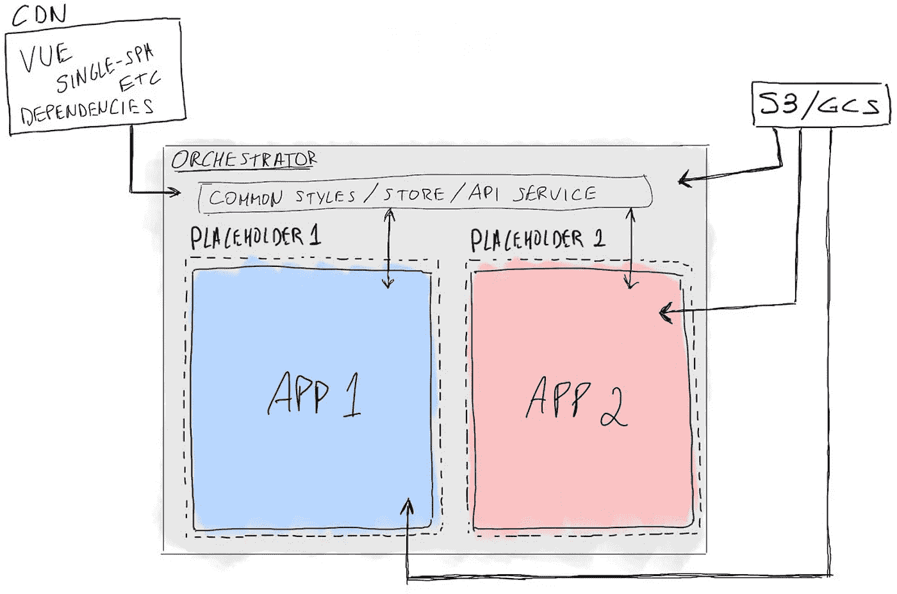
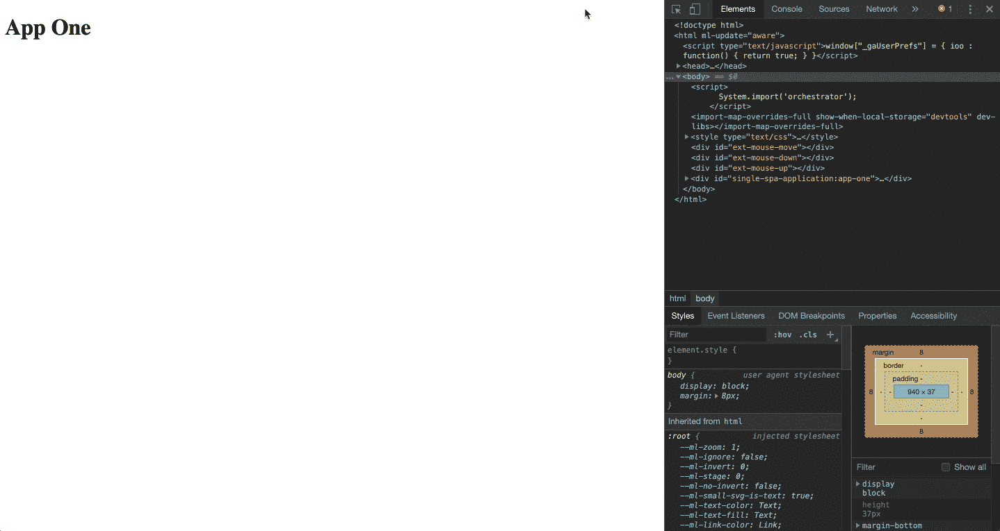
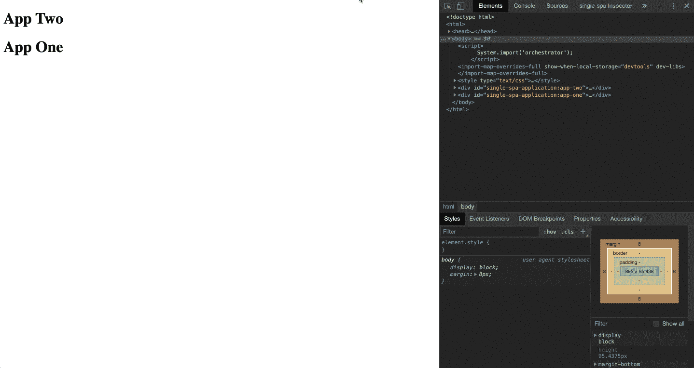
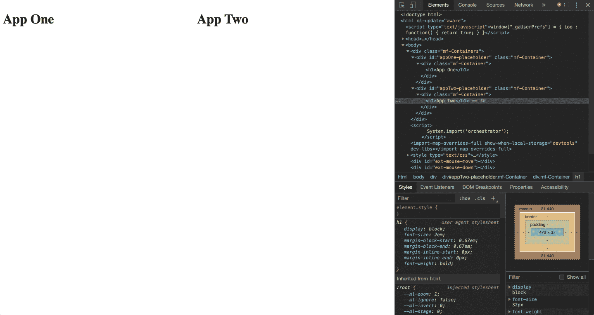

# 使用 Vue 和单 spa 设置微前端架构

> 原文：<https://itnext.io/setup-a-micro-frontend-architecture-with-vue-and-single-spa-2c89528bf72f?source=collection_archive---------0----------------------->

使用 [single-spa](https://single-spa.js.org/) 通过多个 Vue.js 应用构建微前端架构的实践演练。请注意，您可以用自己选择的框架替换 Vue。

> 听听[对 Vue 第 160 集](https://viewsonvue.com/building-micro-frontends-with-lawrence-almeida-vue-160)的看法，在那里我讨论了我们如何在[unbal](https://unbabel.com/)实现这个架构的细节。


照片由 [Unsplash](https://unsplash.com/s/photos/blocks?utm_source=unsplash&utm_medium=referral&utm_content=creditCopyText) 上的 [La-Rel 复活节](https://unsplash.com/@lastnameeaster?utm_source=unsplash&utm_medium=referral&utm_content=creditCopyText)拍摄

三部分指南的第一部分，旨在为如何使用 single-spa 为您的项目设置和组织微前端架构奠定基础。

**第 1 部分** —设置 orchestrator 层，加载必要的资产、第三方库和我们的微应用；

**第二部分(TBD)** —组织通用的风格和可重用的组件；在应用程序之间共享和操作状态；

**第 3 部分(TBD)** —部署到网络，同时避免并发；

# 什么是微前端？

微前端的概念已经存在了一段时间，但在过去几年里得到了更多的关注。



2015-2020 年谷歌趋势上搜索词“微前端”的演变

微前端扩展了后端微服务的概念:将一个 web 应用程序(一个整体 SPA)分解成不同的部分。然后，通过 orchestrator 层，将每个部分组装(或组合)在一起。这样做有多种方式。在我们的例子中，我们将使用单 spa 进行所谓的客户端组合。

# 什么时候应该使用这种方法？

在[un label](https://medium.com/u/f67c142acd49?source=post_page-----2c89528bf72f--------------------------------)我们目前为一款面向客户的新产品使用微前端架构。

像任何技术决策一样，也有权衡。在决定采用这种方法时，我们权衡了几个因素:

*   要构建的产品将由至少 6 个不同的区域组成，即界面；
*   几个多学科团队将拥有并完全自主地交付产品的各个部分；
*   有可能部分改变产品堆栈的部件。虽然 Vue 是公司选择的框架，但我们不知道 3 年后它是否还是我们想要使用的；

**你应该考虑这些优势:**

*   团队在以不同的速度向产品交付价值方面有更大的自主权，因为他们的开发可以很大程度上独立于其他团队；
*   拥有完全独立的存储库、测试和部署流程的能力；
*   能够轻松覆盖部分应用程序界面(即 A/B 测试、增量展示)；
*   在不影响应用程序其他部分的情况下，并行使用不同的框架或进行实验；
*   能够重构产品的一部分，而不必一次全部改变；

**你应该考虑这些警告:**

*   根据您正在构建的产品的范围和特性，设置、部署和维护的开销会增加；
*   更多可移动的部分:重要的是要有一个可靠的文档来说明一切是如何设置和关联的，以及定义指导方针来管理如何在架构中进行开发；
*   让开发人员更深入地了解架构、其生命周期和依赖性。因此，拥有完整的文档是必要的；
*   微前端仍然相对较新，对于如何实现这一点，没有放之四海而皆准的方法或公认的共识。根据你的情况，准备好做相当多的 R&D；

根据我的经验，在构建相对较大的 web 应用程序时，这种方法是最好的，在这种情况下，您希望为多个团队提供灵活性，并有足够的时间致力于治理和文档编制。

话虽如此，你绝对可以和 2-3 人的团队甚至是单独的团队一起利用许多微前端的优势。

# 架构图



简而言之:供应商依赖关系从 CDN 加载，app 1 和 2 捆绑包从 S3/GCS 加载，我们的 orchestrator 将它们组合/捆绑在一起。

# 构建 Orchestrator 应用程序

orchestrator 应用程序只不过是持有 single-spa 的项目，single-spa 负责根据应用程序的激活功能来决定加载哪些应用程序(稍后将详细介绍)。

本演练遵循单温泉的[推荐设置](https://single-spa.js.org/docs/recommended-setup)。还可以查看 [vue-microfrontends 示例 repo](https://github.com/vue-microfrontends) 。

## 创建项目

1.  创建一个父文件夹，将所有项目文件夹和 *cd* 放入其中；
2.  创建一个名为 *orchestrator* 的文件夹，并将 *cd* 放入其中；
3.  运行 *npm init* 创建一个空的 *package.json —* 当询问入口文件名时，将其设置为*main . js；*
4.  修改 *package.json 的*脚本:

```
...
*"scripts"*: {
  *"serve"*: "webpack-dev-server --mode=development --env.isLocal=true",
  *"lint"*: "eslint src",
  *"prettier"*: "prettier --write './**'",
  *"build"*: "webpack --mode=production"
},
...
```

5.安装所需的依赖项:

```
npm i -D @babel/core @babel/preset-env @types/systemjs babel-eslint babel-loader clean-webpack-plugin concurrently eslint eslint-config-important-stuff eslint-config-prettier eslint-plugin-prettier html-webpack-plugin mini-css-extract-plugin prettier pretty-quick webpack webpack-cli webpack-dev-server *dotenv-webpack*
```

## 添加 index.ejs

这是我们的用户在访问我们的应用程序时会碰到的。它使用 [EJS](https://ejs.co/) 在构建时轻松生成 HTML 标记。

在 Orchestrator 文件夹的根目录下，创建一个 *index.ejs* 文件，并添加以下内容:

**这里发生了什么？**

1.  我们希望通过[导入映射](https://github.com/WICG/import-maps)在浏览器中使用“裸导入说明符”。因为导入映射规范只在 Chrome 中实现，所以我们将使用 [SystemJS](https://github.com/systemjs/systemjs) 来加载我们的导入映射(第 9 行)并导入我们想要的模块(第 25 行)；
2.  第 12–13 行允许我们加载额外的模块或者覆盖在 *importmap.json 中定义的模块；*
3.  第 25 行加载我们项目的入口点(*main . js*)；
4.  因为 SystemJS 是一个动态 JS 模块加载器，并且通过使用 [import-map-overrides](https://github.com/joeldenning/import-map-overrides) (第 27 行)，我们能够动态地重新加载模块(稍后将详细介绍)；
5.  *style* 标签暂时是临时的，只是用来样式化我们将在本演练的第 2 部分中使用的 Snackbar

使用这种浏览器 ES 模块+导入映射的方法[有几个优点](https://single-spa.js.org/docs/recommended-setup)，但主要是，它允许我们只加载一次跨微应用程序共享的依赖项(例如 Vue)并在应用程序之间轻松共享通用代码。

## 添加 importmap.json

在项目的根目录下创建一个名为 *importmap.json* 的文件，并添加以下内容:

这个文件决定了我们想要在浏览器中导入的位置。目前，我们只加载我们的架构所需的库，但是一旦这些库可用，它也会指向我们的应用程序的位置。我们现在在本地加载它，但是这个 JSON 文件也应该是独立服务的，允许你从任何 CI/CD 过程中单独地改变它。例如，您可以使用 [jsonbin.io](https://jsonbin.io/) 来托管 JSON(仅用于测试)并轻松地更改其内容。

除了基本的依赖关系( *single-spa* ，*vue*&*vue-router*)，我们还导入了两个库，我们将在本演练的第二部分中使用:

*   [pubsub-js](https://github.com/mroderick/PubSubJS) ，发布/订阅模式实现，将充当事件总线；
*   [snackbar](https://www.polonel.com/snackbar/) ，一个素材风格通知敬酒；

## 添加 local-importmap.json

拥有一个本地导入映射对于本地开发来说是至关重要的，否则我们需要本地旋转每个微前端，以使整个架构正常运行。 *local-importmap.json* 允许我们添加和覆盖在 *importmap.json* 中定义的任何东西(即，覆盖一个在暂存或生产中的应用，或者加载一个不同版本的 Vue)。

现在，我们将只为在本地运行的 Orchestrator 应用程序定义入口点:

将此文件添加到您的*中。gitignore* ，允许团队成员根据他们的工作导入不同的应用，而不影响其他人的导入。

## 添加 webpack.config.js

在项目的根目录下创建一个 webpack.config.js，并向其中添加以下内容:

## 添加*。环境*

折出一个*。env* 文件，内容为:

```
NODE_ENV=development
```

## 添加 main.js

添加一个 *main.js* 文件，内容如下:

现在入口点非常简单:它导入 *single-spa* ，等待所有模块被导入(*pubsub-js*&*snack bar*)，一旦被加载，启动 *single-spa* 并显示一个成功提示。随着架构的发展，我们将向该文件添加更多内容。

现在可以运行 *npm run serve* 并访问 *http://localhost:5000* 。如果一切顺利，你应该会看到左下角的祝酒词写着“单人水疗已加载”。

我们现在有了基本的设置，我们将使用它来加载和编排我们将要构建的微前端。

orchestrator 应用程序应该看起来像这样。

# 创建第一个 Vue 应用

我们的 Vue 应用程序需要进行一些小的修改，以便可以在 *single-spa* 中注册。幸运的是，single-spa 允许轻松地[与所有主要框架](https://single-spa.js.org/docs/ecosystem)集成。

在我们的例子中，我们将使用[vue-CLI-plugin-single-spa](https://github.com/single-spa/vue-cli-plugin-single-spa)为我们执行这些更改。

1.  在父文件夹中，创建一个名为 *app-one* 的 Vue 应用:

```
vue create app-one
```

2.*将*CD 到 *app-one* 中，安装 *single-spa* Vue 插件，该插件将按照此处所述的[执行更改:](https://single-spa.js.org/docs/ecosystem-vue/)

```
vue add single-spa
```

3.安装 *webpack* 的 *EventHooksPlugin:*

```
npm i -D event-hooks-webpack-plugin
```

4.通过删除*组件*、*资产*和*公共*文件夹，从 Vue 中清除样板代码，并修改 *App.vue* 如下:

5.创建一个 *vue.config.js* 并添加以下内容:

这里需要注意一些事情:

*   我们告诉 *webpack* 我们希望输出在 bundle 文件夹的根目录下完成(第 17 行)；
*   我们通过 *config.externals* 告诉 webpack 不要在最终捆绑包中包含一些依赖项，因为 Vue 和 vue-router 将由 Orchestrator 应用程序提供；
*   我们没有散列文件名；
*   我们正在从*dist*build 文件夹中删除*index.html*，因为它没有必要；

App-one 现在应该像这个分支中的[所示进行设置。让我们旋转它并确保它的入口文件是可访问的。](https://github.com/mstrlaw/app-one/tree/0-bare-bones)

运行 *npm 运行 serve* 访问*http://localhost:8080/app . js .*你应该能看到编译好的 Javascript *。*

## 向 single-spa 注册应用程序

我们现在需要告诉 *single-spa* 我们想要注册一个应用程序，以便在 Orchestrator 应用程序中安装它。在 Orchestrator 应用程序中:

1.  将模块条目添加到 *local-importmap.json* 以便 SystemJS 可以导入它:

**注意**键值" *app-one"* 必须与位于*src/set-public-path . js .*中的 app 的 *setPublicPath* 函数使用的键值相同

2.修改 *main.js* ，使其看起来像这样:

这里 [registerApplication](https://single-spa.js.org/docs/api#registerapplication) 用于在 *single-spa 中注册一个 app。*

***activeWhen*** 是一个重要的功能(激活功能)，本质上决定了这个 app 应该在什么时候挂载。它必须返回 *true* 才能安装它。在本例中，我们只是希望当前位置以“/”开头，但是您可以验证许多其他方面，例如用户是否有特定的角色、设备类型等。



通过 Chrome 的开发工具检查应用程序

现在访问 [http://localhost:5000](http://localhost:5000) 应该会看到文字“App One”。如果我们使用开发人员工具检查浏览器的代码，我们可以看到 single-spa 将我们的应用程序附加到 body 标签上。

您可以继续更改 *H1* 标签的内容，并验证热代码重载功能是否按预期工作。

# 创建第二个 Vue 应用程序

我们现在将按照上一节中的步骤 1 至 5 创建另一个 Vue 应用程序，但这些更改除外:

1.  命名为“app-two”；
2.  将 *vue.config.js* 中的端口号改为 8081，以避免与 *app-one 的端口冲突；*
3.  将 *App.vue* 中 *H1* 标签的内容修改为“App Two”；

## 注册应用程序-二

1.  同样，我们将把模块入口点添加到我们的 local-importmap.json 文件中，看起来像这样:

2.现在将它注册到 *main.js* 中，但这次我们将抽象一下应用程序是如何注册的:

如果我们现在访问 http://localhost:5000，我们应该会看到我们的两个应用程序:



我们的两个应用程序显示在彼此之上。

在这个阶段，你的代码应该是这样的[用于*编排器*，这样的](https://github.com/mstrlaw/orchestrator/tree/1-add-microapp)[用于 *app-one* ，这样的](https://github.com/mstrlaw/app-one/tree/0-bare-bones)[用于 *app-two* 。](https://github.com/mstrlaw/app-two/tree/0-bare-bones)

# 控制布局

请注意，在上面的图片中，我们的应用程序堆叠在一起。

这是*单 spa* 的默认行为。如果你只允许在每个位置安装一个 app(即*app-一个*用于 */foo* 和*app-两个*用于 */bar* )，这应该不成问题。

但是如果你想同时安装两个应用程序并控制它们的位置呢？为此，我们可以使用 [appOption.el](https://vuejs.org/v2/api/#el) 来定义我们希望 Vue 在哪里安装应用程序。

## 定义占位符元素

我们将分别在 id 为“appOne-placeholder*”*和“app two-placeholder*”*的元素中安装 *app-one* 和 *app-two* 。我们已经用决定占位符如何定位的内容替换了样式标签(我们稍后将应用前面的样式)。

1.  首先，我们必须修改 Orchestrator 的 *index.ejs* 来为微前端提供接收占位符。修改文件，使其看起来像:

2.将 *app-one* 的 *main.js* 修改为 *:*

注意 *containerSelector* (在本例中是 id 属性)的值必须与我们之前定义的占位符的值相匹配。我们还添加了第 23 行到第 29 行，以便能够正常使用 [*单 spa* 的扩展](https://single-spa.js.org/docs/devtools)高亮功能。

3.对 *app-two* 的 *main.js* 做同样的操作，只是将 *containerSelector* 的值改为“# app two-placeholder”；

如您所见，我们现在能够同时拥有这两个应用程序:



安装在各自占位符容器中的应用程序。

在这个阶段，你的代码应该是这样的代表*指挥*，[是这样的](https://github.com/mstrlaw/app-one/tree/2-mount-on-el)代表*app-一个*和[是这样的](https://github.com/mstrlaw/app-two/tree/2-mount-on-el)代表*app-两个*。您现在应该对如何使用 single-spa 创建微前端架构有了很好的理解。

但是我们应该把所有的 CSS 都放在 index.ejs 中吗？它应该存在于 orchestrator 应用程序中吗？应用程序如何“共享状态”？我可以重用组件吗？本指南的第二部分将重点向您展示如何做到这些以及更多。

同时…

# 阅读材料

..以下是更多关于微前端架构的学习和探索资源:

*   [Michael Geers](http://geers.tv/) [写了大量关于微前端的](https://micro-frontends.org/)；
*   [用微前端扩展你的项目](https://www.youtube.com/watch?v=PnH7MwfgTwI)(视频)和[微前端决策框架](https://medium.com/@lucamezzalira/micro-frontends-decisions-framework-ebcd22256513)，均由[Luca mezzalira](https://medium.com/u/9119c54d607d?source=post_page-----2c89528bf72f--------------------------------)；
*   [微前端条](https://martinfowler.com/articles/micro-frontends.html)通过[凸轮杰克逊](https://camjackson.net/)；
*   [微前端和单 spa 视频系列](https://www.youtube.com/watch?v=3EUfbnHi6Wg&list=PLLUD8RtHvsAOhtHnyGx57EYXoaNsxGrTU)作者 [Joel Denning](https://medium.com/u/a142a504a37c?source=post_page-----2c89528bf72f--------------------------------) 《单 spa》作者；

给这篇文章一个👏如果您发现它有用，请在第 2 部分发布后立即关注我。感谢阅读！