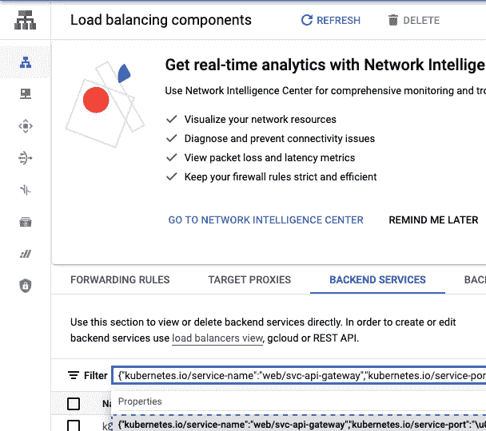

# 在 GCP 上设置多环境 JAMSTACK 生产部署

> 原文：<https://itnext.io/setup-a-multi-env-jamstack-production-deployment-on-gcp-34f10d75dd7f?source=collection_archive---------1----------------------->


照片由[巴累·j·理查德](https://unsplash.com/@prics?utm_source=medium&utm_medium=referral)在 [Unsplash](https://unsplash.com?utm_source=medium&utm_medium=referral) 拍摄

# (或者如何从 Netlify 迁移)

以 JAMSTACK 方式部署 web 应用程序有无数种方法。并且有大量的工具可以提供即插即用的体验。其中之一是 Netlify。将 gatsby.js 应用程序部署到 Netlify 就像创建 github repo 一样简单。然而，如果你需要离开他们。以节省成本或提高速度/可靠性。事情开始变得棘手..

最近，我们在 Netlify 上几乎每天都遇到中断，在获得支持后，我们被建议升级到每月 3，000 美元起的企业计划，并保证 99.9%的 SLA。在发现我们可以使用具有 99.9% SLA、出色性能且价格仅为我们的一小部分的 google CLOUD CDN 来满足我们的需求后，我们决定进行迁移。在这篇文章中，我将解释如何迁移一个运行在 Netlify 上并使用了 **Netlify 重定向**的现有 web 应用。希望这将有利于其他处于相同情况的人。

[](https://answers.netlify.com/t/why-is-netlify-down-so-often-the-last-days/74545) [## 为什么最近几天 netlify 总是情绪低落？

### 我们理解最近的降级对我们的客户造成的影响，并对服务中断表示歉意…

answers.netlify.com](https://answers.netlify.com/t/why-is-netlify-down-so-often-the-last-days/74545) 

正如我在他们论坛看到的，他们是相当多的…

下面的一切也可以用于新的部署。

## 关键概念和计划

[**【jam stack**](https://jamstack.org/):一种部署 web 应用程序的方式，它宣传前端和它们使用的 API 端点的分离，这非常适合微服务架构。

**相同站点请求:**对服务于 web 应用程序的相同域/协议的 web 请求。例如，浏览器对`/api/login`(注意没有域或协议)的请求是一个相同的站点请求，浏览器将自动使用当前打开标签的相同域/协议。

为什么这很重要？因为使用(https)相同站点请求是使用“相同站点、服务器端、安全 cookies”的唯一方式。最安全合法的 cookies，即使是苹果也不会限制/删除。浏览器上运行的 javascript 无法访问的 Cookies。存储用户授权信息的最佳方式。但是如果你有运行在你的 web 应用的不同域/子域上的微服务，你需要一个特殊的技巧来将请求从你的站点域重定向到网关。

Netlify 通过使用对我们来说非常方便的[重定向/重写](https://docs.netlify.com/routing/redirects/)特性来实现这一点。在这篇文章中，我们将用 GCP url-map 替换 Netlify 重定向来达到相同的效果，并做其他一切来创建相同的基础架构，甚至更多。只需价格的一小部分。

我们将使用 Terraform 创建以下 GCP 资源

*   存储桶
*   桶后端
*   负载平衡器
*   IP 地址；网络地址
*   dns 记录
*   托管证书
*   http 到 https 重定向
*   用 GCP url 映射替换 Netlify 重写
*   云甲 DDOS 防护(加成)
*   托管证书
*   一些其他的东西

配置一切。

*   将负载平衡器连接到 bucket 端点以及 k8s 服务(api 网关)、ip 和托管证书。
*   创建一个 github 动作来部署我们的应用程序。

如果这听起来很酷，那就喝杯咖啡，系好安全带。

首先，我们需要一个 IP 地址、一个 DNS 记录和一个 GCS 存储桶

这将创建一个什么也没有连接的 ip 地址和一个 dns 记录

创建一个配置为托管网站的存储桶

然后我们需要将这个桶公开(供阅读)

现在，如何将这个桶连接到负载平衡器？为了实现这一点，我们需要创建一个“后端”，这是一个 GCP 术语，指可以连接到 LB 和目标的托管服务(如 k8s 服务或 GCS bucket)，定义健康检查等内容。

当在 GKE 上创建 K8S 服务时，会为它创建一个 GCP“默认后端”。(我们将很快回来)

请注意 CDN 定义以及与 bucket 和安全策略的连接

“backend_bucket”本质上是将 CDN 连接到 bucket 的东西，但是它还没有连接到 ip。

到目前为止，我们有一个 ip，dns 记录和一个后端公共桶。不，我们需要将它们连接在一起并连接到一个 LB 上。

但首先我们还需要一些东西。

这一点很重要

URL 映射是一个定义负载平衡器“大脑”的实体。它还包含我们正在使用的 Netlify 重写规则的替换。

netlify.toml

上面的 url 映射包含与 netlify.toml 文件相同的逻辑。每个带有“/api”或“/stage/api”前缀的自身站点请求将被重写到环境的 api 网关(位于其自身的 k8s 集群中)。所有其他请求都将被定向到我们之前创建的“bucket backend”。

## 查找 api 网关后端服务

上面定义的黑魔法“API-gateway-back end”terra form 数据资源，带有每个 env 的硬编码 id。是为 API 网关 k8s 服务(由 GKE)创建的默认后端的定义，这些硬编码的 id 可以在 GCP web 控制台中找到。

打开控制台>负载平衡>后端服务

在 ui 过滤器中，开始键入 k8s 服务名。



找到您的 k8s 服务后端服务

它是由 GKE 从这样的 k8s 资源中创建的

搜索您为 k8s 服务指定的名称以找到其后端，如果您的 k8s 服务名称包含“api ”,只需键入“api ”,如上例所示

## 配置 GCP 后端(奖金)

可以使用名为`BackendConfig`的 GKE 资源来配置这些后端，以做一些有趣的事情。

自定义后端配置(CRD)

它可以做很多事情，比如添加自定义地理标题，(你不再需要 [maxmind](https://www.maxmind.com/en/home) 了……)或者附加到云装甲安全策略。(稍后将详细介绍)

请注意，我们没有使用 terraform 创建 api 网关后端服务，我们只是使用了`data`指令来引用它

引用 GKE 创建的后端服务

这是 k8s 和地球资源相遇的地方。我认为这很酷..

到目前为止，我们有一个 url 映射，它将让我们的 LB 如何处理传入的请求。现在让我们将它连接到我们之前创建的 IP 和一个托管证书。

google 托管证书

为了使 https 握手有效，我们的 LB 需要一个 TLS 证书。浏览器可以“信任”LB 身份的方式，就像护照一样。幸运的是，GCP 可以为我们管理这些证书，轮换并与 SA 授权机构签署证书。

这里唯一需要注意的是，我们想要签名的域，在上面的例子中是它的["foo.bar-prod.com . " 、" app.foo.ua . "。需要解析到 LB 的 IP。否则证书不会被签署。

这就引出了下两个资源

将一切联系在一起

以上两个资源连接了 url-map、证书和 ip 地址，基本上创建了负载平衡器，它完成了我们需要的所有工作。

从 GCS bucket 为我们的 web 应用程序提供服务，并重写对我们的 api 网关的 self 站点请求。

还有一件事，http-https 重定向。目前只有端口 443 连接到我们的 LB。如果用户导航到我们的应用程序，端口 80 ( http)上没有任何响应。这将我们引向下一个资源。

http-https 重定向

以上创造了谷歌所谓的“部分负载平衡器”。它是部分的，因为它没有连接到后端。它只有一个简单的 url-map 和一个默认的 https 重定向规则。它和我们的 HTTPS LB 连接在同一个 IP 上。

现在，将在端口 80 导航到您的应用程序的用户将被立即重定向到端口 443 并使用 https。

## 云甲(加成)

边缘安全策略

云装甲安全策略可以连接到我们之前讨论过的“后端”。它可以做很多事情，像晶圆保护，DDOS 保护，速率限制，阻止 ip 范围和国家等等。

基本上有两种类型的策略，边缘策略和非边缘策略。边缘策略可以附加到桶后端，顾名思义，它们在边缘上保护后端，所以它们不能做一些像 WAF 绘制和 L7 DDOS 绘制这样的事情。不过不用担心，云 CDN 内置了那些功能。将安全策略附加到 bucket 后端的原因是，例如，如果将来您想要阻止来自俄罗斯、朝鲜或伊朗等国家的访问您的站点。这将是做它的地方。

## Github 操作

我差点忘了我们还没有部署我们的应用程序。让我们看看这样做的动作。我们还想使用缓存来加速我们的构建。

ga-action.yaml

上面的 GH 动作构建了一个 gatsby.js app，使用缓存。构建步骤需要大约 30 秒。比 Netlify 快三到四倍。

除了以下几点之外，该文件基本上是自我解释的:

我们使用`rsync`将我们的站点上传到桶中，它不是原子的。但是，因为我们使用缓存，所以它只同步已更改的文件，这只是公共目录的一小部分(在我们的例子中是几百个文件中的大约 30 个)。我们将 CDN 定义为一分钟 TTL。因此，如果用户恰好在运行`rsync`的那一秒浏览我们的应用，那么在部署后使 CDN 无效几乎可以保证他们不会得到一个损坏的状态。

我们是如何将 GHA 与我们的 GCP 项目联系起来的？

```
service_account_key: ${{ secrets.GCLOUD_SERVICE_KEY }}
```

保存我们为 github 操作创建的服务帐户导出的 base64 JSON 密钥(对我们的 bucket 有写访问权)。但是这种方式已经被弃用了！他们有一种叫做[的工作负载身份联合](https://cloud.google.com/iam/docs/workload-identity-federation)的东西，可以以一种更安全的方式实现同样的功能(没有共享密钥)。所以如果我是你，我会试试。

## 最后

迁移出 Netlify 花了我们大约 220 个地形线和一些黑色魔术。我们不得不这样做，因为我们需要一个有弹性的快速生产部署，并且不想支付企业账单。但在最初的日子里，Netlify 是一个非常简单的解决方案，它让我们专注于应用程序的业务逻辑，而不是一个完美的基础设施。因此，建议那些想在第一天跳过以上所有这些麻烦的人大胆尝试一下。但是，对于生产部署来说。我建议使用 GCP。在迁移后，您仍然可以使用 netlify 进行暂存和预览部署。SLA 和性能并不重要。

感谢您阅读这篇非常专业的帖子！！

如果你喜欢这样的东西，请给我留言。

干杯！