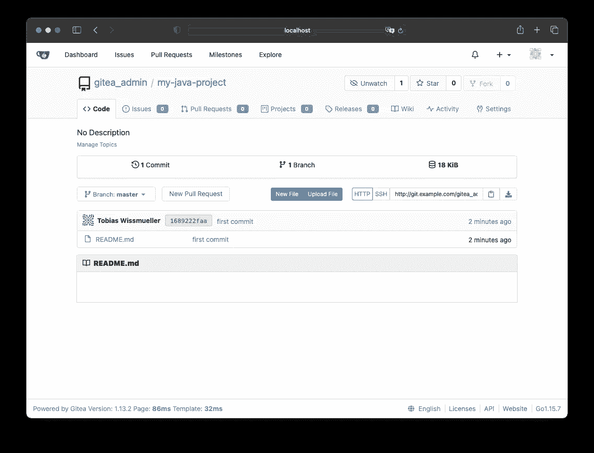
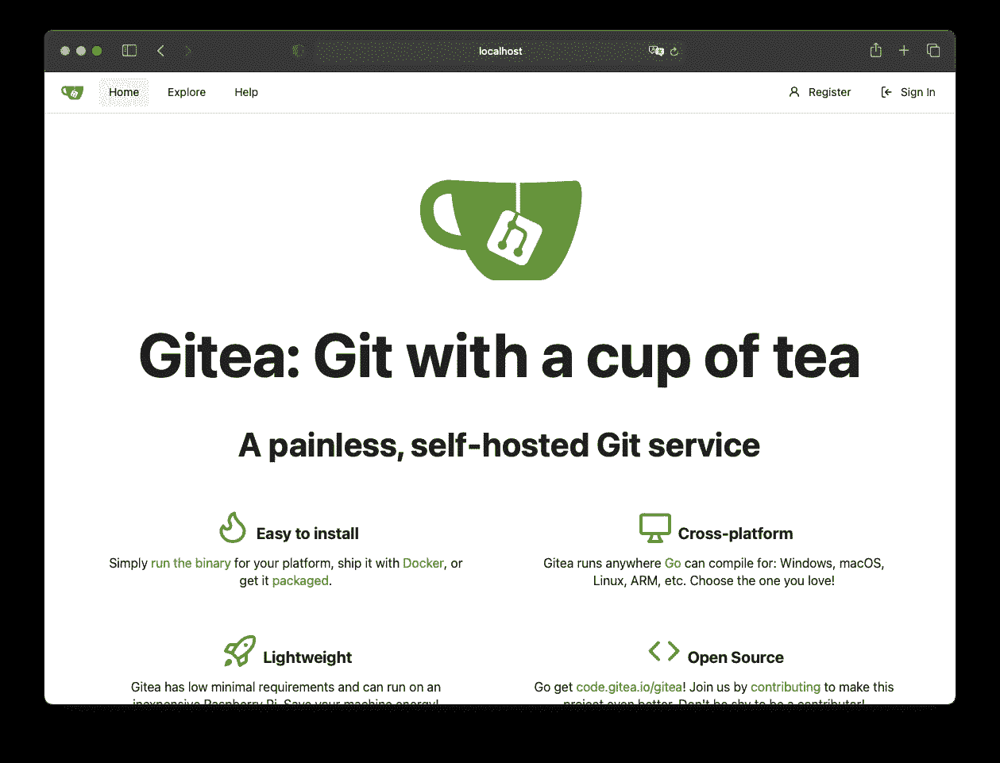
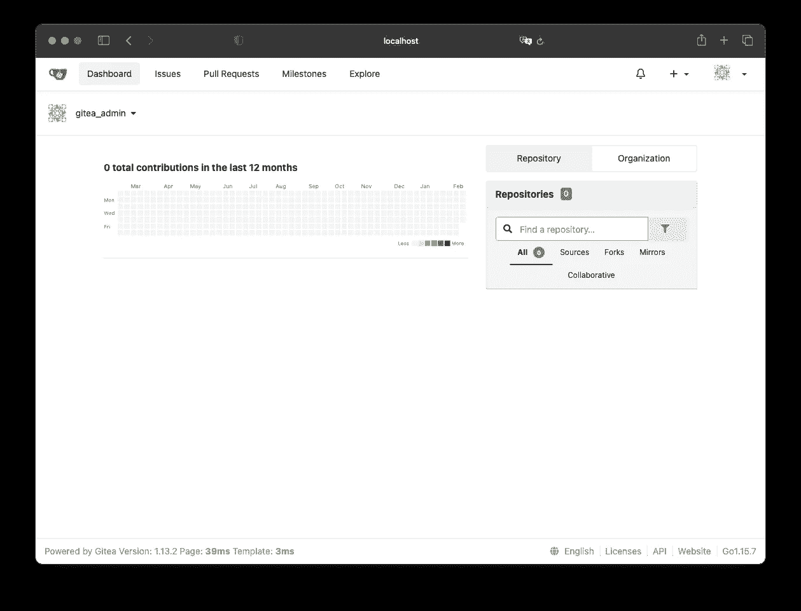
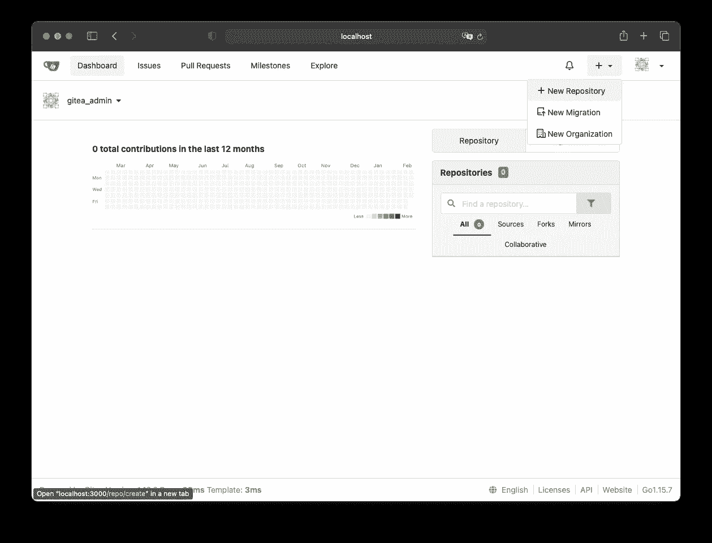
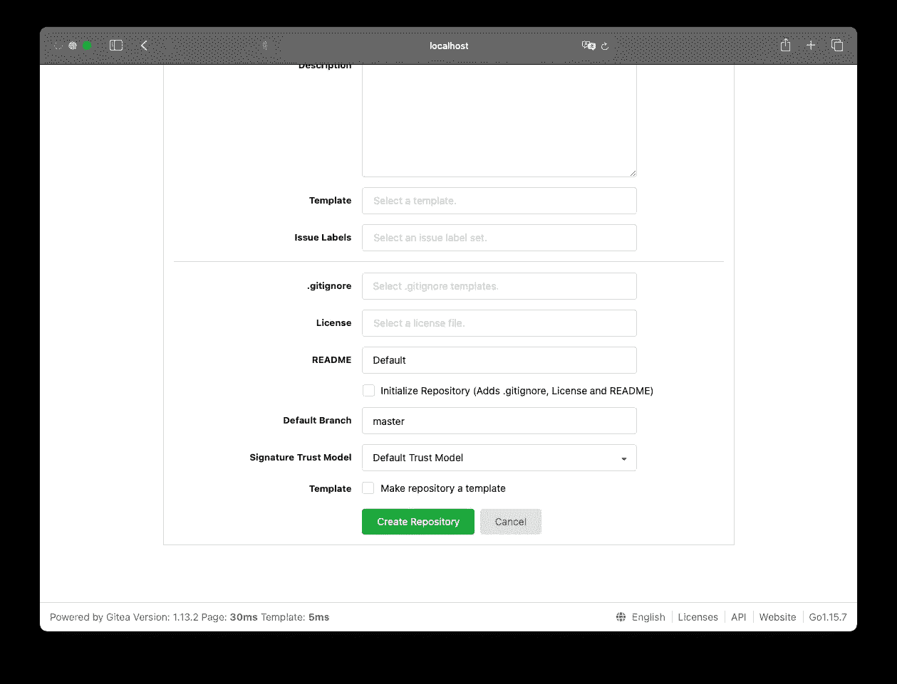
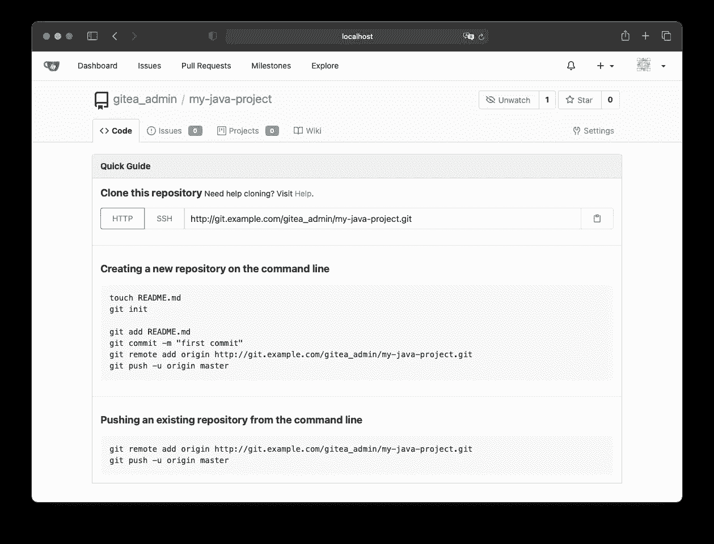

# 用 Gitea 在 Kubernetes 中设置一个私有的 Git 库

> 原文：<https://itnext.io/setup-a-private-git-repository-in-kubernetes-with-gitea-64f5ea1e5070?source=collection_archive---------3----------------------->



如果您的 Kubernetes 集群上需要一个私有的 Git-repository，那么这里是学习如何设置它的合适地方。

Gitea 将被用作存储库。它带有一个整洁的舵图，使生活变得更加容易。

如果还没有完成，首先需要安装头盔。

## 舵安装

有几种方法可以安装头盔。

我在 macOS 上，可以用脚本安装它:

```
curl -fsSL -o get_helm.sh https://raw.githubusercontent.com/helm/helm/master/scripts/get-helm-3
chmod 700 get_helm.sh
cat get_helm.sh
```

或者使用`homebrew`，这是更快的方法:

```
brew install helm
```

## Gitea 安装

首先需要添加图表回购:

```
helm repo add gitea-charts [https://dl.gitea.io/charts/](https://dl.gitea.io/charts/)
```

如果不需要覆盖默认值，那么安装 Gitea 就像运行以下命令一样简单:

```
helm install gitea gitea-charts/gitea
```

默认情况下，Gitea 将[配置为无头](https://stackoverflow.com/q/52707840/1065468)。但是我需要一个内部 IP 地址。

因此我创建了文件`gitea-values.yaml`

```
service:
  http:
    type: ClusterIP
    port: 3000
    clusterIP:
  ssh:
    type: ClusterIP
    port: 22
    clusterIP:
```

使用以下命令在这些值被覆盖的情况下运行安装:

```
helm install --values gitea-values.yaml gitea gitea-charts/gitea
```

结果应该是这样的:

```
NAME: gitea
LAST DEPLOYED: Thu Feb 18 21:30:29 2021
NAMESPACE: default
STATUS: deployed
REVISION: 1
NOTES:
1\. Get the application URL by running these commands:
  echo "Visit http://127.0.0.1:3000 to use your application"
  kubectl --namespace default port-forward svc/gitea-http 3000:3000
```

很好，他们甚至提供了如何将 pods 端口转发到本地机器的命令:

```
kubectl --namespace default port-forward svc/gitea-http 3000:3000
```

Gitea 已经启动并运行，可以通过`localhost:3000`下的本地工作站网络浏览器进行访问。



初始管理员用户`gitea_admin`的密码可以在舵图的`[values.yaml](https://gitea.com/gitea/helm-chart/src/branch/master/values.yaml)`中找到:`r8sA8CPHD9!bt6d`



## 添加第一个项目

通过按下“+”按钮并选择“新建存储库”来创建新的存储库



必须填写几个值，例如，必须选择所有者并提供存储库名称。


准备就绪后，按“创建存储库”



存储库已经准备好，可以添加文件了。

单击存储库名称时，所有步骤都会显示向新存储库添加文件需要完成的工作。



因此，我在本地工作站上创建了一个新项目

```
$ mkdir my-java-project
$ cd my-java-project/
$ touch README.md
```

初始化本地存储库

```
$ git init
Initialized empty Git repository in /Users/username/my-java-project/.git/
```

添加并提交所有文件:

```
$ git add README.md
$ git commit -m "first commit"
[master (root-commit) 1689222] first commit
 1 file changed, 0 insertions(+), 0 deletions(-)
 create mode 100644 README.md
```

目前一切都在本地存储库中。为了将所有内容推送到远程私有存储库，必须执行以下命令:

```
$ git remote add origin http://127.0.0.1:3000/gitea_admin/my-java-project.git

$ git push -u origin master

Username for 'http://127.0.0.1:3000': gitea_admin
Password for 'http://gitea_admin@127.0.0.1:3000':
Counting objects: 3, done.
Writing objects: 100% (3/3), 220 bytes | 220.00 KiB/s, done.
Total 3 (delta 0), reused 0 (delta 0)
remote: . Processing 1 references
remote: Processed 1 references in total
To http://127.0.0.1:3000/gitea_admin/my-java-project.git
 * [new branch]      master -> master
Branch master set up to track remote branch master from origin.
```

瞧，一切正常！


感谢阅读！喜欢吗？ [**给我买杯咖啡！**](https://www.buymeacoffee.com/twissmueller)

## 资源

*   Gitea:喝一杯茶
*   [带头盔的安装(在 Kubernetes 上)](https://docs.gitea.io/en-us/install-on-kubernetes/)
*   [Gitea 舵图](https://gitea.com/gitea/helm-chart/#configuration)
*   [安装舵](https://helm.sh/docs/intro/install/)