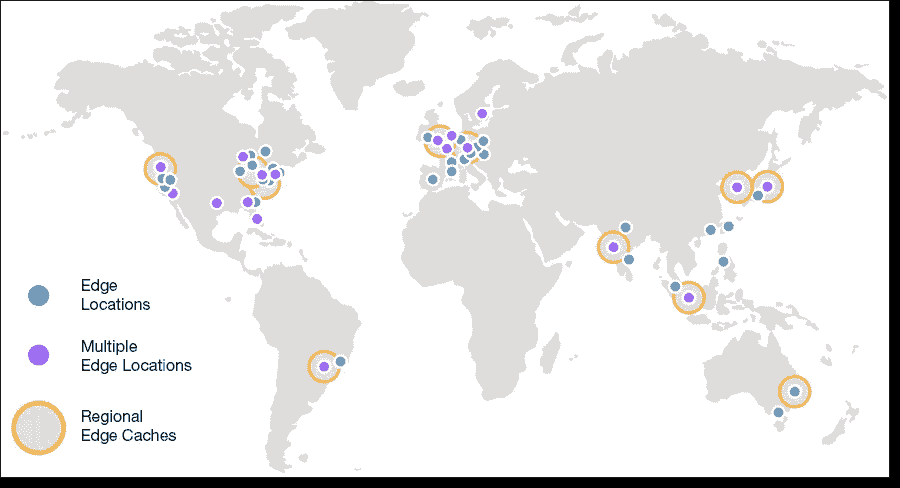
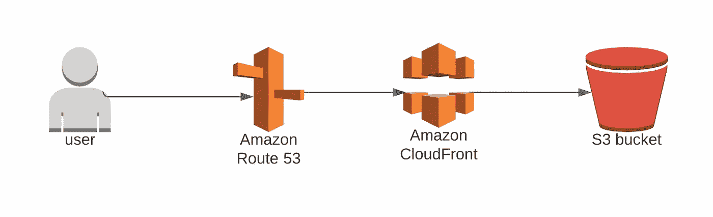
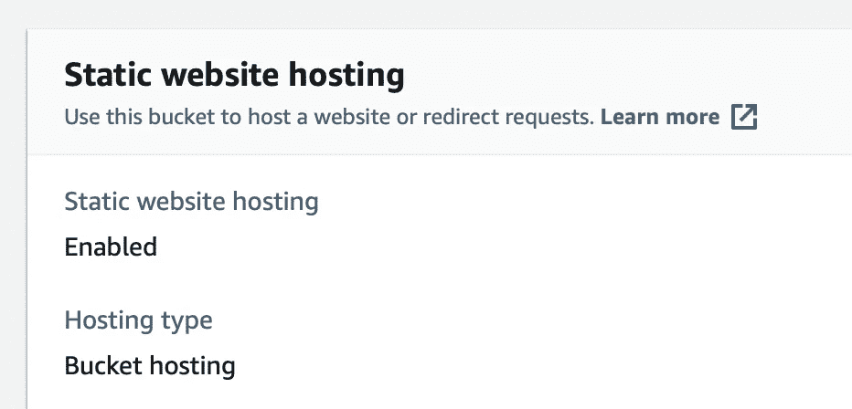
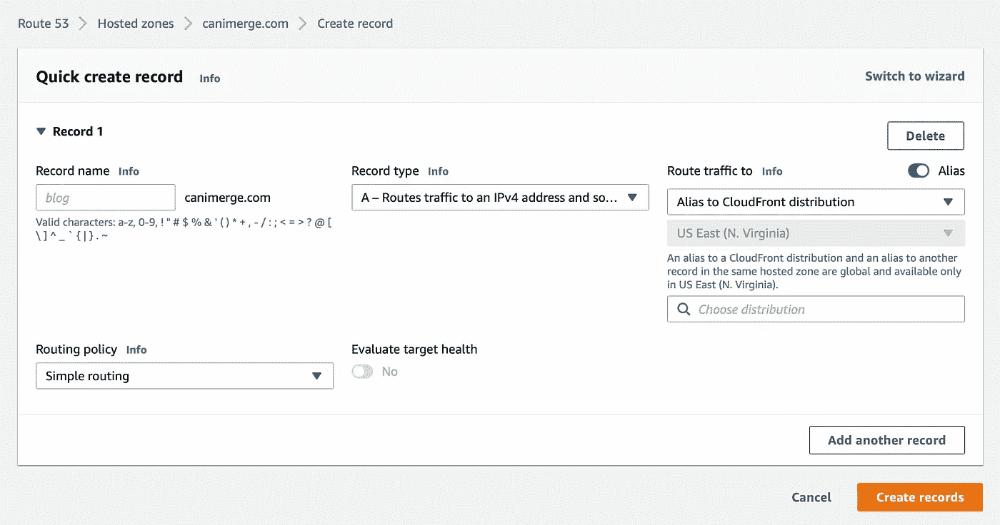
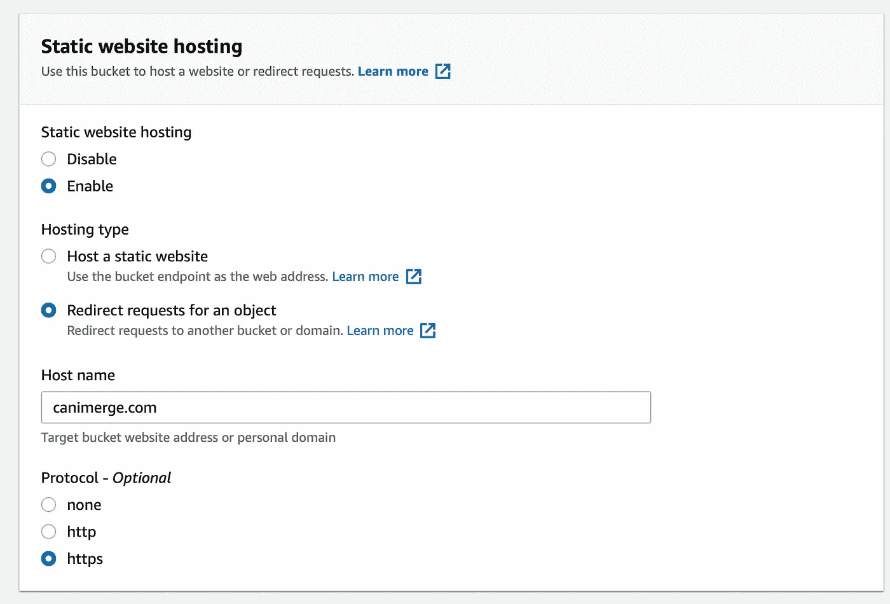
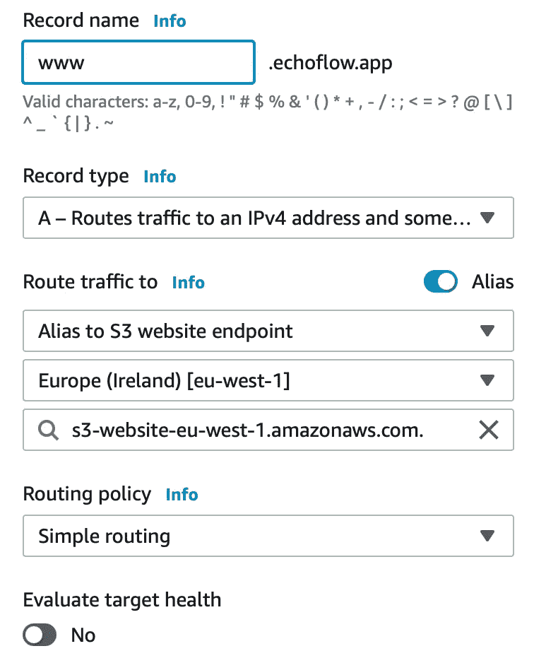

# 在 AWS 上建立一个静态网站

> 原文：<https://itnext.io/setup-a-static-website-on-aws-5a87fdf92347?source=collection_archive---------3----------------------->

## 在 AWS 上建立静态网站的分步指南

如果设置正确，AWS 上的静态网站可以快得令人难以置信。让我们来看一下每个步骤，并解释在 AWS 上建立一个静态站点需要哪些服务。

这可能是一个 Gatsby 网站或任何其他你想托管的静态 HTML/CSS 网站。虽然是可选的，但我们将假设您在 Git 中有可用的应用程序，以及用于构建/部署的工具。在我们的例子中，我们将展示如何使用 GitLab 进行设置。

# 所需服务

AWS 提供了大量的服务，让我们解释一下您需要哪些服务，以及为什么需要。

## AWS 简单存储服务/ S3

亚马逊的 S3 是一个存储所有网站文件的地方。可以把它想象成一个高性能的驱动器或 FTP。每当用户访问您的网站，网站文件可以从 S3 检索。

## AWS 云锋

CloudFront 是一个 CDN，内容交付网络，它由遍布世界各地的服务器或边缘位置组成。所有这些边缘位置都会在本地缓存您的网站。每当世界另一端的用户访问您的网站时，它仍然会很快，因为网站文件可以从边缘位置缓存中获取，而不是 S3。

这确保了从世界任何地方快速连接到您的静态网站。您可以在下面的地图上看到 AWS 的可用边缘位置。

AWS 边缘位置(2021 年)，来自[https://AWS . Amazon . com/blogs/AWS/98-99-100-cloudfront-points-of-presence/](https://aws.amazon.com/blogs/aws/98-99-100-cloudfront-points-of-presence/)

此外，让用户从 CloudFront 检索网页比从 S3 检索要便宜，所以这绝对是一个双赢的局面。每次更新网站时，你都必须支付一定的费用，但除非你的网站每小时都在变化，否则这笔费用不会很多。

请注意，对于网站的每一次更改，您都需要使 CloudFront 中的缓存失效，这需要很小的代价。

## AWS 路线 53

Route 53 是亚马逊的域名和 DNS 服务。尽管是可选的，你可以通过 Route 53 购买你想要的域名。如果您已经在首选注册商处拥有域名，您不必将其转移到 AWS，您可以继续使用您首选的域名注册商。

路由 53 的另一项服务是 DNS 管理，因此称为 53，因为 DNS 在端口 53 上运行。通过将您域的 DNS 指向 AWS，您将能够通过 AWS 管理 DNS 记录。虽然这是要收费的，但在撰写本文时，每个托管区域每月收费 0.5 美元，我强烈推荐它。Route 53 提供了与其他可用 AWS 服务的高度集成。

您将能够通过 AWS 非常容易地设置您的 DNS 记录来指向 CloudFront。

# 在 AWS 上建立静态网站

AWS 上静态网站的设置

## 第一步。创建 S3 存储桶

在 AWS 中创建一个 S3 桶，将所有设置保留为默认设置。

转到您的桶的属性，并启用静态网站托管。

在您的 S3 桶上启用静态网站托管

## 第二步。在 53 路设置一个域名

在 AWS 中为您的域名创建一个新的托管区域。如果您已经在 Route53 中设置了一个，此时不需要任何操作。

## 第三步。在 S3 桶前面添加 CloudFront

在 AWS 管理控制台中创建一个 CloudFront 发行版。作为原点，选择 S3 网站的网址。应该和 yourbucket.s3-website-eu-west-1.amazonaws.com 差不多。作为域别名，输入您的域名。您需要使用 ACM 创建一个 Amazon 证书，按照屏幕上显示的步骤进行操作。其余部分可以保留为默认值。

## 第四步。设置从 Route53 到 CloudFront 的 DNS 链接

我们需要将您的域名指向我们刚刚制作的 CloudFront 发行版。为此，请进入 53 号公路上您的托管区域。使用 CloudFront 发行版的别名创建一个 A 记录，如下面的示例屏幕截图所示。

创建到 CloudFront 的 DNS 记录

## 第五步。设置 WWW 重定向

要让 WWW 重定向到非 WWW 网站，我们需要创建另一个 S3 桶。创建一个名为[www.yourwebsite.com 的 S3 桶。](http://www.yourwebsite.com.)同样，将其配置为静态网站，但带有重定向，参见下面的配置示例。

之后，您必须在 Route 53 中为您的托管区域 www 域创建一个新的 DNS A 记录。您将把 www 域指向这个新创建的 www S3 存储桶。例如，参见下面的截图。

# 为您的静态网站设置 CI/CD

如果您正在使用静态框架(如 Gatsby)开发您的网站，您可以为它设置自动 CI/CD！这样，每次您提交更改时，它都可以自动部署到您的域中！我们需要为此采取多种行动。

1.  现有的构建策略
2.  将网站文件上传到 S3
3.  CloudFront 中缓存的失效

要做到这一点，您需要有一个 Amazon 用户，该用户拥有链接到您的部署工具(可以是 Github、BitBucket、Gitlab 或其他工具)的正确访问权限。

## 第一步。创建 IAM 策略

首先，创建一个如下所示的策略，具有在 CloudFront 上创建缓存失效的正确权限，以便能够在部署后显示网站的新版本。称之为 my website-cloudfront-invalidate

其次，创建另一个策略，以便能够从 CI/CD 工具向 S3 存储桶上传和同步文件。称之为我的网站-S3-完全权利。

## 第二步。创建 IAM 用户组和用户

接下来，创建一个用户组，例如 mywebsite-cicd。授予用户组访问我们刚刚创建的上述两个策略的权限。

然后创建一个新的 IAM 编程用户，只有编程访问权限，这意味着您将获得一个 AWS 访问密钥和密钥来访问 AWS。这些可用于授予对您的 CI/CD 工具的访问权限。请确保在创建后妥善保管密钥，因为您将无法再看到它们。在我们刚刚创建的用户组中创建该用户。

## 第三步。在 CI/CD 工具上设置 AWS 密钥

在您选择的 CI/CD 工具中，添加 AWS_ACCESS_KEY_ID 和 AWS_SECRET_KEY 环境变量，以及先前生成的值。

## 第四步。创建部署脚本

我们将展示一个 Gitlab 的示例部署脚本，但是不同的 CI/CD 工具制作脚本的方式是不同的。

对于 GitLab，我们需要创建一个`gitlab-ci.yaml`文件。您可以在下面找到我们使用的这样一个示例脚本，并根据您的需要进行调整。请注意，这个脚本在 S3 上传中使用了`--delete`标志，这意味着构建中不存在的任何文件都将被删除，以避免保留我们不再需要的旧文件。

下面的脚本还构建了一个典型的 Gatsby 安装，如果您正在使用任何其他技术，请将构建过程替换为您所需的技术堆栈。

# 摘要

在用 CI/CD 工具以及 S3 和 CloudFront 建立了你的静态网站之后，不管用户在哪里，你都将得到一个非常可靠的高性能的设置。这种设置所需的维护量也很少。CI/CD 工具设置非常好，因为您不需要在 AWS 中手动更新任何东西，CI/CD 工具会自动执行所有手动操作，并且随着您使用它的次数增加，会节省您的时间。

关注我，获取更多关于 AWS 的文章和分步指南。

[订阅我的媒介](https://kevinvr.medium.com/membership)到**解锁** **所有** **文章**。通过使用我的链接订阅，你是支持我的工作，没有额外的费用。你会得到我永远的感激。