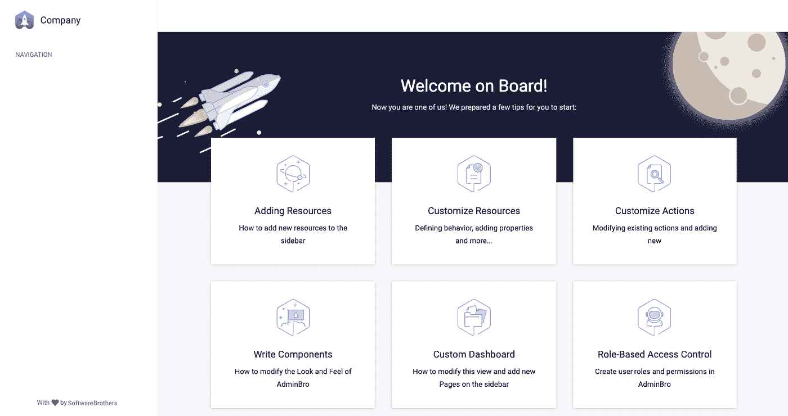
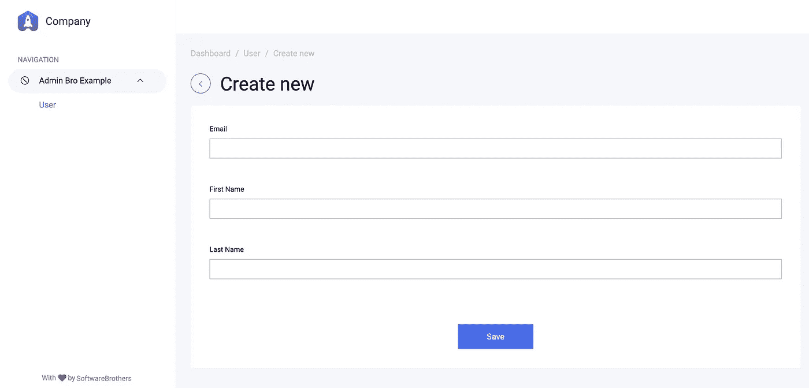

# 为 NestJS 应用程序设置 AdminBro

> 原文：<https://itnext.io/setup-adminbro-for-nestjs-application-de5bc12bc3b3?source=collection_archive---------0----------------------->


*在这个简短的教程中，我将展示如何向您的 NestJS 应用程序添加一个多功能的 Django 风格的管理面板。您可以使用这些知识在 10 分钟内构建一个有效的工具来管理不同种类的数据。*

# **简介**

NestJS 是一个进步的 Node.js 框架，它允许我们构建高效、可靠和可伸缩的服务器端应用程序。当我们创建这样的应用程序时，通常我们需要一个现成的用户界面来进行管理活动，允许我们管理实体。

作为一名长期的 ruby-on-rails 开发人员，我使用 Active Admin 插件来生成管理风格的界面。它抽象了常见的业务应用程序模式，使开发人员可以轻松实现漂亮优雅的界面。这是我在 NestJS 应用程序中寻找的东西。

我坚信在不久的将来, [**nestjs-admin**](https://nestjs-admin.com/) 会成为这样一个解决方案，但是就目前而言，依我个人的拙见，它还没有准备好进行有效的商业应用。所以经过一些研究，我发现了[AdminBro](https://adminbro.com/)——一个为 Node.js 应用程序自动生成的管理面板，它似乎满足了我的所有需求。然而，从一开始，AdminBro 只为 Express 和哈比神框架提供插件。只要 NestJS 构建在 express.js 之上，集成它应该不会太复杂。

因此，在这篇简短的教程中，我将介绍如何将 AdminBro backoffice 添加到您的 NestJS 应用程序中。你可以用这些知识在 10 分钟内建立一个有效的工具来管理不同种类的数据。

# **设置应用程序**

因此，让我们开始使用 Nest CLI 创建一个新项目

```
npm i -g @nestjs/cli
nest new project-name
```

为了方便起见，这个项目以 GitHub 库 [**的形式发布**](https://github.com/SergeyMell/admin-bro-example) ，并且每个步骤都有单独的标签，这样你就可以跟踪变更的历史，或者简单地提取并检查最终结果。

好了，现在让我们将 admin bro 插件和依赖项添加到项目中。
安装 AdminBro 和 express 插件

```
npm install -S admin-bro admin-bro-expressjs
```

此外，我们必须添加`express-formidable`包，只要它是`admin-bro-expressjs`的对等依赖项:

```
npm install -S express express-formidable
```

只要我们安装了所有的依赖项，就让我们创建初始化函数。只需用下面的上下文创建`src/admin-panel/admin-panel.plugin.ts`文件

**src/admin-panel/admin-panel . plugin . ts**

有了这个我们可以像这样调用`main.ts`中的初始化函数

**src/main.ts**

容易理解的是，`app`对象只是对`express.js`应用程序的包装，因此我们可以应用所有的 [express 相关的 admin bro 文档部分](https://adminbro.com/tutorial-installation-instructions.html)。

按照说明，我们可以用适当的代码完成初始化功能，在第一阶段，它应该如下所示

**src/admin-panel/admin-panel . plugin . ts**

现在我们应该重启应用程序，之后，如果我们转到应用程序的`/admin`路径，我们可以看到鼓舞人心的页面



**清空管理面板仪表板**

好了，我们似乎走在正确的道路上，现在让我们开始管理我们的实体。

# **配置资源**

现在让我们转到文章的中心思想——管理实体。首先，我们应该添加数据库集成和创建一些实例，即`User`。我认为没有必要详细强调这些步骤，因为 [NestJS 文档](https://docs.nestjs.com/techniques/database)已经足够全面了，所以我将只强调一些重要的要点。

对于这个例子，我选择 TypeORM 有两个原因。第一个——对我来说，它更接近内斯特的“精神”,与它结合起来更自然。第二个——admin bro 没有现成的 TypeORM 支持，所以这使得实现有点复杂。

在所有操作之后，您的用户实体可能如下所示(确保从`BaseEntity`继承，尽管 NestJS 文档缺少这一点)

**src/users/entities/user . entity . ts**

由于 AdminBro 不支持从盒子里取出的 TypeORM，我们将添加一个非官方的`admin-bro-typeorm` [包](https://www.npmjs.com/package/admin-bro-typeorm)

```
npm i -S admin-bro-typeorm
```

并注册它:

`**src/admin-panel/admin-panel.plugin.ts**`

在管理面板被配置为使用适配器之后，是时候创建一个资源来管理`User`实体了。我更喜欢将所有的管理资源存储在带有`[entity].resource.ts`命名约定的`src/admin-panel/resources`文件夹中。

用最简单的方式，您的资源可以简单地看起来像`export default User;`。然而，在许多情况下，您需要添加一些额外的选项、额外的动作和定制组件，所以我更喜欢以一种更通用的形式来放置资源

**src/管理面板/资源/用户.资源. ts**

完成这些之后，剩下的最后一件事就是将它添加到 AdminBro 构造函数的`resources: []`块中的 AdminBro 资源列表中。

现在，您可以打开管理面板，为您的应用程序创建几个新用户。



**从管理仪表板创建第一个用户**

# 编后记

这是如何为 NestJS 应用程序设置管理面板的第一步。我强烈建议浏览文档并发现大量 AdminBro 特性，包括授权、附加集合、成员和批量操作、定制组件以及更多有用的东西。

如果有任何问题或者你感兴趣的其他话题，请随时在评论中告诉我。跟着我上[媒](https://medium.com/@sergey.mell)。