# 使用 Node.js 在 TypeScript 中设置 Express

> 原文：<https://itnext.io/setup-express-in-typescript-with-node-js-ffa3da038fc1?source=collection_archive---------2----------------------->


在本文中，我将解释在 TypeScript 中用 Express 创建新服务器的简单的一步一步的过程。
本例要求具备 [Node.js](https://nodejs.org/) 、 [npm](https://www.npmjs.com/) 和 [Visual Studio 代码](https://code.visualstudio.com/)的基础知识。

**设置项目**

在开始之前，我们需要为我们的项目创建一个目录。为此，我们输入`mkdir typescript-express`并用回车确认。
我们用`cd typescript-express`切换到目录，并建立项目。

首先，我们用命令`npm init -y`创建一个 Node.js 包。之后，我们可以为我们的项目安装模块。因此我们用`npm i express`安装 Express。因为我们在打字稿中工作，我们也需要打字稿和快速打字。我们用命令`npm i -D typescript @types/express`来做。

最后但同样重要的是，让我们为 TypeScript 创建配置。为此，我们使用命令`npx tsc --init`。TypeScript 编译器将创建一个包含所有可能设置的预定义文件。

这里所有的命令一个接一个…

```
mkdir typescript-express
cd typescript-expressnpm init -ynpm i -D typescript @types/express
npm i expressnpx tsc --init
```

*关于为 TypeScript 设置项目的更多信息，我只能参考我以前的一篇文章* [*为你的下一个 TypeScript 项目*](/simple-setup-for-your-typescript-project-d96f66113b41) *简单设置。*

在那之后，你应该有类似这样的东西:

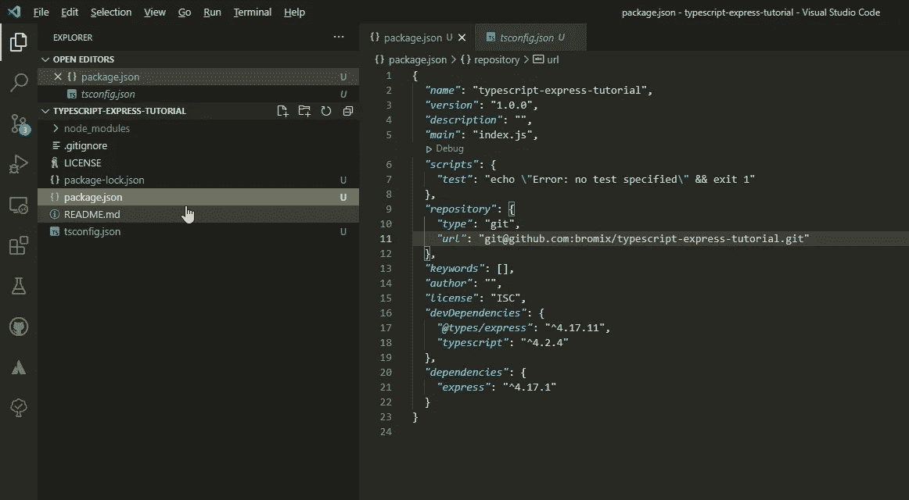

## 编写一个 Hello World 应用程序

为了有一个简单的开始，我们直接使用来自[快速页面](https://expressjs.com/en/starter/hello-world.html)的例子，并对其进行最小程度的调整。

注意我们是如何分配端口的。我只能建议总是这样设置端口。这也适用于其他不使用 Express 的项目。例如，如果您稍后实现服务并将它们部署到 Google App Engine(Google Cloud ), Google 将设置这个环境变量(PORT)。

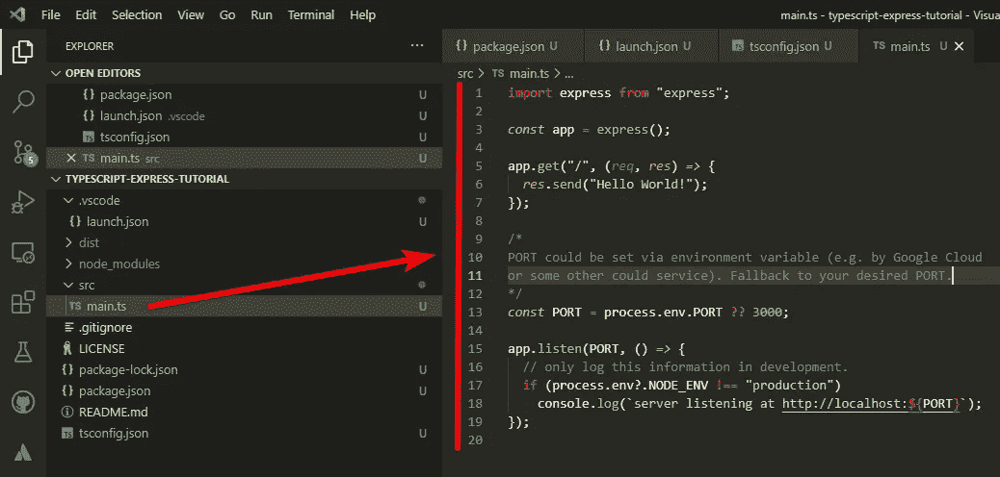

## 配置项目

我们为 TypeScript 配置编译器来创建用于调试的 SourceMaps，并将 JavaScript 文件输出到`dist`文件夹。

为此，我们在 tsconfig.json 中做了以下调整

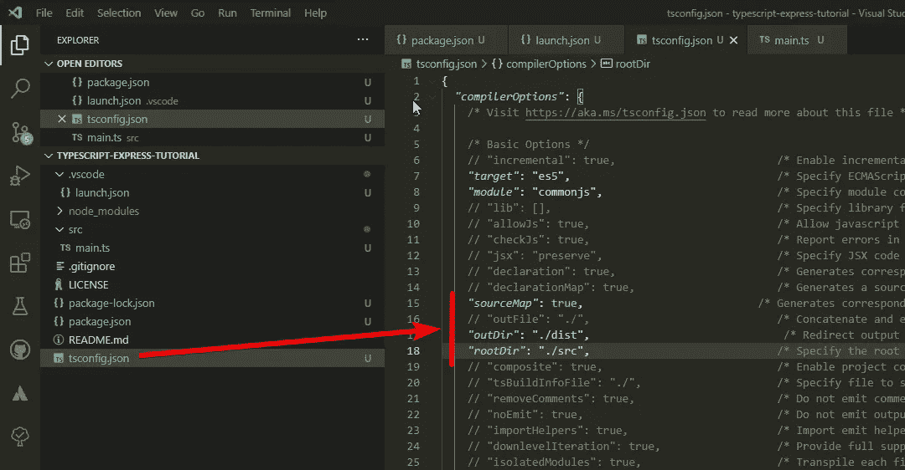

为了将我们的项目转换成 JavaScript，我们添加了一个构建脚本。为此，我们在`package.json`的`scripts`部分添加了一个新的`build`条目。这个脚本只是运行 TypeScript 编译器`tsc`(从`tsconfig.json`获取我们的设置)。

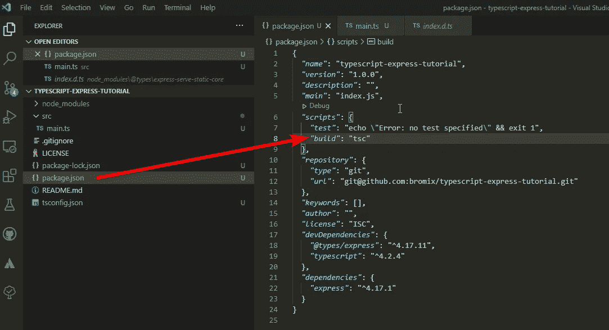

最后但同样重要的是，我们配置我们的 Visual Studio 代码，以便我们可以在 Visual Studio 代码中使用调试器运行项目。

为此，我们按下组合键`Ctrl+D`(在 Windows 上)并选择“创建一个 launch.json 文件”。在打开的菜单中，我们选择`Node.js (legacy)`。

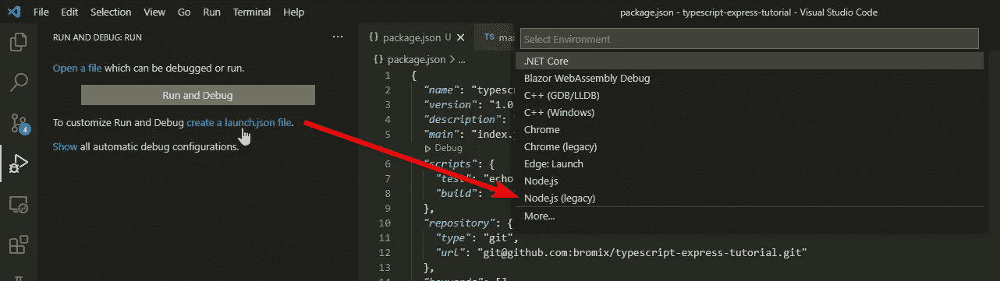

在随后创建的`launch.json`中，我们调整以下值:

*   **程序:**我们切换到 JavaScript 文件的输出目录。
*   **sourceMaps:** 设置为 true，这样我们可以稍后在 TypeScript 中调试我们的源代码(例如，使用断点)。
*   **preLaunchTask:** 总是在我们要启动程序之前执行(只有在调试的时候或者实际上直接从 Visual Studio 代码启动的时候)。

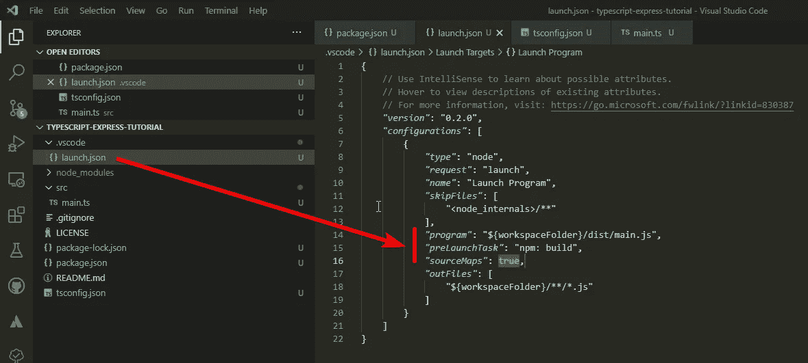

**启动服务器**

到目前为止，一切都设置好了，我们可以按`F5`了。这样我们就启动了 Visual Studio 代码的调试器和我们的服务器。

*或者* `node dist/main.js` *也可以在终端中输入，但只能在项目已经转换成 JavaScript 之后(例如使用* `npm run build` *)。*

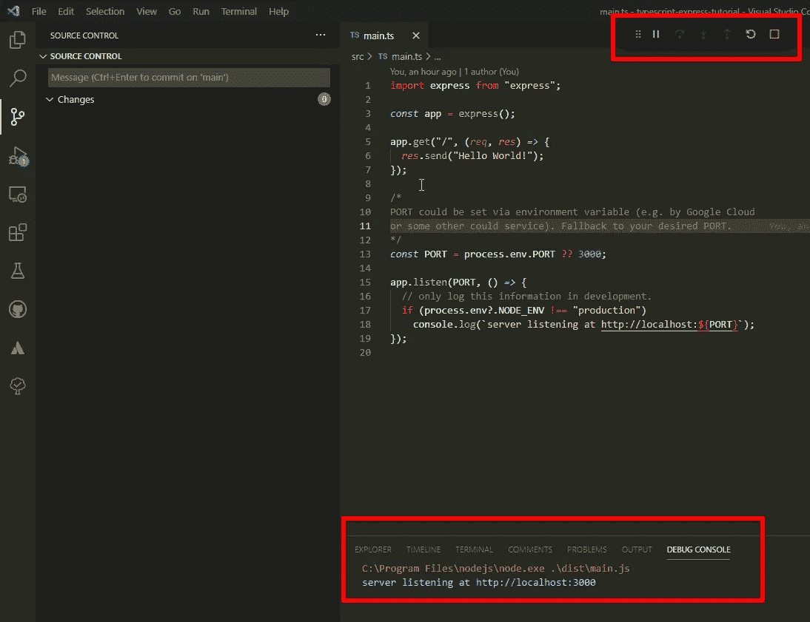

我们现在可以打开浏览器并输入地址`localhost:3000`。我们应该会看到类似下图的内容。

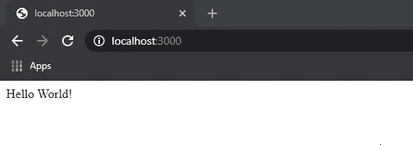

**一些调试**

最后但同样重要的是，我们对源代码进行了调整

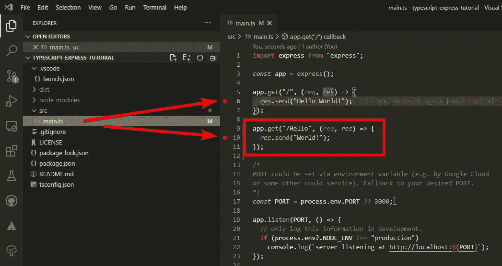

我们添加另一个路由`Hello`，它应该只输出`World!`。此外，我们为两条路由设置了一个断点。这是代码中的一个位置，当到达代码中的这个位置时，调试器应该在这个位置停止。

我们用`F5`再次启动服务器，切换到浏览器并直接导航到`localhost:3000`。Visual Studio 代码应该立即出现在前台，并突出显示源代码中的位置。

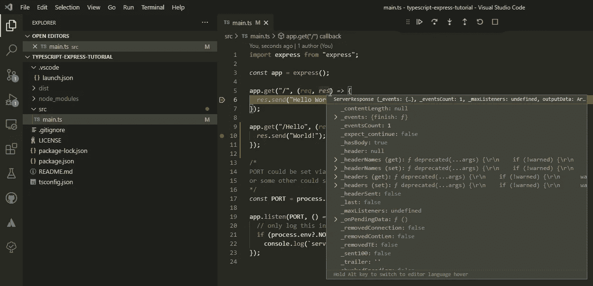

使用`F5`,我们让服务器继续运行，并再次切换到浏览器。我们现在应该看到`Hello World!`。我们最后一次把地址改为`localhost:3000/Hello`。
我们应该再次进入 Visual Studio 代码，这一次可以看到`Hello`的路线被突出显示。

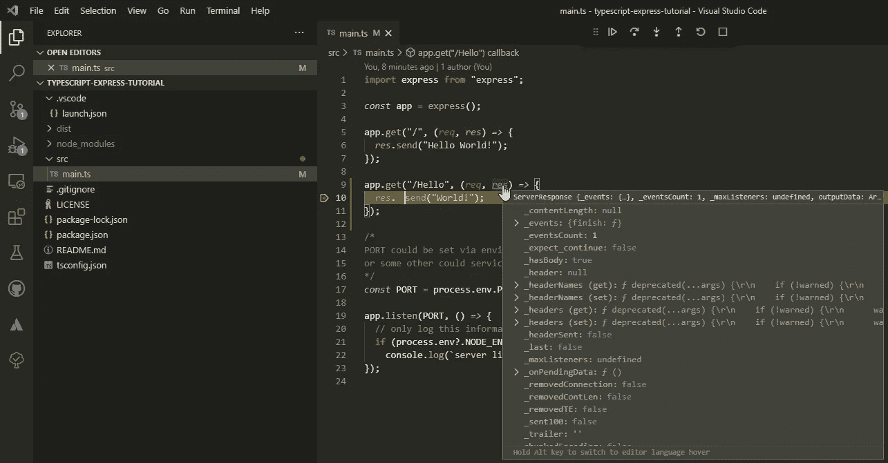

我们可以在 Visual Studio 代码中再次按下`F5`来继续服务器。我们现在应该在浏览器中看到`World!`。

## 我想通过额外的路线和断点实现什么？

在许多教程中，我错过了设置调试器的方法，这样就可以直接从开发环境中调试程序。特别是对于 TypeScript，必须事先进行一些设置才能工作。在这里，我看到了一个很好的机会，在最后简要地谈一谈。

## **结论**

这是一个在 TypeScript 中的 Express 的简单设置(调试器的设置)。我决定用 Express 来展示一个例子，因为尽管它年代久远，但 Express 至今仍被广泛使用。有足够多的替代方法(例如 Nest.js)也在底层结构中使用 Express 或者构建类似。Express 的优势在于它非常适合学习，并且提供了一个简单的服务器开发入门。这并不意味着 Express 不适合生产就绪的项目，恰恰相反。

根据反馈，这将是快速系列的第 1 部分。目前计划:

*   中间件/处理器
*   REST API 的简化示例
*   简化的 GraphQL API(基于相同的模拟数据)以及与 REST API 的比较
*   在谷歌云上部署。

我希望你喜欢这篇文章，如果你有任何问题或建议，请联系我。

完整的例子可以在 GitHub 上找到:[https://github.com/bromix/typescript-express-tutorial](https://github.com/bromix/typescript-express-tutorial)