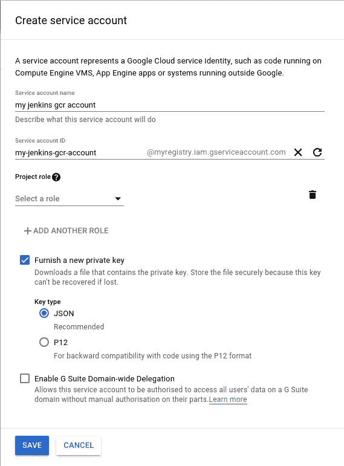
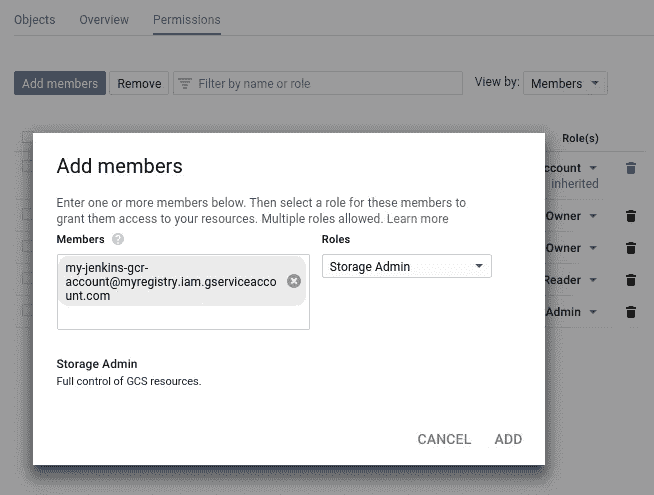
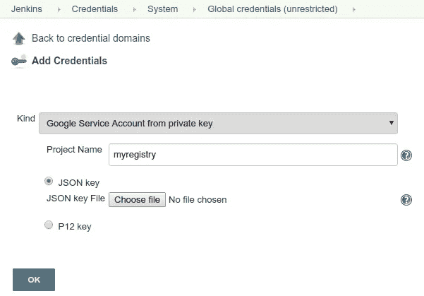
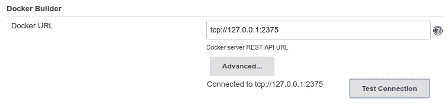
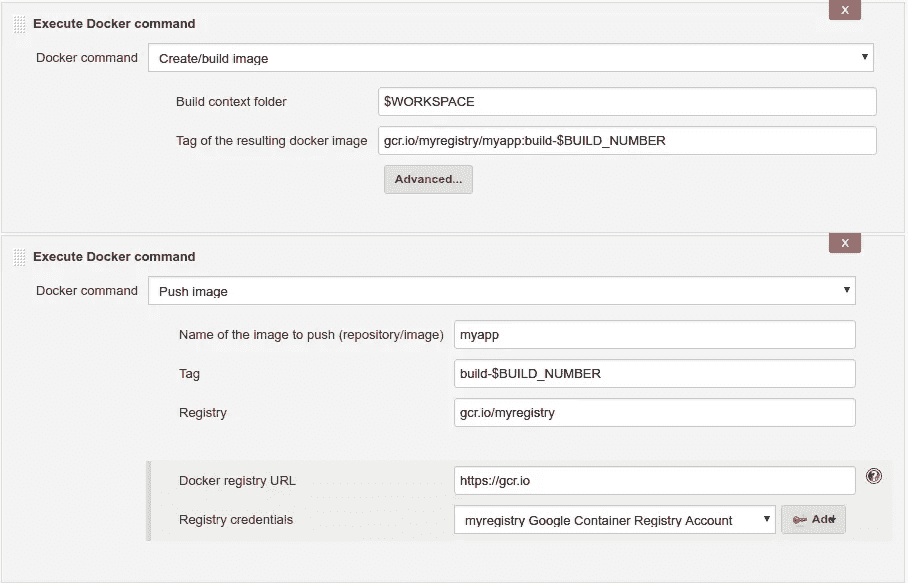

# 用 Google 容器注册表设置 Jenkins

> 原文：<https://itnext.io/setup-jenkins-with-google-container-registry-2f8d39aaa275?source=collection_archive---------0----------------------->

最近[我开始用 Docker 做我的兼职项目](https://hackernoon.com/8-tips-for-containerizing-django-apps-5340647632a4)。在部署过程中有两个任务:一个是构建 docker 映像并将其推送到我的私有容器注册表中，另一个是从注册表中提取 docker 映像并从中创建一个容器。

对于私有注册，我使用的是[谷歌云容器注册](https://cloud.google.com/container-registry/) (GCR)。我也有自己的詹金斯服务，所以我想从詹金斯自动做这两个任务。经过一番调查，我终于使一切工作。以下是方法。

# 环境

以下是我正在使用的软件和操作系统列表:

*   Ubuntu 18.04
*   詹金斯版本。2.121.3
*   Docker 17.12.1-ce，安装有`apt install docker.io`

# 基础

要从 jenkins 访问 GCR，我们需要安装以下插件。

*   docker-build-step :这个插件允许添加各种 docker 命令作为构建步骤。最新版本 2.0。
*   [Google OAuth 凭证](https://plugins.jenkins.io/google-oauth-plugin):提供 Google 凭证。最新版本 0.6。
*   [Google Container Registry Auth](https://plugins.jenkins.io/google-container-registry-auth):该插件从 Google OAuth 凭证插件中检索 Google 凭证，并为 docker-build-step 插件提供认证。最新版本 0.3。

工作流程有点麻烦，但还是可以理解的:

1.  创建一个服务帐户，该帐户可以完全访问谷歌云中的 GCR。
2.  在 jenkins 中，使用 Google OAuth 凭据插件为该服务帐户创建一个凭据。
3.  使用 docker-build-step 插件创建一个拉/推构建步骤，并将注册表 url 设置为 GCR。
4.  当执行构建步骤时，Google 容器注册认证插件将向 docker 提供在步骤 2 中创建的凭证。

详情请继续阅读。

# 步骤 1:创建服务帐户

我假设您已经在 Google Cloud 中创建了容器注册表。如果你还没有这样做，不要担心，只要登录到你的谷歌云控制台，从边栏中选择“容器注册表”，然后按照说明进行操作。您将在几分钟内完成设置。让我们假设注册表 URL 是`[https://gcr.io/myregistry](https://gcr.io/myregistry,)` [，](https://gcr.io/myregistry,)，其中`myregistry`是 Google Cloud 中的项目名称。

我们需要创建一个服务帐户，以便詹金斯可以访问 GCR。从侧边栏打开“IAM & admin”，然后打开“服务帐户”。点击“+创建服务帐户”按钮并输入您的帐户名称。



这里的“服务帐户名”是一个便于阅读的描述性名称，因此可以是任何名称。我们不需要添加任何角色。不要忘记检查“提供一个新的私钥”并选择“JSON”格式。

在点击保存之前，请记下生成的“服务帐户 ID”，在本例中为`my-jenkins-gcr-account@myregistry.iam.gserviceaccount.com`。我们以后需要这个。

单击 Save 按钮，将下载一个包含私钥的 JSON 文件。请将此文件保存在安全的地方，我们在下一步中需要此文件。

从侧边栏切换到“存储”。你应该能看到 GCR 的一个桶，可能命名为`artifacts.myregistry.appspot.com`。打开此桶并切换到“权限”选项卡。

点击“添加成员”。输入我们刚刚创建的服务帐户 ID，并在“Roles”中选择“Storage Admin”。单击添加。



# 设置 Jenkins 凭据

回到你的詹金斯服务，并确保登录与管理帐户。从边栏中选择“凭据”，然后选择“全局凭据”(您也可以选择其他域)，并单击“添加凭据”。

为“种类”字段选择“来自私钥的 Google 服务帐户”，并输入您的项目名称(在本例中为`myregistry`)。然后上传我们在上一步中刚刚下载的 JSON 私钥。



# 设置 Docker

如果你的 docker 已经和 Jenkins 合作过，你可以跳过这一步。还要注意，因为我只有一个 jenkins 服务器，它既充当主服务器又充当从服务器，所以我决定从命令行手动安装 Docker。如果您想为 jenkins 集群配置 Docker，“管理 Jenkins”→“全局工具配置”→“Docker 安装”可能会有所帮助。

我从 jenkins 服务器命令行安装了 docker:

```
$ sudo apt install docker.io
```

默认情况下，Docker 只公开 Jenkins 无法访问的 unix 套接字上的 API。我们需要为 jenkins 公开一个 TCP 端口。键入以下命令:

```
$ sudo systemctl edit docker
```

并键入以下内容以覆盖 Docker 配置:

```
[Service]
ExecStart=
ExecStart=/usr/bin/dockerd -H fd:// -H tcp://127.0.0.1:2375
```

重启 docker，使 docker 在`127.0.0.1:2375`上公开 API:

```
$ sudo systemctl restart docker.service
```

然后回到 jenkins，选择“管理 Jenkins”→“配置系统”。在“Docker Builder”部分，用`tcp://127.0.0.1:2375`填充“Docker URL ”,然后点击“测试连接”以确保它正常工作。



# 设置 Jenkins 作业以推送映像

现在是时候创建詹金斯职位了。创建一个自由式 jenkins 作业，并根据您的需要填充其他设置(如 git 存储库、参数等。).在构建步骤中，您可以添加 docker 命令来构建和推/拉 Docker 映像。

对于推/拉命令，按如下方式填充参数:

*   要推/拉的图像名称:图像名称，例如`myapp`
*   Tag:图像标签，可以使用 jenkins 变量，例如`build-$BUILD_NUMBER`
*   注册表:GCR 上不带`https`的注册表名称，如`gcr.io/myregistry`
*   Docker 注册网址:GCR 网址，使用`[https://gcr.io](https://gcr.io)`
*   注册表凭据:选择我们在“设置 Jenkins 凭据”部分创建的凭据

下面是一个包含构建步骤和推送步骤的示例:



就这些了！现在，您可以尝试构建这个 jenkins 作业，它会自动将映像推送到 GCR。

詹金斯插件设置总是很麻烦，所以有一些现成的“配方”总是好的。希望这篇文章对你有所帮助，感谢你的阅读！