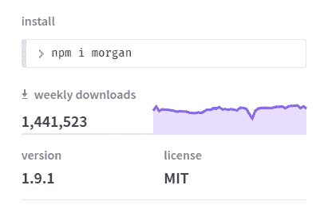
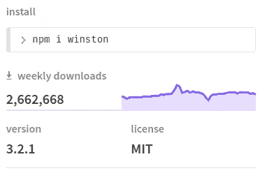

# Node-Express 应用程序的设置记录器

> 原文：<https://itnext.io/setup-logger-for-node-express-app-9ef4e8f73dac?source=collection_archive---------0----------------------->

在本文中，我将描述如何使用 Express 路由器为节点应用程序设置 HTTP + events logger。

# 问题的表述

在开发基于节点和快速路由器的服务器端应用程序时，我遇到了一个准备记录器的问题。解决方案的要求:

*   记录应用程序事件
*   能够指定多个日志级别
*   记录 HTTP 请求
*   能够将日志写入不同的源(控制台和文件)


# 发现可能的解决方案

在发现的过程中，我找到了两种可能的解决方案，可以满足我的问题需求

[摩根](https://www.npmjs.com/package/morgan) —用于 express 的 HTTP 日志中间件。通过根据不同的请求相关信息指定日志实例的格式，它提供了记录传入请求的能力。例如:

```
:method :url :status :response-time ms - :res[content-length]
```

根据 npm 下载统计数据，我可以假设这是一个广泛使用的软件包。



这是一个强大而简单的工具，所以我喜欢用它。

[Winston](https://www.npmjs.com/package/winston) —简单而强大的日志库，支持多种类型的传输。这个有用的能力对我来说非常重要，因为我想同时将事件记录到控制台和文件中。



根据下载统计，它也是一个广泛使用的包，所以我假设它可以用来解决我的日志问题。

请注意，我不会使用或概述所描述的工具的所有功能，我只是解决本文开始时设置的任务。

# 溶液的制备

所以我将从准备基于 Winston 的日志开始。在这里，我配置日志和传输的格式——发布日志的通道。在我的情况下，它是一个文件和控制台。日志文件将出现在指定的文件夹中，日志将追加到文件中，直到文件超过指定的文件大小。此后，将创建一个名称中带有数字索引的新文件。达到最大文件数量后，最新的文件将在创建新文件时被删除。示例中描述的配置对于大量的日志来说确实足够了。

导出的记录器实例允许使用不同的日志级别记录应用程序事件。例如:

```
logger.info('some info logging message');logger.warn('some warn logging message');logger.error('some error logging message');
```

每条消息都将被写入控制台和文件。此外，Winston 提供了将不同日志级别的事件记录到不同源的能力。例如，将错误和信息记录到不同的文件中。你可以在 Winston docs 中找到更多信息，但我的项目不需要这些，所以我会继续。

另一个问题是 Winston 不记录 HTTP 请求。出于这些目的，我发现了将 Morgan HTTP logger 连接到 Winston base logger 的能力。

这样，我将扩展 Winston logger 之前创建的 HTTP 请求日志功能。下面是代码片段，显示了如何使用上述记录器功能。

在这里的第 8 行，我使用了之前为快速应用程序创建的 HTTP logger 中间件。因此它将记录所有传入的 HTTP 请求信息。另一个测井仪被导入第三行，准备进行任何上述类型的测井。最后一种类型的记录器可以导入并在我的应用程序中的任何地方使用。

结果，所有带有时间戳和事件详细信息的日志都将出现在控制台中，并将被写入配置日志文件中指定的。

# 结论

在本文中，描述了一种为 Node+Express 应用程序配置简单而强大的日志系统的简单方法。这个日志记录系统允许将 HTTP 传入请求和内部应用程序事件日志存储到多个源:控制台和文件。这不是最佳解决方案或最佳实践，这只是举例说明我如何以最简单的方式满足开发过程中出现的任务条件。

这里有一个[链接](https://github.com/BagrijRoman/node-logger)到一个带有完整代码示例的存储库。