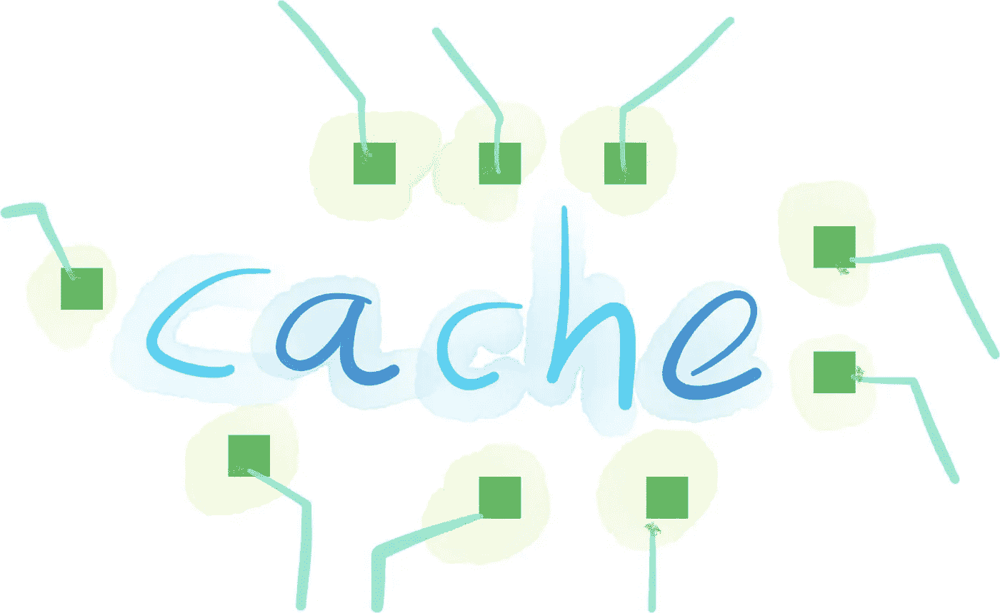

# 设置 Ruby on Github 操作以缓存 Ruby gems for Rails 项目

> 原文：<https://itnext.io/setup-ruby-on-github-actions-to-cache-ruby-gems-for-rails-project-780a3c76f78d?source=collection_archive---------5----------------------->

如何在 Github Actions 上从缓存加载 Ruby gems 更快的启动 CI 构建？如果您能够在短时间内设置好所有的依赖项，那么您可以更快地开始运行 Ruby on Rails 项目的测试。缓存对此很有帮助。您的项目所需的 Ruby gems 可以通过 Github 操作进行缓存，因此当您运行一个新的 CI 构建时，可以更快地加载它们。



您将学习如何使用以下工具配置 Github 操作:

*   [动作/缓存](https://github.com/actions/cache) —这是一个流行的缓存 Ruby gems 的解决方案。
*   [ruby/setup-ruby](https://github.com/ruby/setup-ruby) —这是一个安装特定 ruby 版本并用 bundler 缓存 Ruby gems 的解决方案。一个动作中的两个特征。

# 操作/缓存—仅缓存依赖关系

[Actions/cache](https://github.com/actions/cache) 是一种流行的解决方案，可用于将数据保存到缓存中，并在下一次 CI 构建期间恢复数据。它通常用于 Ruby on Rails 项目，这些项目也使用`actions/setup-ruby`来管理 Github 上的 Ruby 版本动作。

让我们看看使用`actions/cache`的 Github 动作缓存配置示例。

```
*# .github/workflows/main.yml*
name: Main
on: [push, pull_request]
jobs:
  test:
    runs-on: ubuntu-latest
    steps:
      - uses: actions/checkout@v2

      - uses: actions/cache@v2
        with:
          path: vendor/bundle
          key: ${{ runner.os }}-gems-${{ hashFiles('**/Gemfile.lock') }}
          restore-keys: |
            ${{ runner.os }}-gems-

      - name: Bundle install
        env:
          RAILS_ENV: test
        run: |
          bundle config path vendor/bundle
          bundle install --jobs 4 --retry 3
```

*   您需要指定将被缓存的目录路径。在我们这里是`vendor/bundle`。
*   您还可以根据操作系统版本和`Gemfile.lock`文件生成一个唯一的缓存`key`。当您更改操作系统版本或安装新的 gem 并且`Gemfile.lock`发生变化时，将会生成新的`key`值。
*   您需要配置 bundler 来将您所有的 Ruby gems 安装到目录`vendor/bundle`中。
*   您可以使用捆绑器选项:
*   `--jobs 4` -使用平行工人安装宝石。这允许更快的 gems 安装。
*   `--retry 3` -如果出现网络问题(例如 Rubygems.org 暂时停机)，尝试 3 次连接 Rubygems

如果你想看 Github Actions 和 Rails 项目的完整 YAML 配置，你可以看看我们的一些文章:

*   [如何使用并行作业为 Ruby on Rails 应用程序运行 RSpec on GitHub Actions](https://docs.knapsackpro.com/2019/how-to-run-rspec-on-github-actions-for-ruby-on-rails-app-using-parallel-jobs)
*   [GitHub Actions CI config for Ruby on Rails project with MySQL、Redis、Elasticsearch —如何运行并行测试](https://docs.knapsackpro.com/2019/github-actions-ci-config-for-ruby-on-rails-project-with-mysql-redis-elasticsearch-how-to-run-parallel-tests)
*   [如何在 Github Actions 上运行慢速 RSpec 文件，通过测试示例自动分割 Spec 文件来执行并行作业](https://docs.knapsackpro.com/2020/how-to-run-slow-rspec-files-on-github-actions-with-parallel-jobs-by-doing-an-auto-split-of-the-spec-file-by-test-examples)
*   [Cucumber BDD 测试使用 Github Actions 并行作业更快地运行测试](https://docs.knapsackpro.com/2021/cucumber-bdd-testing-using-github-actions-parallel-jobs-to-run-tests-quicker)

# ruby/setup-ruby —安装 ruby 并缓存 gem

在上一节中，我们提到了`actions/setup-ruby`经常与 Ruby on Rails 项目一起使用。`actions/setup-ruby`已经被弃用，所以现在推荐使用`ruby/setup-ruby`动作。它已经有缓存功能，你可以使用。让我们看看怎么做。

```
*# .github/workflows/main.yml*
name: Main
on: [push, pull_request]
jobs:
  test:
    runs-on: ubuntu-latest
    steps:
    - uses: actions/checkout@v2

    - uses: ruby/setup-ruby@v1
      with:
        *# Not needed with a .ruby-version file*
        ruby-version: 2.7
        *# runs 'bundle install' and caches installed gems automatically*
        bundler-cache: true

    *# run RSpec tests*
    - run: bundle exec rspec
```

如你所见，使用`ruby/setup-ruby`来管理 Ruby 版本和 gems 缓存要简单得多。你只要加上一个选项`bundler-cache: true`就可以了。

你可以在`[ruby/setup-ruby](https://github.com/ruby/setup-ruby#caching-bundle-install-automatically)` [文档中读到](https://github.com/ruby/setup-ruby#caching-bundle-install-automatically):

“也可以手动缓存 gem，但不建议这样做，因为这样做很繁琐，而且很难正确完成。存在许多问题，这意味着使用`actions/cache`永远不足以缓存 gem(例如，不完整的缓存密钥、从另一个密钥恢复时清理旧的 gem、正确散列未签入的锁定文件、操作系统版本、ruby-head 的 ABI 兼容性等)。所以，请用`bundler-cache: true`代替……”

# 摘要

您看到了在 Github Actions 上缓存 Ruby gems 的两种方式。还有其他方法可以让您的 CI 构建得更快，比如并行运行测试。你可以在这里了解更多关于[测试并行化的信息，或者直接查看](https://docs.knapsackpro.com/2020/how-to-speed-up-ruby-and-javascript-tests-with-ci-parallelisation)[背包 Pro](https://knapsackpro.com/?utm_source=medium&utm_medium=blog_post&utm_campaign=medium-how-to-load-ruby-gems-from-cache-on-github-actions) 主页。


*原载于 2021 年 3 月 25 日 https://docs.knapsackpro.com*[](https://docs.knapsackpro.com/2021/how-to-load-ruby-gems-from-cache-on-github-actions)**。**