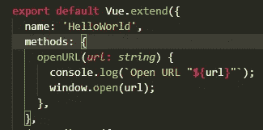
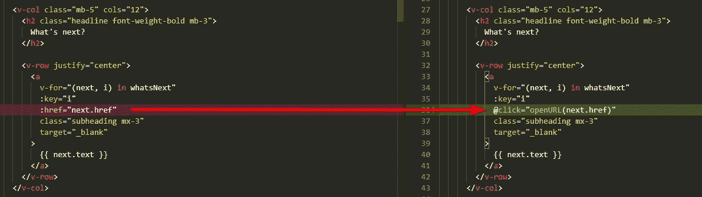
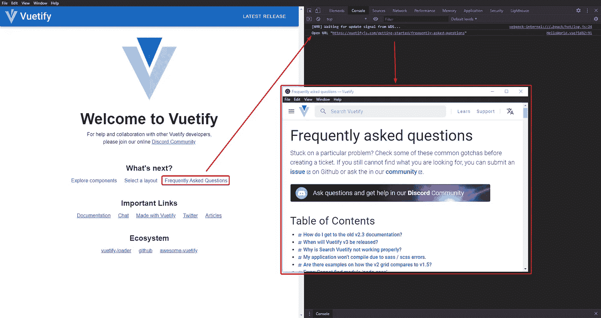
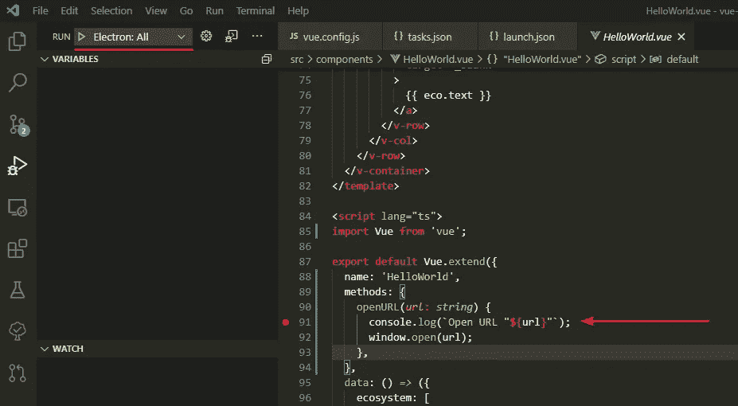
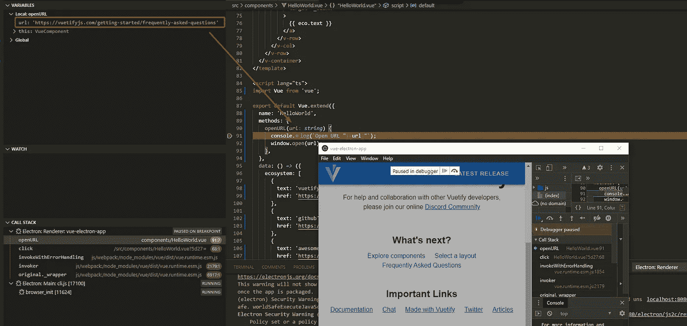
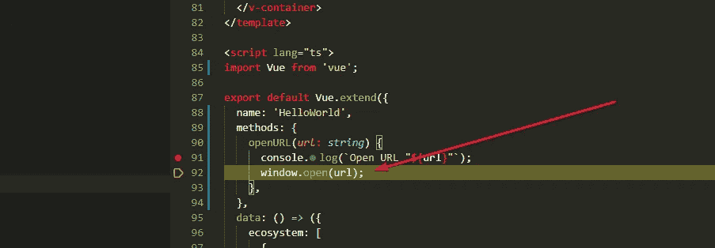

# 设置 Visual Studio 代码以调试您的电子应用程序

> 原文：<https://itnext.io/setup-visual-studio-code-for-debugging-an-electron-application-with-the-vue-cli-service-c224600fc219?source=collection_archive---------3----------------------->


如果您已经使用 Vue CLI 为一个电子应用程序创建了一个项目，则无法使用 Visual Studio 代码(例如，带有断点的代码)立即调试该应用程序。

本文基于文章 [*使用 Vue 创建电子应用程序和 Vue 化*](/electron-application-with-vue-js-and-vuetify-f2a1f9c749b8) *。*如果您以前从未使用 Vue CLI 为电子应用程序设置过项目，请先阅读本文。

我们可以使用以下命令为任何平台(Windows、MacOS 或 Linux)构建应用程序:

```
npm run electron:build
```

命令完成后，我们将在子文件夹 *dist_electron/中拥有一个可执行的电子应用程序。*

我们还可以运行以下命令:

```
npm run electron:serve
```

这个命令将把电子应用程序作为开发服务器运行，我们可以使用内置的开发工具直接在电子应用程序中调试它。

这在大多数情况下是可行的，但是从长远来看，应用程序会增长，功能和过程会变得更加复杂。最终，控制台上的输出不再足够。

但是为了便于说明，我们将准备一个简单的示例，并输出到控制台，然后用 Visual Studio 代码进行调试。

# 使用 console.log 进行调试(…)

这是最常见的技术之一，在大多数情况下，我只能建议不要这样做。对于快速测试，您可以向控制台写入一些输出，但是危险在于，当您不再需要输出时，您会忘记删除它。

我们稍微修改一下 HelloWorld 组件(HelloWorld.vue)。首先，我们添加一个简单的函数，在新窗口中打开一个 URL。此外，我们将 URL 写入控制台。



在模板部分，我们通过使用 click 事件而不是 href 来更新其中一个 v-for 循环，这将使用相应的 URL 调用我们的方法。



将 href 更改为点击事件

再次启动开发人员服务器:

```
npm run electron:serve
```

单击您使用方法更新的链接之一。带有 URL 的新窗口应该会打开，在开发人员工具的控制台中，我们应该会看到 URL 的输出。



但是如果我们有一个有几个参数的方法，也许在函数中还有额外的变量呢？然后，在某个时候，将所有内容输出到控制台变得很复杂。

因此，以一种可以从 IDE 中调试项目的方式来设置您的 IDE 更有意义。这也使得一步一步地检查源代码来追溯单个步骤成为可能。

# 为调试设置 Visual Studio 代码

我一直在寻找一种直接从 Visual Studio 代码中调试我的一个项目的方法。首先我在 [GitHub](https://github.com/nklayman/vue-cli-plugin-electron-builder/issues/80#issuecomment-572066368) 上找到了一个条目。后来我才在电子构建器(Vue CLI)插件的文档中找到这些设置。这有点隐藏，所以我写这篇文章，以便其他开发人员可以更容易地找到和使用这个设置。

在 Vue CLI Plugin Electron Builder 的文档中有一个名为[用 VSCode](https://nklayman.github.io/vue-cli-plugin-electron-builder/guide/recipes.html#debugging-with-vscode) 调试的方法，我们可以一步一步地学习。

## 源地图

只有当我们用 TypeScript 编写项目时，我们才必须激活源地图。源映射是包含映射定义的文件，这些定义将您生成的每段 JavaScript 代码链接回相应的 TypeScript 文件的特定行和列。

打开文件 *vue.config.js* ，添加如下内容:

```
module.exports = {
  configureWebpack: {
    devtool: 'source-map'
  }
}
```

使用此设置，Vue CLI 将从您的 TypeScript 文件生成源映射。源地图也是从*生成的。Vue 文件，我们将在本例中看到。

## 添加任务和配置

在子目录*中。vscode/* (在项目的根级别)创建两个文件: *tasks.json* 和 *launch.json.*

将以下内容添加到 *tasks.json:*

```
{
  // See https://go.microsoft.com/fwlink/?LinkId=733558
  // for the documentation about the tasks.json format
  "version": "2.0.0",
  "tasks": [
    {
      "label": "electron-debug",
      "type": "process",
      "command": "./node_modules/.bin/vue-cli-service",
      "windows": {
        "command": "./node_modules/.bin/vue-cli-service.cmd"
      },
      "isBackground": true,
      "args": ["electron:serve", "--debug"],
      "problemMatcher": {
        "owner": "custom",
        "pattern": {
          "regexp": ""
        },
        "background": {
          "beginsPattern": "Starting development server\\.\\.\\.",
          "endsPattern": "Not launching electron as debug argument was passed\\."
        }
      }
    }
  ]
}
```

这将在后台启动作为开发服务器的电子应用程序。因此您的应用程序的 UI 将不可见。

在最后一步中，将以下内容添加到 *launch.json 中:*

```
{
  "version": "0.2.0",
  "configurations": [
    {
      "name": "Electron: Main",
      "type": "node",
      "request": "launch",
      "protocol": "inspector",
      "runtimeExecutable": "${workspaceRoot}/node_modules/.bin/electron",
      "windows": {
        "runtimeExecutable": "${workspaceRoot}/node_modules/.bin/electron.cmd"
      },
      "preLaunchTask": "electron-debug",
      "args": ["--remote-debugging-port=9223", "./dist_electron"],
      "outFiles": ["${workspaceFolder}/dist_electron/**/*.js"]
    },
    {
      "name": "Electron: Renderer",
      "type": "chrome",
      "request": "attach",
      "port": 9223,
      "urlFilter": "http://localhost:*",
      "timeout": 30000,
      "webRoot": "${workspaceFolder}/src",
      "sourceMapPathOverrides": {
        "webpack:///./src/*": "${webRoot}/*"
      }
    }
  ],
  "compounds": [
    {
      "name": "Electron: All",
      "configurations": ["Electron: Main", "Electron: Renderer"]
    }
  ]
}
```

这定义了两个配置(一个用于主进程，另一个用于呈现器进程)。compounds 部分将结合两种配置，启动主进程并附加到 render 进程，这样我们就可以调试这两个进程。

## 选择配置并设置断点

因为电子运行两个进程，我们必须在开始调试之前选择化合物配置(*电子:所有)*。在我们的方法中设置一个断点，方法是将光标放在要调试的代码行上，然后按 F9，或者单击编辑器行号的左侧。您应该会看到一个红色的点，指示该行的断点。



现在，您可以按 F5 或绿色播放图标。您应该会在 Visual Studio 代码的终端中看到类似的输出。


之后，您的电子申请应该会再次启动，您可以再次点击之前的其中一个链接。但是现在应用程序将停止，Visual Studio 代码将出现在前台。



此外，还会显示源代码中要打开 URL 的位置。此外，还可以看到局部变量。对于 F10，每一行都被执行。因此，逐步调试功能是可能的。



按下 F10 后

使用 F5 键，程序继续运行，直到下一个断点。如果您再次单击其中一个链接，应用程序也将再次在断点处停止。

# 摘要

这是一个如何设置 Visual Studio 代码来调试电子应用程序的简单示例。如果您需要更多信息或有任何问题，请告诉我。

完整的例子可以在 GitHub 上找到:
【https://github.com/bromix/vue-electron-app 