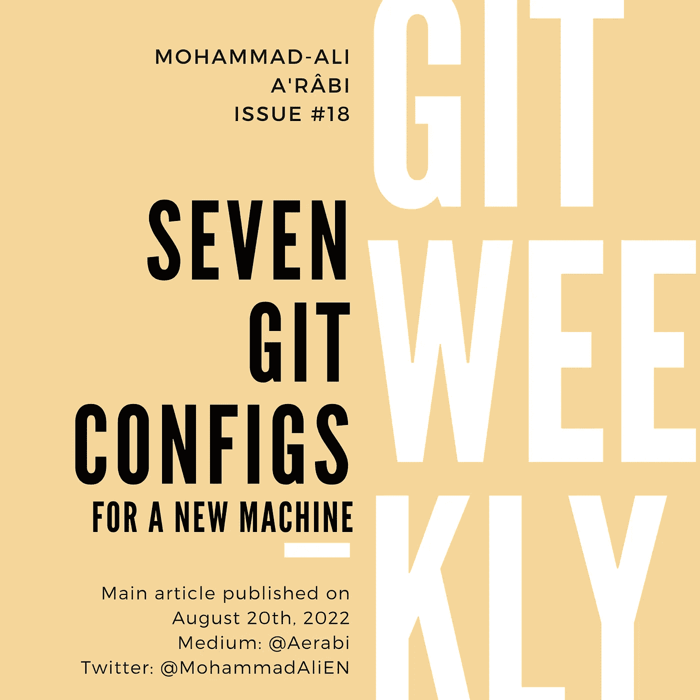

# 七种 Git 配置

> 原文：<https://itnext.io/seven-git-configs-9de48007aa77?source=collection_archive---------1----------------------->

## 移动到新机器时进行设置

整整一个月前，我开始在我的新雇主 Jodel 工作。🎉

新雇主带来了新的笔记本电脑和新的 git 安装。在过去的一个月里，我试图从我以前的博客文章中找到我总是设置的 git 配置。既然我已经很好地配置了我的 git 安装，我将写下我设置的配置。



# 0.显示分支

*主条:* [*Git:确定分支*](/git-determine-branch-95714bcc99ab)

这不是真正的 git 配置，而是 Bash 的配置。如果您没有使用 Bash，那么您可以跳过这一部分。Zsh 展示了开箱即用的 git 分支，我没有太多使用其他 shells 的经验。

诀窍是在您的`.bashrc`文件的末尾添加下面一行，然后每当您进入 git repo 时，git 分支将显示在美元符号后面:

```
**PS1**="${debian_chroot:+($debian_chroot)}\[\033[01;32m\]\u@\h\[\033[00m\]:\[\033[01;34m\]\w\[\033[00m\]\[\e[91m\]\$(__git_ps1 ' [%s]')\[\e[00m\]\$ "
```

# 1.设置姓名和电子邮件

这一步太明显了，不能错过，但如果你正在处理需要不同电子邮件地址的回购，请提前设置它们。例如，如果您需要将您的工作电子邮件地址提交到您的工作 repos，但也需要在与您的个人电子邮件地址相同的机器上运行一些开源 repos。

我的建议是将你最常用的电子邮件设置为全球通用:

```
git config --global user.name "Mohammad-Ali A'râbi"
git config --global user.email "my-name-at-work@employer.com"
```

然后在本地 repos 上本地设置不同的选项:

```
git config user.email "my-personal-id@gmail.com"
```

# 2.设置默认分支名称

在最近的 git 版本中，默认的分支名称不再是“默认”的`master`。如果您想第一次初始化本地分支，git 会告诉您这些，并要求您指定您选择的默认分支名称:

```
git config --global init.defaultBranch <name>
```

在这里你可以设置为`main`或`master`或`trunk`或`on-branch-to-rule-them-all`，随你喜欢。

# 3.将 Rebase 设置为默认拉方法

*相关文章:* [*Git 合并 vs Rebase:三种类型的合并*](/git-merge-vs-rebase-938950fb218)

我总是讨厌在我拉的时候创建一个合并提交。特别是，当我在 master 上开发时，我不能再推了(因为本地分支不在远程分支的前面)。

为了在拉取时重置基础，我设置了以下配置:

```
git config --global pull.rebase true
```

# 4.自动存储

拥有一个干净的母版并不是使用 rebase 作为默认 pull 动作的唯一好处。通过设置以下配置，用户无需在拉货前存放其 WIP，因为会自动执行:

```
git config --global rebase.autoStash true
```

因此，如果您有一些未提交的更改，您可以简单地进行拉取，git 将存储、拉取、重置，然后再次从存储中弹出更改，这一切都是一气呵成的。

# 5.为强制租赁创建别名

*主文:*[*Git Force vs Force with Lease*](/git-force-vs-force-with-lease-9d0e753e8c41)

作为一个 rebases 的人，我需要和`--force-with-lease`一起推远支很多。而且每次都把整件事写出来也没意思:

```
git push --force-with-lease
```

这就是为什么我为它创建了一个别名:

```
git config --global alias.enforce "push --force-with-lease"
```

然后命令变得更短:

```
git enforce
```

# 6.推送时的默认分支名称

假设您已经创建了一个新分支，并希望第一次将它推送到远程回购。Git 会抱怨，说你应该设置上游:

```
git push -u origin the-same-name-as-my-current-branch
```

这整个工作流程超级烦人。这就是为什么有一个配置来自动化它:

```
git config --global push.default current
```

有了这个配置集，下一次您想要推送到一个没有上游集的分支时，git 会自动使用当前分支的名称将上游设置到一个远程分支。

# 最后的话

我每周都会在 git 上写一篇博文。

*   [订阅](https://medium.com/subscribe/@aerabi)my Medium publishes，以便在新的 Git 周刊发布时获得通知。
*   在 Twitter 上关注[我，了解更多其他平台上发布的更新和文章。](https://twitter.com/MohammadAliEN)