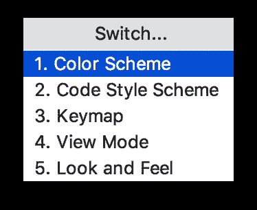
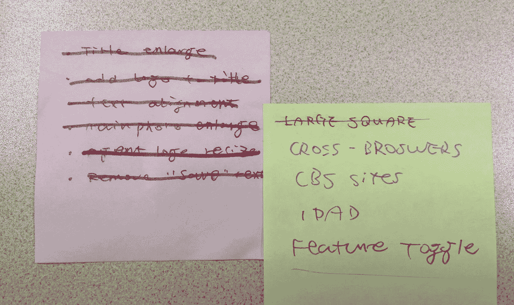
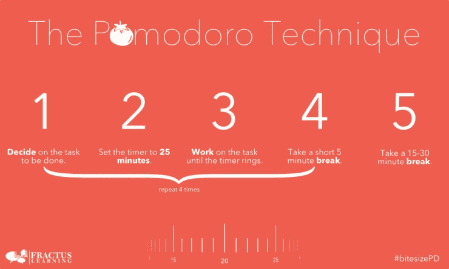

# 结对编程礼仪的七个原则

> 原文：<https://itnext.io/seven-principles-of-pair-programming-etiquette-74a2b3b233b0?source=collection_archive---------6----------------------->

> *结对编程远不止是两个开发人员坐在一起写代码。—未知*

# 结对编程

结对编程是所有敏捷实践中相对有争议的实践——如果不是最多的话。事实上，只有少数采用它的团队能够从中受益。对于大多数其他人，即使他们声称他们在做敏捷，也经常看到两个相反的团体:倡导者强调诸如`knowledge transform`、`reduce potential defects`、`avoid information island`等。另一方面，反对者认为这有点浪费时间:开发人员很难总是专注于某个任务，很容易从一个主题转移到另一个主题(最终以围绕编辑比较/个人偏好的辩论结束)。此外，另一个常见的问题是，当团队采用结对编程时，很难衡量每个人的绩效(对于一些组织来说，衡量一切是至关重要的)。坦率地说，这是我参与的几乎所有项目中最具挑战性的部分。

我不打算讨论结对编程是如何影响生产力的，也不打算讨论我们是否应该在下一个项目中采用它，或者你应该在你自己的项目中应用到什么程度。这里的假设是，你们已经决定作为一个团队来尝试一下，但不知道如何去做，或者对于那些发现应用它并不像看起来那么实际的人，需要一些实际的指导。

当然，结对编程不仅仅是两个开发人员坐在一起轮流编写代码，它是一门科学，也是一种充满乐趣的工程实践。事实上，它有很多原则可以遵循，只有团队中的开发人员正确地应用这些原则，团队才能从中受益。

假设您已经找到了您的同行，并且迫不及待地开始讲述一个特定的用户故事。在您开始输入任何有趣的代码之前，您应该首先设置环境。

# 硬件设置

首先，你需要一个外接显示器和一个高度可调的桌子(当然你可以用纸板箱自己动手)。这是大多数初学者所忽略的，然而，实际上这是决定练习是否可持续或滑向相反方向的基本步骤。如果你的脖子保持倾斜的姿势几分钟，疼痛会分散你对编码的注意力，你会发现很难集中注意力。如果身体不舒服，也不会持续太久。

因此，在你开始编码之前，确保屏幕处于最佳高度，有时你必须调整座位的高度，使其适合你和你的同伴。如果可以的话，你可能想要双屏幕。(在我的职业生涯中，我只见过一次，那是在 NAB 的 Samantha 和 Raymond，他们实际上都有一张戴尔 17' 4k 屏幕的桌子。但我怀疑大多数人并不总是拥有这种豪华配置)

除此之外，你还需要检查一些细节:

*   VGA/HDMI 适配器
*   笔记本电脑电池的高百分比
*   键盘/鼠标适配器
*   便利贴和夏普斯

请记住，纸和笔永远是你最好的朋友，在你开始编码之前，将故事分成 S.M.A.R.T(具体的、可衡量的、可实现的、现实的、与时间相关的)子故事是至关重要的。有时候把它贴在屏幕下方会很方便。最后，请确保你的手机处于静音模式，这很有帮助。

# 软件配置

当您准备好所有硬件后，是时候让软件为您和您的同事工作了。不幸的是，软件比硬件更复杂。大多数专业开发人员都有自己的工具包，从 curl/wget 到 vim/emacs，甚至不要指望你和你的同行在工具方面有什么共同点。那是你可能偶然遇到的事情，但不是你应该预料到的。

根据我的经验，像 JetBrains 的 IntelliJ / WebStorm 这样的高级 IDE 有内置的预定义键映射，你可以很容易地切换。如果你不能同意哪一个键映射适合你们两个，当轮到你写代码的时候就切换到你的键映射，反之亦然。

在 IntelliJ / WebStorm 中，你可以很容易地使用`Ctrl+to switch different preferences,` 3 '来切换键映射。这只是三个按键，在大多数情况下可以避免潜在的冲突。

请注意，这种技术只对你们两个都有复杂的键盘(快捷键)技能的人有效。对于另一个常见的场景——一对中的一个根本不掌握任何预定义的键映射，这将要求较慢的一个尝试学习至少一个键映射，并赶上他/她的同伴。

在你和你的同伴流利地配对之前，你至少应该熟悉一个 IDE/编辑器。例如，您应该能够在不触摸鼠标的情况下完成以下常用任务:

*   按名称搜索文件并导航到该文件
*   按内容搜索
*   定位到特定功能/生产线
*   选择变量、表达式、语句
*   运行测试(在命令行或 IDE 中)

此外，如果您能在`shell`中完成以下任务，那就更好了:

*   按关键字搜索文件/文件夹
*   从 URL 下载文件并保存到文件
*   搜索/替换的正则表达式

诸如此类，这将大大提高你的生产力。更好的是，这些任务的投资回报率相当高，只要花些时间练习和掌握基础知识，这是值得的。

# 当知识不平衡时

好了，我想这足够设置了，现在让我们配对。理想情况下，同龄人应该具有相似的技能水平，具有相对相同的知识库等级，并且能够流利有效地交流。他们可以专注于问题本身并深入讨论，他们讨论时迸发出的想法，他们编码时手指在跳舞。在这样的场景中，他们不需要任何技术，可以做任何他们喜欢的形式。

相比之下，有些情况下，双方都不知道如何解决问题，技能也不符合项目的要求，这是我们在安排人员时应该避免的。

唯一剩下的场景，也是最常见的情况是:一个是有经验的，而另一个相对较新，需要赶上。一般来说，一个人开车，另一个人观察，在旅途中互动，回答提出的问题，一起解决问题。

与传统的教与学不同，结对需要两个聪明的灵魂一起工作，而不是单向交流。因此，观察者不是被动地接受它，而驾驶员不仅仅是教授，实际上这是一种密集的互动活动。

# 对于驾驶员

有时候，司机很容易沉浸太深而忽略了同伴的感受。我自己正常做，这很可怕，把同行当橡皮鸭。这让你的同事很沮丧，很难跟上你的步伐，因此会影响结果。作为一名司机，你需要更多的耐心，并与你的同行保持互动。

另一个极端是司机太热衷于教练，而忽略了为他们的同伴创造机会。这需要驱动程序引入更多的机会让观察者练习:例如，在经历一个完整的 TDD 循环(红绿重构)后，抑制你的脉冲(我知道这很难)继续编码，将键盘交给你的同事，并要求他/她完全按照你刚才所做的去做。

当你发现有什么不对劲时，你应该立即阻止你的同事，并尝试用以下方式来启发他:

*   你能想到什么更好的方法吗？

如果他/她犹豫或不太明白，试着:

*   你认为 XYZ 更好吗？

例如，当你写一些 JavaScript 来遍历一个列表，而你的同事正在努力做一个 For 循环时，你可能会建议`Array.map`做同样的工作，但要体面得多。你可以期待一些令人惊讶的答案，碰巧他们的答案启发了你，你从中学习。

# 观察家报

另一方面，作为观察者，结对是向同伴学习的好机会，你应该充分利用这段经历。例如快捷用法、命令行工具选项或您的同事一直在使用的任何其他高效的编程习惯。保持你的专注和好奇心，当你看到你的 peer 神奇地删除了括号里的所有内容，或者美化了`curl`的输出，不要犹豫去问。

实际上，您可以在每个测试代码周期中转换您的角色。例如，A 编写一个测试，B 编写代码使测试通过，A 进行重构，然后 B 编写另一个测试，依此类推。

# 保持专注

一旦你决定要解决什么问题，你就需要分配任务。这可以确保你总是专注于一小块，并避免当你不得不在上下文之间切换时的潜在浪费。

每个任务完成后，从便利贴上划掉就行了。不要忽视微小滴答声的力量。首先，它可以很容易地可视化进展。其次，当你被会议或午餐打断时，它可以是一个提醒。最后，这个小仪式可以为你的大脑提供积极的反馈，这可以促进多巴胺，使你快乐/热情。

然而，在一些极端的情况下，当冲突不可避免时，我们不得不在某些方面进行权衡，然后继续前进。

# 处理分歧

当你必须和一个固执的同事搭档时，不幸的是你也是一个很难被说服的人，你会如何处理现实世界中这种不可避免的争论？尤其是那些不能明确分辨对错的论点。比如哪种编程语言最适合 Web 应用程序(我听说肯定是 PHP)，或者如何正确地进行 TDD(自底向上还是自顶向下)等等。

在某些情况下，我们坚持我们真正相信的东西，并把与我们想法不同的人视为异教徒。其实只是要多花一点时间才意识到他们可能没那么错，如果能换个角度理性看待问题，可能就说得通了。

在前一个项目中，我选择了`scss module`作为 CSS 预处理器，因为在这个项目之前，我使用了它，发现它非常方便。而其中一个同事的目的是`styled-component`，我们两个都没有说服对方。所以最终代码库中混合了这两种风格。直到有一天，我发现构建在`styled-component`之上的组件看起来相当整洁，在尝试重构一些由`scss`写给`styled-component`的组件后，我发现代码看起来更加简洁，对现有测试没有任何影响。

突然我意识到我一直坚持的`truth`有点讽刺:那只是我编造的一些幻想——只是为了继续使用一些熟悉的东西。保持`open mind`不是那么容易的，希望当你发现很难说服别人或被说服时，你可以重新思考你提出的建议。

对于难以达成一致困境，我建议将其搁置，并尝试其中一种方法，直到您找到阻碍业务需求实现的缺陷。通常，你会发现一些权衡，并提出一个利用双方优势的解决方案。

# 艰巨的任务

即使对于有经验的开发人员来说，他们也可能面临棘手的问题，这可能是一个具有复杂业务逻辑的新领域，或者是一个熟悉领域中的一些新挑战。在某些情况下，双方都没有任何解决问题的线索。如果你在这个阶段坚持配对，实际上使配对变得困难和无效。

一个可行的方法是在有限的时间内，比如 30 分钟，单独做一些尖峰。在大多数情况下，你们中至少有一个人会想出一些开始的方向。否则，您可能不得不将它作为整个团队或整个程序的技术风险提出来。

例如，我们最近面临一个关于 Kerberos 的认证问题，我的同事和我自己都没有接触过这个问题。经过 20 分钟的单独高峰，我发现了一篇关于 Kerberos 身份验证机制的许多细节的信息丰富的文章，我的同行在内部 GitHub 中发现了一些现有的代码(尽管质量一般)。我们决定复制这段代码，而不是花更多的精力在它上面，然后再重构它。而我找到的这篇文章是值得作为延伸阅读资源阅读的。

# 设定并控制正确的速度

注意力实际上是最宝贵的资源，通常你很难专注于任何事情超过 30 分钟。之后，你的大脑会发现一些更有趣的东西。短暂的休息可以让大脑得到恢复和休息。我们的大脑有一个迷人的特征，似乎它有一种在后台处理任务的超能力——而且比前台强大得多。你很可能已经经历了很多下楼买白色平板的时刻。

当你在设置测试套件时遇到一些难以理解或卡住的 bug 时，休息一下可能会从不同的角度给你一些启发。为了避免在某个问题上陷得太深，您可以使用像番茄计时器这样的工具或类似的工具:

1.  从待办事项中提取任务
2.  设置不间断电源`tomato`25 分钟并开始工作
3.  时间到了，任务休息 5 分钟
4.  重复步骤 2-3，在 4 次`tomato`后花 15 分钟

这里有一个在线的[番茄工具](https://tomato-timer.com/)你可以使用，或者你可能只想用你手机上的定时器。

# 开关对

当你总是与某人配对一段时间后，`pair`本身就会转向信息岛。比如，A 和 B 一直在做`order`模块，而 C 和 D 一直在做`store`管理，毫无疑问，过了一定时间，A 和 B 就不知道 C 和 D 在做什么了。不仅是领域知识，还有技术细节/设计模式等。当你的团队发展到 10+的规模时，情况会变得更糟。

你应该有一些机制来确保轮换的发生，比如一周轮换两次，这样可以在整个团队中实现知识共享。

在某些情况下，团队采用前端和后端分离的方式。两端的技术堆栈可能没有任何共同点，这为轮换带来了潜在的挑战，并可能在短期内降低生产率。当`Ops`作为一个独立团队分开时，事情可能会变得更糟。

在实践中，我发现不同角色的轮换所带来的好处比知识隔离要好得多。如果前端开发人员花一些时间与`Ops`配对，他们可以更好地理解应用程序在架构层面上是如何工作的。在与`Ops`配对之后，后端工程师可以意识到潜在的缺陷并在缺陷发生之前修复它(例如，将会话存储、缓存策略等外部化)。

# 尊重你的同伴

作为各种团队级别活动中最小的单位，你要时刻站在同龄人的角度看问题。尽量不要成为自己不想配对的人。例如，你讨厌某人只专注于打字而不关心对方是否在同一页上，或者你不想与总是使用鼠标导航文件和打字时效率较低的人配对，那么你自己应该试着不要成为那种人。

除此之外，尊重全在细节。当你在结对过程中因为其他事情不得不离开时，一定要让你的同伴知道。并在离开前道歉，不要突然消失，几分钟后又出现。没有人想和不可靠的人配对。此外，当你的同事开完会回来时，你应该告诉他/她正在发生什么，进展如何，以及你下一步打算做什么。确保你对手头的任务有相同的理解。

# 控制你的情绪

情绪是相当有趣的东西，它很容易传播给别人。当我们试图完成任务时遇到一些阻碍，或者发现由于一些我们无法控制的原因很难取得任何进展时，你必须学会如何控制自己的情绪。有趣的是，当你的同伴在你旁边抱怨时，你也会变得沮丧，很难集中精力解决问题。

找到外界的帮助并想象出阻挡者是至关重要的。让团队了解你的情况，可能的话提供支持。对任务本身要积极主动，不要让你的负面情绪影响到别人。

# 做一些家庭作业

在度过了充实而快乐的一天后，总结你所学到的东西是你的责任，这是提高你自己和技能的绝佳方式。在应用你从现实世界中学到的东西后，你可以发现你潜在的弱点，看看其他人如何解决它，这可能会对你产生相对深远的影响，所有这些对你都有好处。

例如，当您非常习惯使用`grep`进行全文搜索，并且注意到当您的同行显示出它的一些优势时,`awk`看起来更有效。当你回来的时候，你可以把它当作家庭作业来学习，并且尝试使用不同的选项或者与你已经熟悉的工具进行比较。另一个例子是，你和你的同事在解决日常工作中的一些问题时，发现了关于`webpack`的一些有趣的特性，但是你们都不了解其背后的机制，这是一个改善特定部分的好机会。花些额外的时间在那些能让你第二天看起来更好的衣服上，沉浸在搭配的乐趣中(如果有的话)。

这些原则是基本的、微妙的和琐碎的。但是做好它可以让你和你的同伴在配对时感到舒适和自信，并有望给你的日常工作带来成效。

# 摘要

在这篇文章中，我总结了一些常见的模式和解决方案。在你开始之前，确保你已经正确设置了硬件和软件，并且适合你们两个。为了提高编码效率，您可以使用不同的 IDE 首选项。当你的能力不平等时——这正是结对可以最大限度地发挥其潜力的时候——不仅观察者可以获得大部分经验，而且对于被驱动者来说，可以从不同的角度学到一些东西。

在配对过程中，你应该始终专注于任务，你可能需要`tasking`来帮助将大任务分成几个部分，并一个接一个地解决它们。此外，你应该在配对过程中有规律地休息一下，不时地放松一下紧张情绪。为了避免更大规模的信息孤岛，团队还应该定期轮换这两个人。

总之，通过应用这些原则，从长远来看，对个人和团队都有帮助，并促进团队中的每个人在健康的氛围下工作。