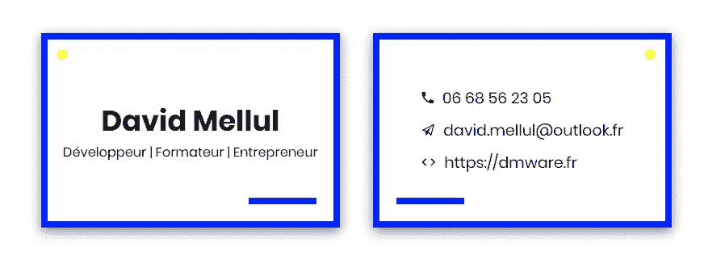
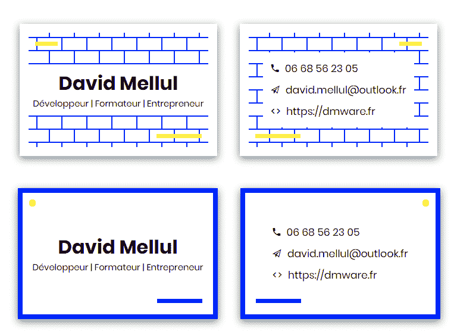
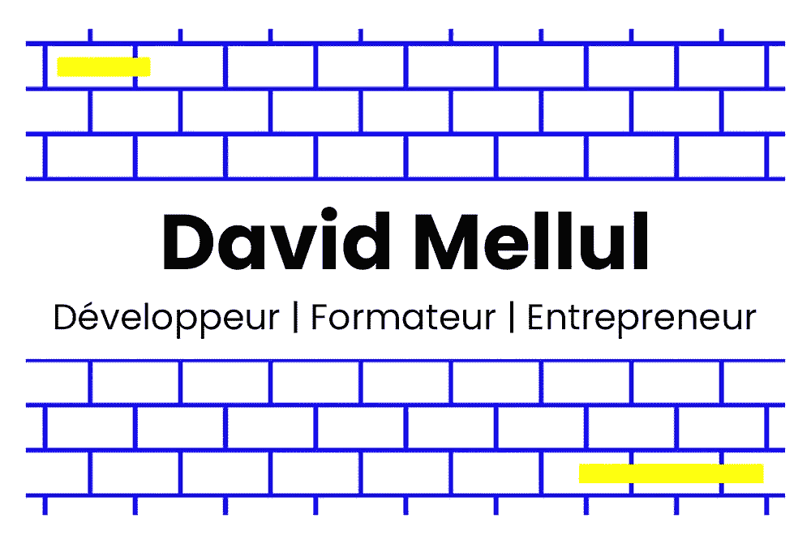

# 塑造现代:我用手设计一张带有代码的名片的小小旅程

> 原文：<https://itnext.io/shaping-modern-age-my-tiny-journey-designing-a-business-card-with-code-by-hand-59ceeb271427?source=collection_archive---------5----------------------->

我想制作自己的名片，作为一只半瞎的猴子，我负担不起使用 Photoshop 或 Sketch 来完成这项任务。

对我这样的完美主义者来说，生活一直是一个挑战，所以我想:

> 至少，代码不会让你做不准确的丑陋的事情。

没时间浪费了，我的名片最多一个小时就完成了。

男孩，我感到骄傲和满足吗

我越高兴，就越快发现，将一个花哨的 HTML + CSS 设计变成 VistaPrint / MOO 的现成打印资产不仅仅是一种痛苦。

时间流逝，花了四个小时与那些臃肿的在线卡片编辑们斗争。

我后悔我的选择了吗？**是的。**

我应该尝试一下 Photoshop 吗？**是的。**

一天后，肯定比德国对韩国更有动力，我决定再试一次。

**第一次尝试的主要问题是印刷商不能保证切割过程中边界的均匀分布。**

我的设计几乎只依靠那些边界，我承受不起这样的灾难。

我想:**再来一次，再来一个没有边界的伟大设计。**

比较|我真的两个都喜欢

我对自己说:**至少这次一切都会好的。**

**我错了！！！**

将一个 HTML + CSS 的设计变成一个图像并不是那么容易。

尝试了十几个在线图书馆，都声称是**那个在打印我该死的卡片时会煮咖啡的**。

其中一个非常突出: [**html2canvas**](https://html2canvas.hertzen.com/)

它可以把我的代码变成一个图像，但是它太模糊了，不管我在 StackOverflow 上找到了什么方法来解决这个问题。

> 我在那里，让我来帮你——Adobe Photoshop，6 月 26 日

我在 Adobe Photoshop 中复制作品的时间几乎和我最初在 Codepen 上花的时间一样多。

我试图尽我所能重现一切

半秒钟后，我收起信用卡，前往 **MOO** ，因为他们觉得自己比其他人更专业、更注重质量。

*(还在等我的包男生！小心)*

# 我学到的是用代码设计名片

强大的力量带来巨大的责任。

我真希望有人教我如何设计名片，以及我必须避免的事情。

让我告诉你我学到了什么，这样你就不会像我一样陷入巨大的陷阱:

*   **尺寸极其重要**:在网上寻找名片的标准尺寸，挑选一张你最喜欢的(欧式、美式、小号、大号等)。注意选择打印机允许的尺寸。**比如**的 MOO 有 **84x55mm** 的卡，而澳洲的标准是 **90x55mm**
*   **不要低估页边距:**打印机有**出血、裁切和安全页边距。安全页边距**是您应该放置更重要内容(徽标、文本、信息)的地方。**修剪** **页边距**是你的卡片被打印机剪切的地方。**出血边距**是打印机切掉的丢失部分。[在这里阅读更多内容](http://www.whyprint.fi/en/support/guides/trimbleedmargin/)
*   **避免彩色边框卡片:**印刷不是像素完美的艺术。如果你的卡片有彩色边框，很可能你的边框是不平等的。例如，你可能有一个左边 2 毫米、右边 4 毫米、上边 1 毫米、下边 2 毫米的，而不是一个全 4 毫米的边框。印刷是一个自动化的过程，不准确是其中的一部分。
*   **使用 CMYK 配置文件:**打印机使用**青色、洋红色、黄色和黑色**墨水来复制您的颜色。因此，你最好有一个带有 **CMYK** 颜色配置文件的 PSD/SKETCH 文件，这样你屏幕上的颜色在你的名片上看起来几乎一样。
*   使用高分辨率图像:名片图片的分辨率至少为 300 DPI(每英寸点数)。它确保当您的图像打印在纸上时，它保持清晰和干净，而不是模糊和“像素化”。
*   **给名片编码有好处:**正如我前面说的，元素居中和定位非常容易。颜色、字体和基本形状(正方形、圆形、三角形、图标)也是如此。这是非常有用的，因为它可以让您在需要时非常精确和对称地定位元素。还有，CSS 包括了`mm | cm | in`这样的单元。所有这些功能都允许使用定制软件(Photoshop、Sketch 等)进行更好的复制
*   **然而它也有局限性:**无论功能多么强大，打印名片都要求图片至少具有 **300 DPI** 和 **CMYK 色彩配置文件。**我建议只有当你像我一样不擅长对齐和定位事物时才使用代码。那么，最好使用专业软件。
*   **专业设计师会比你做得更好**

**更新 2018 年 7 月 11 日:**我收到了我的名片！😍包装很好，卡片也和预期的一样。*小问题:我想让蓝色更加明亮/饱和，但是如果你读过这个故事，你一点也不会感到惊讶。*

# 有用的资源

在我的旅途中，我偶然发现了非常酷的资源，我不知道或者只是没有使用。

*   你的用户界面:[https://uifaces.co/](https://uifaces.co/)非常好的用户画像
*   ****谷歌字体**(键入一个单词，看看它在所有字体下的样子):[https://fonts.google.com/](https://fonts.google.com/)**
*   ****全球名片尺寸:**[https://en.wikipedia.org/wiki/Business_card#Dimensions](https://en.wikipedia.org/wiki/Business_card#Dimensions)**

**我在 Codepen 上的第一张名片:**

# **感谢阅读**

**我的故事不断带来一个不断增长的社区，我无法用语言来表达我的感激之情。不仅仅是鼓励，它激励我写更多，尽可能多地分享有价值的知识。**

**我的最新故事:**

** [## 满足您日常需求的手工 React 组件清单

### 我使用 React 已经有一段时间了，但我仍然对它缺少日常组件包感到惊讶…

dmware.fr](https://dmware.fr/a-short-list-of-handmade-react-components-that-will-fit-your-daily-needs/) 

欢迎致电 **david.mellul@outlook.fr ☕️😃****