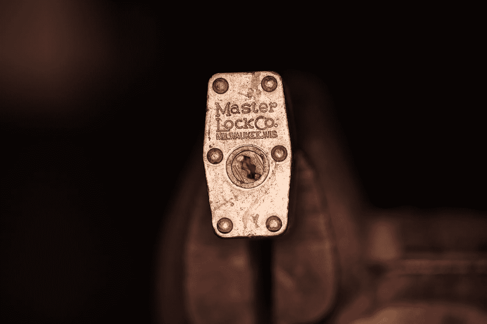

# 在 Node.js 和 Python 3 之间共享 AES-256 加密数据

> 原文：<https://itnext.io/sharing-aes-256-encrypted-data-between-node-js-and-python-3-d0c87eae212b?source=collection_archive---------2----------------------->

今天早上我开始为 [https://nazcabot.io](https://nazcabot.io) 开发一个特性，它要求一些数据在 Node.js 中安全加密，并最终传递给 Python 进程，解密并使用。

**注意**我们正在讨论**对称密钥认证加密**。你有*一些数据*，你想用*密钥加密它。*

你可能和我一样在想。没有。不不不。

显而易见的解决方案是使用 Node 的`crypto`库，它构建在 OpenSSL 之上。现在，最流行的 Python 加密包， [PyCrypto](https://github.com/dlitz/pycrypto) 却不是。虽然底层加密算法是相同的(在我的例子中是`aes-256-cbc`)，但是 OpenSSL 填充数据的方式(PKCS#5)与 PyCrypto 不同，导致了不必要的麻烦。



迈克·什切潘斯基在 [Unsplash](https://unsplash.com?utm_source=medium&utm_medium=referral) 上的照片

# 输入 NaCl 或 TweetNaCl 或 lib na

为了避免不兼容问题，您可以使用[libna](https://github.com/jedisct1/libsodium)，这是一个现代的、可移植的、易于使用的加密库，用 C 语言编写，带有大多数语言的包装器。特别是，它有用于 [Node.js](https://github.com/dchest/tweetnacl-js) 和 [Python](https://github.com/pyca/pynacl) 的包装器。

## **node . js 中的加密**

我使用了一个名为 [tweenacl-js](https://github.com/dchest/tweetnacl-js) 的库和一个兄弟库 tweetnacl-util，它附带了一些方便的函数，你可以用:

```
npm install --save tweetnacl tweetnacl-util
```

现在让我们开始吧。*注意*我已经硬编码了密钥。不要那样做。把密钥放在一个`.env`文件里，用 dotenv 加载。

```
const nacl = require('tweetnacl')
const utils = require('tweetnacl-util')
const encodeBase64 = utils.encodeBase64// Our nonce must be a 24 bytes Buffer (or Uint8Array)
const nonce = nacl.randomBytes(24)// Our secret key must be a 32 bytes Buffer (or Uint8Array)
const secretKey = Buffer.from('_THIS_IS_MY_32_CHARS_SECRET_KEY_', 'utf8')// Make sure your data is also a Buffer of Uint8Array
const secretData = Buffer.from('Some Italians hate wine', 'utf8')
const encrypted = nacl.secretbox(secretData, nonce, secretKey)// We can now store our encrypted result and our nonce somewhere
const result = `${encodeBase64(nonce)}:${encodeBase64(encrypted)}`
```

`result`看起来会像这样

```
6mNohLkeVCPgv6r4Jfx2cRhFHtnIa04K:rWTEbQ0GdzpXdxXZ9JRk+drr3JtEmt1I70DGNpXvPO9lKgOZbflf
```

用一个`:`从我们的加密数据中分离出随机数。重要的是随机数每次都是不同的，因此我们随机生成它并保存它以备后用。

## 解密是 Python

安装[派纳尔](https://pynacl.readthedocs.io/)和`pip`或者你喜欢的任何东西。

```
pip install pynacl
```

现在，假设你已经有了上面的字符串，你可以用几行代码来解密它

```
from base64 import b64decode
from nacl.secret import SecretBoxsecret_key = '_THIS_IS_MY_32_CHARS_SECRET_KEY_'
encrypted = '6mNohLkeVCPgv6r4Jfx2cRhFHtnIa04K:rWTEbQ0GdzpXdxXZ9JRk+drr3JtEmt1I70DGNpXvPO9lKgOZbflf'encrypted = encrypted.split(':')# We decode the two bits independently
nonce = b64decode(encrypted[0])
encrypted = b64decode(encrypted[1])# We create a SecretBox, making sure that out secret_key is in bytes
box = SecretBox(bytes(secret_key, encoding='utf8'))decrypted = box.decrypt(encrypted, nonce).decode('utf-8')
```

现在你知道了

```
'Some Italians hate wine'
```

同样，请确保您的密钥不是以纯文本的形式存储在代码中。