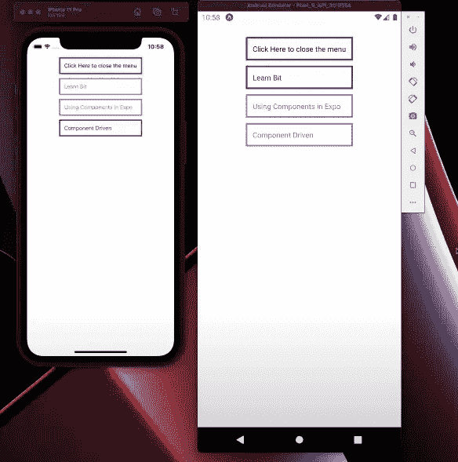
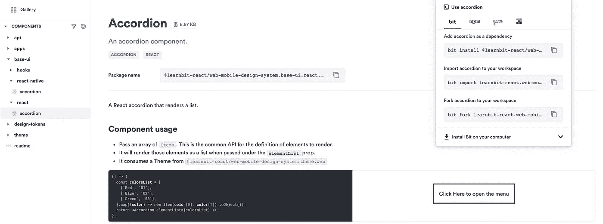
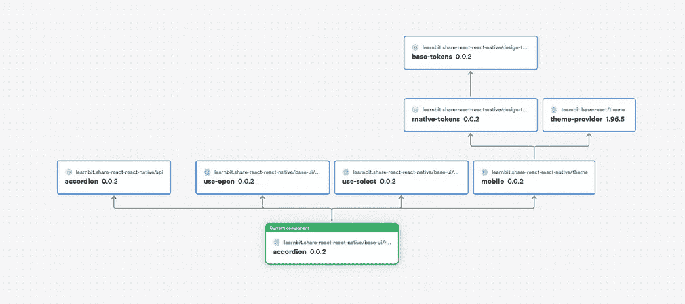
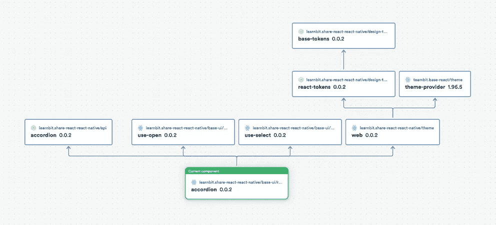

# React 和 React Native 之间共享代码

> 原文：<https://itnext.io/sharing-code-between-react-and-react-native-19dc836538c7?source=collection_archive---------0----------------------->

## 如何将公共代码和设计元素作为 web 和移动应用程序的依赖项进行共享。



我们要做的反应原生手风琴；我们也将有一个针对网络的 React

> **根据** [**本精彩指南**](https://bit.cloud/blog/creating-a-cross-platform-design-system-for-react-and-react-native-with-bit-l7i3qgmw#turn-common-code-to-shared-dependencies) **作者 Jony Kruszewski**

[React](https://reactjs.org/) 和 [React Native](https://reactnative.dev/) 有助于将 web 和移动开发更紧密地结合在一起，以改善用户和开发人员的体验。

有些团队甚至用 React 和 React Native 构建了一个完整的跨平台设计系统([视频教程](https://www.youtube.com/watch?v=O_xhMW8KZPA&feature=emb_title))。

虽然 React 和 RN 需要不同的实现(浏览器和移动设备不一样)，但这两种类型的应用程序和组件通常有共同的代码、业务逻辑、挂钩、道具甚至设计令牌。

在本教程中，我将向您展示如何将 React 和 rn 应用程序的公共元素转化为共享依赖。这些组件是有版本的，我们以后可以跨平台更新和管理它们。

使用开源项目 [Bit](https://bit.dev) ，这变得很简单。

我们会这样做:

1.  **两个组件:React 和 React Native**
2.  **将公共代码和设计令牌转化为共享依赖**
3.  **将它们添加到特定于平台的组件中**
4.  **为反应和 RN 提供主题**
5.  **创建具有共享依赖关系的 web 和移动应用**

让我们开始吧。

> 在这里，你可以找到(并使用)本教程中的所有组件。

# **1。两个组件:React 和 React Native**

在本教程中，我们将使用两个手风琴，一个用于 React，另一个用于 React Native。这是它们的样子:

一个是反应手风琴组件。探索它，安装/派生它，在本地使用或编辑它。

[](https://bit.cloud/learnbit-react/web-mobile-design-system/base-ui/react/accordion) [## 网络-移动-设计-系统/基础-用户界面/反应/折叠

### 手风琴部件。贴上手风琴的标签，反应过来。在您的项目中安装 Accordion。

比特云](https://bit.cloud/learnbit-react/web-mobile-design-system/base-ui/react/accordion) [](https://bit.cloud/learnbit-react/web-mobile-design-system/base-ui/react/accordion)

另一个是 React 本机组件:

[](https://bit.cloud/learnbit-react/web-mobile-design-system/base-ui/react-native/accordion) [## 网络-移动-设计-系统/基础-用户界面/反应-原生/折叠

### 手风琴部件。贴上手风琴的标签，反应过来。在您的项目中安装 Accordion。

比特云](https://bit.cloud/learnbit-react/web-mobile-design-system/base-ui/react-native/accordion) [](https://bit.cloud/learnbit-react/web-mobile-design-system/base-ui/react-native/accordion)

花点时间研究一下每个组件的“[依赖关系图](https://bit.cloud/learnbit-react/web-mobile-design-system/base-ui/react-native/accordion/~dependencies)。您会注意到它们有许多共同的依赖关系。

[](https://bit.cloud/learnbit-react/web-mobile-design-system/base-ui/react-native/accordion/~dependencies)[](https://bit.cloud/learnbit-react/web-mobile-design-system/base-ui/react/accordion)

React 和 React 本机组件之间的共享依赖关系

# 2.将公共代码转化为共享依赖项

我们希望每个 accordion 包含最少数量的特定于平台的代码(因为它们的 API 是不同的)，并将外包所有的公共部分。

有了 Bit，我们可以将任何东西转化为组件，从而依赖于我们的折叠式组件。Ee 希望有尽可能多的特定于平台的实现之外的代码，这意味着钩子、类型、主题和设计标记将成为不同组件的一部分。

以下是我们希望用 React 和 React 原生手风琴创建和组合的组件依赖关系(您可以在这里找到所有这些组件):

```
share-react-react-native              --> scope
├── api                               --> namespace
│    ├── accordion                    --> component
│    └── accordion-items              --> component
├── design-tokens                     --> namespace
│    ├── base-tokens                  --> component
│    ├── react-tokens                 --> component
│    └── rnative-tokens               --> component
├── base-ui                           --> namespace
│    ├── hooks                        --> namespace
│    │    ├── use-open                --> component
│    │    └── use-select              --> component
│    ├── react                        --> namespace
│    │    └── accordion               --> component
│    └── react-native                 --> namespace
│         └── accordion               --> component
└── theme                             --> namespace
     ├── web                          --> component
     └── mobile                       --> component
```

# 3.将它们添加到平台特定的组件中

React 和 React Native 是有区别的。例如，它们不允许相同的样式属性和类型，尽管 React Native 中的所有维度都是无单位的，但在 React 中，您可以使用 px、rem、em 等。

为了实现这一点，我们将有一个共享最常见值的基本对象和添加属性的其他平台特定组件。

我们将应用创建上下文和挂钩的有用模式来将令牌注入到组件中。让 React 和 React Native 一起工作的技巧是，我们将有三种令牌:

*   **一个基础令牌**——两者通用:

```
export interface BaseTokensProps {
  primaryColor: string;
  secondaryColor: string;
  borderColor: string;
  borderStyle: "solid" | "dotted" | "dashed" | undefined;
}

export const baseTokens: BaseTokensProps = {
  primaryColor: "red",
  secondaryColor: "blue",
  borderColor: "green",
  borderStyle: "solid",
};
```

*   **从基础令牌扩展的令牌**，与**一起使用:**

```
import { baseTokens } from "@learnbit-react/web-mobile-design-system.design-tokens.base-tokens";
import type { BaseTokensProps } from "@learnbit-react/web-mobile-design-system.design-tokens.base-tokens";

export interface ReactTokensProps extends BaseTokensProps {
  spacing: string;
  fontSize: string;
  borderWidth: string;
}

export const reactTokens: ReactTokensProps = {
  ...baseTokens,
  spacing: "15px",
  fontSize: "18px",
  borderWidth: "3px",
};
```

*   **一个从基础令牌扩展而来的令牌，用于 **React Native:****

```
import { baseTokens } from "@learnbit-react/web-mobile-design-system.design-tokens.base-tokens";
import type { BaseTokensProps } from "@learnbit-react/web-mobile-design-system.design-tokens.base-tokens";

export interface RNativeTokensProps extends BaseTokensProps {
  spacing: number;
  fontSize: number;
  borderWidth: number;
}

export const rNativeTokens: RNativeTokensProps = {
  ...baseTokens,
  primaryColor: "purple",
  secondaryColor: "gray",
  spacing: 10,
  fontSize: 12,
  borderWidth: 3,
};
```

> 如果您的 IDE 使用相对导入来自动完成位置，您可以通过运行“位链接—重新布线”来快速修复它

# 4.**提供主题反应和反应原生**

使用 Bit a [主题也可以是一个组件](https://bit.cloud/blog/design-tokens-in-components-with-react-and-bit-l28qlxq6)——这在这里很神奇，因为我们可以很容易地为设计令牌和主题组成依赖关系。

对于我们的主题，我们将使用一个预先存在的组件从一个对象创建一个主题。为此，我们需要将它安装在我们的工作区中:

```
$ bit install @teambit/base-react.theme.theme-provider
```

我们需要一个带有主题属性的对象，并调用 createTheme 函数，将其作为参数提供。结果将是一个带有使用这些值的钩子的对象和一个使用 React 上下文注入它的组件。

*   下面是 React 的[主题:](https://bit.cloud/learnbit-react/web-mobile-design-system/theme/web)

```
import { createTheme } from "@teambit/base-react.theme.theme-provider";

import { reactTokens } from "@learnbit-react/web-mobile-design-system.design-tokens.react-tokens";
import type { ReactTokensProps } from "@learnbit-react/web-mobile-design-system.design-tokens.react-tokens";

const theme = createTheme<ReactTokensProps>({
  theme: reactTokens,
});

const { useTheme, ThemeProvider } = theme;
export { useTheme, ThemeProvider };
```

*   这里是 [React Native](https://bit.cloud/learnbit-react/web-mobile-design-system/theme/mobile) 的主题。我们将传递选项`withoutCssVars: true`以避免必须呈现一个`<div>`。

```
import { createTheme } from "@teambit/base-react.theme.theme-provider";

import { rNativeTokens } from "@learnbit-react/web-mobile-design-system.design-tokens.rnative-tokens";
import type { RNativeTokensProps } from "@learnbit-react/web-mobile-design-system.design-tokens.rnative-tokens";

const theme = createTheme<RNativeTokensProps>({
  theme: rNativeTokens,
  withoutCssVars: true,
});

const { useTheme, ThemeProvider } = theme;

export { useTheme, ThemeProvider };
```

现在让我们把它们提供给手风琴。

这很简单，我们可以导入主题组件。

我们的两个手风琴都有相同的框架，我们使用钩子并返回一个映射列表，如下图所示:

```
import { useTheme } from '@learnbit-react/web-mobile-design-system.theme.web // or .mobile in the react-native one!
import { useOpen } from '@learnbit-react/web-mobile-design-system.hooks.use-open';
import { useSelect } from '@learnbit-react/web-mobile-design-system.hooks.use-select';
import type { AccordionProps } from '@learnbit-react/web-mobile-design-system.api.accordion';

const GenericAccordionTemplate = ({ elementList } : AccordionProps) => {
  const { isOpen, toggleOpen } = useOpen();
  const { selectedId, setSelection } = useSelect();
  const {someValueToken, someValueToken} = useTheme();

  return <div_or_View style={{someProp: someValueToken}}>My styled element<div_or_View/>;
};
```

> 请注意，这两个手风琴没有使用相同的 useTheme 挂钩。每一个都使用不同的样式来符合适当的样式类型。

# **5。创建具有共享依赖关系的网络和移动应用**

最后，让我们使用我们的新组件和共享依赖项来构建 web 和移动应用程序。在可组合的应用程序中(即使用 Bit)，您可以添加一个应用程序组件并部署它。因为一切都是组件，所以我们可以添加一个 netlify-deployer 组件，或者创建/添加任何类似的组件来部署到任何地方。点击了解更多[。](https://bit.cloud/blog/deploying-a-composable-react-app-to-netlify-l7rlluzs)

## 让我们从 React web 应用程序开始

[这是部署到 Netlify 的最终结果](https://accordion-react-demo.netlify.app/)。让我们看看它是怎么做的。

让我们创建一个应用程序组件并安装 Netlify 部署器。

```
$ bit create react-app apps/react/accordion — scope learnbit-react.web-mobile-design-systembit install react-router-dombit use learnbit-react.web-mobile-design-system/apps/react/accordionbit install @teambit/cloud-providers.deployers.netlify
```

然后将手风琴添加到应用程序的代码中。

```
import React from "react"; 
import { Routes, Route } from "react-router-dom"; 
import { Accordion } from "@learnbit-react/web-mobile-design-system.base-ui.react.accordion"; 
import { Item } from "@learnbit-react/web-mobile-design-system.api.accordion"; export function AccordionApp() {
  return (
    <>
      {/* header component */}
      <Routes>
        <Route
          path="/"
          element={
            <Accordion
              elementList={[
                new Item("Asia", "01").toObject(),
                new Item("Africa", "02").toObject(),
                new Item("North America", "03").toObject(),
                new Item("South America", "04").toObject(),
                new Item("Antarctica", "05").toObject(),
                new Item("Australia / Oceania", "06").toObject(),
                new Item("Europe", "07").toObject(),
              ]}
            />
          }
        />
        <Route path="/about">{/* about page component */}</Route>
      </Routes>
      {/* footer component */}
    </>
  );
}
```

在`[accordion.react-app.ts](https://bit.cloud/learnbit-react.web-mobile-design-system/apps/react/accordion/~code/accordion.react-app.ts)`中配置应用程序，运行`bit tag`将对其进行快照并进行部署:

```
bit tag apps/react/accordion -m “First deploy”
```

而且展开了！

## 让我们在 Expo 中使用 React 本地组件

```
expo init my-new-project cd my-new-project yarn install @learnbit-react/web-mobile-design-system.base-ui.react-native.accordion @learnbit-react/web-mobile-design-system.api.accordion
```

将组件添加到 app.js 文件中"

```
import {Accordion} from '@learnbit-react/web-mobile-design-system.base-ui.react-native.accordion';
import { Item } from '@learnbit-react/web-mobile-design-system.api.accordion';

import {(StyleSheet, View)} from 'react-native';

export default function App() {
  return (
    <View style={styles.container}>
      <Accordion
        elementList={[
                new Item('Asia', '01').toObject(),
                new Item('Africa', '02').toObject(),
                new Item('North America', '03').toObject(),
                new Item('South America', '04').toObject(),
                new Item('Antarctica', '05').toObject(),
                new Item('Australia / Oceania', '06').toObject(),
                new Item('Europe', '07').toObject(),
              ]}
      />
    </View>
  );
}

const styles = StyleSheet.create({
  container: {
    flex: 1,
    backgroundColor: '#fff',
    alignItems: 'center',
    justifyContent: 'flex-start',
    marginTop: 50,
    },
  });
```

下面是 GitHub 上的[源代码](https://github.com/bit-demos/react-reactn-dds-expo)

# 摘要

浏览器和移动设备是不同的，你不能使用它们之间的所有共同点。然而，有许多代码和设计元素是通用的。通过将这些元素转化为可组合的依赖项，我们可以有效地共享它们，并将它们与我们的 React 和 React 本地组件和应用程序组合在一起。我们可以对它们之间的更新进行版本化和管理，以保持我们的代码库和我们的 UI/UX 跨平台的一致性。

我希望你喜欢并发现它很有用，请随意检查并使用本指南中的示例，开始使用 [Bit](https://bit.dev) 将更多东西转化为组件(从 UI 元素到页面、体验、应用程序甚至后端),并在 React 和 React Native 中度过美好时光。

干杯🍻