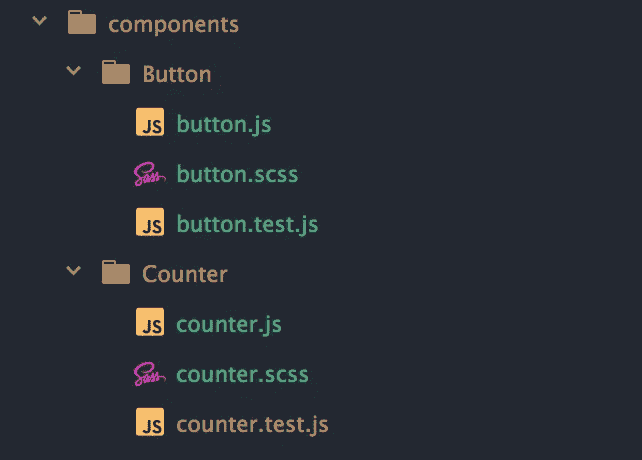
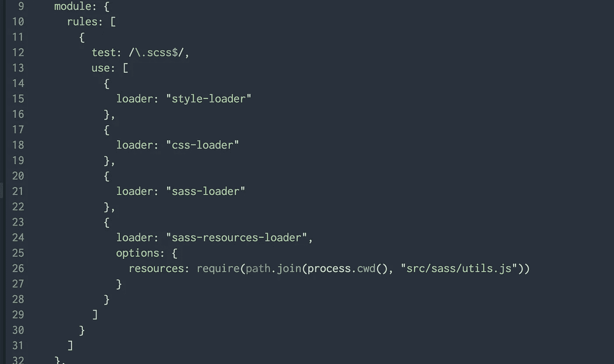

# 用 sass-resources-loader 和 webpack 共享 Sass 资源

> 原文：<https://itnext.io/sharing-sass-resources-with-sass-resources-loader-and-webpack-ca470cd11746?source=collection_archive---------0----------------------->

> [点击这里在 LinkedIn 上分享这篇文章](https://www.linkedin.com/cws/share?url=https%3A%2F%2Fitnext.io%2Fsharing-sass-resources-with-sass-resources-loader-and-webpack-ca470cd11746\)

在处理组件(比如 React 组件)时，将样式紧密结合到组件本身是很有用的。在组件目录中包含组件的 CSS 并不少见。

TL；推倒（网络用词）

*   源文件可在 https://github.com/planetflash/sharing_sass_resources[网站](https://github.com/planetflash/sharing_sass_resources)在线获得
*   演示现场可在[https://planetflash.github.io/sharing_sass_resources/](https://planetflash.github.io/sharing_sass_resources/)观看



我的 React 应用程序的典型组件文件夹结构

我们可能希望在这些组件中使用变量(比如颜色)和混合(比如断点)，但是目前它们还不能使用。我们可以全局定义它们，并将它们导入每个`.scss`文件:

```
// button.scss
@import "../path/to/sass/variables.scss";
@import "../path/to/sass/mixins.scss";.btn {
  ...
  background: map-get($colors, primary);
  ...
}
```

但是，如果我们忘记这样做，这是令人厌倦的，而且容易出错。我们还必须指导开发团队的任何成员记住也要这样做。如果我们决定进一步分割`mixins.scss`(也许分成`mixins.scss`和`mediaQueries.scss`)，我们必须回顾我们的文件并添加新的导入。

# 让我们实现一些自动化

使用 webpack 和 [sass-resources-loader](https://github.com/shakacode/sass-resources-loader) 我们可以自动化这个过程，并拥有我们的 mixins、变量等。我们可以在任何`.scss`文件中找到。首先我们创建我们的`utils.scss`文件，它将包含所有我们希望可用的 Sass。需要注意的是，不要在这里包含任何会有实际 css 输出的文件，否则我们的包文件大小会快速增长，因为输出会在每个文件中。

```
// utils.scss
@import variables.scss
@import mediaQueries.scss
@import mixins.scss
```

然后我们在 webpack 配置中使用 [sass-resources-loader](https://github.com/shakacode/sass-resources-loader) 来自动将它注入到项目中任何`.scss`文件的顶部。

```
// webpack.config.js
...
{
  test: /\.scss$/,
  use: [
    {
      loader: "style-loader",
    }, {
      loader: "css-loader",
    }, {
      loader: "sass-loader",
    }, {
      loader: "sass-resources-loader",
      options: {
        resources: require(path.join(process.cwd(), "src/sass/utils.scss")),
      }
    }
  ],
}
...
```

然而， [sass-resources-loader](https://github.com/shakacode/sass-resources-loader) 建议避免在资源文件中使用“SASS `@import`规则，因为它会降低增量构建的速度”。您可以将一组资源传递给加载器，但是我更喜欢将我的资源文件保存在我的`sass`文件夹中。我们可以使用一个`utils.js`文件而不是`utils.scss`文件来解决这个问题，并像这样导入资源:

```
// utils.js
const path = require("path");const resources = [
  "_ceaser.scss",
  "_variables.scss",
  "_mediaQueries.scss",
  "_mixins.scss"
];module.exports = resources.map(file => path.resolve(__dirname, file));
```

我们的 webpack 配置被简单地修改成包含了`.js`文件而不是`.scss`文件。

```
// webopack.config.js
...
loader: "sass-resources-loader",
      options: {
        resources: require(path.join(process.cwd(), "src/sass/utils.js")),
      }
...
```

我们的资源现在可以在每个`.scss`文件中找到，我们有一个整洁的文件夹结构。

我是保罗·托马斯，是英国布里斯托尔[沉浸式实验室](https://immersivelabs.co.uk/)的首席开发人员。

*   在推特上关注我:[https://twitter.com/motionimaging](https://twitter.com/motionimaging)
*   在 Github 上关注我:[https://github.com/planetflash](https://github.com/planetflash)
*   在 LinkedIn 上连接:[https://www.linkedin.com/in/paulthomas1981/](https://www.linkedin.com/in/paulthomas1981/)

