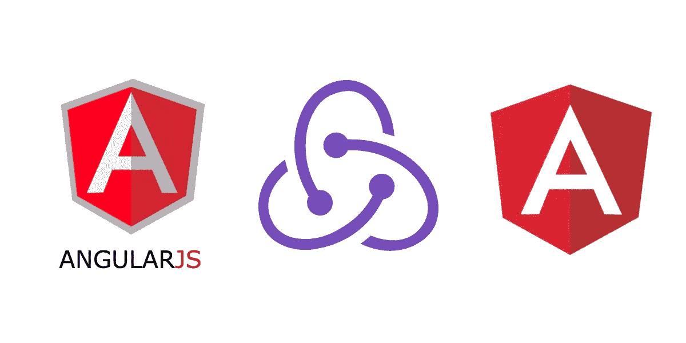

# 使用 Redux 在 AngularJS 和 Angular v6 之间共享状态

> 原文：<https://itnext.io/sharing-state-between-angularjs-and-angular-v6-with-redux-75e3abe7f4f3?source=collection_archive---------1----------------------->



通过 Redux 共享 AngularJS 和 Angular 之间的状态

在我之前的帖子中，关于[用 AngularJS 和 Angular v6](https://medium.com/@roelofjanelsinga/angularjs-angular-v6-hybrid-finally-97ac37087de1) 构建一个混合应用程序(我从现在开始将它称为 Angular)，我设置了拥有一个工作应用程序的基础。但是，当一个框架中的一些动作影响到另一个框架中的状态时，会发生什么呢？那么，您就有麻烦了，因为在 Angular 中访问$rootScope 是一个坏主意，而反过来又太复杂了，花不了多少时间。引入 Redux，集中式状态管理器。

# 它不仅仅与 React 一起使用

Redux？！这难道不是反应吗？不，事实上，它是一个普通的 JavaScript 库，创建一个包含一些数据的 JavaScript 对象。这意味着你可以在 React、VueJS、Angular、jQuery 等中使用它。如果你愿意，你甚至可以在没有框架的情况下使用它。简单来说就是 JavaScript。我以前曾经使用过 Redux，但是那时候，我正在构建两个完全不同的框架，它们彼此相邻，从不接触。这一次，它是两个框架，相互实现，并一直相互对话。这是让 Redux 再帮我一次的绝佳时机。

# 设置 Redux

第一步是设置 Redux，不考虑任何框架。我们必须设置一些我们希望触发的动作，一些 reducers 来处理当前状态中的任何变化，以及一个 store 来将所有这些集合在一起。然后，该商店将“提供”AngularJS 和 Angular。当这个完成时，我们将能够在两个框架中分派动作并订阅任何更改，以便能够同步两个不同框架的状态。

首先，让我们创建一个基本的 Redux 设置。这篇文章不是教程，所以如果你想了解这里发生了什么，我建议你阅读[官方文档](https://redux.js.org/basics)。我用它作为创建自己的设置的指南，所以它与您自己的实现不会有太大的不同。

如果你真的想跟随我的脚步，这里是我的商店:

这是我将在本文中使用的示例商店

rootReducer 将在稍后的博客中展示，所以现在还不用担心。初始状态及其界面如下所示:

这篇文章的初始状态

在这个初始状态，我将我的 languages 属性设置为一个空数组，这意味着当 Redux 启动时，它将有一个空值，但该值就在那里，并准备好用数据填充。初始状态的类型为 IAppState，如下所示:

我不会显示 ILanguage 界面，因为它与本博客无关。这可以是你能想到的任何东西。它只是告诉 TypeScript，languages 属性将用一个 ILanguage 的数组填充。这可以是字符串、整数或布尔值。

# 设置调度员和订户

一旦设置好 Redux，就可以开始分派动作并订阅这些事件。我想你开始明白这是怎么回事了。您将使用一个与框架无关的库在两个“独立的”框架之间共享数据。每当您调度一个操作时，订阅者都会收到 Redux 状态新版本形式的数据。这意味着您可以在任一框架中调度操作，在任何需要的地方添加订阅者，并无缝地交换数据。如果您愿意，您甚至可以使用它在同一个框架内交换数据。对于 AngularJS，这可以帮助您完全删除对$rootScope 的使用。

# Ng-Redux

为了方便地在 AngularJS 中集成 Redux，我使用了 NPM 软件包“ [ng-redux](https://github.com/angular-redux/ng-redux) ”。这是完全可选的，因为你不需要它来使 Redux 工作，但它使与 AngularJS 的集成更简单。您可以通过发出以下命令来安装它:

```
yarn add ng-redux
```

或者，如果你不使用纱线:

```
npm install ng-redux -S
```

当您将这个包包含在您的项目中时，您必须将它与您在我前面提到的 Redux 指南中创建的 Redux store 链接起来。我在上面链接的 GitHub 页面希望你创建一个新的商店，只是为了 AngularJS，但这不是我们想要做的事情。我们已经创建了商店，我们不只是想在 AngularJS 使用它。因此，使用以下代码用现有存储初始化 ng-redux:

在 AngularJS 应用程序中初始化 Redux 的简单方法

我在这里做的只是简单地包含我需要的库:Angular、ng-redux 和我之前创建的 redux 存储。然后我告诉 ng-redux 使用现有的存储，而不是创建一个新的存储。我们需要使用这个现有的商店，因为它允许我们在 AngularJS 和 Angular 之间进行交流。现在让我们来看看 Angular。

# @angular-redux/store

我在 Angular 中做了类似的事情，但是在这个版本中使用了合适的包。这个包叫:“ [@angular-redux/store](https://github.com/angular-redux/store) ”。再次使用以下命令之一:

```
yarn add @angular-redux/store
```

或者，如果你不使用纱线:

```
npm install @angular-redux/store -S
```

在 AngularJS 中，我向您展示了我向 ng-redux 提供了现有的 Redux 存储。这也正是我们要为 Angular 做的:

初始化@ angular-redux/存储在 Angular 中的 AppModule 中

请注意，这是我的实际 AppModule 的精简版本，所以不要简单地将其复制并粘贴到您自己的项目中。我在这个代码片段中做的是包含来自@angular-redux/store 包的 NgReduxModule 和注入器，以及与我在 AngularJS 代码片段中包含的完全相同的存储，以及一个 TypeScript 非常喜欢的接口。在 AppModule 的构造函数中，我为 NgRedux 提供了我之前创建的并且已经在 AngularJS 中提供的存储。我们已经准备好让这些框架相互交互了！

# 准备时间

为了使这部分简单，我将向您展示两件事:AngularJS 发送事件和 Angular 接收事件。当你知道如何从一种方式沟通到另一种方式时，其他方式的沟通就很容易了。

首先，我将展示一个带有缩减器的动作的一个小片段，所以您大概知道在这个特定的例子中发生了什么。

这是您可以在这个 Redux 存储中调度的示例操作

出于演示的目的，我只包含了一个可以在 Redux 设置中分派的动作。我使用常量来确定动作，因为它们可以在 PhpStorm 中进行类型提示，这样可以节省我的时间。

这是一个带有单个缩减器的根缩减器的例子

这是一个根缩减器，只提供了一个缩减器，即语言缩减器。如果只有一个减速器，就没有必要使用组合减速器。但这是真实设置的简化片段，所以我有大约 15 个减速器。

这是 RootReducer 中提供的示例语言缩减器

这是我实际使用的语言缩减器。如你所见，我在这里给出的默认值是 INITIAL_STATE 常量的一部分。这确保我得到一个可预测的值，以防我选择忽略状态变化。这个 reducer 所做的只是返回一个填充了 ILanguage 类型对象的数组。正如我之前提到的，这种类型实际上是什么并不重要。你可以把它当成一个字符串数组来读。

# 是时候开始说话了

因此，有了存储、操作和缩减器，我们就可以开始调度操作和接收数据了。首先，我们来看看 AngularJS 用一些数据调度一个动作，Angular 接收这些数据会是什么样子:

AngularJS 用 Redux 调度新语言

AngularJS 刚刚派出了一个行动。它包含一个包含一些数据的简单 JavaScript 对象。让我们看看如何在 Angular 中捕捉这些数据。

角度接收随机分量中的数据

这里您可以看到 Angular 是如何接收组件中的数据的。现在，您已经在两个不同的框架中获得了相同的数据。这可以帮助您使它们保持同步，无缝地协同工作。分享数据不一定很难。根据同样的原理，您可以在 Angular 中调度一个动作，并在 AngularJS 中接收数据。不过我打算让你自己弄清楚怎么做:)(在 ng-redux 和@angular-redux/store 的文档中都有，放心吧！).

# 结论

一旦你知道它是如何工作的，在框架之间共享数据并不困难。在这篇文章中，我演示了如何在 AngularJS 和 Angular 之间发送数据，但是您可以很容易地将其更改为 Angular/React、React/VueJS/Angular、AngularJS/VueJS，嘿，让我们来点有趣的，React/jQuery。您使用哪种框架并不重要，只要您使用的是 JavaScript(或者我使用的是 TypeScript)，您就已经可以在项目中使用 Redux 了。

如果你对我如何改进我的内容或我的例子有任何建议，请告诉我！我总是乐于接受建议。如果你有任何问题，你可以在评论中提问，我会尽我所能回答你。