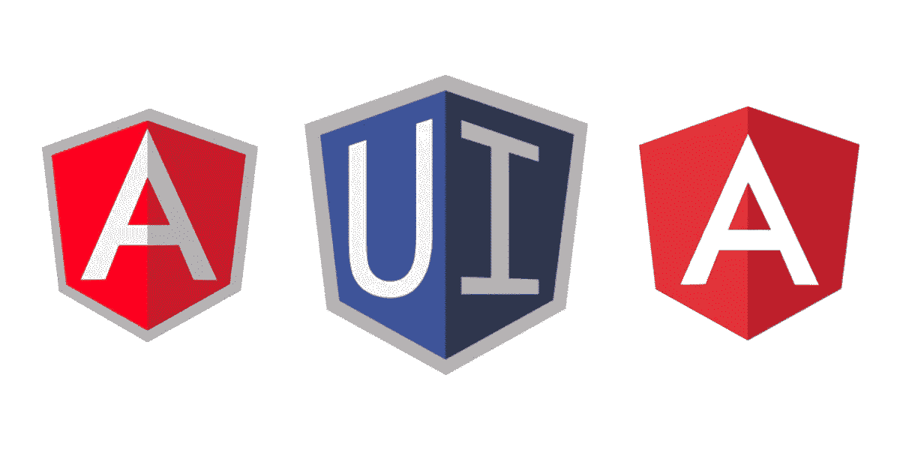

# 在 AngularJS 和 Angular 6 之间共享 UI 路由器

> 原文：<https://itnext.io/sharing-the-ui-router-between-angularjs-and-angular-6-84f6370ec557?source=collection_archive---------0----------------------->



在 AngularJS 和 Angular 6 之间共享 UI 路由器

在我之前的一些帖子里，[“Angular js+Angular(V6)hybrid(终于！)"](https://medium.com/@roelofjanelsinga/angularjs-angular-v6-hybrid-finally-97ac37087de1)和[" Angular js 和 Angular v6 与 Redux 共享状态"](/sharing-state-between-angularjs-and-angular-v6-with-redux-75e3abe7f4f3)，我已经记录了制作一个混合 AngularJS/Angular 应用程序的过程。

到目前为止，我已经解释了如何设置 Angular 应用程序来显示 AngularJS 和 Angular 内容(从现在开始，我将使用 Angular 来指代 Angular 6，AngularJS 来指代版本 v1.x)。随着我在转换应用程序方面的进步，我已经到了开始将整个页面转换成棱角状的时候了。要做到这一点，你可以将整个页面降级为 AngularJS 指令和组件，并将其注入 AngularJS UI 路由器，或者你可以使用我发现的一个很棒的包。我们用那个包吧！

# Angular UI 混合路由器

在我的 AngularJS 应用程序中，我使用的是 UI 路由器，而不是“普通的”Angular 路由器。这样做的唯一原因是 UI 路由器给了我使用命名路由的选项，而不仅仅是 URL。让我们开始这个过程。首先，使用 NPM 或纱线安装包装:

```
yarn add @uirouter/angular-hybrid
```

或者

```
npm install @uirouter/angular-hybird --save
```

现在，在您的 AppModule 中，导入此模块:

好了，完成了！嗯…差不多了！遵循下一节中的设置步骤后，您可以在 AngularJS UI 布线中引用任何角度组件。

# 在 AngularJS 应用程序中需要采取的步骤

按照[软件包的 GitHub 页面](https://github.com/ui-router/angular-hybrid#getting-started)上描述的步骤，对您的 AngularJS 安装做一个小小的调整。这将确保 AngularJS 理解你在做什么。你可以在他们的 GitHub 页面上获得更多关于这个包[设置的信息。这里有非常重要的信息，以避免某些错误，并确保 AngularJS 路线和 Angular 路线得到合并，所以也看看那里。他们建议的 Angular 应用程序的更改我个人还没有实现，但是，我采取的步骤记录在](https://github.com/ui-router/angular-hybrid)[“引导应用程序”](http://Now you can just refer to any Angular component in your AngularJS UI routing.)一节中。如果你也需要实现其他步骤，就自己看看吧。

# 静态路由

你可能希望在你的 AngularJS 路由旁边开始建立一些角路由，这是非常容易的。下面我为所有我想在应用程序中显示的静态页面创建了一个模块。这里要特别注意 UIRouterUpgradeModule。这次它没有使用 forRoot()，而是使用了 forChild()，请确保您也这样做。这为您在 AppModule 中创建的现有路由器提供了额外的路由。

因此，在这之后，您可以简单地在您的 AppModule 中导入 StaticPagesModule，您将能够查看您刚刚定义的角度路线上的页面。

# 动态路线

我们刚刚定义了一些静态路线，没有任何数据要解析，但普通应用程序大多数时候不会这样工作。您的页面需要数据来呈现列表、表格或您想要显示的任何内容。那么我们如何做到这一点呢？嗯，UI 路由器提供了一些方法，这些方法记录得非常糟糕。我只是通过挖掘源代码找到了其中的一些，所以让我来帮助你。注意 state 对象中的 resolve 参数，查看我发现的三个不同的选项。可能有更多(或更好)的解决方案，但我至今没有找到。

这里有五种场景，第一种使用提供的字符串，可以在 NgModule 的 providers 部分找到。第二个使用与 AngularJS UI 路由器相同的语法。第三个选项只是提供一个类，UI 路由器会自动解决这个问题。第四个选项类似于第一个选项，但是您可以内联提供一个值。第五个选项是第四个选项的变体，但是显示了您可以在解析器中注入一个解析器。被注入解析器的解析器将不会做任何事情，直到它的依赖被解析。

我个人最喜欢第三种方法，因为它保持路线干净。当一个路由不需要依赖注入时，你的最佳选择是选项 1 或 2，这取决于你。如您所见，当您使用选项 1 和 3 时，您会得到这些“神奇的”路由和转换变量，UI 路由器会为您提供这些变量。你可以在那里找到查询参数，你刚来的状态，和你要去的状态，并且可以用于像条件重定向这样的事情。

有很多选项可供您解析数据，因此请找到最适合您的选项，并在整个路线中使用它。

# 结论

混合 UI 路由器帮助您将整个应用程序从 AngularJS 慢慢迁移到 Angular。如果您愿意，您可以继续使用 AngularJS UI 路由器，并降级 Angular 组件以保持一切与 AngularJS 兼容，但无论如何，您迟早都需要进行转换。当你开始转换整个页面时，从混合路径开始，否则，从长远来看，你将做两倍的工作。Angular UI Hybrid Router 帮助您从 v1.x 迁移到较新的版本，并保持路由状态对象几乎相同，因此不需要大量的重写。

如果你对我如何更好地解释有任何提示或建议，请让我知道，我很乐意帮助你并向你学习。