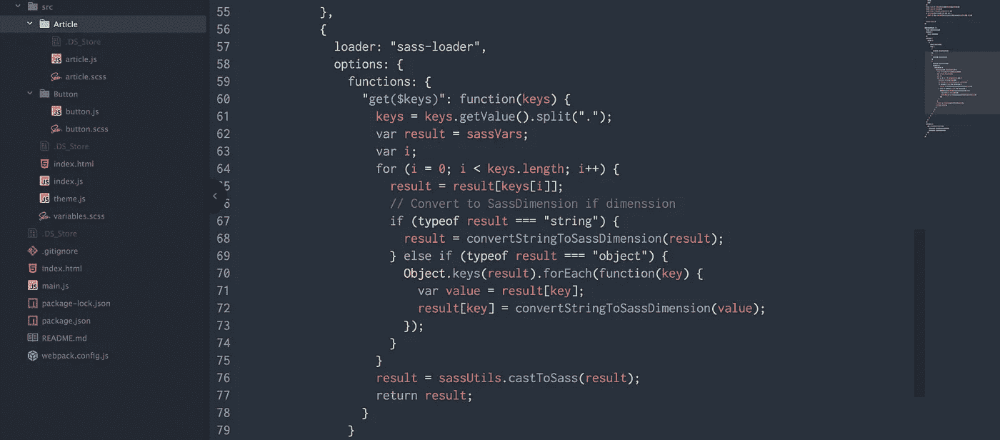

# 使用 webpack sass-loader 在 JS 和 Sass 之间共享变量

> 原文：<https://itnext.io/sharing-variables-between-js-and-sass-using-webpack-sass-loader-713f51fa7fa0?source=collection_archive---------3----------------------->

[*点击这里在 LinkedIn 上分享这篇文章*](https://www.linkedin.com/cws/share?url=https%3A%2F%2Fitnext.io%2Fsharing-variables-between-js-and-sass-using-webpack-sass-loader-713f51fa7fa0)

项目的主题是一个文件，您可以在其中定义组成其外观的各种属性。这可能包括颜色、字体、断点和大小/间距。有了这个真实的单一来源，更新就变得容易了，这意味着您可以确信您的所有组件都是从同一个地方获得它们的值的。

一个项目可能很容易在你希望混合使用 JS 样式(比如样式化组件或内联样式)和 Sass 样式的情况下结束，但是我们仍然希望有一个真实的单一来源。那么，我们如何在一个地方定义我们的属性，同时又能被 Sass 和 JS 使用呢？

TL；推倒（网络用词）

*   源文件可以在[https://github.com/planetflash/sharing_variables_js_sass](https://github.com/planetflash/sharing_variables_js_sass)在线获得
*   演示网站可在[https://planetflash.github.io/sharing_variables_js_sass/](https://planetflash.github.io/sharing_variables_js_sass/)观看

# 真理的单一来源

所以，我们已经决定我们需要在一个地方定义我们的属性，但是这应该在 JS 中还是在 Sass 中？这两种方法似乎都可行，我简要地探讨了这两种方法。我认为定义规则最合理的地方应该是在 JSON 对象中。设置简单明了，分组直观，如果其他地方需要，可以很容易地将其转换成各种格式。

```
// theme.js
module.exports = {
  base: "16px",
  spacing: "1rem",
  breakpoints: {
    xs: "0em" /* 0px */,
    sm: "30em" /* 480px */,
    md: "64em" /* 1024px */,
    lg: "75em" /* 1200px */
  },
  typography: {
    font: "'Open Sans', sans-serif",
    text: "1rem",
    title: "2rem"
  },
  colors: {
    primary: "#2c97de",
    secondary: "#7F8FA4",
    warning: "#f2c500",
    success: "#1fce6d",
    danger: "#e94b35",
    error: "#e94b35"
  },
};
```

这个`theme.js`文件是我们的主题可能看起来像什么的一个简化的例子，包含我们的基本大小、断点、字体和颜色。然后可以将这个文件导入到任何需要它的 JS 组件中。

# 具有可用于 Sass 的值

我们仍然需要将这些相同的值放入 Sass，这样我们就可以通过 CSS 将它们用于样式化。我们使用 w [ebpack](https://webpack.js.org/) 来编译我们的代码，更具体地说是使用 [sass-loader](https://github.com/webpack-contrib/sass-loader) 来将 sass 编译成 CSS，以便可以通过 [css-loader](https://github.com/webpack-contrib/css-loader) 将其导入到我们的项目中。关于如何在 webpack 中使用 Sass，有大量的文章，所以我们在这里就不深究了。

sass-loader 使用 [node-sass](https://github.com/sass/node-sass) ，这恰好支持[函数](https://github.com/sass/node-sass#functions--v300---experimental)。这意味着我们可以创建自定义函数，然后通过我们的 Sass 文件访问这些函数。这是我们用来访问我们的`theme.js`属性的。

```
// webpack.config.js...
const sassVars = require(__dirname + "/src/theme.js");
...
module.exports = {
...
  {
    test: /\.scss$/,
    use: [{
        loader: "style-loader"
    }, {
        loader: "css-loader"
    }, {
        loader: "sass-loader"
        options: {
          functions: {
            "get($keys)": function(keys) {
              keys = keys.getValue().split(".");
              let result = sassVars;
              let i;
              for (i = 0; i < keys.length; i++) {
                result = result[keys[i]];
              }
              result = sassUtils.castToSass(result);
              return result;
            }
          }
        }
    }]
  }
...
}
```

您会注意到该函数的最后一行使用了来自 [node-sass-utils](https://github.com/sass-eyeglass/node-sass-utils) 的一个名为`[castToSass()](https://github.com/sass-eyeglass/node-sass-utils#sassutilscasttosassjsvalue)`的函数。这个方便的函数将 JS 值转换成 Sass 值，比如将 JSON 对象转换成 Sass 映射，使得在 Sass 中使用 JS 值成为可能。

# 使用 Sass 中的属性

这使我们可以访问 Sass 文件中的一个名为`get()`的函数，它的用法如下:

```
// style.scss
.text { 
  color: get('colors.secondary');
  background: get('colors.primary');
}
```

这让我们非常接近最终目标。我不太喜欢这种语法，尤其是在团队环境中，这意味着要培训其他开发人员如何使用它。我更愿意使用 Sass 变量和 Sass 映射。为此，我们创建了一个名为`variables.scss`的文件

```
$base: get("base");
$spacing: get("spacing");
$grid: get("grid");
$breakpoints: get("breakpoints");
$colors: get("colors");
```

然后，我们将这个文件导入到任何需要使用这些变量的 Sass 文件中。

```
// style.scss
@import 'variables.scss';.text {
  color: map-get($colors, secondary);
  background: map-get($colors, primary);
}
```

# 处理维度

我们现在非常接近了，但是我们还有一场战斗要打——维度。现在的代码*会*起作用，我们可以说`margin: $spacing;`和萨斯会解决这个问题。然而，我们在这里真正做的是给 Sass 一个字符串，而不是一个维度，如果我们试图对它运行任何数学运算，我们都会得到一个错误。所以我们真的需要把这些字符串转换成维度。

[node-sass-utils](https://github.com/sass-eyeglass/node-sass-utils) 用它的 [SassDimension](https://github.com/sass-eyeglass/node-sass-utils#class-sassdimension) 类再次拯救了我们。

```
const convertStringToSassDimension = function(result) {
  // Only attempt to convert strings
  if (typeof result !== "string") {
    return result;
  } const cssUnits = ["rem","em","vh","vw","vmin","vmax","ex","%","px","cm","mm","in","pt","pc","ch"];
  const parts = result.match(/[a-zA-Z]+|[0-9]+/g);
  const value = parts[0];
  const unit = parts[parts.length - 1];
  if (cssUnits.indexOf(unit) !== -1) {
    result = new sassUtils.SassDimension(parseInt(value, 10), unit);
  } return result;
};
```

这个函数检查传递给它的字符串是否是 CSS 维度(以 px、em、rem 等结尾。)如果是这样，就从该值和分母创建一个`SassDimension`，这样`castToSass`函数就能够正确地将该值解释为一个维度。

我们需要对每个值和对象中的每个值运行这个，这样我们就不会遗漏任何一个值。我们的`get()`函数因此变成:

```
"get($keys)": function(keys) {
  keys = keys.getValue().split(".");
  let result = sassVars;
  let i;
  for (i = 0; i < keys.length; i++) {
    result = result[keys[i]];
    if (typeof result === "string") {
      result = convertStringToSassDimension(result);
    } else if (typeof result === "object") {
      Object.keys(result).forEach(function(key) {
        const value = result[key];
        result[key] = convertStringToSassDimension(value);
      });
    }
  }
  result = sassUtils.castToSass(result);
  return result;
}
```

现在，我们能够通过 Sass 或 JS 访问我们所有的值，它们的行为就像最初在 Sass 中声明的一样。我们只需要更新我们的 theme.js 文件，我们将在站点范围内进行更新——尽管值得注意的是，您需要重新启动 webpack 才能工作，但这不会在`watch`期间发生。

我是保罗·托马斯，是英国布里斯托尔[沉浸式实验室](https://immersivelabs.co.uk/)的首席开发人员。

*   在推特上关注我:[https://twitter.com/motionimaging](https://twitter.com/motionimaging)
*   在 Github 上关注我:[https://github.com/planetflash](https://github.com/planetflash)

