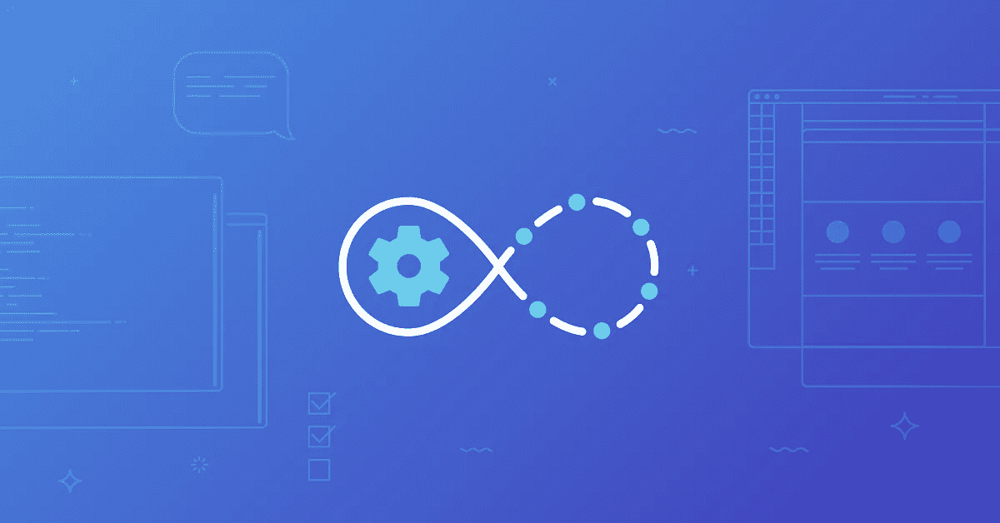

# 将您的 CI 脚本转移到 docker build

> 原文：<https://itnext.io/shift-your-ci-scripts-to-docker-build-92453bca9f75?source=collection_archive---------0----------------------->



典型场景:您的团队维护几十个 Jenkinsfile/。gitlab-ci.yml/whatever,每一个项目都有其特定的需求。您已经尝试从一个 repo 到另一个 repo 重用这些持续集成脚本。但是这很难，因为每个项目都有自己的技术栈、版本、对其他工具的依赖性等等。

还有，您梦想能够在本地测试您的 CI 管道，而不是在 CI 服务器中调试。

我说的对吗？然后， [**多级码头工打造**](https://docs.docker.com/develop/develop-images/multistage-build/) 都是冲着你来的。

这种技术已经存在很多年了，但是用户通常没有意识到它的全部潜力。

想法很简单:**将多个 Dockerfile 文件合并到同一个 Dockerfile 文件**。在构建过程中，他们每个人都可以执行不同的任务。

让我们看一个例子。我已经包含了一些额外的复杂性来演示高级概念，但是到目前为止，还是把重点放在本质上。请参考[官方文件](https://docs.docker.com/develop/develop-images/multistage-build/)了解 kickstart。这个职位的特点是展示竞争情报的能力。

第一阶段进行声纳测试:

```
FROM newtmitch/sonar-scanner AS sonar
COPY src src
RUN sonar-scanner
```

下一阶段是安装依赖项并构建应用程序:

```
FROM node:11 AS build
WORKDIR /usr/src/app
COPY . .
RUN yarn install \
 yarn run lint \
 yarn run build \
 yarn run generate-docs
LABEL stage=build
```

下一个，单元测试:

```
FROM build AS unit-tests
RUN yarn run unit-tests
LABEL stage=unit-tests
```

第三，把文件推给 S3:

```
FROM containerlabs/aws-sdk AS push-docs
ARG push-docs=false
COPY --from=build docs docs
RUN [[ "$push-docs" == true ]] && aws s3 cp -r docs s3://my-docs-bucket/
```

最后，最后一个阶段是唯一一个将反映在结果图像中的阶段。它使用较小的基础图像，并且只有所需的伪像:

```
FROM node:11-slim
EXPOSE 8080
WORKDIR /usr/src/app
COPY --from=build /usr/src/app/node_modules node_modules
COPY --from=build /usr/src/app/dist dist
USER node
CMD ["node", "./dist/server/index.js"]
```

Jenkins 文件变得简单多了(Kubernetes 上 Jenkins 的例子):

```
#!/usr/bin/env groovypodTemplate(label: "example", name: "example", 
  containers: [
    containerTemplate(name: 'dind', 
privileged: true, image: 'docker:18.06-dind', command: 'dockerd-entrypoint.sh'),
    containerTemplate(name: 'docker', image: 'docker:18.06', command: 'cat', ttyEnabled: true)
  ],
  envVars: [
          envVar(key: 'DOCKER_HOST', value: 'tcp://localhost:2375')
  ]
){node('example'){container('docker'){stage('checkout'){
        checkout scm
      }stage('Docker build + push'){
        sh """#!/bin/bash
          docker build -t test --build-arg push-docs=true .
          docker push test
        """
      }stage('deploy'){
        .......
      }
    }
  }
}
```

它可以用于几乎每个项目！

主要优势:

*   它可以从一个 CI 系统重用到另一个 CI 系统(例如，从 Jenkins 迁移到 GitHub actions)。这对开源项目来说尤其方便。
*   你可以通过在本地运行 docker build 来测试它。
*   与构建和测试源代码相关的一切都在 docker 文件中。因此，CI 脚本保持了对源代码的抽象。
*   人为错误的空间更小:每一步都不可避免地在无特权的 docker 容器中执行。你甚至可以通过使用像 [Kaniko](https://github.com/GoogleContainerTools/kaniko) 这样的工具来避免 docker 守护进程。

总的来说，特定于项目的一切都是自包含的，CI 脚本可以从一个存储库重用到另一个存储库，从而使基础设施更简单、更便宜、更易于维护。给它一个机会，将尽可能多的工作负载转移到 Dockerfile 文件中！

# 额外提示

有一些警告，但这些都很容易克服。我将告诉你其中的两个:

**按需跳过特定步骤**

例如，我在 S3 上包含了一个将生成的文档推到桶中的阶段。只有在我的 CI 系统中执行构建时，这才是有用的，在这里，我提供凭证来写入这个 bucket。

为此，我用 ARG 命令设置了一个 build 参数。默认情况下，它是假的，但是在我的 CI 服务器中，我运行`docker build --build-arg push-docs=true`，然后命令`aws s3 cp`被执行。

**导出测试报告或任何其他工件**

在 docker build 中执行所有操作的最重要的警告是工件会保留在中间 docker 映像中。例如，对我来说，将测试结果放在 Jenkins 工作区来生成统计数据是很有用的。

用标签很容易从任何中间阶段拿走任何神器。

我把第二阶段标为`stage=test`。所以在 docker 构建之后，我可以运行一个小脚本来获得文件 test-results.xml

```
docker cp $(docker create — name temp $(docker image ls — filter label=stage=test -q | head -n 1)):/usr/src/app/tests-results.xml .; docker rm temp
```

它使用`docker image ls`来获得这个阶段的图像的 ID 和`docker cp`来复制文件。

一个更好的解决方案是使用更多的标签从其他类似的构建中筛选出您的特定构建。

您已经到达终点，所以这里是最后的建议:使用 [BuildKit](https://docs.docker.com/develop/develop-images/build_enhancements/) 。😉

[ignaciomillan.com](https://ignaciomillan.com)