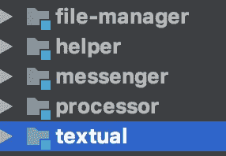

# 在 10 分钟内在 Kubernetes 上发送您的 Spring Boot 应用程序

> 原文：<https://itnext.io/ship-your-spring-boot-application-on-kubernetes-in-10-minutes-6873fddc388b?source=collection_archive---------7----------------------->

非常容易，非常舒适，高度可靠和公平足够直观…我将解释我如何运送一个多微服务项目开发的 Spring Boot 谷歌 Kubernetes 引擎(GKE)。

Kubernetes(K8s)是一个突破性的平台，得到了很好的宣传。我不会解释 K8s 背后的架构，但我可以说的基本事情是:谷歌 Kubernetes 引擎(GKE)使得在 K8s 架构上部署和展示应用程序变得容易。

我们的应用程序由 5 个不同的微服务组成(我知道这不是一个大的架构，但相信我，我看过许多来自 Google 工程师的演示，他们在一个项目中部署了数百甚至数千个微服务)。每个微服务实际上是同一个项目下的一个模块。让我向你展示在 IntelliJ Idea 上看到的结构:



故事从容器化那些 Spring Boot 应用开始。正确的关键词是:com . Spotify . docker file-maven-plugin

将这个插件导入到 pom.xml 中，并在每个模块的根目录中放置一个 Dockerfile，它将驱动容器化过程。

```
FROM openjdk:8-jdk-alpine
VOLUME /tmp
ARG JAR_FILE
ADD $JAR_FILE target/app.jar
ENTRYPOINT ["java","-agentlib:jdwp=transport=dt_socket,address=5005,server=y,suspend=n","-Djava.security.egd=file:/dev/./urandom","-Xms2g","-Xmx8g","-jar","target/app.jar"]
```

以上 docker 文件是一个足够合理的指令，可以拥有一个产品级的容器映像。我们用 GIT 平台给定的提交 ID 来标记 docker 图像，这一点我将在接下来的故事中解释。

我们依赖的下一个有用的平台是 Jenkins。通过使用 Jenkins，我们在主分支上提取每一个提交，构建一个标记有提交 ID 的 docker 映像，将该映像推送到 Google 容器注册表(将此视为一个免费的 dockerhub ),然后部署在 GKE 上。就是这样！下面是 Jenkins 在 local 上执行的几行 shell 命令。

```
./mvnw install dockerfile:build -Drevision=${SCRUMID} -Dgit-revision=$GIT_COMMIT
docker push gcr.io/MYGOOGLECLOUDPROJECT/messenger:${SCRUMID}.$GIT_COMMIT
kubectl set image deployment/messenger-app messenger-app=gcr.io/MYGOOGLECLOUDPROJECT/messenger:${SCRUMID}.$GIT_COMMIT
```

是什么让上面那些 shell 命令？让我们一个一个地考虑

第一行执行一个 maven 命令，用 scrumId.gitCommitId 标记构建一个 docker 映像。

第二行将所谓的图像推送到 Google 容器注册表。

第三行是一个简单的 kubectl 命令，它更新所有运行我们的 messenger 应用程序部署的 pod。

就这么简单！这么简单。

另外，考虑使用 Jenkins box 来运行 docker 命令和 kubectl 命令，并为您的 Google 云项目 MYGOOGLECLOUDPROJECT 进行连接和配置