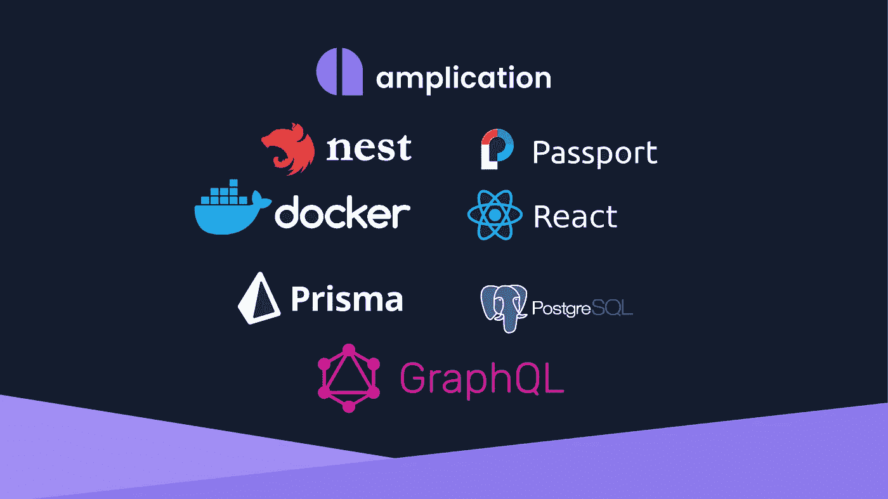
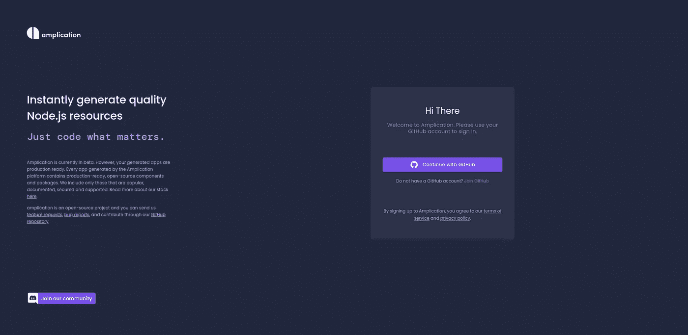
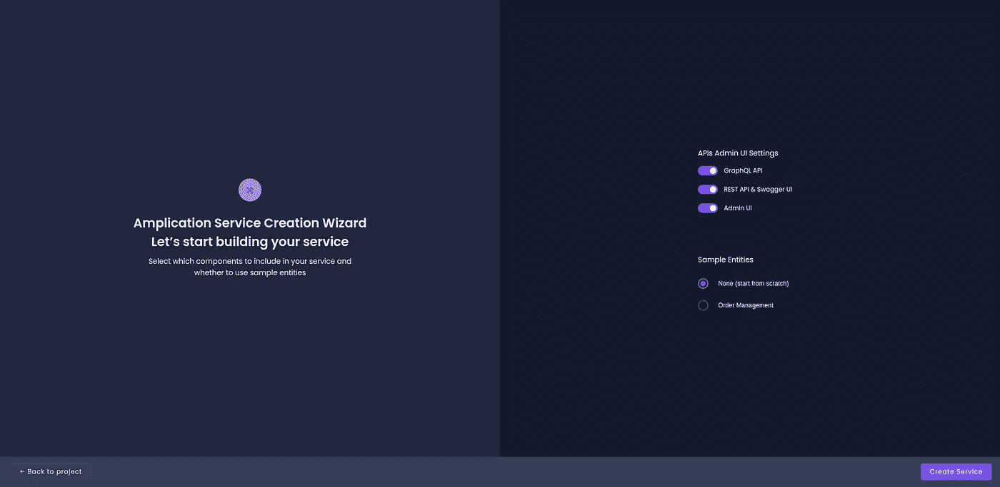

# 利用 Amplication 缩短 Node.js 应用程序的上线时间

> 原文：<https://itnext.io/shorten-go-live-time-for-node-js-applications-with-amplication-db56326786d9?source=collection_archive---------0----------------------->

放大堆栈

用任何技术开发任何应用程序都是一个复杂的过程。我们必须考虑很多事情，比如架构，使用什么技术，哪些模块，如何正确维护，需要使用什么帮助程序库或第三方，等等。

这里我们将特别关注 Node.js 应用程序。正如我们现在所知，Node.js 使用单线程、异步和非阻塞架构，由于这些特性，它提供了很多灵活性、选项和库，我们可以使用它们来开发我们需要的任何应用程序。另一个好处是，它可以用于应用程序开发生命周期的所有步骤，前端和后端。

有了上面所说的一切，我们可以想象我们拥有前端和后端的大量选项/工具/库和框架。其中一些工具/框架是 [Express.js](https://expressjs.com/) 、 [NestJS](https://nestjs.com/) 、 [Fastify](https://www.fastify.io/) 、 [Socket。IO](https://socket.io/) 、 [React](https://reactjs.org/) 、 [Vue.js](https://vuejs.org/) 、 [AdminJS](https://adminjs.co/) 、 [TypeORM](https://typeorm.io/) 、 [Sequelize](https://sequelize.org/) 、 [Prisma](https://www.prisma.io/) 、 [EJS](https://ejs.co/) 、 [NunJucks](https://mozilla.github.io/nunjucks/) 等等，不胜枚举。

面对所有这些选择，选择哪一个最符合我们的需求是如此困难和复杂。此外，即使我们已经选择了我们需要的框架和库的堆栈，我们也必须在这个堆栈上开发我们的应用程序，这不是花费在开发我们的业务上的时间，而是实际开发应用程序来为我们的业务提供功能。

这一点非常重要，尤其是对于一家以快速发展为目标的初创公司。

尽管上面提到的所有工具和框架都大大加快了我们的开发过程，但是进一步减少这个时间是很重要的，这样我们才能更好地满足我们的业务需求。

这就是[扩增](https://amplication.com/)帮助我们的地方。Amplication 消除了选择堆栈的负担，它为我们提供了一个预定义的堆栈，其中包含许多样板代码，可以随时使用并适应我们的需求。

## **什么是扩增？**

Amplication 是一个开源工具，通过用户界面在几分钟内实现我们应用程序的前端和后端，包括 REST API 和 GraphQL。工程师需要做的是设计应用程序从 UI 工作所需的数据模型，我们的应用程序的所有代码都是自动生成的，功能齐全，具有集成的管理 UI。

Amplication 还为我们提供了一个用于管理 UI 和后端服务器的`Dockerfile`,我们已经可以使用它在我们选择的任何云提供商中部署我们的应用程序。

关于所使用的堆栈，前端使用以下库:

*   [材料 UI](https://www.npmjs.com/package/@material-ui/core) 用于图标和与 UI 指南相关的一切
*   [React](https://www.npmjs.com/package/react) 、 [React Admin](https://www.npmjs.com/package/react-admin) 、 [React Dom](https://www.npmjs.com/package/react-dom) 和 [React 脚本](https://www.npmjs.com/package/react-scripts)用于呈现所有数据和 UI 相关组件
*   [Sass](https://www.npmjs.com/package/sass) 编写自定义样式并根据我们的需要进行编译
*   [Apollo 客户端](https://www.npmjs.com/package/@apollo/client)查询 GraphQL API 并获取必要的数据

如果我们选择在本文后面将看到的项目设置中生成 GraphQL API，那么 React Admin UI 上呈现的所有内容都是使用 GraphQL 从服务器获取的。如果没有，它将使用 REST API。

对于后端，堆栈如下所示:

*   NestJS 框架和所有必要的库，如 [config](https://www.npmjs.com/package/@nestjs/config) 、 [core](https://www.npmjs.com/package/@nestjs/core) 、 [graphql](https://www.npmjs.com/package/@nestjs/graphql) 、 [jwt](https://www.npmjs.com/package/@nestjs/jwt) 、 [passport](https://www.npmjs.com/package/@nestjs/passport) 、 [swagger](https://www.npmjs.com/package/@nestjs/swagger) 等
*   [Prisma](https://www.npmjs.com/package/@prisma/client) 作为处理 PostgreSQL 数据库层和迁移的 ORM
*   [护照](https://www.npmjs.com/package/passport)用于认证和处理代币
*   [Jest](https://www.npmjs.com/package/jest) 用于测试

正如我们所看到的，在 Node.js 社区中使用的所有工具都非常流行，并且维护得非常好。

值得一提的是，所有代码都是以 TypeScript 格式生成的，并且可以完全定制，以防我们想要实现 Amplication 可能还不支持的附加功能。

## 使用放大器

我们可以很容易地在云中使用 Amplication，或者通过克隆[库](https://github.com/amplication/amplication)并在本地运行它。在这里，我们将展示如何使用云版本。

首先，我们需要用我们的 GitHub 帐户登录。

登录页面

登录后，我们将看到下面的页面，在这里我们可以选择是否要为后端生成 REST API 和 GraphQL API，以及为前端生成 Admin UI。我们还可以选择从头开始一个项目，或者使用已经预先配置好的订单管理项目。

在我们的例子中，对于这个演示，我将选择订单管理项目，我们将生成 GraphQL 和 REST API 以及 Admin UI。

如果我们禁用 GraphQL，如前所述，Admin UI 将使用 REST API 生成，我们不能再切换启用/禁用。如果我们也禁用 REST API，Admin UI 也将被禁用，并且我们不能再次启用它，直到我们启用 GraphQL。

项目设置

单击 create 按钮后，我们将进入以下 UI。我不会在这里深入讲解，因为您可以在下面的视频中看到演示，但我会做一个简短的介绍，在这个 UI 上，我们可以看到将要使用的工具，我们可以在“实体”部分访问和管理我们的实体，在“角色”部分，我们可以访问和管理我们的用户将拥有的角色。 与 GitHub 部分同步，这非常重要，我们需要连接到一个存储库，在那里我们的代码将被存储，以及查看代码部分，在那里我们可以看到我们的代码，一旦我们在 GitHub 上第一次提交。

项目概述

现在是时候了，让我们通过演示视频展示 Amplication 的实际应用。

行动中的放大

## 运行我们的应用

现在我们已经实现了我们的应用程序，并通过 Amplication UI 完全配置了我们需要的所有功能，是时候运行它并查看它的运行情况了。

如视频所示，我们在存储库中创建了两个文件夹，一个名为`admin-ui`的文件夹将为我们的 UI 提供服务，另一个名为`server`的文件夹将运行我们的 GraphQL 和 REST API。

首先，我们需要运行我们的服务器，这样我们就可以让 UI 使用我们的 API。有几种方法可以运行服务器，但最简单的方法是进入服务器目录并运行`npm run compose:up`命令。这应该会启动我们的服务器，使我们能够在这个 URL 中看到 REST API 的 Swagger UI 文档[http://localhost:3000/API/](http://localhost:3000/api/)和这个 URL 中的 graph QL Playground[http://localhost:3000/graph QL](http://localhost:3000/graphql)。

***注意:确保执行迁移，因为根据您的本地环境设置，运行迁移的容器可能并不总是工作。***

现在服务器正在运行，我们可以导航到`admin-ui`目录并运行`npm run start`命令来启动我们的前端，一旦它运行，如果它没有在我们的浏览器中自动打开，我们可以在这个 URL[http://localhost:3001/](http://localhost:3001/)中访问它。

我们可以使用我们的默认凭证登录，即用户名`admin`和密码`admin`，并开始管理您的数据。

你也可以参考 Amplication 的文档[来了解如何运行这个应用程序。](https://docs.amplication.com/docs/getting-started/dev-env/)

这是一个运行中的管理 UI 和服务器的快速演示。

运行中的管理 UI

希望你喜欢这篇文章，并和我一样发现 Amplication 很有用:-)

如果您想与我联系，您可以关注或联系我的任何社交网站，或者通过我的[个人网站](https://abame.github.io/)上的联系方式。

照片由[普里西拉·杜·普里兹](https://unsplash.com/@priscilladupreez?utm_source=medium&utm_medium=referral)在 [Unsplash](https://unsplash.com?utm_source=medium&utm_medium=referral) 上拍摄