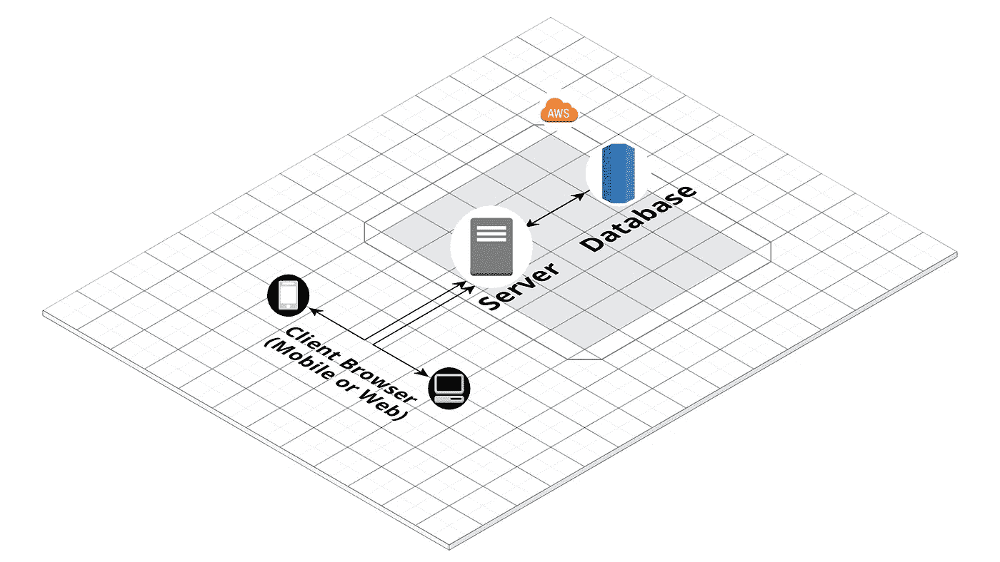
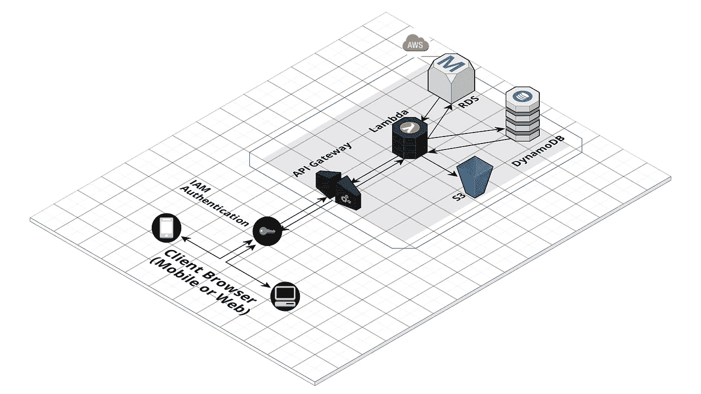

# 我应该选择“无服务器”吗——如何为您的产品和业务选择合适的解决方案

> 原文：<https://itnext.io/should-i-go-serverless-how-to-choose-the-right-solution-for-your-product-and-business-d8ce0b6bb151?source=collection_archive---------10----------------------->

随着技术越来越多地转向基于云的解决方案，而不是传统的内部部署，我们面临着如何部署应用程序的多种选择。考虑到如此多的可能性，这个时候从来没有这么混乱过。那么，我们如何着手选择我们的架构呢？

# 基于云的基础设施的类型

我们有两种基于云的基础架构，如下所示。

## 基于服务器的计算

基于服务器的计算基本上是指，为了运行我们的应用程序或软件，我们建立了一台服务器，或者从 AWS(亚马逊网络服务)、GCP(谷歌云平台)或 Azure(微软)等云提供商那里提供服务器。然后，我们安装所需的包、需求和服务，如 Apache Web 服务、Flask、Django、它们的依赖项或我们需要的任何东西。我们需要管理应用程序的部署、与之相关的数据库、补丁和软件更新以及可扩展性(添加更多 CPU、RAM 等)。)和监控，以确保高运行时间和最小的中断。

基于服务器的计算

## 无服务器计算

无服务器计算基本上是使用上述云提供商提供的所谓“托管服务”来部署我们的应用程序。一些例子(在 AWS 中)是使用 S3/RDS/DynamoDB 进行存储，Lambda 用于代码执行，API Gateway 用于创建和服务 API 等。在这种情况下，没有对特定服务器的管理。

无服务器计算

我们将更深入地探讨两者的优缺点。

# 无服务器工具和技术

## 亚马逊网络服务

*   按需代码执行
*   关系数据库
*   NoSQL 型数据库
*   S3(云存储)
*   API 网关(创建 API)
*   简单通知服务
*   SQS(简单队列服务)
*   运动(流)
*   红移

## GCP(谷歌云平台)

*   云函数
*   云存储
*   数据存储，大表
*   数据流
*   发布/订阅
*   BigQuery
*   谷歌 SQL

下面您可以找到 AWS 和 GCP 服务之间的映射，仅供参考。

 [## 将 AWS 服务映射到谷歌云平台产品|谷歌云平台免费层|谷歌云

### 谷歌云提供安全、开放、智能和变革性的工具，帮助企业实现现代化，以适应当今的…

cloud.google.com](https://cloud.google.com/free/docs/map-aws-google-cloud-platform) 

# 无服务器的利与弊

基于服务器的架构已经存在了很长一段时间，并在工业中大量使用，直到今天。很明显，我们对无服务器的好处和坏处知道得更多了。

# 无服务器的优点

## 缩短上市时间

*   无需管理或调配服务器，这意味着您可以更快地设置和运行基础架构。

## 降低运营和开发成本

*   大多数无服务器技术将根据使用情况(如 API 调用或函数调用)向您收费，因此，当您刚刚开始使用时，流量不会太高，这可能非常好。此外，开发成本也降低了，因为开发人员可以专注于应用程序，而不是担心基础设施无法工作。
*   零维护成本。

## 易于打包和部署

*   任何将应用程序打包并部署到传统 Web 服务器的人都会告诉你这是多么痛苦和复杂。无服务器架构通常只需要将代码打包成 Zip 文件，然后通过控制台上传或通过 API 调用提交。这整个过程也可以自动化。

## 非常适合敏捷开发

*   由于代码的部署非常容易，应用程序可以使用敏捷实践如看板、Scrum 等更有效地开发。可以相对快速地添加功能、修复和部署缺陷。

# 无服务器的缺点(不太好)

## 冷启动

*   当您的无服务器基础架构需要初始化内部资源来满足第一个请求时，就会出现冷启动问题。第一次之后，通常这不是问题。这通常是由于启动容器来运行应用程序。在某些非常需要微秒级延迟的情况下，这可能是一个问题。
*   Python 和 Go 的启动时间较短，而 Java 和 C#的启动时间较长。

## 供应商锁定

*   由于每个供应商的无服务器技术，您的代码必须设计成适合该系统。您的应用程序并不是完全与云无关的，需要重新设计以适应另一个提供商的系统。

## 数据敏感性

*   由于无服务器的运行方式，提供商可能会在同一台物理服务器上运行来自不同客户的代码(这也称为多租户)。
*   在使用 PCI 或 PII(客户可识别数据或卡敏感数据)的情况下，您需要考虑在无服务器系统中出现错误并且您的数据受到危害时的潜在影响。这非常罕见，但总有这种可能性，你应该意识到这一点。

# 如何选择和做决定？

决定选择什么是困难的，并且会消耗开发时间，但是从长远来看，这将为您节省大量时间，这是当您试图快速启动和运行您的产品时最重要的事情(更不用说省钱了)。

那么你如何选择最适合你的呢？

## 预算和时间

考虑将您的产品推向 POC 阶段并最终推向市场所需的时间是很重要的。如果你是一家早期创业公司，你希望你的开发者把他们的时间和精力放在构建和维护基础设施或者构建应用程序功能上吗？你在预算和时间方面有什么限制？

## 高可用性和可扩展性

客户期望并要求您的应用程序或服务具有很高的正常运行时间。您是否有预算支持开发运维工程师监控您的基础架构和服务器？您的设置还需要具有可伸缩性。如果你正在构建一个 API，它能每秒处理 10，000 个请求吗？每秒一百万呢？

## 路线图和渠道

作为产品愿景的一部分，您的路线图中还有哪些其他产品？这个基础设施和代码可以重用以缩短开发时间吗？您计划使用敏捷交付模型还是瀑布交付模型？

## 数据

您是否有任何敏感的 PII 或 PCI 数据，如果在云中存储或执行，一旦泄露，可能会对您的业务造成潜在的危害？

## 云提供商

您决定选择云提供商了吗？有什么更大的因素在影响它吗？您会在短期或长期内要求更换提供商吗？

# 结论——问自己上述问题并进行测试

如果您无法回答以上问题来帮助您做出决定，您可以做的是构建一个演示或 POC，看看在性能和成本方面什么最适合您。从一个开始，看看它在初始阶段是如何部署、执行和扩展的。您可以稍后重新考虑这个决定，但是上述问题回答得越早，就体系结构而言就越好，这意味着您以后不需要做 180 度的转变。

我希望这篇文章能帮助你和你的公司决定是应该走无服务器路线还是坚持使用传统的产品服务器。请在下面的评论中留下问题和反馈，或者通过 Linkedin 和其他社交媒体与我联系。