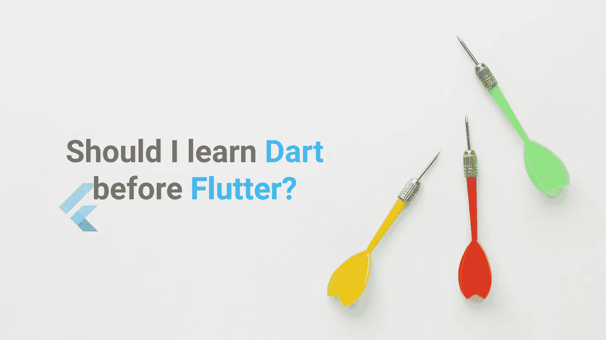

# 我应该先学飞镖再学扑吗？

> 原文：<https://itnext.io/should-i-learn-dart-before-flutter-55893ab9ca84?source=collection_archive---------0----------------------->

***“飞镖是旋舞的先决条件吗？我应该在开始颤振之前学习吗？我应该知道多少镖？没有飞镖开始飘起可以吗？”*** 这样的问题不胜枚举。我敢肯定，如果你看到这篇文章，这意味着你刚刚开始困惑，或者你也迷失在这些问题中。让我们一劳永逸地消除这种困惑吧！

飞镖前扑？

> 注意:这只是我个人的观点和想法，请不要认为这是硬性规定:)

所以，这将是非常简单和快速的。我已经在我的其他几篇文章中回答了这个问题，但我决定明确地写下这个问题，因为我收到了很多关于“ **Dart before Flutter** ”困惑的 DM。

我们将讨论分为三种情况:

1.  你完全是编程初学者吗？
2.  你知道编程(OOP)或其他语言(java，python，C++等)的基础吗？)
3.  你是来自另一个框架/库吗？

# 👦完全的编程初学者

现在，如果你是一个完全的编程初学者，并且从未编写过一段代码，那么对你来说**“Dart”是次要的，**你首先应该学习的是编程基础知识，包括:

*   **面向对象编程**
*   **数据结构(堆栈—是必须的！).**

我强烈建议你使用面向对象的 Java 和数据结构的 C++。

> 为什么选择 Java & C++？那是一个单独的讨论；p

一旦你完成了？然后你可以直接进入 Flutter 世界，而不需要专门学习 Dart，因为它与 Java/C++/C#等非常相似。因此，你现在可以开始学习颤振。

# 💻了解编程或语言的基础

如果你有编程的基础知识，那么很明显你已经使用过像 Java，python，C++或者 JavaScript 这样的编程语言。在这种情况下，没有必要像上面提到的那样专门学习 Dart，*“它非常类似于 Java/C++/C#等。”*

# ⚡来自另一个框架/库？

在这种情况下，如果你来自另一个框架或库，那么这也完全没问题，因为如果你一直在使用 **Angular 或 React.js** ，那么你肯定使用了很多 JavaScript，Dart 与此非常相似。

例如，JS 有承诺，Dart 有未来。`async`和`await`在这里也是一样的。所以，你在使用 Flutter 的时候会感觉很熟悉。

更多细节 **Flutter 有针对不同场景的官方文档**，你可以查看:

*   [Web 开发者文档](https://flutter.dev/docs/get-started/flutter-for/web-devs)
*   [安卓开发者文档](https://flutter.dev/docs/get-started/flutter-for/android-devs)
*   [iOS 开发者文档](https://flutter.dev/docs/get-started/flutter-for/ios-devs)
*   [Xamarin 开发者文档](https://flutter.dev/docs/get-started/flutter-for/xamarin-forms-devs)
*   [React 原生开发者文档](https://flutter.dev/docs/get-started/flutter-for/react-native-devs)

最后但同样重要的是，如果您还想看的话，可以看一下 Dart 语言的[概述](https://dart.dev/overview)

# 结论

现在，你可能会有一个问题

> 如果是这样的话，那么谁需要在开始颤振之前学习飞镖？

我的朋友，如果你想专门用 Dart 语言编程，那么只有我会建议你像学习 Java 或 C++一样学习 Dart。因为对于开始颤振编程的基础是必不可少的，如果你已经覆盖，那么显然没有必要学习 Dart 只是因为你需要学习颤振。

所以，分析一下自己，开始行动吧！设置 flutter 并开始编写你的第一个 flutter 应用程序。下面是我的文章，作为 Flutter 初学者的路线图和资源指南，以防你正在寻找什么:)

[🗺颤振路线图&资源指南— 2020 年|作者:Muhammad Hamza | ITNEXT](/flutter-roadmap-resource-guide-2020-2ea6e4460a15)

# 谢谢大家和# HappyFluttering💙