# 你应该换成夸库斯吗？

> 原文：<https://itnext.io/should-you-switch-to-quarkus-4b89eedfe5fe?source=collection_archive---------0----------------------->

我曾经有一个经理说“问第二个问题”。当我问我的一个女儿“你的作业做完了吗？”我总是得到一个肯定的回答。然后，我会问第二个问题“所以它准备好了吗？”通常的回答是“嗯，我还有一件事要完成”。一个问题永远不够，第一个答案通常是被提问的人希望你或者他们自己相信的。

我最近和一位 Red Hat 架构师谈论微服务和 OpenShift，在那次谈话中 [Quarkus](https://quarkus.io/) 出现了。在过去做了很多 Java 开发之后，我对 Quarkus 这个想法非常感兴趣。这是一个“为 OpenJDK HotSpot 和 GraalVM 量身定制的 Kubernetes 原生 Java 堆栈”，它承诺显著加快基于 Java 的微服务的启动时间，并减少其占用空间。我怎么能错过呢？我搜索并找到了一些文章，展示了 Quarkus 应用程序比标准的基于 JVM 的应用程序启动要快得多。我决定自己试试，果然我的应用程序启动更快，占用空间更小。然后，按照我前任经理的建议，我问了第二个问题:它跑得更快吗？事实证明，这个问题的答案是“视情况而定”。

# 设置

为了对 Quarkus 的潜力进行真正的测试，我不想以运行 Quarkus 为目标定制一个应用程序——这可能会因为有目的地构建而扭曲结果。我的大多数客户都有遗留应用程序，因此，转换现有应用程序是一个更现实的用例。我正好有一小组微服务，我已经在其他几篇文章中使用过，其中一篇是 Spring Boot 应用程序。这个微服务， *capitol-info，*通过 REST 操作提供 CRUD 能力。第一个操作通过一个 **HTTP GET** 调用返回国家首都。第二个操作支持通过一个 **HTTP POST** 插入/更新 capitols。

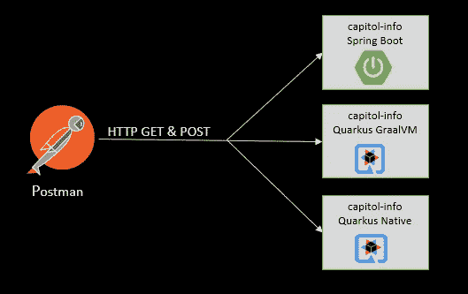

性能测试案例

Red Hat 有一篇关于如何将 Spring Boot 应用程序转换成 Quarkus 的好文章。本文涵盖了删除 Spring Boot 代码和构建工件，并用 Quarkus 等价物替换它们。我没有太大困难地按照文章中的说明做了。我会说它花了不到半个小时就完成了修改并获得了一个干净的构建。当然，我只做了两次 REST 手术，但这个过程还是相当顺利的。

## 本地夸库人

下一步是按照[的指示](https://quarkus.io/guides/building-native-image)构建 Quarkus 本地版本，包括安装 C 编译器。我在构建应用程序的本地版本时没有任何问题。然而，当我去运行它时，微服务无法找到库，出现了运行时错误。具体来说，它试图找到我的 [JSON 数据库库](http://jsondb.io/)。我研究了这个问题，并决定如果可能的话，我应该为项目依赖项使用 Quarkus 扩展。因为 JSON 数据库库有注释，所以使用扩展是一个硬性要求。不幸的是，我使用的 JSON 数据库库没有 Quarkus 扩展。我只能选择构建一个扩展或者替换代码。我决定更换。

为了模拟类似于 JSON 数据库的功能，我用 HashMap 和 JSON 序列化替换了相关代码。为了序列化，我使用了 [GSON](https://github.com/google/gson/blob/master/UserGuide.md) 库，我已经在应用程序的其他地方使用了。这个库没有 Quarkus 扩展(顺便提一下，有一个 Apache Camel GSON 扩展，但是这个微服务没有使用 Camel)，但是可以编译，因为它没有使用注释。没有扩展被证明是重要的，我们将在后面看到。

为了确保磁盘 I/O 是等式中的一部分，而不仅仅是 CPU，我用 GSON 添加了 JSON 序列化，以 JSON 的形式将 HashMap 写到文件系统中。我相信这有助于一个更现实的测试，覆盖更多的用例。基本上，测试包括从散列表中为 **GET** 操作查找一个大写字母。在 **POST** 操作的情况下，它在一个循环中执行几个函数，同时将 JSON 写入一个文件，以模拟负载。

对于每个测试，我从邮递员到 *capitol-info* 微服务进行了三次 1000 个批量调用。每个批处理调用都有一个 **HTTP GET** 调用和一个 **HTTP POST** 调用，批处理之间有 10 毫秒的延迟。对每组三次运行(总共 6000 次 HTTP 调用)的结果进行平均，以帮助最小化异常值和外部因素的影响。测试在 MacBook Pro 上进行，配备 2.4 GHz 8 核英特尔酷睿 i9 处理器和 32 GB 内存。Spring Boot 和 Quarkus 版本都使用 GraalVM 运行。

# 结果

虽然更快的启动时间很好，但我真正寻求的是运行时的性能改进。正如下面将要看到的，Quarkus 已经产生了一些意想不到的，也许是有争议的运行时性能结果。首先，让我们快速看一下启动时间。正如你在下面看到的，Quarkus 启动比 Spring Boot 快得多，Quarkus 本地版本比两者都快几个数量级，以毫秒为单位启动。这些启动时间表明了我在运行测试时所看到的，并且与其他使用 Quarkus 的人的发现一致。

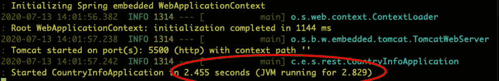

Spring Boot 在 GraalVM 上的启动时间大约为 2.8 秒

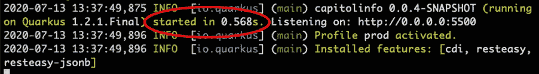

GraalVM 上的 Quarkus 启动时间大约为 0.57 秒

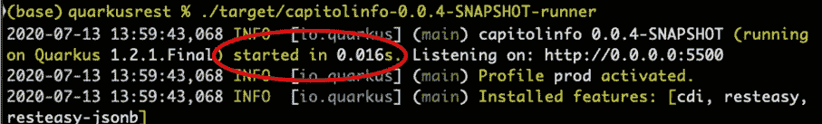

Quarkus 本机可执行文件的启动时间约为 0.2 秒

到目前为止一切顺利。请注意在 Quarkus 截图中，您可以看到已安装的特性或扩展:cdiresteasy 和 resteasy-jsonb。现在，让我们从测试运行所需时间的角度来看一下运行时测试的结果:

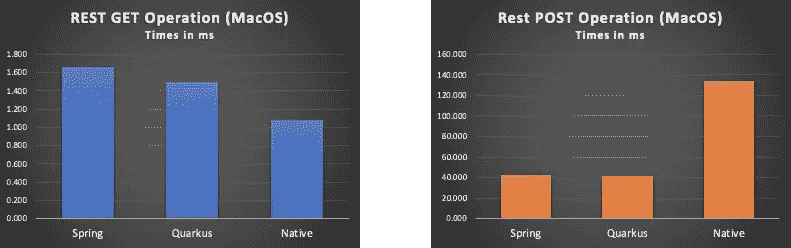

MacOS 上的 REST 操作测试结果

等等，什么？ **GET** 响应时间图看起来不错，本地可执行应用程序轻松击败了 GraalVM 版本。但是，为什么针对本地版本的 **POST** 调用运行时间(134 ms)是 Spring Boot (43 ms)或 GraalVM 中 quark us(42 ms)的三倍呢？ **GET** 和 **POST** 操作之间的主要区别是引入了文件 I/O，所以我的第一个想法是它可能与 MacOS 磁盘 I/O 库有关。我决定将代码移植到一台运行 Ubuntu 的旧笔记本电脑上，进行同样的测试。笔记本电脑是第三代 i7，8GB 内存，固态硬盘。以下是平均测试时间:

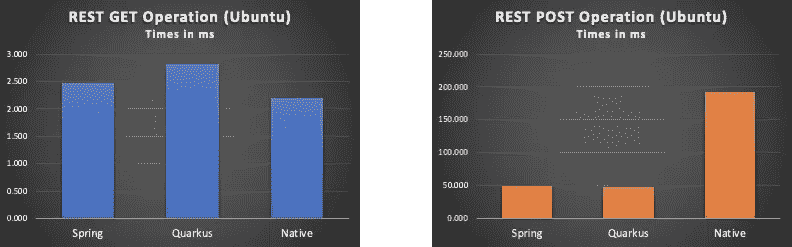

Ubuntu 上的 REST 操作测试结果

结果是一样的，在 Linux 机器上，使用文件 I/O 的本地 **POST** 调用同样慢。MacOS 和 Ubuntu 测试时间也在下表中列出，便于参考。

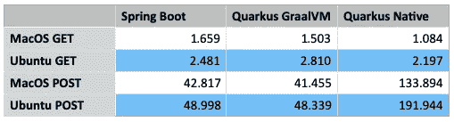

性能测试结果—以毫秒为单位的时间

# 集装箱化

下一步是在 Docker 容器和 Kubernetes 中运行时，比较 Spring Boot 版本和 Quarkus 本地可执行版本。我构建了 Docker 映像，为 Quarkus 使用了 ubi8 最小基本 Docker 映像，为 Spring Boot 容器使用了 OpenJDK 11.0.7-jre-slim 基本映像。然后对 Docker 和 Kubernetes 进行测试。

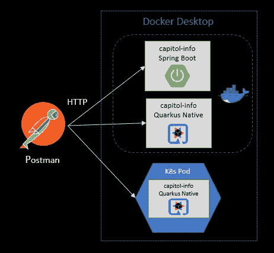

使用 Docker 和 Kubernetes 的测试用例

Spring Boot 和 Quarkus Native 之间的启动时间仍然显示了从 Spring Boot 切换到 Quarkus 的惊人性能改进。下面是 Spring Boot 容器的日志输出，启动大约需要 4 秒钟。

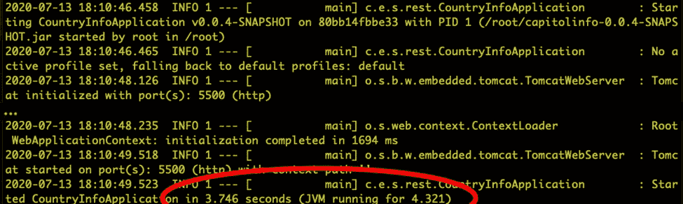

运行 Quarkus 本地可执行应用程序的 Docker 容器需要 0.012 秒才能启动，如下所示。这在开始时间上是一个惊人的改进。

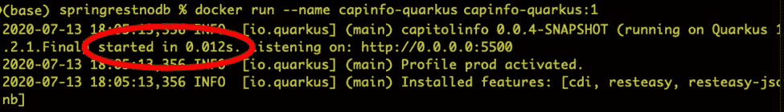

不幸的是，运行时结果仍然显示 Quarkus 本机代码 POST 调用时间比同等的 JVM 慢，而本机 GET 仍然比 JVM GET 快。

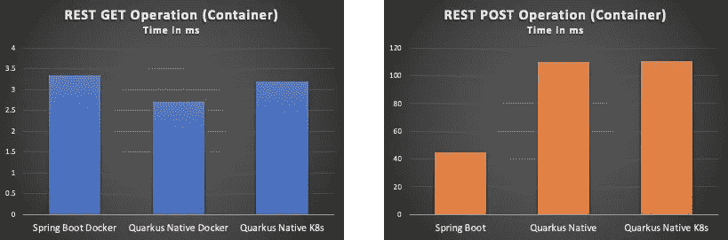

容器中运行的 REST 操作测试结果

奇怪的是， **POST** 操作在 Docker 中运行比直接在 OS 上运行要稍微快一些。

# 调查

此时，很明显 Quarkus 本地可执行版本中的 **POST** 操作比 JVM 版本慢得多。不管它是运行在 Spring Boot 还是 Quarkus 上，或者直接在操作系统上运行还是在容器上运行，它都要慢一些。因为 **GET** 和 **POST** 之间的主要区别是序列化和磁盘 I/O，所以我将调查重点放在了那个领域。知道它没有使用 Quarkus GSON 扩展，我把它换成了基于 JSON-B 的代码。JSON-B 有一个 Quarkus 扩展，所以我希望看到本机版本比 JVM 版本有更好的性能。下面是使用 GSON 将 Java 对象序列化为 JSON 并写入磁盘的代码。

GSON Java 对象序列化

这段代码被转换成使用 JSON-B，它有一个 Quarkus 扩展。

JSON-B Java 对象序列化

一旦代码被转换，我再次测试。下图显示了 Spring Boot 和夸尔库斯本地的 HTTP POST 操作平均时间。

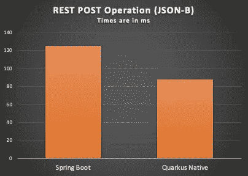

REST POST 操作测试结果，在 MacOS 上使用 JSON-B

下表显示了 GET 和 POST 调用的结果:

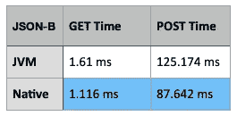

在 MacOS 上使用 JSON-B 的 REST POST 操作测试时间

正如所料，原生编译代码现在击败了 JVM 代码，但是 JSON-B 代码仍然比 GSON 版本慢。

# 结论

我将 Spring Boot 转换成夸库，然后进行后续测试的工作，留给我的问题比答案还多。这也给了我一些启示。首先，在开发 REST 服务时，Quarkus 代码比 Spring Boot 代码更干净、更简洁。第二，在做大量自动缩放并且开始时间很关键的情况下，Quarkus 再次轻松获胜。第三，很明显，如果没有适当的扩展，Quarkus 可能会引入相当大的延迟，以至于停止采用 Quarkus 的本地可执行版本。在这一点上，如果我能获得或创建所需的扩展，我可能会选择用 Quarkus 开发一个新的 REST 应用程序。

从这些测试中还有一些其他的观察结果，熊大声叫道:

1.  Java 库的选择会对性能产生重大影响。根据我参与的大多数项目的经验，开发人员倾向于获取众所周知的库并使用它们，而不独立测量它们的性能。性能问题通常集中在更粗粒度的领域，如网络协议、数据冗长、消息引擎等。有大量的 Java 库，一个团队几乎不可能对它们进行性能测试。我也没有发现这方面的信息，这似乎本身就是一个问题。
2.  我不得不说，我的新 MacBook Pro 运行 i9 处理器，性能并不比一台七年前只有四分之一内存的 Ubuntu 笔记本电脑好多少，这让我非常震惊。我不确定这是否是 Java 的一种措施，热节流，两者都使用固态硬盘这一事实是一个限制因素，或者其他一些原因，但我认为它需要进一步的调查和针对各种硬件的更多测试。