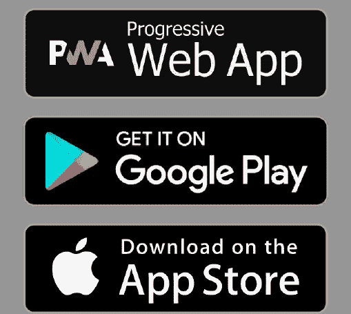

# Ionic 4…是否应该构建一个混合应用？

> 原文：<https://itnext.io/should-you-use-ionic-4-fa04daebaffd?source=collection_archive---------1----------------------->

TL；是的，只要你有正确的用例。

混合移动 app 开发……有人爱，有人恨，有人爱恨交加(那句台词是我从科学小精灵[关于 Java](https://youtu.be/HEdPX8pt_DQ) 的视频里偷来的，你肯定要看)。

混合应用开发的**优势**令人信服。

*   写一次，到处跑。
*   利用 iOS 和 Android 的网络技术。
*   降低成本，缩短上市时间。

但是天下没有免费的午餐。在混合动力的道路上，你会做出一系列复杂的**权衡**。

*   原生 SDK 成为黑匣子
*   本机功能开发中的潜在限制
*   潜在的性能问题

“潜力”这个词在这里很重要，因为当 Ionic 应用于正确的用例时，这些权衡都不是问题。

2018 年，大量关于*React Native vs Flutter vs Ionic vs what*的内容被炮制出来，我在这场比赛中没有一匹马，简单的事实是，它们都是很好的工具。我只是一个梦想着完美的跨平台开发体验的 web 开发人员。我写这篇文章的目的是给你一些在投资时间和金钱到移动应用之前要考虑的要点。

# 这是商业决定

最终，你的应用开发策略是一个商业决策。Ionic 允许你利用你的 web 开发才能来构建一个移动应用，而不需要陡峭的学习曲线或新员工，但代价是与原生 SDK 分离。理解权衡并**将 Ionic 应用于正确的用例**是绝对重要的。

让我们假设你是一个产品经理，负责为一个 SaaS 产品发布前端 UX。根据您的客户群，您可能会面临以下情况之一

## 场景 1——网络是你唯一的优先事项

总结:如果你喜欢爱奥尼亚的组件，这是个不错的决定


如果构建 PWA 是您唯一的优先任务，那么 Ionic 可以简化为一个组件库。与普通 Angular 或 Vue 应用相比，它唯一显著的附加值是它提供的预构建组件。就组件库而言，Ionic 非常可靠。它为您提供了广泛的通用 UI 元素和行为，这些元素和行为在所有平台上都很棒。

## 场景 2— PWA 第一优先，移动第二优先



总结:这是 Ionic 和混合应用程序开发的亮点。

当 PWA 是您的首要任务时，Ionic 非常有意义，但您也希望为您的客户支持原生移动应用程序。它可以让你专注于构建一个最佳的网络体验，通过在 Cordova 或电容器插件中喷洒，可以很容易地移植(相对而言)到 iOS 和 Android。你现有的网络开发人员将能够快速获得 Ionic，并将一个应用程序推向市场将比从头开始构建多个原生应用程序快得多。

## 场景 3 —移动成为主要优先事项


总结:它可能对你有用，但是在这个领域还有其他选择。

如果你的唯一目标是本地移动，你真的想给你的产品增加一个额外的 web 抽象吗？用例将在短期内避免技能差距，但从长期来看，这可能会让您付出代价。如果你正在投资一款移动应用，从商业角度来看，使用原生 SDK 或框架(如 Flutter 和 React Native)通常更安全，它们允许你合并原生代码。如果你碰到了混合应用程序处理性能的极限，你会看到一个完整的重写和更大的总支出。

此外，需要注意的是，Ionic 通常不适合具有大量图形/动画需求或需要与原生平台频繁交互的应用程序，如游戏、增强现实、动画场景等。

但话虽如此……如果你有适合混合应用的需求，Ionic 仍然是原生应用的正确选择——只是因为与大多数替代品相比，它的成本效益非常高。

# 离子与颤动或自然反应


Flutter 和 React Native 占据了介于原生 SDK 和混合风格框架(如 Ionic)之间的空间。这些工具产生的本机代码与使用 Swift 或 Kotlin 构建的应用程序完全相同，而不像 Ionic 那样将 HTML/JS 代码包装在不可见的 WebView 中。

那么与这些框架相比，Ionic 的缺点(和优点)是什么呢？

## 缺点 A —使用本机代码

所有非原生框架(Ionic、RN、Flutter)都有同样的问题，最终需要一个没有合适插件或模块的特性。但是在 Flutter 或 RN 中解决这个问题的方式更加灵活。

这些框架允许您使用原生 iOS 或 Android 代码，而不需要将其作为 Cordova 插件在 JavaScript 中重新实现。假设你想要一些不支持插件的很酷的新的原生特性，比如 Firebase ML Kit。在 RN 或 Flutter 中，将这项工作外包给本地开发人员会更容易。简而言之，Ionic 要么全是 web，要么什么都没有，而 RN 和 Flutter 在框架和本地代码之间实现了更友好的混合匹配系统。

## 缺点 B —性能

没有什么能打败本土性能。句号。

很有可能构建一个性能与原生 UI 不相上下的 Ionic 应用程序，但这取决于你对它的优化程度——并不是所有东西都可以轻松优化。

CSS 动画、DOM 更新和 Cordova 回调之类的东西会让移动设备上的用户界面陷入困境。如果插件出现性能瓶颈，你就有麻烦了，因为现在你必须和 web 开发团队一起调试本地代码。这并不是说你不能构建性能不佳的 RN 或 Flutter 应用程序，而是因为内置的小部件没有包装在 web 视图中，所以这种可能性本来就不大。但更重要的是，您可以绕过桥，直接使用本机代码来克服性能问题。

## 缺点 C —缺乏热重装

在 Ionic 上开发 PWA 非常快——本地设备仿真器就不那么快了。您经常需要为模拟器重新编译代码，每次代码更改后，您的状态都会被清除。

热重装与实时重装不是一回事。在 Flutter 和 RN 中，可以使用热重装来保持应用程序运行，然后在运行时注入更改，从而维护应用程序的状态。


来源:https://flutter.io/hot-reload/

不要低估这对开发者体验的影响。如果与走路相比，这就是在本机仿真器上调试时“在泥泞中艰难跋涉”与“在人行道上慢跑”的区别。

## 缺点 D —测试

世界一流的软件经过测试。一个生产级的移动应用应该有合理数量的单元、集成和 e2e 测试。测试移动应用尤其耗时，因为你必须为多个原生平台编译代码，并了解 iOS 和 Android 的古怪之处。

例如，Flutter 使[测试成为一级优先](https://flutter.io/testing/#adding-the-flutter_driver-dependency)，并提供一个驱动程序在真实设备上测试应用程序。

Ionic 在 v4 测试版中有一些基于 Angular CLI 的 Jasmine/Karma 架构的测试文档，但它主要专注于测试 web 应用。

## 受益匪浅

说到性价比，爱奥尼亚是无与伦比的。我制作了一个名为[五分钟五个应用程序](https://angularfirebase.com/lessons/capacitor-five-apps-in-five-minutes/)的视频，展示了如何快速地在网络平台之间共享代码。有了 RN 或 Flutter，你仍然只关注 iOS 和 Android，所以如果你需要建立一个 PWA，期待一个完整的独立项目——从技术上来说，RN 确实有在网络上运行代码的[能力](https://github.com/necolas/react-native-web)和社区维护的项目。总的来说，Ionic 和 Cordova 可以为需要支持多种平台的公司节省大量成本。

## 益处 B——学习曲线

React Native 对于 web 开发人员来说并不难学(尤其是如果他们知道 React 的话)，但是与普通的 web 代码有所不同，需要花时间来学习。Flutter 的学习曲线更高，因为它使用了一种几乎无人知晓的编程语言 Dart。虽然这是一种很好的语言，但对于任何程序员来说，要对一种新语言有信心，确实需要大量的时间投入。Ionic 在这方面提供了显著的优势，尤其是对于有棱角的开发者。此外，v4 基于 web 组件，这使得它可以兼容任何 JS 框架。

# 写一次，到处跑…

这是一个听起来不错的口号，但网站不是移动应用程序，两者永远不会完美结合。所以你最后会写很多这样的代码:

```
if (platform.is('android')) {
  // do Android stuff
}if (platform.is('ios')) {
  // do Apple stuff
}
```

这种类型的代码在其他框架中也会出现，但这不是什么大问题，因为默认情况下，您的目标是本地移动设备。如果你在 Ionic 中有很多本地特性，你会有很多在 web 和本地之间跳转的平台检查条件。

值得称赞的是，Ionic 正在努力使用[电容器](https://capacitor.ionicframework.com/)库来避免这种类型的代码，这是一种 Cordova 风格的方法，但将本机代码和 web 代码捆绑到一个类中，以实现无缝 PWA 支持。

最终，你必须问自己，你是愿意拥有“一个大的跨平台代码库，还是多个独立管理的项目”。软件很难——两种方式都有权衡。

# 爱奥尼亚在野外的成绩如何？

根据 Ionic 的说法，已经有超过 500 万个应用是基于这个框架开发的——这是一个巨大的负担。事实上，这是苹果应用商店中[应用总数的两倍多。](https://blog.appfigures.com/ios-developers-ship-less-apps-for-first-time/)让我们来看看这个样本中的一些最佳展示示例。

*   [未开发的](https://play.google.com/store/apps/details?id=com.untappdllc.app&hl=en_US) —啤酒评论社交媒体应用
*   [市场观察](https://play.google.com/store/apps/details?id=com.marketwatch&hl=en)——商业新闻
*   [Pacifica](https://play.google.com/store/apps/details?id=com.pacificalabs.pacifica) —压力管理

这些应用受到好评，下载量超过 100 万次，因此很有可能在 Ionic 中打造一流的移动体验。

你可以将这与 Flutter 和 RN 进行比较，它们有一些非常大的名字，但请记住，它们是由科技巨头谷歌和脸书赞助的。

*   [颤动的橱窗](https://flutter.io/showcase/)
*   [React Native Showcase](https://facebook.github.io/react-native/showcase.html)

# 结论

我是 Ionic 的粉丝，他们已经将混合应用推向了极致。像其他工具一样，它并不适合每个项目，但是在正确的用例中非常有效。Ionic v4 和 Capacitor 为框架带来了一些不错的改进，在可预见的未来，它将继续引领混合利基市场。