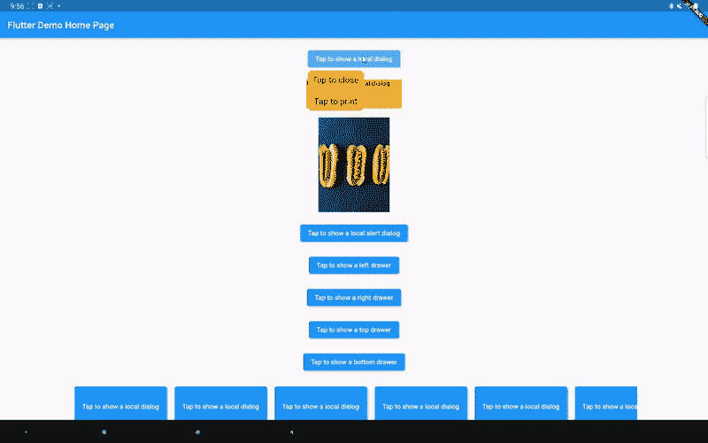
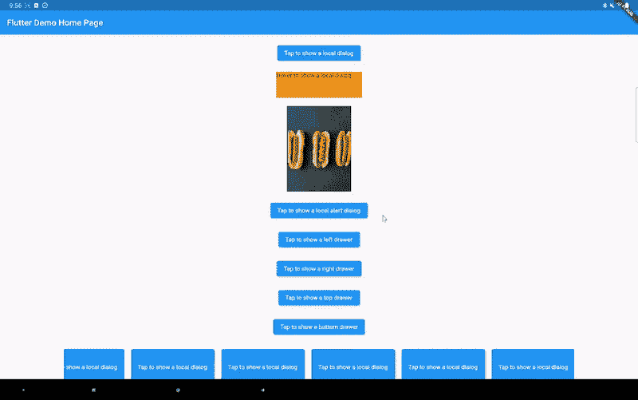

# 在颤动中显示对齐的对话框

> 原文：<https://itnext.io/show-aligned-dialogs-in-flutter-324e922ae54f?source=collection_archive---------1----------------------->

对话框是 UI 设计中一种重要的交互模型。在 Flutter 中，可以通过调用 showDialog 函数打开一个对话框:

```
Future<T?> showDialog<T>({
  required BuildContext context,
  required WidgetBuilder builder,
  bool barrierDismissible = true,
  Color? barrierColor = Colors.*black54*,
  String? barrierLabel,
  bool useSafeArea = true,
  bool useRootNavigator = true,
  RouteSettings? routeSettings,
})
```

构建器通常返回一个对话框小部件，如 AlertDialog 或 SimpleDialog。pub.dev 上也有很多包可以让你构建更多定制的对话框小部件。对话框不知道打开它的小部件在屏幕上的位置，几乎总是在屏幕的中央。这对于移动设备来说没问题，但对于较大的设备来说可能不太理想。我们在网上看到的通常是一个打开对话框的按钮，这个对话框就在按钮旁边。我们能在 Flutter 中实现这一点吗？

## showAlignedDialog 函数简介

下面是 showAlignedDialog 函数的界面:

```
Future<T?> showAlignedDialog<T>({
  required BuildContext context,
  required WidgetBuilder builder,
  bool barrierDismissible = true,
  Color? barrierColor = Colors.black54,
  String? barrierLabel,
  bool useRootNavigator = true,
  RouteSettings? routeSettings,
  Alignment followerAnchor = Alignment.center,
  Alignment targetAnchor = Alignment.center,
  Offset offset = Offset.zero,
  bool avoidOverflow = false,
  bool isGlobal = false,
  RouteTransitionsBuilder? transitionsBuilder,
  Duration? duration,
})
```

最后七个参数是新的。

*   **targetAnchor** 和 **followerAnchor** 告诉原始部件和对话框的哪一部分应该对齐。类似于 CompositedTransformFollower 小部件的要求。
*   **偏移量**用于对话框的额外精细控制。
*   如果 **avoidOverflow** 设置为 false，部分对话框可能会在屏幕外呈现。否则，如果可能的话，对话框将被移动以避免视觉溢出。
*   如果 **isGlobal** 设置为 true，那么对话框将根据 followerAnchor 相对于整个屏幕对齐。在这种情况下，targetAnchor 将被忽略。如果你想显示一个抽屉部件，这是很有用的。
*   **过渡生成器**和**持续时间**用于控制对话框的显示方式。默认行为是渐变过渡。但是你可以像滑入过渡一样添加你自己的。

其他一切都像内置的 showDialog 函数一样工作。

现在让我们看看这个包的运行情况:



本地对话

您可以显示与按钮相关的“执行更多操作”菜单，或者较小图像的扩展视图。用例应该很多。



当 isGlobal 设置为 true 时

你也可以在屏幕上任何你喜欢的地方显示抽屉。

显示左抽屉的代码

[aligned_dialog](https://pub.dev/packages/aligned_dialog) 包到此结束。它允许您打开具有更多定位和转换可定制性的对话框。

到目前为止我在 pub.dev 上发布的其他包:

*   [flutter_class_parser](https://pub.dev/packages/flutter_class_parser) 。一个用于序列化/反序列化内置 Flutter 数据类和枚举的包。
*   [尺寸](https://pub.dev/packages/dimension)。允许你用不同的单位计算尺寸，并应用类似于 CSS 提供的 clamp，min，max 等功能。
*   [morphable_shape](https://pub.dev/packages/morphable_shape) 。让您创建各种形状，可以相互变形。部分形状边界、渐变边界等。访问 fluttershape.com[观看在线演示。](https://fluttershape.com/)
*   [animated _ style _ widget](https://pub.dev/packages/animated_styled_widget)。为类似容器的小部件设计风格并制作隐式和显式动画。还为您提供组件小部件，如样式按钮、单选按钮、开关、切换按钮和滑块。对于需要高级用户界面定制的应用程序非常有用。
*   [响应式 _ 属性](https://pub.dev/packages/responsive_property)。受材料状态属性启发的响应式解决方案。使从数字到小部件的对象具有响应性。

我目前的重点是 UI 开发，尤其是序列化、动画、响应性以及更多的定制，这些都可以在我开发的包中体现出来。如果有什么建议，欢迎随时在 Medium 或者 Github 上联系我。谢谢大家！