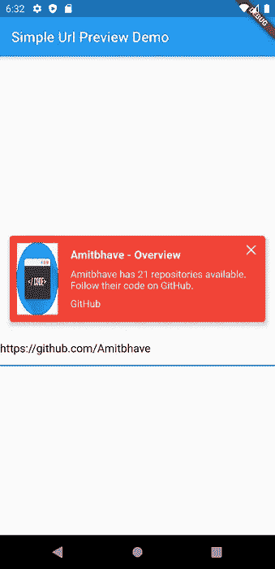

# 在 Flutter 中显示 URL 预览

> 原文：<https://itnext.io/showing-url-preview-in-flutter-a3ad4ff9927e?source=collection_archive---------4----------------------->

当你在聊天信息中添加链接或在社交网络如 Whatsapp、脸书、Twitter、LinkedIn 上分享时；您会看到一个小的可视预览和链接的简短描述。这主要包括标题、描述、图片和网站名称。这给了我们一个简短的总结，告诉我们可以从这个 URL 中得到什么。

URL 预览基本上基于[开放图协议](https://www.ogp.me/)工作。网站的 html 中有这些< meta >标签，这些标签具有特殊的属性，如**‘og:title’，‘og:description’，‘og:image’**。这些用于显示 URL 预览。

为了在 Flutter 的应用程序中拥有相同的功能，我创建了这个简单易用的[simpleurlrpreview](https://pub.dev/packages/simple_url_preview)包。



URL 预览

*   要使用这个包，您只需将这个包添加到您的 **pubspec.yaml** 依赖项中。

```
dependencies:
  ...
  simple_url_preview: ^3.0.1
```

*   然后在部件树中使用该部件:

```
SimpleUrlPreview(
  url: 'https://github.com/Amitbhave',
  bgColor: Colors.*red*,
  isClosable: **true**,
  previewHeight: 200,
  previewContainerPadding: EdgeInsets.all(10),
  titleLines: 1,
  descriptionLines: 2,
  titleStyle: TextStyle(
    fontSize: 16,
    fontWeight: FontWeight.bold,
    color: Colors.blue,
  ),
  descriptionStyle: TextStyle(
    fontSize: 14,
    color: Theme.of(context).primaryColor,
  ),
  siteNameStyle: TextStyle(
    fontSize: 14,
    color: Theme.of(context).primaryColor,
  ),
  onTap: () => print('Hello Flutter URL Preview'),
),
```

*   就是这样！在这些参数中，只有 URL 参数是必需的。但是你也可以覆盖其他参数，根据你的应用主题( **bgColor，titleStyle，descriptionStyle，siteNameStyle** )。
*   同样，如果你设置了 **'isClosable: true'** ，它会在你的预览上添加一个关闭按钮，点击它，它会关闭预览。
*   您也可以单击 URL 预览，在默认浏览器中启动实际的 URL。对于此功能，所有功劳归于 [**url_launcher**](https://pub.dev/packages/url_launcher) 包！或者，如果您想要覆盖此功能，请使用**‘on tap’**属性，该属性接受当有人单击预览时触发的功能。
*   [**http**](https://pub.dev/packages/http) 包用于获取 URL 元数据信息(og:title，og:description，og:image)，而 [**html**](https://pub.dev/packages/html) 包用于解析其响应。
*   该包已被迁移到**空安全**。

该包的完整源代码及其示例可以在这里找到**Github**:[https://github.com/Amitbhave/flutter-simple-url-preview](https://github.com/Amitbhave/flutter-simple-url-preview)
**包详情**:[https://pub.dev/packages/simple_url_preview](https://pub.dev/packages/simple_url_preview)

最后，如果你觉得这个有用，给 some❤️看看⭐的包和
库！