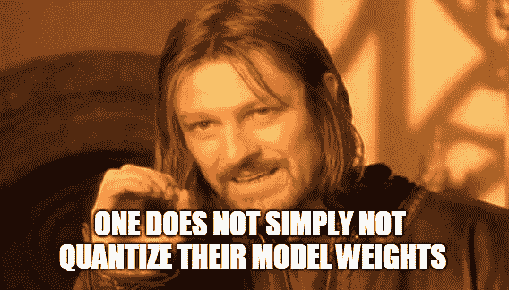

# 通过权重量化缩小 Tensorflow.js Web 模型的大小

> 原文：<https://itnext.io/shrink-your-tensorflow-js-web-model-size-with-weight-quantization-6ddb4fcb6d0d?source=collection_archive---------0----------------------->

## Tensorflow.js 权重量化快速简单指南



由于 [**tensorflow.js**](https://github.com/tensorflow/tfjs) 团队的出色工作，浏览器中的机器学习已经成为我们 javascript 和 web 开发人员中非常热门的话题。Tensorflow.js 允许我们将预训练的模型下载到客户端浏览器，并直接在客户端运行推理。

幸运的是，从技术上讲，客户只需下载一次模型，因为通常这样的网络模型会被分成 **4MB** 的碎片，这样浏览器就会**缓存**它们。然而，我们希望初始加载时间尽可能短，并减少客户端为我们的任何模型存储的字节数。

# 为什么你一定要量化你的模型权重！

**简单回答:**我们宁愿下载一个 **15MB** 的型号，也不愿下载一个 **60MB** 的型号，对吧？这是显而易见的！是的，我们可以将模型的尺寸缩小 **4** 并且基本上是**免费**！我对 [**face-api.js**](https://github.com/justadudewhohacks/face-api.js) 曝光的所有模特都使用这种技术。

简而言之，利用权重量化，我们可以通过将由 **255⁴** 位表示的范围【最小值，最大值】中的每个张量的值映射到由 **255** 位表示的范围【0，255】来将我们的模型参数从**float 32**s**s**(4 字节)压缩到**uint 8**s**t29】(单字节)。因此，我们减去张量值的最小值，并对其应用一个比例因子。我们存储每个张量的最小值和比例以及我们的模型元数据，一旦我们再次加载模型权重，我们就应用逆运算(**去量化**)。**

# 模型的精度呢？

现在你可能想知道:将张量值从一个 **255⁴** 位表示映射到 **255** 位？我的模型在准确性上肯定有严重的损失，对吗？嗯，不一定。更准确地说，在这个过程中，张量值将被剪裁，这样它们最终会具有较低的浮点精度，但根据我的经验，在大多数情况下，整体模型精度根本不会受到权重量化的影响。

平心而论，也有一些例外，当一些张量出现不幸的值分布时，我用从 dlib 移植到 tfjs 的人脸识别模型到目前为止只遇到过一次。但在这些情况下，这并不意味着，根本不可能减少我们的模型权重的大小。事实上，你可以识别这些张量，并简单地保持它们的权重不变，同时我们仍然可以减少剩余张量的大小(如果你遇到这个问题，参见上一节)。

# 好吧，我相信了！但是怎么做呢？

好问题！这可能非常简单，也可能非常简单。首先，我们将讨论非常简单的情况，即你已经有一个 tensorflow 或 keras 模型。当您将模型转换为 web 模型时，您可以简单地使用 [**tfjs-converter**](https://github.com/tensorflow/tfjs-converter) 工具并将量化标志传递给 CLI:

```
tensorflowjs_converter --quantization_bytes 1 --input_format=tf_frozen_model --output_node_names=logits/BiasAdd --saved_model_tags=serve ./model/input_graph.pb ./web_model
```

显然，这是量化模型权重的最简单也是最好的方法。所以如果可以的话，我会推荐使用这个工具。

## **但是如果:**怎么办

1.  正如上一节指出的，我们的一个或多个张量是令人讨厌的那种，它扰乱了我们模型的准确性？
2.  我们把一些现有的模型架构(caffee，torch，darknet，随便什么…)直接移植到 tfjs？
3.  我们在浏览器中用 tfjs 训练了我们的模型？

## **简答:**

我们简单地通过 tfjs-converter [**量子化脚本**](https://github.com/tensorflow/tfjs-converter/blob/master/python/tensorflowjs/quantization.py) 运行我们的张量。

## 长回答:

显然，这是一个 python 脚本，隐藏在 tfjs-converter 源代码的深处。我们必须存储所有张量数据，通过脚本运行它们，并构建 **weights_manifest.json** 文件。当然，你当然可以这么做。或者，你可以用 javascript 做任何事情:

使用 javascript 量化实现，我们可以将以下内容复制并粘贴到一个 html 页面中，添加用于加载我们想要收缩的模型的权重张量的逻辑，在浏览器中打开它，并从控制台调用***quantizandsave()***，这将下载量化的模型碎片和 **weights_manifest.json** 文件:

注意，***getNamedTensors***的空函数体。这里你要实现自己的逻辑，它返回 **{ name: string，tensor: tf。**张量}对。如果我们查看一个 **weights_manifest.json** 文件，我们可以看到每个张量都被命名为:

```
{
  "name":"conv0/filter",
  "shape":[3,3,3,32],
  "dtype":"float32",
  "quantization":{
    "dtype":"uint8",
    "scale":0.004699238725737029,
    "min":-0.7471789573921876
  }
}
```

此外，我们使用 **FileSaver.js** 来下载文件。简单地从 [**这个回购**](https://github.com/eligrey/FileSaver.js) 或者通过运行 **npm i 文件保护**获得这个脚本。

之后，我们可以简单地使用***TF . io . load weights(manifest，modelBaseUri)*** 加载我们的压缩模型，如下所示:

```
const manifest = await (await fetch('/models/my-model-weights_manifest.json')).json()const tensorMap = tf.io.loadWeights(manifest, '/models')
```

这将对每个张量应用反量化，在其清单条目中有一个“**量化**”对象。最后，它返回命名的张量图，就这样:

```
{
  "conv0/filter": tf.Tensor4D,
  ...
}
```

# 那么，如果我的模型的精度确实下降了呢？

如果您没有注意到权重量化后模型精度的任何损失，一切都很好。但是，如果准确性确实受到量子化的影响，如何识别罪魁祸首呢？

不幸的是，这是一个有点棘手的情况。在这种情况下，您应该迭代地尝试从量化中排除张量(或尝试迭代地包括张量)，以确定张量，这将导致模型精度在其值被量化后下降。

要跳过张量的量化，只需确保在***getNamedTensors***中为相应的张量设置了“***isSkipQuantization***”标志。

*如果你喜欢这篇文章，欢迎留下一些掌声，并在 medium 和/或*[*Twitter*](https://twitter.com/justadudewhohax)*:)上关注我。也请继续关注进一步的文章，如果你有兴趣，请查看我的* [*开源作品*](https://github.com/justadudewhohacks) *！*