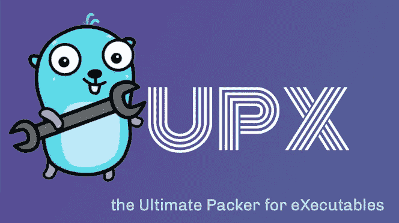
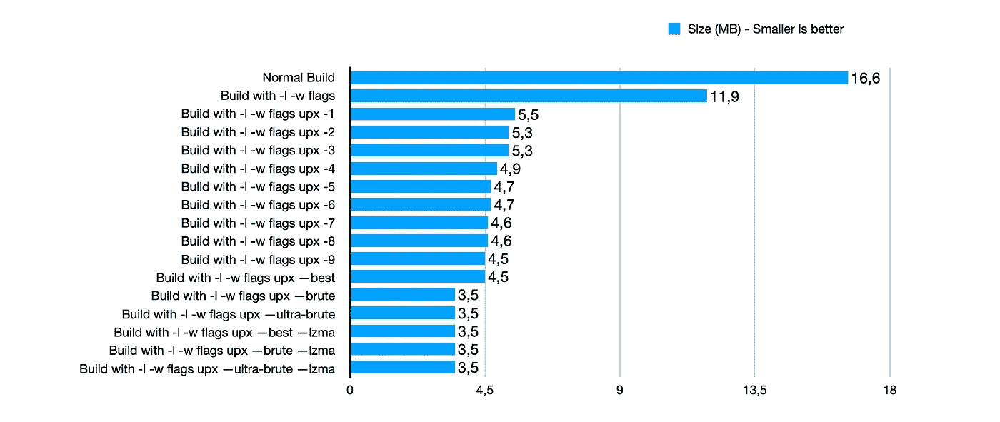
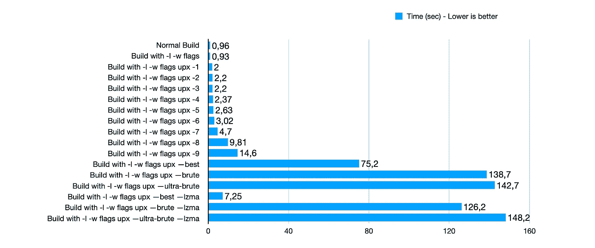

# 收缩 Go 可执行文件

> 原文：<https://itnext.io/shrinking-go-executable-9e9c17b47a41?source=collection_archive---------1----------------------->

使用 Go 1.18 和 UPX

由 Renee French 创建的原始地鼠图像，使用由 Maria Letta 创建的地鼠图像

如果你是一名开发人员，很可能你总是希望你的代码更快、更好、更可读…

另外，我希望，您希望您的可执行文件(二进制文件)尽可能小。如果你正在使用 Go，也许你会惊讶，一个简单的“Hello World”可执行文件能有多大。

这篇文章不是关于“为什么”，而是关于“用它做什么”。

作为一个理智的人，你可以做的事情主要有两个步骤。请继续读下去。

# 收缩可执行文件

在本文中，我使用真实世界的例子，代码来自下面的资源库。

 [## GitHub-petrjahoda/system _ web service

### 在 docker 运行时下使用这个 docker 文件映像安装用户 UI 的 web 服务，命令如下:docker-compose…

github.com](https://github.com/petrjahoda/system_webservice) 

当你用标准的方式创建一个可执行文件时，使用`go build`，来自这个特定仓库的可执行文件将会是 16.6MB，这是一个很大的数目。但是构建时间不到一秒。

但是 16.6MB 真的很多。

上面提到的那两个步骤真的很简单。首先，使用两个 go build 标志，像这样创建可执行文件:`go build -ldflags="-s -w"`。然后使用 UPX 让你的可执行文件变小。

这就是这篇文章的主要原因。

使用 UPX，你可以使你的可执行文件尽可能的小，但是这需要很多时间(有时)。或者你可以满足于一个“不是最小的”可执行文件，但是打包时间会更快。
问题是……什么是最适合 UPX 的参数，打包您的文件甚至需要多长时间？

# 尺寸变量

首先，我们来看尺寸。这是一张不同尺寸、不同设置的表格。如您所见，第一行是非优化版本。普通身材。正如你在其他栏目中看到的，UPX 的能力是有限的。3.5MB 是最小的大小，UPX 可以压缩这个特定的可执行文件。这大约是原始大小的 21%。还不错。

# 时间变量

现在让我们看看时间。最快的是带有 go build 标志的第二行。

你可以看到，当使用`best`、`brute`和`ultra-brute`参数时，构建时间——或者说打包时间——疯狂增长。

我不认为任何理智的人会等两分钟来构建二进制文件。

但是有些事情。大家可以看到，使用`--best --lzma`的时候，时间大概是 7.25 秒。如果您查看第一个表，您可以看到文件大小约为 3.5MB

因此，通过使用这两个参数，您将在合理的构建时间内获得尽可能小的尺寸。

# 摘要

对我来说总结很简单。创建二进制时，使用`go build -ldflags="-s -w"`，然后使用带`--best --lzma`参数的 UPX。

请注意，一些反病毒程序不喜欢 UPX 压缩二进制文件。

如果你好奇，为什么我会关心这些…

我经常使用 docker，并在我的 Docker 映像中使用这些二进制文件。所以我想让这些图像尽可能的小。我不想浪费时间在网上上传和下载软件。
我简单地构建一个二进制文件，然后创建尽可能小的图像。

此外，通过使用这个二进制“在 Docker 中”,没有必要担心那些抗病毒药物。