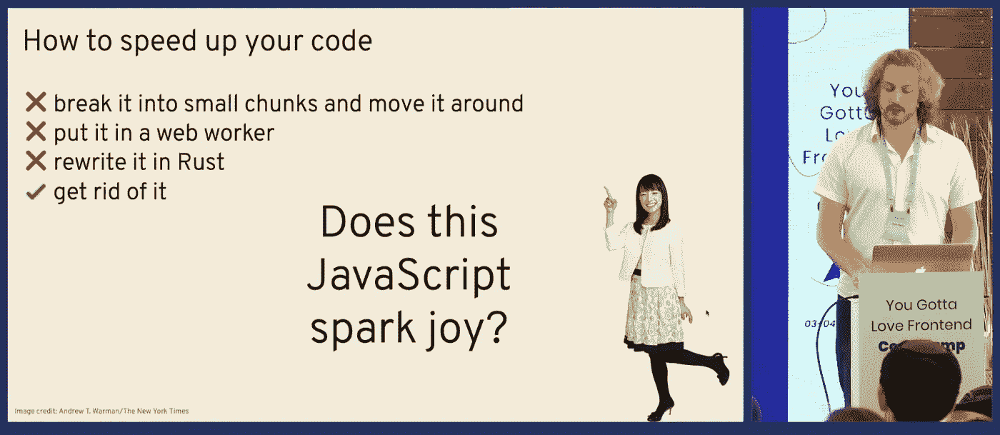
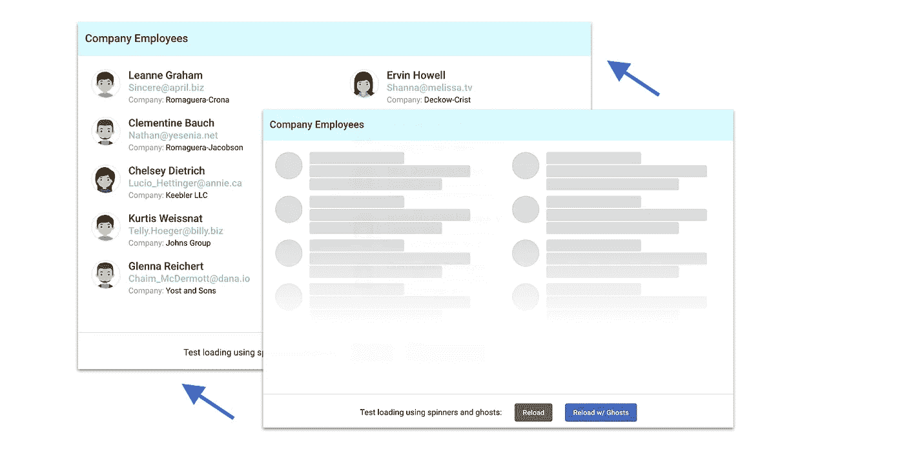
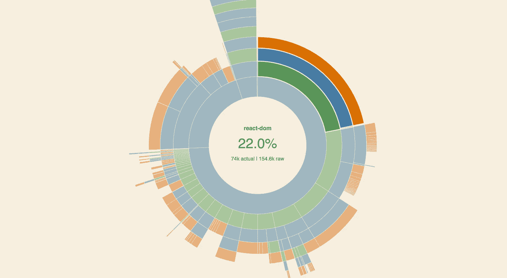
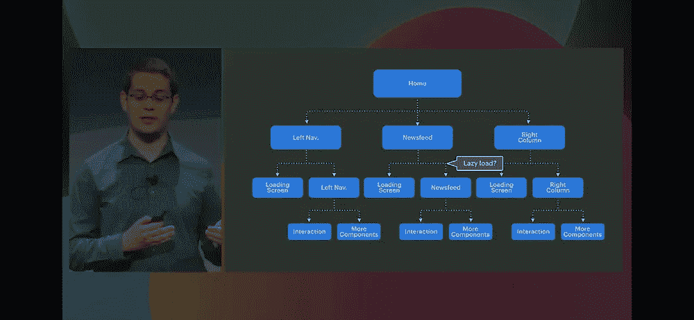
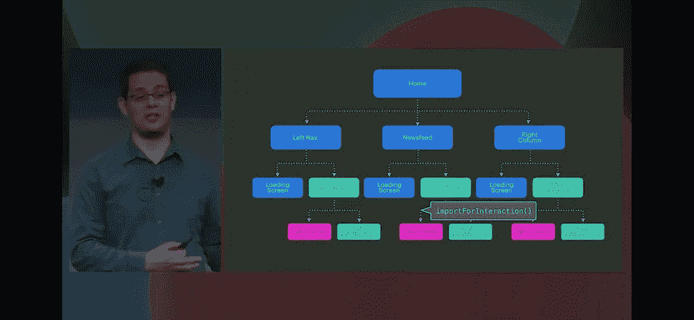

# 用于代码分割的边车

> 原文：<https://itnext.io/sidecar-for-a-code-splitting-65c1fb205dfd?source=collection_archive---------10----------------------->


代码分割。代码拆分无处不在。但是为什么呢？仅仅因为现在有太多的 javascript，而且不是所有的都在同一时间使用。

JS 是一个很*重*的东西。不是为你的 iPhone Xs 或全新的 i9 笔记本电脑，而是为数百万(可能数十亿)速度较慢的设备拥有者。或者至少是你的手表。

所以- JS 是不好的，但是如果我们**禁用它**会发生什么呢-问题会消失...对于一些网站来说，和基于 React 的网站一起消失。但是不管怎样，有些网站不需要 JS 也能工作...我们应该向他们学习一些东西...

# 代码分割

今天，我们有两条路可走，两条让它变得更好或不变得更糟的路:

# 1.少写代码

那是你能做的最好的事情。虽然`React Hooks`让你发布更少的代码，像`Svelte`这样的解决方案让你生成的代码比*通常的*要少，但这并不容易做到。

这不仅是关于代码，也是关于*功能*——为了保持代码“紧凑”，你必须保持它“紧凑”。如果 application bundle 要做这么多事情(并且有 20 种语言版本)，就没有办法保持它的小。

有办法写出*短小健全的*代码，也有办法写出相反的实现——*血淋淋的企业*。你知道，两者都是合法的。



苗条是一种享受

但主要问题是代码本身。一个简单的 react 应用程序可以轻松绕过“推荐”的 250kb。你可能会花一个月的时间优化它，让它变得更小。“小”优化有据可查，非常有用——只要用`size-limit`得到`bundle-analyzer`,然后恢复原状。
有许多库，它们争夺每一个字节，试图让你保持在你的极限内——[preact](https://preactjs.com/)和 [storeon](https://github.com/storeon/storeon) 等等。

但是我们的应用程序超过了 200kb。更接近 **100Mb** 。删除千字节没有意义。即使删除兆字节也没有意义。

> 过一段时间后，你就不可能再让你的应用程序变小了。它会慢慢变大。

# 2.无船代码

或者，`code split`。换句话说——**投降**。拿你的 100mb 包，做 20 个 5mb 包。老实说——如果你的应用程序变大了，这是唯一可能的处理方法——用它创建一个小应用程序包。

> *既然我们正在讨论它，你可能希望确保自己了解 2019 年 React 代码拆分的最新和最大进展。或者只是阅读一些实现细节。*

[](/react-code-splitting-in-2019-9a5d2776c502) [## 2019 年反应代码拆分

### 都 2019 年了！每个人都认为他们知道代码分解。所以——让我们仔细检查一下！

itnext.io](/react-code-splitting-in-2019-9a5d2776c502) 

但是现在有一件事你应该知道:无论你选择哪个选项，它都是一个实现细节，而我们正在寻找更可靠的东西。

# 关于代码分割的真相

关于代码拆分的真相是，其本质是**时间分隔**。你不仅仅是*分割*你的代码，你还以一种方式分割它，你将**在单个时间点尽可能少地使用**。

只是不要发布你现在不需要的代码。摆脱它。


摆脱它！

说起来容易，做起来难。我有几个沉重的，但没有充分分裂的应用程序，其中任何一个页面加载了大约 50%的东西。有时`code splitting`变成了`code separation`，我的意思是——你可以将代码移动到不同的块中，但是仍然要全部使用。回想一下*“不要发布你现在不需要的代码”*，我*需要* 50%的代码，这才是真正的问题。

> *有时仅仅在这里加上* `*import*` *并不够。直到不是* ***时间*** *分离，而仅仅是* ***空间*** *分离——这根本无关紧要。*

有 3 种常见的代码拆分方式:

1.  只是动态`import`。这几天很少单独使用。更多的是关于跟踪一个*状态*的问题。
2.  `Lazy`组件，当您可能推迟 React 组件的渲染和加载时。如今大概 90%的“反应代码分割”。
3.  *懒* `Library`，其实就是`.1`，不过会通过 React 渲染道具给你一个库码。在[反应导入组件](https://github.com/theKashey/react-imported-component#library-level-code-splitting)和[可加载组件](https://www.smooth-code.com/open-source/loadable-components/docs/library-splitting/)中实现。相当有用，但不太为人所知。

# 组件级代码拆分

这个是最受欢迎的。作为每路由代码分割或每组件代码分割。要做到这一点并最终保持良好的感知效果并不容易。从`Flash of Loading Content`开始就是死亡。

好的技巧是:

*   加载`js chunk`和`data`为并行路线。
*   使用`skeleton`在页面加载之前显示类似页面的内容(如脸书)。
*   `prefetch`组块，你甚至可以使用 [guess-js](https://github.com/guess-js/guess) 进行更好的预测。
*   使用一些延迟、加载指示器、`animations`和`Suspense`(将来)来软化过渡。

而且，你知道，那都是感性表现。



*图片来自* [*用幽灵元素改良的 UX*](https://blog.angularindepth.com/https-medium-com-thomasburleson-animated-ghosts-bfc045a51fba)

# 那听起来不太好

你知道，我可以称自己为代码分解专家，但我也有自己的失败。

有时我可能无法减少包的大小。有时我可能无法提高结果性能，只要`the _more_ code splitting you are introducing - the more you spatially split your page - the more time you need to _reassemble_ your page back` *。这叫做**装载波**。

*   没有 SSR 或预渲染。适当的 SSR 是目前的游戏改变者。


上周我经历了两次失败:

*   我已经在[一库比对](https://github.com/mui-org/material-ui/issues/15450)中输了；即使我的图书馆更好，😉它比另一个大得多。我失败了。少写代码。
*   优化一个小网站，由我的妻子在 React。它使用基于路由的组件拆分，但是`header`和`footer`被保留在主包中，以使转换更“可接受”。就这么几件事，**互相紧耦合**把 bundle side 暴涨到 320 kb(gzip 之前)。没有什么重要的东西，也没有什么我真的可以拿走的东西。**千刀万剐**。我的**出货失败代码**。

> *React-Dom 占 20%，core-js 占 10%，react-router，jsLingui，react-powerplug...20%的自有代码...我们已经做完了。*



# 解决方案

我已经开始思考如何解决我的问题，以及为什么*常见的解决方案对于我的用例*不能正常工作。

> *我做了什么？我列出了所有重要的位置，没有这些位置应用程序根本无法运行，并试图理解为什么我还有其他的位置。*

这是一个惊喜。但是我的问题出在 CSS 上。在普通的 CSS 转换中。

这是代码

*   一个*控制*变量- `componentControl`，最终将被设置为`DisplayData`应该显示的内容。
*   一旦设定值- `DisplayData`变得可见，改变`className`，从而触发花式过渡。同时`FocusLock`被激活，使`DisplayData`成为**模态**。

```
<FocusLock
 enabled={componentControl.value} 
 // ^ it's "disabled". When it's disabled - it's dead.
>
  {componentControl.value && <PageTitle title={componentControl.value.title}/>}
  // ^ it's does not exists. Also dead
  <DisplayData
    data={componentControl.value}
    visible={componentControl.value !== null}
    // ^ would change a className basing on visible state
  />
  // ^ that is just not visible, but NOT dead
</FocusLock>
```

我想将这段代码作为一个整体进行拆分，但这是我做不到的，原因有两个:

1.  一旦需要，信息应该立即可见，没有任何延迟。业务需求。
2.  信息“铬”应该存在之前，属性处理过渡。

使用[CSS 转换组](https://github.com/reactjs/react-transition-group)或[修复](https://github.com/theKashey/recondition)可以部分解决该问题。但是，你知道，修复*一个代码*添加*另一个代码*听起来很奇怪，即使实际上*足够了*。我的意思是添加更多的代码可以帮助删除更多的代码。但是...但是...

> *应该有更好的办法！*

TL；博士——这里有两个关键点:

*   `DisplayData`必须被**挂载**，并且之前存在于 DOM 中。
*   `FocusLock`也应该存在在先，不会导致`DisplayData`重新挂载，但是**一开始不需要**的大脑。

所以让我们改变我们的思维模式

# 蝙蝠侠和罗宾

假设我们的代码是蝙蝠侠和罗宾。蝙蝠侠可以对付大多数的坏人，但是当他不能的时候，他的伙伴罗宾会来拯救他..

> 蝙蝠侠将再次投入战斗，罗宾将稍后到达。

这是蝙蝠侠:

```
+<FocusLock
- enabled={componentControl.value} 
+>
-  {componentControl.value && <PageTitle title={componentControl.value.title}/>}
+  <DisplayData
+    data={componentControl.value}
+    visible={componentControl.value !== null}
+  />
+</FocusLock>
```

这是他的伙伴，罗宾:

```
-<FocusLock
+ enabled={componentControl.value} 
->
+  {componentControl.value && <PageTitle title={componentControl.value.title}/>}
-  <DisplayData
-    data={componentControl.value}
-    visible={componentControl.value !== null}
-  />
-</FocusLock>
```

蝙蝠侠和罗宾可以组成一个*团队*，但他们实际上是两个不同的人。

而且别忘了——我们还在讨论**代码拆分**。并且，在代码分割方面，助手在哪里？罗宾在哪里？


*在边车里。罗宾正等在一辆* ***边车的大块*** *。*

# 边车

*   `Batman`这些都是你的顾客必须尽快看到的视觉材料。最好是立刻。
*   这里是所有的逻辑和奇特的交互功能，它们可能在一秒钟后可用，但不是在一开始。

最好称之为**垂直代码分割**，其中代码分支平行存在，与常见的**水平代码分割**相反，其中代码分支被*切割*。

在[一些地方](https://github.com/respond-framework/rudy)，这三人组被称为`replace reducer`或其他方式来延迟加载 redux 逻辑和副作用。

在其他一些国家，它被称为`"3 Phased" code splitting`。

> 这只是另一种关注点分离，只适用于这样的情况，你可以延迟加载组件的某个部分，但不能延迟加载另一个部分。



" loadAfter "，" lazyLoad "，" loadForInteractivity "

> *图片来自* [*建筑新 facebook.com 用 React、GraphQL 和 Relay*](https://developers.facebook.com/videos/2019/building-the-new-facebookcom-with-react-graphql-and-relay/) *，其中* `*importForInteractions*` *，或者* `*importAfter*` ***都是*** `***sidecar***` *。*

还有一个**有趣的**观察——虽然`Batman`对顾客来说更有价值，只要是顾客可能*看到*的东西，他总是在状态...而`Robin`，你知道，他可能有点*超重*，需要更多的字节来生活。

因此，对于顾客来说，蝙蝠侠是可以忍受的，他以更低的成本提供了更多的价值。你是我的英雄蝙蝠！

# 什么可以移到边车:

*   `useEffect`、`componentDidMount`和朋友居多。
*   喜欢所有的*模态*效果。即`focus`和`scroll`锁。你可以先展示一个模态，然后**才**让模态*模态*，即“锁定”客户的注意力。
*   表格。将所有逻辑和验证转移到边车上，并阻止表单提交，直到逻辑加载完毕。客户可能开始填写表格，而不知道这只是`Batman`。
*   一些动画。我这一整`react-spring`。
*   一些视觉上的东西。比如[自定义滚动条](https://github.com/theKashey/React-stroller)，它可能会在一秒钟后显示精美的滚动条。🤷‍♂️设计师🤷‍♂️

此外，不要忘记——卸载到 sidecar 的每一段代码，也卸载被删除的代码使用的 core-js poly-和 ponyfills 之类的东西。


代码分割可以比我们今天的应用程序更加智能。我们必须意识到有两种*代码*要分割:1)视觉方面 2)交互方面。后者可以稍后出现。`Sidecar`让两个任务的分割变得天衣无缝，让*感觉一切都加载得更快了*。它会的。

# 最古老的编码分割方法

虽然可能还不太清楚什么时候以及什么是`sidecar`，但我会给出一个简单的解释:

> `*Sidecar*` *是* ***所有你的剧本*** *。Sidecar 是我们今天得到所有前端东西之前进行代码分割的方式。*

我说的是服务器端渲染( **SSR** )，或者只是普通的 **HTML** ，我们昨天都已经习惯了。`Sidecar`当页面包含的 HTML 和逻辑分别位于可嵌入的外部脚本中时，事情就像以前一样简单了(关注点分离)。

我们有 HTML、**加上** CSS、**加上**一些内联的脚本、**加上**其余的脚本提取到一个`.js`文件中。

`HTML` + `CSS` + `inlined-js`是`Batman`，而外部脚本是`Robin`，该网站能够在没有罗宾的情况下运行，老实说，部分没有蝙蝠侠(他将在双腿(内联脚本)骨折的情况下继续战斗)。这只是昨天的事，许多“非现代和酷”的网站今天也是如此。

如果你的应用支持 SSR——尝试**禁用 js** ,让它在没有它的情况下也能工作。这样就能清楚地知道什么东西可以搬到边车里。
如果你的应用程序是一个客户端专用的 SPA——试着想象一下，如果 SSR 存在，它将如何工作。

> *举个例子——*[](https://theurge.com/en-au/)**，在 React 中写的，是全功能* ***而没有*** ***任何 js*******启用*** *。***

**有很多东西你可以卸到一个边车。例如:**

*   **评论。您可以将代码发布到`display`注释，而不是`answer`，只要它可能需要更多的代码(包括 WYSIWYG 编辑器)，这在最初是不需要的。延迟一个*评论框*，甚至只是将代码加载隐藏在动画后面，比延迟一整页要好。**
*   **视频播放器。运送没有“控制”的“视频”。一秒钟后加载，他们的客户可能会尝试与它互动。**
*   **图片库，像`slick`。用**画**它没什么大不了的，但是动画制作和管理起来要困难得多。很清楚什么可以被移到边车。**

> ***想想什么对你的应用程序是必不可少的，什么不太重要...***

# **实施细节**

# **(二)组件代码拆分**

**最简单的形式`sidecar`很容易实现——只要把所有东西都移到一个子组件中，你就可以用一种“旧”的方式进行代码拆分。这几乎是智能组件和非智能组件之间的一个分离，但是这次智能组件并不包含非智能组件——它是相反的。**

```
**const SmartComponent = React.lazy( () => import('./SmartComponent'));

class DumbComponent extends React.Component {
  render() {
    return (
      <React.Fragment>
       <SmartComponent ref={this} /> // <-- move smart one inside
       <TheActualMarkup />           // <-- the "real" stuff is here
      </React.Fragment>
  } 
}**
```

**这也需要将*初始化*代码移动到一个哑代码中，但是你仍然能够对代码中最重的*部分进行代码分割。***

> ***你现在能看到一个* `*parallel*` *或者* `*vertical*` *的分码图案吗？***

# **使用边车**

**[用 React、GraphQL 和 Relay](https://developers.facebook.com/videos/2019/building-the-new-facebookcom-with-react-graphql-and-relay/) 建造新的 facebook.com，我已经在这里提到过，有一个`loadAfter`或`importForInteractivity`的概念，这很像 sidecar 的概念。**

**同时，我不建议创建类似于`useSidecar`的东西，只要你可能有意尝试在里面使用`hooks`，但是这种形式的代码分割会打破挂钩的*规则。***

**请选择更具声明性的组件方式。您可能会在`SideCar`组件中使用`hooks`。**

```
**const Controller = React.lazy( () => import('./Controller'));
const DumbComponent = () => {
 const ref = useRef();
 const state = useState();

 return (
  <>
   <Controller componentRef={ref} state={state} />
   <TheRealStuff ref={ref} state={state[0]} />
  </>
 )
}**
```

# **预取**

**别忘了——你可以使用[装载优先级提示](https://medium.com/webpack/link-rel-prefetch-preload-in-webpack-51a52358f84c)来预载或预取`sidecar`并使其更加透明和不可见。**

**重要的东西——预取脚本会通过**网络**加载它，但不会执行(并消耗 CPU)，除非它确实需要。**

# **苏维埃社会主义共和国**

**与*正常的*代码分割不同，SSR 不需要任何特殊动作。`Sidecar`可能不是 SSR 流程的一部分，在`hydration`步骤之前不需要。它可以被“故意”推迟。**

**因此——随意使用`React.lazy`(理想的是没有 `Suspense`的**，这里你不需要任何回切(加载)指示器)，或者任何其他库，有 SSR 支持，但是没有 SSR 支持更好，在 SSR 过程中跳过边车块。****

# **不好的部分**

**但是这个想法也有一些不好的地方**

# **蝙蝠侠不是一个产品名称**

**虽然`Batman` / `Robin`可能是一个很好的概念，而且`sidecar`与技术本身非常匹配，但是对于`maincar`来说没有“好”的名字。没有所谓的`maincar`，显然`Batman`、`Lonely Wolf`、`Solitude`、`Driver`、`Solo`不能用来命名非边车零件。**

**脸书使用了`display`和`interactivity`，这对我们来说可能是最好的选择。**

> **如果你有一个好名字给我，请在评论中留下**

# **树摇晃**

**更多的是从 bundler 的角度来分离关注点。假设你有`Batman`和`Robin`。和`stuff.js`**

```
**export * from `./batman.js`
export * from `./robin.js`**
```

**然后你可以尝试基于*组件的*代码分割来实现 sidecar**

```
**//main.js
import {batman} from './stuff.js'

const Robin = React.lazy( () => import('./sidecar.js'));

export const Component = () => (
  <>
   <Robin />  // sidecar
   <Batman /> // main content
  </>
)

// and sidecar.js... that's another chunk as long as we `import` it
import {robin} from './stuff.js'
.....**
```

**简而言之，上面的代码可以工作，但是不能“工作”。**

*   **如果你只使用来自`stuff.js`的`batman`-树摇动将只保留它。**
*   **如果你只使用`stuff.js`中的`robin`-树抖动将只保留它。**
*   ****但是**如果你同时使用两者，即使是在不同的块中——两者都将被捆绑在`stuff.js`的第一个事件**中，即**主捆绑包**。****

> ***树摇不是代码分裂友好。您必须通过文件来分离关注点。***

# **取消导入**

**另一件被大家遗忘的事情是 javascript 的成本。这在 jQuery 时代很常见，在这个时代，`jsonp`有效负载加载脚本(使用`json`有效负载)，获取有效负载，**移除**脚本。**

> **如今我们所有的脚本都将永远被导入，即使不再需要。**

**就像我之前说的——JS 太多了，迟早有一天，有了*连续导航*你会把它全部载入。我们应该找到一种方法来取消导入不再需要的块，清除所有内部缓存并释放内存，以使 web 更加可靠，而不是因为内存不足异常而崩溃应用程序。**

**大概`un-import` (webpack [可以做到](https://github.com/theKashey/wipeWebpackCache))的能力是我们应该坚持使用*基于组件的* API 的原因之一，只要它能给我们处理`unmount`的能力。**

**到目前为止——ESM 模块标准没有关于这类东西的内容——也没有关于缓存控制的内容，也没有关于撤销导入操作的内容。**

# **创建支持边盘的库**

**到目前为止，只有一种方法可以创建支持`sidecar`的库:**

*   **将您的组件拆分成几个部分**
*   **通过`index`暴露一个`main`部分和`connected`部分(不破坏 API)**
*   **通过一个单独的入口点暴露一个`sidecar`。**
*   **在目标代码中-导入`main`零件和`sidecar` -树摇动应该切割一个`connected`零件。**

**这一次树摇动应该正常工作，唯一的问题是如何命名`main`部分。**

```
**//main.js
export const Main = ({sidecar, ...props}) => (
  <div>
    {sidecar} 
    ....
  </div>
);

// connected.js
import Main from './Component';
import Sidecar from './Sidecar';

export const Connected = props => (
  <Main
    sidecar={<Sidecar />}
    {...props}
  />
);

//index.js
export * from './Main';
export * from './Connected';

//sidecar.js
import * from './Sidecar';

// -------------------------

//your app BEFORE
import {Connected} from 'library'; //

// -------------------------

//your app AFTER, compare to `connected.js`
import {Main} from 'library';
const Sidecar = React.lazy(import( () => import('library/sidecar')));
// ^ all the difference ^

export SideConnected = props => (
  <Main
    sidecar={<Sidecar />}
    {...props}
  />
);

// ^ you will load only Main, Sidecar will arrive later.**
```

**理论上`dynamic import`可以用在 node_modules 内部，使得*组装过程*更加透明。**

> ***反正——无非是* `*children*` */* `*slot*` *的模式，所以常见于 React。***

# **今后**

**`Facebook`证明了这个想法是正确的。如果你还没有看过[的那个视频](https://dev.to/thekashey/(https://developers.facebook.com/videos/2019/building-the-new-facebookcom-with-react-graphql-and-relay/))——现在就看。我刚刚从一个稍微不同的角度解释了同样的想法(并在 F8 会议前一周开始写这篇文章)。**

**现在，它需要对您的代码库进行一些代码更改。它需要更明确的关注点分离来实际分离它们，并让代码不是水平地而是垂直地分离，为更大的用户体验运送更少的 T4 代码。**

**`Sidecar`，大概是除了守旧派 SSR 之外，处理大代码库的唯一办法。当您拥有大量代码时，这是交付最少量代码的最后机会。**

> **它可以使一个大的应用程序变得更小，一个小的应用程序变得更小。**

**10 年前，媒体网站在 300 毫秒内“准备就绪”，而几毫秒后*真的*准备就绪了吗？今天，秒甚至超过 10 秒是常见的数字。真可惜。**

**让我们停下来，想一想——我们怎样才能解决这个问题，让 UX 再次变得伟大...**

****

**我喜欢这张照片**

# **全部的**

*   **1.组件代码分割是一个最强大的工具，它让你能够完全分割某些东西，但是这是有代价的——除了一个空白页或者一段时间的框架之外，你可能不会显示任何东西。那是水平分离。**
*   **2.当组件拆分不起作用时，库代码拆分会有所帮助。那是水平分离。**
*   **3.代码，卸载到 sidecar 将完成图片，并可能让您提供更好的用户体验。但是也需要一些工程上的努力。那是垂直分离。**

****我们来聊聊这个**。**

# **停下来。那么你试图解决的问题呢？**

**这只是第一部分。**我们现在处于最后阶段**，还需要几周的时间来写下这个提议的第二部分。同时...**

************

**找你自己的边车！**