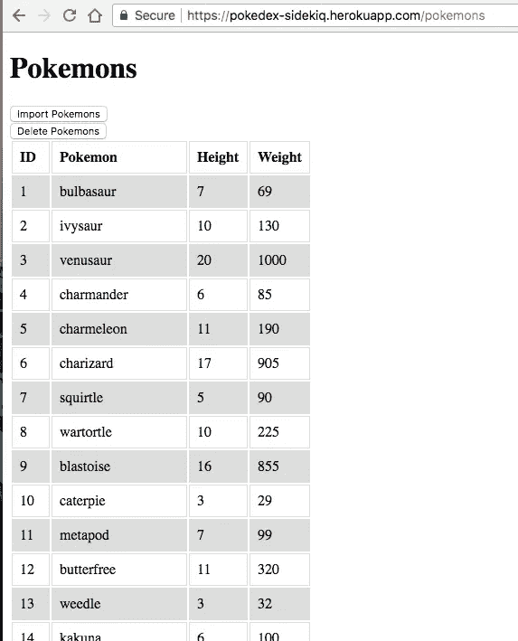
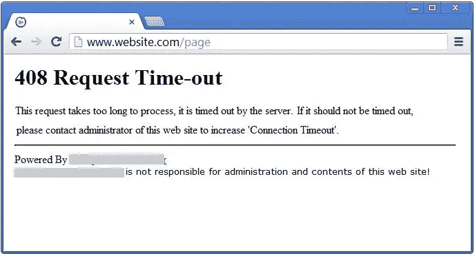
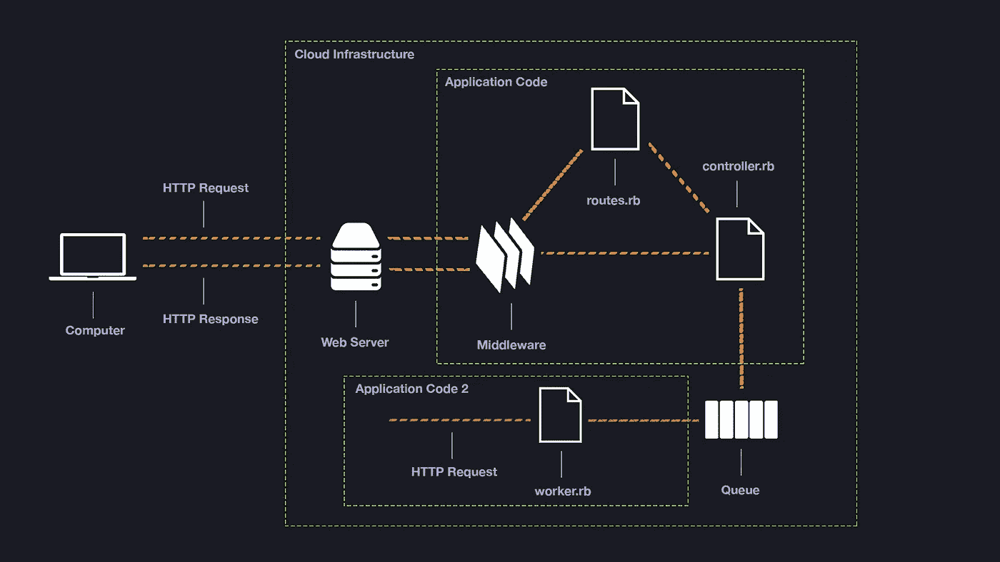
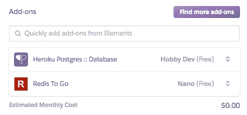
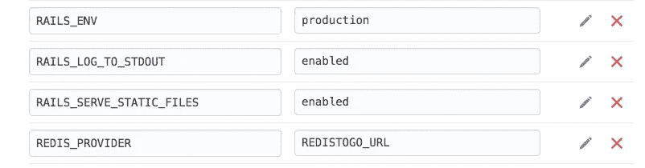
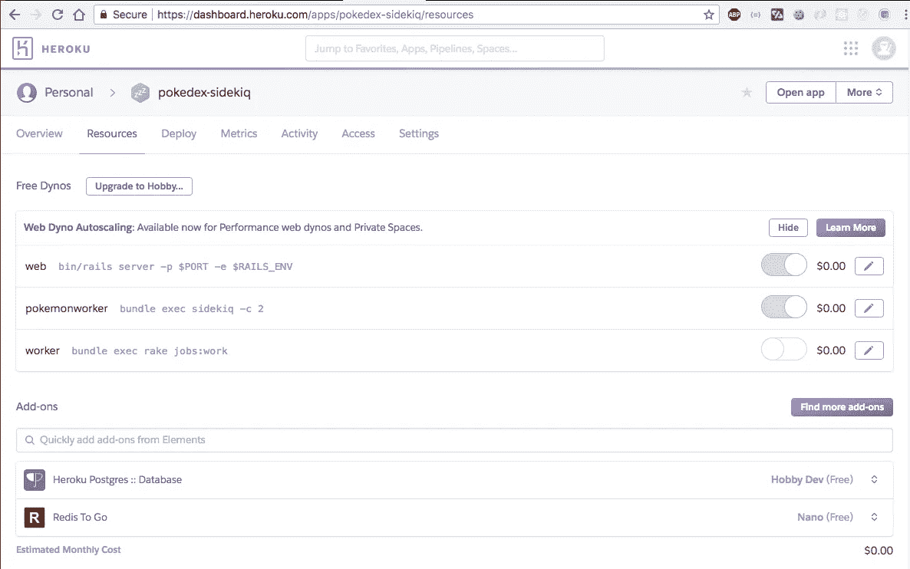
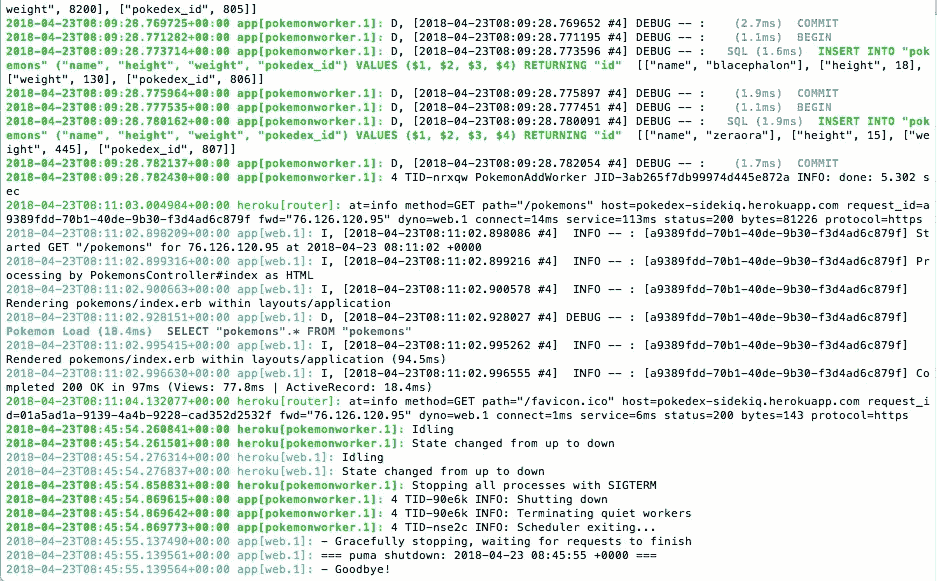

# Rails 后台工作者:Sidekiq 概述以及如何将其部署到 Heroku

> 原文：<https://itnext.io/sidekiq-overview-and-how-to-deploy-it-to-heroku-b8811fea9347?source=collection_archive---------0----------------------->


Sidekiq 是一个后台作业处理框架，对于处理昂贵的计算、电子邮件和其他在主 web 应用程序之外更好服务的进程非常有用。

在这篇博文中，我使用了一个解析大型口袋妖怪数据库的古怪例子来解释 Sidekiq 的必要性、Sidekiq 的工作流程、如何实现/利用 Sidekiq，以及如何将 Sidekiq 部署到 Heroku。

# 一个关于何时需要 Sidekiq 的人为但有用的例子

你可以在这里下载这个 pokedex 回购[，或者在这里](https://github.com/kevinYCKim33/pokedex)使用部署的应用[，随意跟随这个指南。](https://pokedex-sidekiq.herokuapp.com/pokemons)

假设您发现了一个很棒的 [CSV 文件，其中列出了所有 807 个口袋妖怪](https://github.com/veekun/pokedex/blob/master/pokedex/data/csv/pokemon.csv)，您想要创建一个 Rails 应用程序，您只需按一个按钮，它就会创建一个`Pokemon`类的 807 个实例，并以如下表格格式显示它们:



所以现在你可能想在你的`PokemonsController`中写一些类似的东西

```
#app/controllers/pokemons_controller.rbclass PokemonsController < ApplicationController
  require 'csv' def index
    [@pokemons](http://twitter.com/pokemons) = Pokemon.all
  end def upload
    csv_path = File.join Rails.root, 'db', 'pokemon.csv'
    CSV.foreach((csv_path), headers: true) do |pokemon|
      Pokemon.create(
        pokedex_id: pokemon[0],
        name: pokemon[1],
        height: pokemon[3],
        weight: pokemon[4])
    end
    flash[:notice] = "All 807 Pokemons added to db."
    redirect_to pokemons_path
  end def destroy_all
    Pokemon.destroy_all
    flash[:notice] = "All 807 Pokemons deleted from db."
    redirect_to pokemons_path
  endend
```

虽然这段代码是功能性的，但一旦用户点击“导入口袋妖怪”或“删除口袋妖怪”按钮，它将锁定浏览器，直到每个口袋妖怪的 807 个实例都被创建或删除，因为它现在在与请求/响应相同的线程中处理相同的解析/创建/删除动作。

这在开发模式下很烦人，但是假设这种情况发生在你部署的 Heroku 应用上，你甚至可能会得到这样的结果:



这就是 Sidekiq 的用武之地。不要让主 web 应用程序线程处理 Pokemons 的创建/删除，您可以将这个乏味且消耗内存的任务交给您可信赖的 Sidekiq——一个后台工作程序，允许您在主 web 应用程序线程之外执行任务。为了直观起见，请使用这张漂亮的图表:



由[https://www.youtube.com/watch?v=GBEDvF1_8B8](https://www.youtube.com/watch?v=GBEDvF1_8B8)提供

控制器不是将所有口袋妖怪的创建/删除交给口袋妖怪模型类，然后将结果发送回 web 服务器并显示在计算机屏幕上，这里的目标是将此任务委托给 Redis 队列(稍后将详细介绍),并让 Sidekiq 处理这些任务，同时 web 应用程序线程温和地让用户知道当前正在创建/删除所有口袋妖怪。

## 设置

首先，将 Sidekiq 添加到`Gemfile`和`bundle`

```
gem 'sidekiq'
```

Sidekiq 依赖于[Redis](https://redis.io/topics/introduction)——一个数据库存储，在这种情况下，它将被用来将口袋妖怪创建/删除作业保存在队列中。要在本地安装，请键入 Terminal:

```
brew install redis
```

## 重构我们的口袋妖怪代码以利用 Sidekiq

在我们的 Sidekiq gem 安装后，你现在可以创建几个 Worker 类来处理口袋妖怪的添加和删除，如下所示:

```
#app/workers/pokemon_worker.rbclass PokemonAddWorker
  include Sidekiq::Worker
  sidekiq_options retry: false require 'csv' def perform(csv_path)
    CSV.foreach((csv_path), headers: true) do |pokemon|
      Pokemon.create(
        pokedex_id: pokemon[0],
        name: pokemon[1],
        height: pokemon[3],
        weight: pokemon[4]
      )
    end
  end
endclass PokemonRemoveWorker
  include Sidekiq::Worker
  sidekiq_options retry: false def perform
    Pokemon.destroy_all
  end
end
```

正如你在上面看到的，要将一个普通的 Ruby 类转换成 Sidekiq Worker 类，你只需要在类声明下面添加行`include Sidekiq::Worker`。

此外，默认情况下，Sidekiq 将继续重试失败的方法。有些情况下这并不理想，比如涉及信用卡的时候。如果是这样，您可以像上面的代码一样通过添加`sidekiq_options retry:false`来关闭它

添加完这些代码行后，再添加一个`#perform`方法，现在你可以在这个方法中加入任何你不想成为主 web 应用程序瓶颈的任务。

现在您只需要通过调用这些 Worker 方法来重构`PokemonsController.rb`。

```
#app/controllers/pokemons_controller.rbclass PokemonsController < ApplicationController def index
    [@pokemons](http://twitter.com/pokemons) = Pokemon.all
  end def upload
    csv_path = File.join Rails.root, 'db', 'pokemon.csv'
    PokemonAddWorker.perform_async(csv_path)
    flash[:notice] = "Pokemons getting added to db"
    redirect_to pokemons_path
  end def destroy_all
    PokemonRemoveWorker.perform_async
    flash[:notice] = "Pokemons getting removed from db"
    redirect_to pokemons_path
  endend
```

注意，工人方法是通过写出`NameOfWorkerClass.perform_async(args)`来执行的

## 执行一切(至少在本地)

为此，您需要打开“终端”的三个标签:

选项卡 1:通过键入`redis-server`启动 redis 服务器

标签 2:通过输入`bundle exec sidekiq`激活你的 Sidekiq

第 3 页:输入`rails s`，启动你真正的 Rails 应用

如果你进入浏览器中的`localhost:3000`，你将能够看到你的 Sidekiq 正在工作，并且在导入或删除你的口袋妖怪数据库时没有锁定你的主浏览器。

Sidekiq 让我们不断刷新页面，看看有多少口袋妖怪被创造出来，而不是锁定屏幕，直到大约 800 个口袋妖怪被载入数据库。

# 将 Sidekiq 部署到 Heroku

所以你现在可能想知道:“我不能在 Heroku cloud 和`brew install redis server`和`redis-server`和`bundle exec sidekiq`中打开几个终端，对吗？对吗？？

幸运的是，Heroku 使这一切变得非常简单。

## **把 Redis 拿到 Heroku**

一旦主 Rails 应用程序被部署到 Heroku，登录到你的 Heroku 帐户，然后转到应用程序的仪表板，点击*资源*选项卡。

向下滚动到*附加组件*部分，搜索 *Redis To Go，*并安装其免费版本。最后，它应该看起来像这样:



现在转到 Heroku 应用仪表板上的*设置*选项卡，点击*显示配置变量*。在列表的末尾分别添加一个键值对 REDIS_PROVIDER 和 REDISTOGO_URL。如果操作正确，应该是这样的:



这又是相当于`brew install redis`和`redis-server`的本地环境

## 把 Sidekiq 带到 Heroku

如果你还没有，在你的 Rails 应用的根目录下创建一个`Procfile`。

如果你想知道`Procfile`实际上是什么，直接从 Heroku 文档:

> Procfile 是一种机制，用于声明 Heroku 平台上应用程序的 [dynos](https://devcenter.heroku.com/articles/dynos) 运行哪些命令。它遵循[流程模型](https://devcenter.heroku.com/articles/process-model)。您可以使用 Procfile 来声明各种流程类型，例如您的 web 服务器、多种类型的工作器、像[时钟](https://devcenter.heroku.com/articles/scheduled-jobs-custom-clock-processes)这样的单一流程，或者您希望在将新版本部署到生产环境之前运行的[任务](https://devcenter.heroku.com/articles/release-phase)。

如果您曾经在没有 Procfile 的情况下将 Rails 应用程序部署到 Heroku，您可能会注意到日志中有一条警告，指出没有检测到 Procfile，并且应用程序的默认值被设置为:

```
web: bin/rails server -p $PORT -e $RAILS_ENV
```

这只是 Heroku 真的很好，但它还不足以让人感觉到你在使用 Sidekiq 并为你添加适当的 Procfile 命令。

相反，进入你的`Procfile`，输入:

```
pokemonworker: bundle exec sidekiq -c 2
```

***批判搁置在-c 2 旗帜上***

Sidekiq 以能够并发运行多个线程而自豪(在-c 2 标志中“c”代表什么)。这类似于左边这个了不起的家伙在一场街机篮球比赛中大获全胜:


左边的家伙:bundle exec sidekiq-C2；右边的人:捆绑销售高管 sidekiq -c 1

默认情况下，`*bundle exec sidekiq*` 将实际上并发运行 **25 个**线程，但这是一个很大的线程，我们在 Redis To 的*免费*版本的基础上使用 Heroku 的*免费*版本。所以为了避免任何 Heroku 日志看起来像这样:

```
**2018-04-23T07:12:09.453785+00:00 app[pokemonworker.1]:** 4 TID-qkxr8 WARN: Redis::CommandError: ERR max number of clients reached
```

我们将只解决两个线程，而不是 25。因此，我们给我们的`bundle exec sidekiq`添加了一个`c -2`标志。

将代码推送到 Heroku 后，回到 Heroku 应用仪表板上的*资源*选项卡，打开 dyno 部分下的*口袋妖怪工作器*。该说的都说了，该做的都做了，应该是这样的:



下图是[这里](https://pokedex-sidekiq.herokuapp.com/pokemons)部署的 app 的 Heroku 日志(要显示日志，输入终端:`heroku logs -t`)。蓝色突出显示的日志是由主 web-app 线程创建的日志，而绿色突出显示的日志是由 Sidekiq/Redis 线程创建的日志。您可以看到两者同时工作。



所以应该就是这样！你的 Sidekiq 现在部署在你实际的口袋妖怪创建/删除应用程序旁边。

# 信用/更多资源

和我之前的博客一样，如果没有几个优秀的资源，这篇博客是不可能的。我在这里列出主要的，强烈推荐大家去看看，深入了解 Sidekiq 和后台处理。

[***长时间运行的任务*** ***在 Rails 中***](https://github.com/learn-co-students/rails-sidekiq-readme-v-000) 由 Flatiron School:一个关于如何设置 Sidekiq 的本地环境以及如何实现它的简明纲要。

[***使用 Rails、Redis 和 Sidekiq***](https://www.youtube.com/watch?v=GBEDvF1_8B8)*进行后台处理由 Decypher Media 提供:一个 15 分钟的 YouTube 视频，其中包含了关于后台处理的高级概念(博客文章顶部的流程图就是来自那里)，以及如何将 Sidekiq 部署到 Heroku 的详细演示。*

*[***Sidekiq Playlist***](https://www.youtube.com/watch?v=bfPb1zD91Rg&list=PLjeHh2LSCFrWGT5uVjUuFKAcrcj5kSai1)**作者 daily drip:Sidekiq 的创建者的官方演示，它包括一个展示 Sidekiq 如何在并行/并发线程中工作的演示，以及如何使用其基于 Sinatra 的 web-ui 查看 Sidekiq 操作的深入教程。***

***[***让我们聊聊***](https://speakerdeck.com/gogogarrett/lets-chat)*by*[网飞的 Garrett Heinlen](https://twitter.com/GoGoGarrett):在 [FogCity Meetup](http://www.fogcityruby.com/) 上的演讲，包括 Redis 的快速概述，以及 Sidekiq 如何与 Redis 通信。*****

# *****结束语*****

*****感谢你一直坚持到最后，这篇博客比我想象的要全面得多。*****

******随便在下面留几个拍手的吧！******