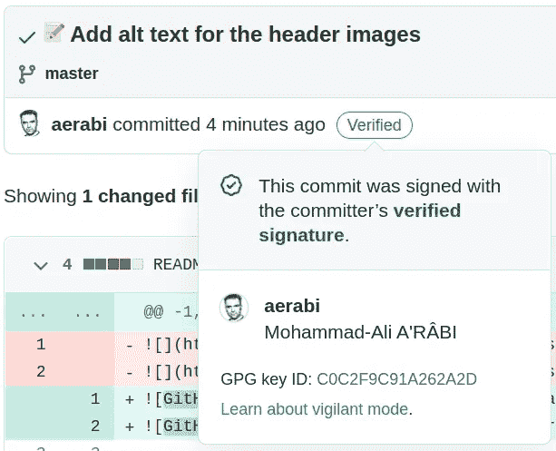

# 签署 Git 提交

> 原文：<https://itnext.io/sign-git-commits-7518318b804a?source=collection_archive---------3----------------------->

## 在 Linux 或 Mac 上，使用 GitHub

Git 周刊 #19
等级:高级🥇

Git 是一个非常灵活的工具。它允许一个人使用任何他们想要的名字。因此，举例来说，一个人可能犯了一个错误的代码，并将其归咎于他人。

*主文:* [*Git:改作者*](/git-change-author-709783e69626)

那么，如何确定提交是真实的并且有一个经过验证的作者呢？签字就行了。


# 说明

签名提交是使用 GNU 隐私卫士，简称 GPG 完成的。

## 安装 GNU 隐私保护，GPG

为了能够签署提交，需要首先安装`gpg`软件。在 Ubuntu 上:

```
sudo apt-get install gpa seahorse
```

在 Mac 上:

```
brew install gpg
```

该包很可能适用于其他 Linux 发行版的本机包管理器。底线是，人们可以在 Linux 上安装自制软件。

## 生成新的 GPG 键

现在，生成一个密钥:

```
gpg --gen-key
```

该软件将要求您的姓名和电子邮件地址。请确保输入在您的 GitHub 帐户上验证过的电子邮件地址。如果你想保持你的电子邮件地址的私密性，你可以使用你的 GitHub 不回复邮件地址。

然后会出现一个提示，要求输入密码以保护您的密钥。两次输入一。

现在，看看你的钥匙:

```
gpg --list-secret-keys --keyid-format=long
```

输出应该是这样的:

```
/home/mohammad/.gnupg/pubring.kbx 
------------------------------ 
sec   rsa3072/**3AA5C34371567BD2** 2022-09-15 [SC] [expires: 2024-09-14] 
      659FF1F3B51AD9F677276E4BC0C2F9C91A262A2D 
uid                 [ultimate] Mohammad-Ali A'râbi <44623032+aerabi@users.noreply.github.com> 
ssb   rsa3072/42B317FD4BA89E7A 2022-09-15 [E] [expires: 2024-09-14]
```

或者像这样:

```
/Users/mohammad/.gnupg/secring.gpg
------------------------------------
sec   4096R/**3AA5C34371567BD2** 2016-03-10 [expires: 2017-03-10]
uid                          Mohammad <me@example.com>
ssb   4096R/42B317FD4BA89E7A 2016-03-10
```

无论哪种方式，关键是斜线之后和日期之前的部分(粗体)。复制它并把它交给下面的命令。

首先，我们需要告诉 git 我们使用这个密钥来签署提交:

```
git config --global user.signingkey **3AA5C34371567BD2**
```

第二，我们需要导出密钥，以便稍后可以将其提供给 GitHub:

```
gpg --armor --export **3AA5C34371567BD2**
```

确保用您自己的密钥替换此命令中的密钥。这个命令显示了一个以`-----BEGIN PGP PUBLIC KEY BLOCK-----`开始，以`-----END PGP PUBLIC KEY BLOCK-----`结束的密钥。复制它。您也可以将它存储在一个文件中进行安全保管:

```
gpg --armor --export **3AA5C34371567BD2** > gpg-key.txt
```

## 将 GPG 密钥添加到 GitHub 帐户

下一步是将 GPG 密钥保存在你的 GitHub 账户中。进入你的设置中的按键部分:[https://github.com/settings/keys](https://github.com/settings/keys)

点击“新 GPG 密钥”，将密钥(以`-----BEGIN PGP PUBLIC KEY BLOCK-----`开头，以`-----END PGP PUBLIC KEY BLOCK-----`结尾的那个)粘贴到大文本区，给它起个名字，然后点击“添加 GPG 密钥”。

## 创建您的第一个签名提交

进行一些更改，准备好它们，然后提交并传递`-S`标志:

```
git commit -S -m ":pencil: Add alt text for the header images"
```

操作系统会询问您在开始时设置的密码。输入它。答对了。🎉

要检查签名，请使用以下命令:

```
git log --show-signature
```

输出将类似于以下内容:

```
commit 79db00a5d6724ebf304b268bd696c03aafcdd232 (**HEAD -> master**, **origin/master**, **origin/HEAD**)
gpg: Signature made Do 15 Sep 2022 23:18:52 CEST 
gpg:                using RSA key 659FF133B51AA9F677276E4BC1D2F9C91A262A2D 
gpg: Good signature from "Mohammad-Ali A'râbi <me@example.com>" [ultimate] 
Author: Mohammad-Ali A'râbi <me@example.com> 
Date:   Thu Sep 15 23:15:54 2022 +0200 

    :pencil: Add alt text for the header images
```

如果你提交，GitHub 会给它添加一个“已验证”的徽章:



# 遗言

要告诉 git 默认签署提交(不通过`-S`)，设置以下配置:

```
git config --global commit.gpgSign true
```

要签署一个标签，你应该通过一个小的`-s`:

```
git tag -s v1.5
```

为了使标签自动化:

```
git config --global tag.gpgSign true
```

是的，你可以在 git 提交消息中添加表情符号。😅

我每周都会在 git 上写一篇博文。

*   [订阅](https://medium.com/subscribe/@aerabi)my Medium publishes，以便在新一期 Git 周刊出版时获得通知。
*   在 Twitter 上关注[我，了解更多其他平台上发布的更新和文章。](https://twitter.com/MohammadAliEN)

# 参考

*   沙孔、史考特和本·施特劳布。“7.4 Git 工具—签署您的作品”。亲 Git。
*   [GitHub 文档:给你的 GitHub 账户添加 GPG 密钥](https://docs.github.com/en/authentication/managing-commit-signature-verification/adding-a-gpg-key-to-your-github-account)
*   [GitHub 文档:生成新的 GPG 密钥](https://docs.github.com/en/authentication/managing-commit-signature-verification/generating-a-new-gpg-key)
*   [GitHub 文档:签名提交](https://docs.github.com/en/authentication/managing-commit-signature-verification/signing-commits)
*   [GitHub Docs:告诉 Git 你的签名密钥](https://docs.github.com/en/authentication/managing-commit-signature-verification/telling-git-about-your-signing-key)
*   [库马尔，安库尔。Github:使用 GPG 签署提交(Ubuntu/Mac)](https://gist.github.com/ankurk91/c4f0e23d76ef868b139f3c28bde057fc#github--signing-commits-using-gpg-ubuntumac-closed_lock_with_key)