# 通过 7 个步骤登录 Apple 尽可能深入

> 原文：<https://itnext.io/sign-in-with-apple-in-7-steps-as-deep-as-possible-45c919bdb066?source=collection_archive---------3----------------------->

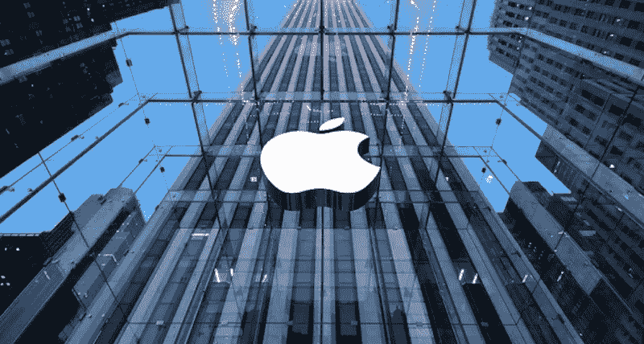

S ign In With Apple 是苹果公司打造的认证系统。iCloud 用户可以鉴定应用程序以检索他们的全名和电子邮件地址。苹果公司为那些想要隐藏自己电子邮件地址的用户提供代理电子邮件服务，以免应用程序所有者索要他们的电子邮件地址。在代理电子邮件系统的控制下，应用程序所有者必须首先在苹果服务器上注册他们的域名，以便向客户发送电子邮件。

苹果提供了[认证服务框架](https://developer.apple.com/documentation/authenticationservices)，为开发者提供了一个简单易用的认证工具，以方便他们在应用中实现。开发者必须首先在苹果开发者控制台配置功能，然后在应用程序端编码。可以只分 7 步！👏🏼

对于提供任何第三方认证选项的应用程序来说，登录苹果是一个必要的登录选项，包括谷歌登录、脸书、Instagram 和 Twitter 等。因此，你可以看到越来越多的应用程序现在在其应用程序中提供使用苹果选项登录。

# 开始前

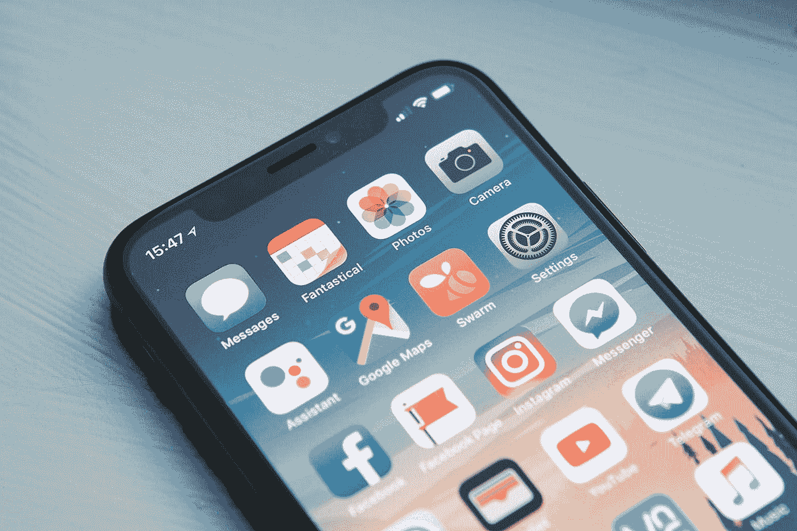

登录苹果**只有** **可以在** **真实设备**上运行，因此你**必须**拥有[苹果开发者账户](https://developer.apple.com/programs/)，用于生成[预置描述文件](/apple-provisioning-profile-as-simple-as-possible-b2db0af94e5)，以便将你的开发应用安装到真实设备上。

# 步骤 1)通过登录 Apple 创建/更新预置描述文件

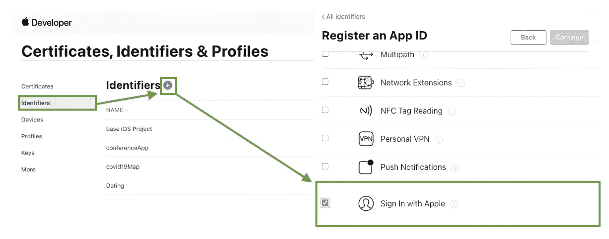

访问[苹果开发者控制台](https://developer.apple.com/)并创建一个带有苹果登录功能的应用标识符。

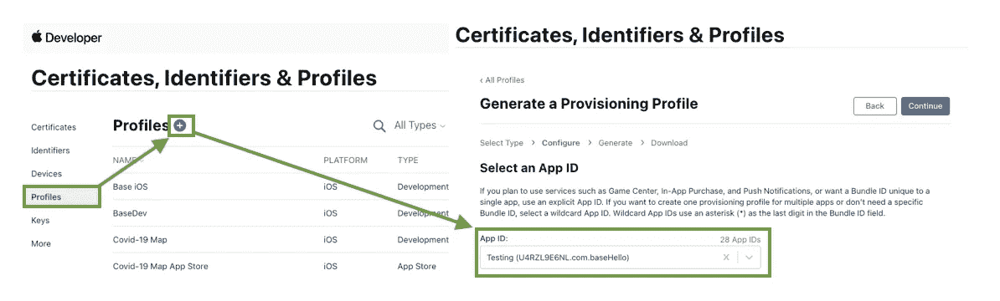

然后为您刚刚创建的应用程序实例生成一个配置文件。

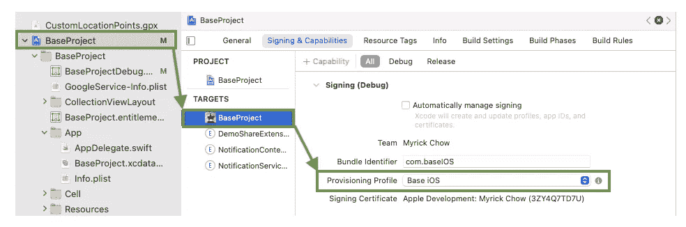

将预置描述文件导入 Xcode 项目。

# 第 2 步)在 Xcode 项目中添加 Apple 登录

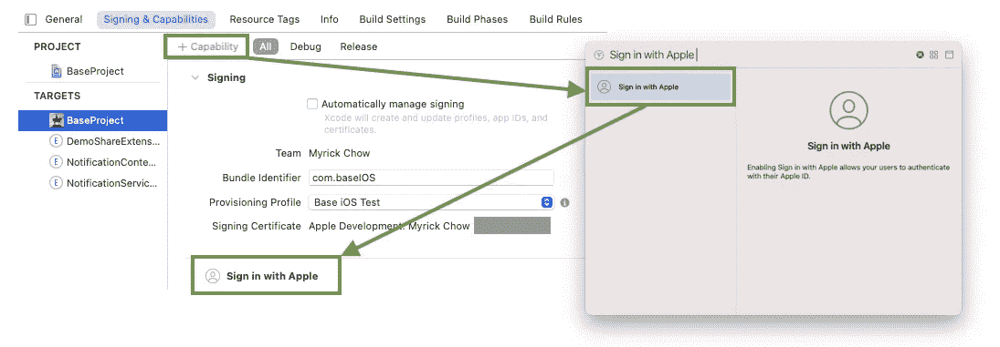

点击目标标签上的“+功能”按钮，选择“登录苹果”功能。

> 如果“使用 Apple 登录”功能未启用，运行时错误代码`1000`将从认证服务框架返回到`didCompleteWithError`回调。
> 
> 要了解更多信息，请参考第 5 步中的“错误处理”部分。

# 步骤 3)添加一个 ASAuthorizationAppleIDButton

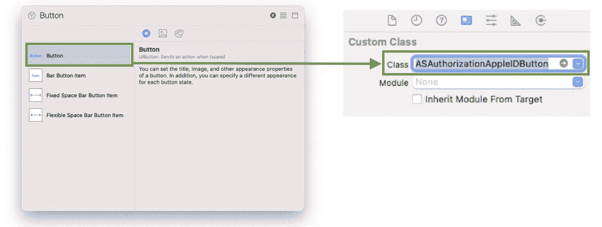

向您的`UIViewController`添加一个`UIButton`，并将类别类型分配给`ASAuthorizationAppleIDButton`。

用`ASAuthorizationAppleIDButton`代替普通的`UIButton`有什么好处？以下是一些要点:

1.  苹果在使用苹果按钮登录时有严格的[人机界面指南](https://developer.apple.com/design/human-interface-guidelines/sign-in-with-apple/overview/buttons/)，例如尺寸(最小 140W x 最小 30H)、圆角半径和显示的按钮标题。为了保证苹果审查顺利，我们应该使用`ASAuthorizationAppleIDButton`。
2.  `AuthenticationServices`框架可以支持多种语言，并根据设备的语言环境改变按钮标题。它减轻了开发人员的工作量！

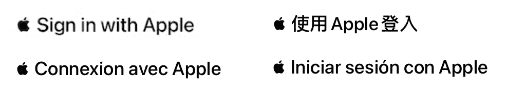

`ASAuthorizationAppleIDButton in different languages`

3.`ASAuthorizationAppleIDButton`支持明暗主题。开发人员可以通过编程初始化按钮来选择主题。

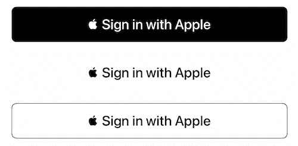

# 步骤 4)创建一个 ASAuthorizationRequest

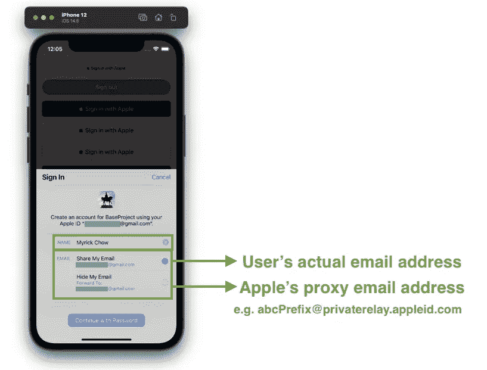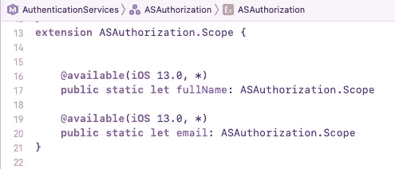

我们必须定义什么类型的用户信息是我们真正需要的。根据`AuthenticationServices`的最新版本，开发者可以请求的字段只有两个:

1.  全名(名+姓)
2.  电子邮件地址(真实的电子邮件地址或苹果公司的代理电子邮件地址)

苹果为用户提供了一个选项，通过提供代理电子邮件地址，向应用程序所有者隐藏他/她的实际电子邮件地址。总的来说，苹果将是一个中间人，负责将应用程序所有者的电子邮件转发到应用程序用户的电子邮件地址。[在向客户发送电子邮件之前，额外的 SMTP 中继验证](https://help.apple.com/developer-account/?lang=en#/devf822fb8fc)必须通过苹果服务器进行配置。因此，即使 app 数据库被黑客入侵，如果没有正确的 SMTP 中继验证，黑客也无法向用户发送垃圾邮件。

# 步骤 5 实现 ASAuthorizationControllerDelegate

## 数据处理

`AuthenticationServices`可以在`didCompleteWithAuthorization`回调时向 app 返回认证信息。信息打包在`ASAuthorization`对象的`credential`字段中。有一些重要的领域需要强调:

1.  `user` —用户的`String`标识符
2.  `fullName`—`PersonNameComponents`对象，由`givenName`和`familyName`字段组成
3.  `email` —用户的实际电子邮件地址或 Apple 代理电子邮件地址，格式为“ABC prefix @ privaterelay . Apple id . com”
4.  `identityToken` —一个代表 [JSON Web 令牌](https://jwt.io/) (JWT)的`Data`。你可以用在线工具解码令牌，比如 [JWT.io](https://jwt.io/) 。您可以在解码后的令牌中找到`iss`(发行者)、`aud`(包标识符)和`email`字段。

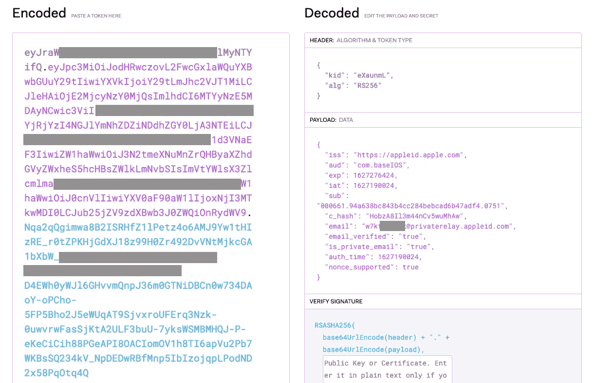

## 错误处理

`didCompleteWithError`可能会抛出两个错误:

1.  **错误代码 1000** 你必须再次阅读步骤 2)。
2.  **错误代码 1001**用户用 Apple flow 取消签到。

# 步骤 6 实现 asauthorizationcontrollerpresentationcontextproving

`presentationContextProvider`是一个委托，它提供了一个显示上下文，系统可以在其中向用户呈现一个授权界面。我们可以简单的返回当前`UIViewController`截至`ASPresentationAnchor`的`window`。

# 提出请求

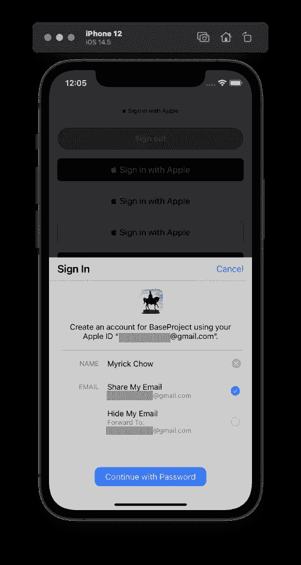

最后一步非常简单。我们只需要让`ASAuthorizationController`实例向用户请求个人信息。

您现在可以在步骤 5)中引入的`ASAuthorizationControllerDelegate`的`didCompleteWithAuthorization`回调中处理用户信息。

# 发展实践技能

## 问题一:首次成功登录后无法选择选项

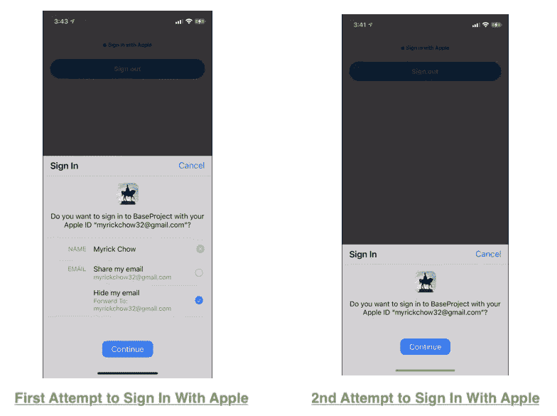

为了测试你的代码，你可能会多次尝试通过“登录苹果”来登录。然而，`ASAuthorizationController`的 UI 在首次成功登录后改变并隐藏了选择共享何种信息的选项。

为什么？这是因为苹果最伟大的 UX 理论——“尊重用户的选择”。一旦用户同意/拒绝了他/她的全名或电子邮件地址的请求，应用程序开发人员就不应该再问用户了！因此，用户只需要决定他/她这次是否想登录苹果😉。

## 问题二:全名和电子邮件地址都是零！！！首次成功登录后

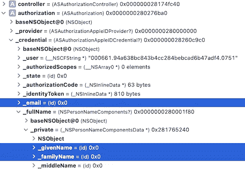

您是否发现在返回的`credential`中存储的信息在每次登录之间并不一致？🤔

在第二次尝试时，名字、姓氏和电子邮件地址都是`nil`，即使用户已经将他/她的个人信息授权给应用程序。在`ASAuthorizationControllerDelegate`的`didCompleteWithAuthorization`回拨处看到上面的截图。

是`AuthenticationServices`框架的 bug 吗？不。实际上是计划好的！根据[苹果框架工程师在苹果开发者论坛上的回答](https://developer.apple.com/forums/thread/121496#379297)，用户信息仅在**初始用户注册**时在`ASAuthorizationAppleIDCredential`发送，强烈建议应用开发者将用户凭证安全地存储在本地，直到在我们的服务器上成功创建帐户！

> 换句话说，一旦用户授予信息，应用程序开发人员就不能更新或添加额外的范围到`requestedScopes`字段。在启动应用程序之前，我们应该记住这个问题。
> 设置`requestedScopes`见步骤 4)

# 撤销 Apple ID 登录权限

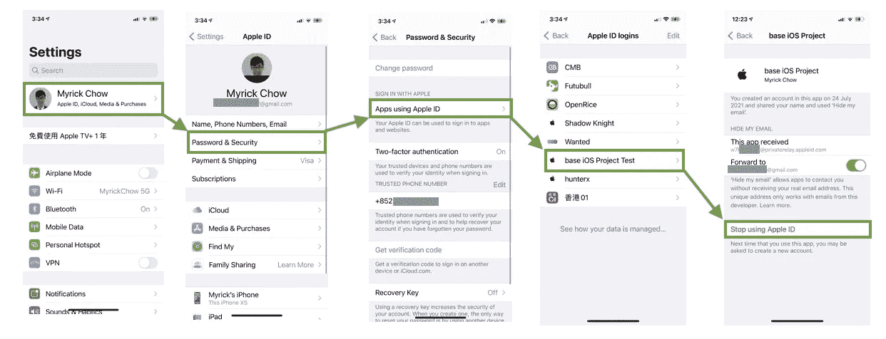

在应用程序开发阶段，开发人员和质量保证测试人员必须多次登录苹果，以检查应用程序和服务器是否运行顺畅，即使用户没有授权某些信息。那么，我们如何在不更换不同 iCloud 账号的情况下，在同一台设备上进行多次测试呢？

我们可以导航到设置应用程序>密码与安全>使用 Apple ID 的应用程序>[您的应用程序]>单击“停止使用 Apple ID”以撤销登录状态。

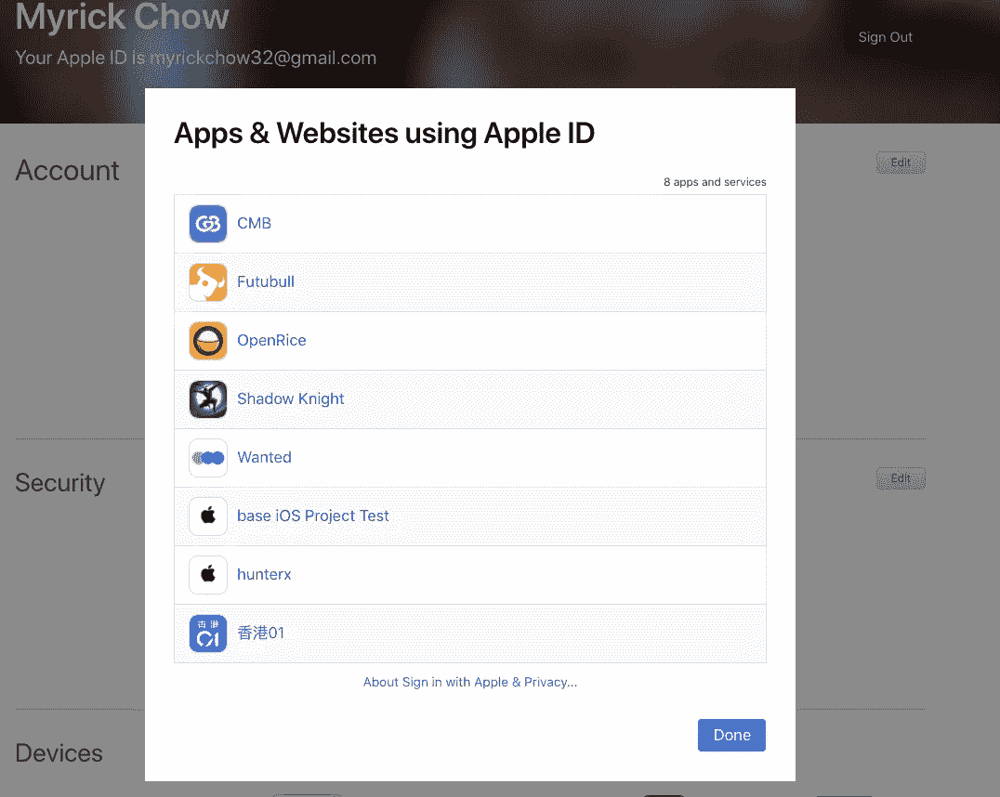

[iCloud 账户管理网站](https://appleid.apple.com/account/manage)

你也可以在 [iCloud 账户管理网站](https://appleid.apple.com/account/manage)进行操作。

# 当用户撤销身份验证时获得通知

一旦用户撤销了使用 Apple 权限登录，应用程序开发人员应该将此事件发送到服务器，并让后端开发人员决定是否适合暂时暂停甚至删除用户的帐户。

`AuthenticationServices`框架提供了一个`ASAuthorizationAppleIDProvider.credentialRevokedNotification`，app 只需通过`NotificationCenter`就可以观察到。参见上面的代码。您可以通过在 [iCloud 账户管理网站](https://appleid.apple.com/account/manage)撤销登录状态来测试该代码。

# 获取登录状态

如果当用户撤销登录状态时，你的应用不在状态或不在前台，你将错过通知。Apple 提供了另一个在运行时获取最新凭证状态的函数。当凭据状态不是“授权”时，我们可以采取额外的操作。

# 如何向代理邮箱发送邮件？

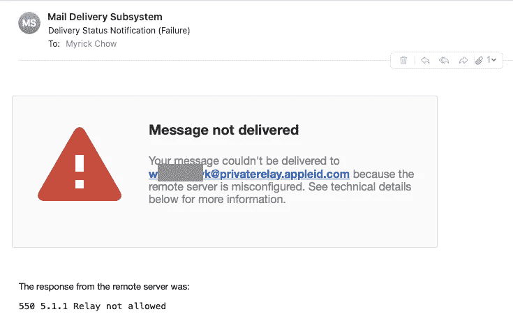

虽然这是一个普通的后台话题，但仍然值得在这里讨论。一旦用户不想与应用程序所有者共享他/她的实际电子邮件地址，就会创建一个代理电子邮件地址。它由苹果公司控制。为了与苹果服务器通信，需要首先在苹果开发者控制台[配置私人电子邮件中继服务](https://help.apple.com/developer-account/?lang=en#/devf822fb8fc)。这些过程包括注册域名和通信电子邮件。

如果您直接从您的个人电子邮件邮箱(如 Gmail)向代理电子邮件地址发送电子邮件，您将会收到错误`550 5.1.1 Relay not allowed`。错误截图见上。

# 还有一件小事

iPhone 上的`ASAuthorizationController`只能**支持**的**人像模式**。用户必须切换回纵向模式，才能继续使用 Apple flow 登录。在我看来，如果它能支持横向模式就更好了，但我相信苹果是有意和明智的。😉

# 摘要

登录 Apple 是 Apple 为进一步保护用户隐私而提供的工具。用户可以选择向应用程序所有者公开自己的全名和真实电子邮件地址。苹果公司为那些想向他人隐藏自己真实电子邮件地址的用户生成了一个代理电子邮件地址。

应用程序所有者必须在苹果开发者控制台设置 SMTP 配置并注册域名和其他细节，以便向用户的代理电子邮件地址发送电子邮件。

对于编码部分，主要关注`ASAuthorizationController`，它可以向用户请求个人信息，并通过`ASAuthorizationControllerDelegate`返回。我们必须记住，一旦用户之前授权了它，我们就不能更新了。我们必须在本地安全地保存用户凭证，直到在服务器端成功创建一个帐户！

# 参考

1.  [配置私人邮件中继服务](https://help.apple.com/developer-account/?lang=en#/devf822fb8fc)
2.  [苹果开发者论坛——在真实设备](https://developer.apple.com/forums/thread/121496#379297)上请求范围时无法获得电子邮件&名称
3.  [JWT。IO](https://jwt.io/)
4.  [关于使用苹果按钮登录的人机界面指南](https://developer.apple.com/design/human-interface-guidelines/sign-in-with-apple/overview/buttons/)
5.  [苹果认证服务框架](https://developer.apple.com/documentation/authenticationservices)

 [## Apple 预置描述文件尽可能简单

### 供应简档可以被视为应用所有者、开发者和测试设备所有者之间的合同。看一看…

itnext.io](/apple-provisioning-profile-as-simple-as-possible-b2db0af94e5) 

感谢您阅读这篇文章。希望你觉得有趣和有用！欢迎您关注我，并通过以下渠道与我联系:

1.  [Twitter @ myrik _ chow](https://twitter.com/myrick_chow)
2.  [YouTube @ myrick show](https://www.youtube.com/channel/UC_UEqZPDms3rtX5W-m9hgxg)
3.  [LinkedIn @ myrik Chow](https://www.linkedin.com/in/myrick-chow-720b34118/)