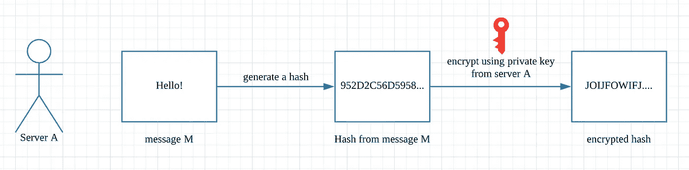
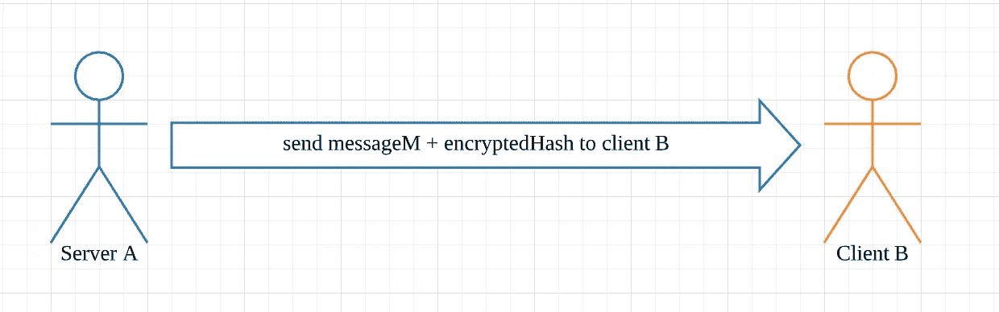
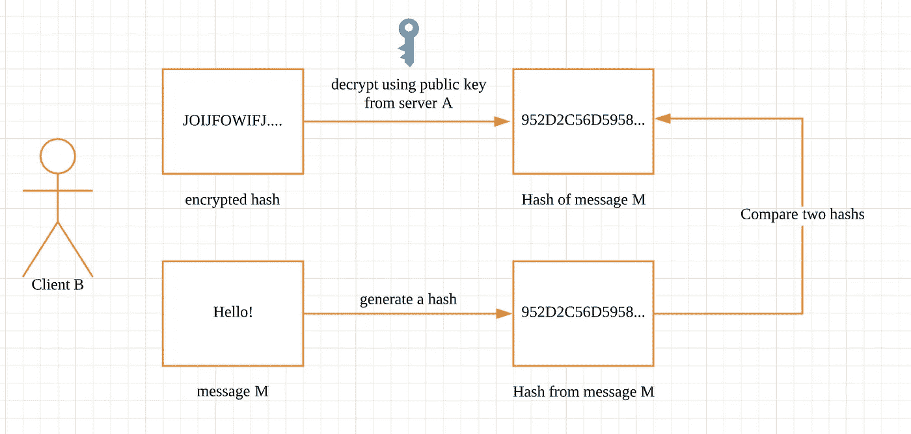

# 签署消息和加密

> 原文：<https://itnext.io/signing-a-message-e303c2954499?source=collection_archive---------4----------------------->

图片由来自[皮克斯拜](https://pixabay.com/?utm_source=link-attribution&utm_medium=referral&utm_campaign=image&utm_content=3400657)的[皮特·林福思](https://pixabay.com/users/TheDigitalArtist-202249/?utm_source=link-attribution&utm_medium=referral&utm_campaign=image&utm_content=3400657)拍摄

# 介绍

手游行业有各种不同的黑客行为。人们可能会在将数据发送到服务器之前修改客户端数据，或者从服务器上窥探数据。防止这种攻击最常见的方法是在发送之前对你的信息进行加密和签名。

“签名消息”和“加密消息”的主要区别在于，“签名消息”确保消息来自正确的来源并且没有被修改。而“加密消息”确保消息只能被授权方**读取。**

在这篇文章中，我们将重点讨论消息签名部分。

# 公钥和私钥

我假设您对加密有基本的了解，如果您不熟悉加密密钥，我们在这里快速浏览一下:

## 使用

*   用公钥加密的内容只能用私钥解密。
*   用私钥加密的内容只能用其公钥解密。

## 公开密钥

*   对于公共用途，您可以将它上传到网络上，或与您的邮件一起发送。
*   主要用于加密和公开签名(验证签名)

## 私人密钥

*   应该保密，最好加个密码
*   主要用于解密和签署消息

# 关于签署邮件

## 为什么我们需要签署一个信息

*   为了防止第三方在数据传输过程中修改数据
*   确保消息来自正确的来源

## 它是如何工作的

1.  签署邮件

*   服务器从 messageM(要加密的消息)中计算散列值
*   服务器 a 使用私钥加密哈希(这是对消息进行签名)

2.发送消息和散列

*   ServerA 将 messageM 和 encryptedHash 发送给 ClientB (messageM 不需要加密，只需要原始消息)

3.打开签名的邮件

*   ClientB 使用来自 serverA 的公钥对加密的哈希进行解密
*   ClientB 使用 messageM 计算哈希，并与解密的哈希进行比较，如果两个哈希相同，则 messageM 有效，并且在传输过程中未被第三方修改。

# 给我看看代码

## 核心代码

## 配置文件

## 加密服务

# 结论

在这篇文章中，我们只讨论如何确保消息来自正确的来源，但消息在传输过程中仍然可以被阅读。如果我们想确保消息只能被授权方阅读，我们也需要加密消息。