# 使用 Box & OutSystems 签署文档

> 原文：<https://itnext.io/signing-documents-using-box-outsystems-6b9e4f1a4bfb?source=collection_archive---------0----------------------->

[签名专家](https://unsplash.com/@signaturepro?utm_source=unsplash&utm_medium=referral&utm_content=creditCopyText)在 [Unsplash](https://unsplash.com/s/photos/sign-document?utm_source=unsplash&utm_medium=referral&utm_content=creditCopyText) 上的照片

我仍然记得我在 2007 年使用 OutSystems 的第一个大项目。这是一个水管理机构的文档管理系统。我希望我那时有拳击。

如果您正在处理文档，这个用例迟早会出现。销售合同、NDA、员工入职，有很多机会在你的应用或公司中实现文档签名。

一般来说，人们会发送一份 PDF 文件，打印出来，然后手动签名、扫描并作为电子邮件附件发送回去。声音效率很低，对吧？但是有一个更简单的方法。

一些公司提供这项服务作为一个完整的应用程序，大多数还提供一些你可以在你的应用程序中使用的 API，如果你看看 forge，你会发现相当多的电子签名相关组件的选择。

Box 是 OutSystems 开发人员中相当受欢迎的组件，最近发布了他们的 Sing API。所以如果你把 Box 集成到你的 app 里，这个功能你已经可以用了。

# 让我们开始编码吧

如果你在铁匠铺里搜索盒子，你会发现至少有 3 个部件:

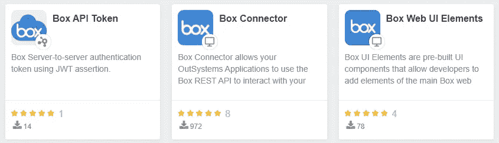

[框 API 令牌](https://www.outsystems.com/forge/component-overview/9350/box-api-token)是一个包装器，用于获取 JWT 授权令牌以使用 API(感谢哈里)，如果你选择 JWT，你可以使用这个或者通用的 [JWT 组件](https://www.outsystems.com/forge/component-overview/1853/jwt)。

实现大部分 Box API 的 [Box 连接器](https://www.outsystems.com/forge/component-overview/586/box-connector)仍然使用传统堆栈，因此需要一些创造性。

最后，我创建了一个服务来管理 JWT 授权令牌，另一个服务来处理与应用程序类型无关的框符 API。

## 框 API: JWT 授权

该服务处理 JWT 授权和应用程序配置。

这个想法是为了让开发人员简单，你需要做的就是上传你在 Box 控制台上设置应用程序时得到的配置 JSON 文件，然后就完成了。

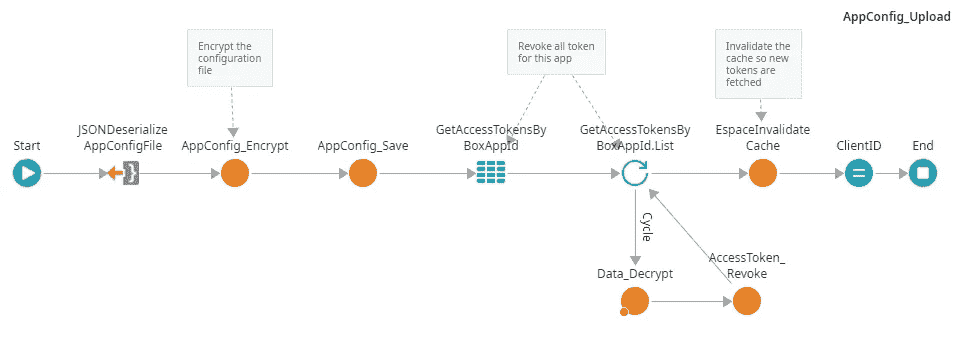

敏感信息，如客户端机密、私钥和密码在数据库中被加密。

服务方法受到“应用程序管理员”特定权限的保护。

如果一个新令牌即将过期，那么服务方法 **BoxAPI_AccessToken_Get** 将处理新令牌的请求或现有令牌的重用。此方法也受“API 用户”权限的保护。

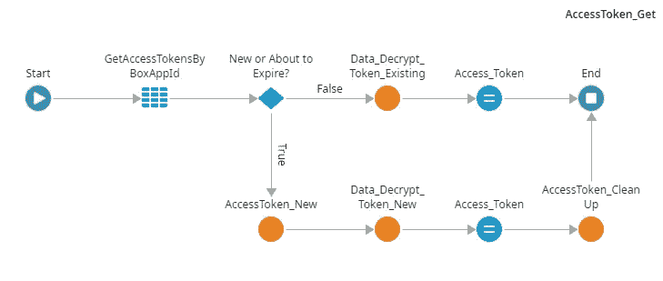

## 框 API:签名

与其他的 Box API 相比，你会发现这个简单易用，它们只有 5 个入口点(列表、获取、创建、取消和重发)。

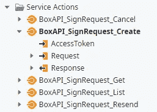

创建签名请求所需的最少信息是文档 id、文件夹 id 和签名者的电子邮件。

从这一点上来说，盒子接管。它会将文档发送到电子邮件，提供用户签名的应用程序接口，并将签名的文档返回给请求者。没有打印，没有纸张，没有扫描，完成。

我确实有一套令人印象深刻的功能(虽然我没有测试所有的功能)，例如:为尚未签署文档的用户自动提醒(也可以显式重新发送)；双因素认证(除了文档密码之外)；预填充签名相关信息，以允许您将工作流、人员或文档置于上下文中；具有特定签名顺序和角色(请求者、批准者、签名者)的多个签名者。

# 示例应用程序

作为一个演示应用程序，我需要限制使用，否则我的开发者帐户将有一个非常短的生命。

所以我准备了一个简单的文件，这将是唯一可以签名的文件，用户可以将这个样本发送到他的电子邮件作为签名请求。

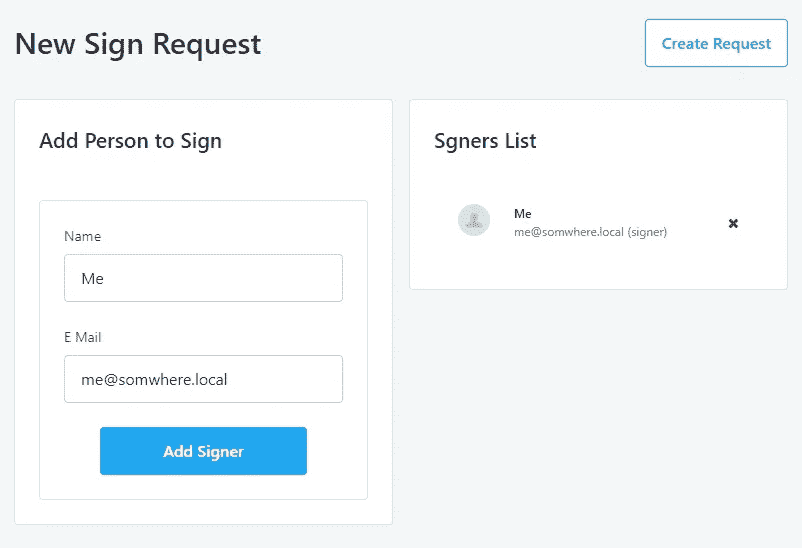

一旦您输入了电子邮件地址并创建了一个请求，几秒钟后您的收件箱就会收到该请求，然后按照说明进行操作。

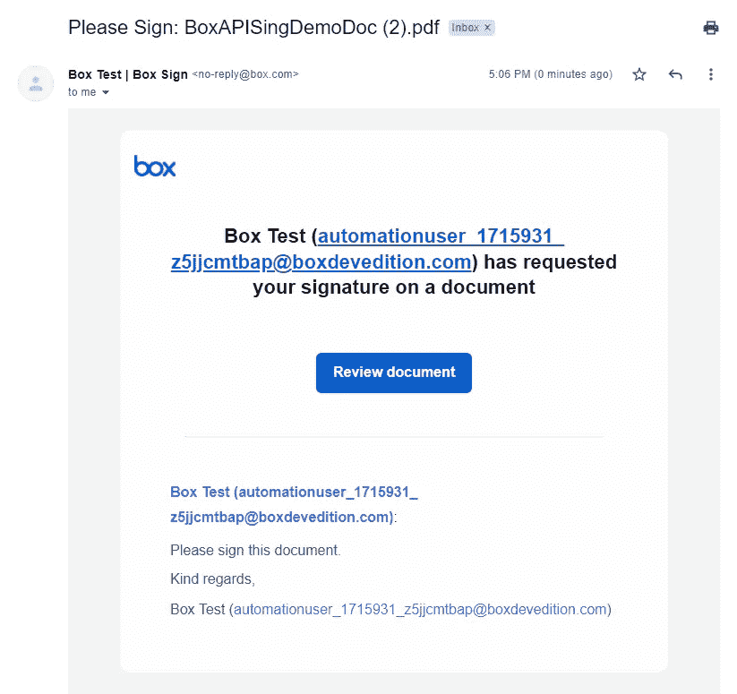

Box 还处理签名捕获

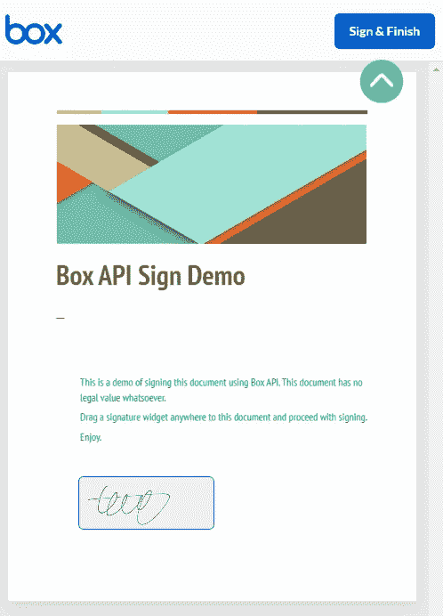

## 代码

一旦 Box API 开始工作，编写这个应用程序就是一个简单的过程。

对于**主页**屏幕，一个简单的列表小部件显示当前的签名请求及其状态。

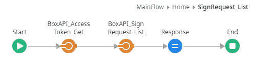

创建新请求的方法获取硬编码的文件夹和文档 id、签名者电子邮件列表并调用 API。

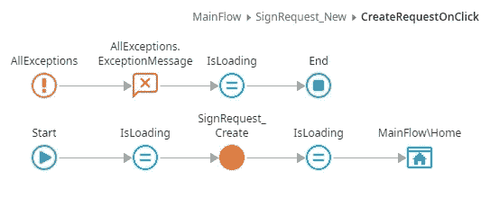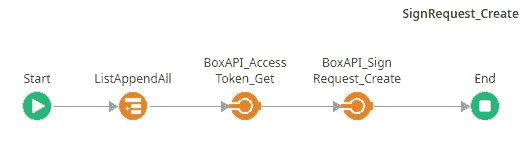

最后，还有一个使用 Sign Request Get API 方法的详细信息屏幕。

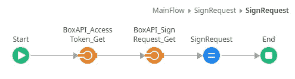

查看[锻造](https://www.outsystems.com/forge/list?q=box&t=&o=&tr=False&oss=False&c=%20&a=&v=&hd=False&tn=&scat=forge)上的盒子相关组件了解更多详情。

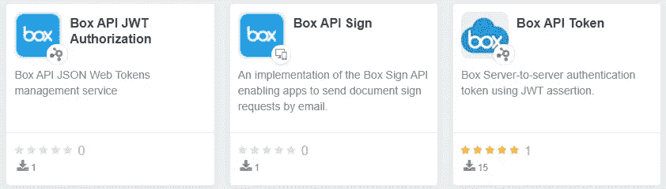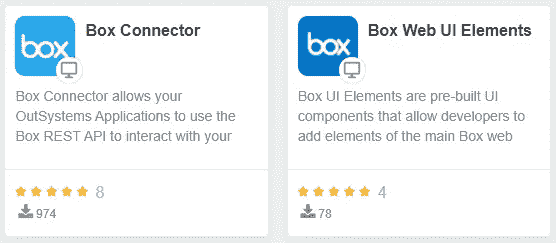

并在这里试驾一下这个演示[。](https://rb-demos.outsystemscloud.com/BoxSignDemo/)

但是等等，我们还没完，还有更多…

现在你已经知道你需要做什么了…

去构建一些应用程序吧！！！