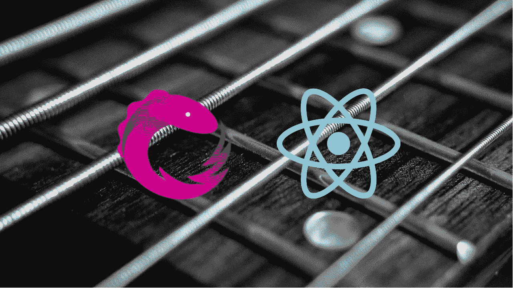

# 用 React & RxJS & re enhance-components 简化了 Ajax 获取

> 原文：<https://itnext.io/simple-ajax-fetch-with-react-rxjs-hocs-bb174bc45d9e?source=collection_archive---------0----------------------->



> [*点击这里在 LinkedIn 上分享这篇文章*](https://www.linkedin.com/cws/share?url=https%3A%2F%2Fitnext.io%2Fsimple-ajax-fetch-with-react-rxjs-hocs-bb174bc45d9e%3Futm_source%3Dmedium_sharelink%26utm_medium%3Dsocial%26utm_campaign%3Dbuffer)

TL；RxJS 博士用中间件处理 Ajax 比 Redux 容易多了。通过使用`[reenhance-components](https://www.npmjs.com/package/reenhance-components)`中的`AsyncResolver`，你可以很容易地在普通 JSX 中采用它。在附加的 CodePen 示例中，您可以看到通过 API 获取的 iTunes 专辑。

*更新* 2018/7/19 切换到 ES6。介绍`reenhance-components`

# 关于 Ajax 和 React 的简短介绍

React 项目中试过 Ajax 吗？你可能已经尝试过在官方常见问题解答中使用`then/catch`子句中的`setState`或 Redux 中间件 [redux-thunk](https://github.com/gaearon/redux-thunk) 和 [redux-saga](https://github.com/redux-saga/redux-saga) 中的[示例。无论哪种方式，国家管理都需要大量的工作。但是等等。原始问题有一个替代解决方案。是 RxJS。](https://reactjs.org/docs/faq-ajax.html)

# **RxJS 是什么？**

从[正式文件](http://reactivex.io/rxjs/)，

> RxJS 是一个使用 Observables 进行反应式编程的库，使得编写异步或基于回调的代码更加容易。

实际上，像定时器、事件和承诺这样的异步流可以更容易地处理。

这是一个用 RxJS 获取 API 的小例子。

```
const fetch$ = Observable
  .from(fetch(url))
  .flatMap(response => response.json());
```

和常规的`Promise`的`resolve/reject/then/catch`差不了那么远，但是我承认还是和常规的 Javascript 编程有区别。

# **通过重新增强组件获得 RxJS 的好处**

虽然我最初的帖子使用了`[recompose](https://github.com/acdlite/recompose)`，但是现在我创建了`[reenhance-components](https://www.npmjs.com/package/reenhance-components)`，它是一组具有各种功能的组件。在本文中，我将展示一个使用基于 RxJS 和`recompose`的`AsyncResolve`的例子。

它像这样解析基于承诺的常规异步函数。

```
const asyncFetch =
  ({ query }) =>
    fetch(queryToUrl(query))
      .then(res => res.json())
      .catch(err => ({ error: err.toString() }));
```

必须首先实例化该组件。你可以为孩子传递一个参数名和初始道具。

```
const AlbumsAsyncResolver =
  AsyncResolver('query', { resultCount: 0, results: [] });
```

然后，用它制作一个简单的功能组件*。*

```
const Albums = ({ query }) => (
  <AlbumsAsyncResolver query={query} subject={asyncFetch}>
    {props => props.results && (
      <ul>
        {props.results.map(itemRenderer)}
      </ul>
    )}
  </AlbumsAsyncResolver>
);
```

仅此而已。`AsyncResolver`调用主题，解析`Promise`，并将结果作为其`children`的`props`传递。它是声明性的，不需要类或其他任何东西。

惊讶吗？你可以在下面的代码栏中看到它的工作。每个组件向 iTunes 发送一个 API 请求，并显示响应中的专辑信息。

# 结论

要在 React 中执行异步操作，`setState`或 Redux 中间件不是唯一的解决方案。RxJS 提供了很棒的编程模型，您可以使用`reenhance-components`中的`AsyncResolver`轻松采用它！