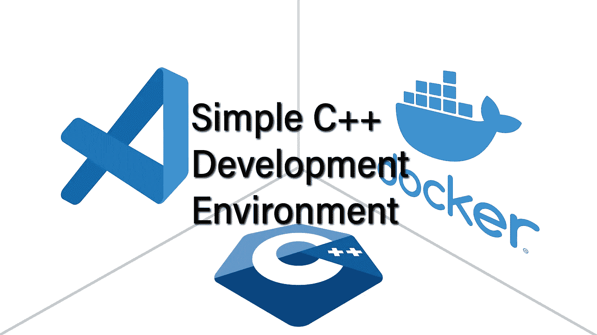

# 简单一致的 C++开发环境

> 原文：<https://itnext.io/simple-and-consistent-c-development-environment-c08cf8d93ed9?source=collection_archive---------2----------------------->

C++学生的一个常见障碍是选择一个好的开发环境。需要做出许多选择，其中大多数都会显著影响用户体验。

今天，我将指导您使用 Visual Studio 代码和 Docker 进行简单的设置，从一个现成的设置开始，然后逐步解释所提供的配置以及如何根据您的需要定制设置。

# 先决条件

此设置将适用于 Windows、Linux 和 macOS(包括 M1)。但是，您需要首先安装两个软件:

*   [Visual Studio 代码](https://code.visualstudio.com/download)
*   [Docker 桌面](https://docs.docker.com/desktop/#download-and-install)

# 简单设置

启动 VSCode，打开*视图>命令面板(CTRL+Shift+P)* 。

编写 *git clone* ，确认并将以下 URL 复制到输入框中:

*   [https://github.com/HappyCerberus/simple-cpp-devenv](https://github.com/HappyCerberus/simple-cpp-devenv)

VSCode 完成存储库克隆后，VSCode 将提示您确认以下步骤:

*   打开克隆的存储库
*   毫不含糊地相信我
*   安装*远程容器*扩展
*   在容器
    *中重新打开，首次构建需要几分钟时间。此后，后续的运行将重用已经构建好的容器。*
*   选择你的装备:选择“铿锵 14”

完成这些后，您现在就有了一个完整的 C++开发环境，它有一个基本的 *CMake* 配置和一个位于 *src* 文件夹中的 hello world 程序示例。常见的操作(构建/运行/调试)在蓝色底部栏中提供。

# 定制设置

如果你想使用这个设置而不仅仅是学习 C++，你可能需要定制它。

## 仓库

首先，您需要创建您的存储库。与典型的分叉不同，我已经将存储库设置为模板，所以跟随 [URL](https://github.com/HappyCerberus/simple-cpp-devenv) 并点击绿色的“*使用此模板*”按钮。

## 开发容器和停靠栏

不同机器之间的一致体验是通过 Docker 映像实现的。VSCode 通过 Devcontainer 特性与 Docker 集成。

使用该功能时，您通常会依赖预构建的映像。但是，容器也可以指定为 Dockerfile。然后在目标机器上按需构建映像。

在容器规范之上，我们还可以定义需要哪些 VSCode 插件:

Dockerfile 通过安装 clang-14、git、CMake 和 gdb 来建立一个基于 Ubuntu 的镜像。

## 虚拟代码

我们还可以包括对 VSCode 本身和我们使用的插件的配置。

首先，为了确保 VSCode 在打开存储库后推荐*远程容器*插件，我们可以将它添加到*中的推荐部分。vscode/extensions.json* :

其次，我们需要对*中的 CMake 插件进行一些配置。vscode/settings.json* 。不幸的是，VSCode 不支持 Linux 上的 lldb 调试器，所以我们手动切换到 gdb，并强制 CMake 使用 Makefile 生成器:

## C++

C++配置是您可以进行最大程度定制的地方。您可以引入典型的 CMake 配置，或者使用 CMake starter 项目之一。只有一件事需要记住。Clang 14 会产生 *dwarf-v5* 格式的调试信息，和我们已经安装的 GDB 版本不太好玩，需要手动切换到 *dwarf-v4* 。

# 限制和注意事项

最后，值得一提的是这种方法的缺点。

最明显的缺点是，这种配置只适用于 Linux 项目，并且只可能进行命令行开发，而不需要额外的工作。

## 缓存和预建图像

第二个考虑来自大型项目。如果您在公司中部署这种方法，您可能希望使用预构建的映像(可能使用本地映像注册表)。

最后，由于 docker 映像的孤岛性质，使用缓存解决方案将更加困难。

## 参考

如果您想了解更多信息，VSCode 文档写得非常好，它探讨了更多的细节(例如，如何处理点文件):

*   [https://code.visualstudio.com/docs/remote/containers](https://code.visualstudio.com/docs/remote/containers)
*   [https://code . visual studio . com/docs/remote/containers-教程](https://code.visualstudio.com/docs/remote/containers-tutorial)
*   [https://code . visual studio . com/remote/advanced containers/overview](https://code.visualstudio.com/remote/advancedcontainers/overview)

# 感谢您的阅读

你喜欢这个快速教程吗？您可能也会喜欢我的长篇 C++文章:

 [## 114 种标准 C++算法。介绍

### 欢迎来到关于 C++标准算法的新系列。标准算法提供了安全和优化的构建模块…

itnext.io](/the-114-standard-c-algorithms-introduction-2a75a2df4300)  [## 节省你的理智和时间——不要拘泥于形式。

### 作为一名软件工程师，你能做的最有影响力的事情之一就是自动化重复的活动。一个领域，在…

itnext.io](/save-your-sanity-and-time-beyond-clang-format-2b929b9120b8) 

我也在 YouTube 上发布视频。你有问题吗？在[推特](https://twitter.com/SimonToth83)或 [LinkedIn](https://www.linkedin.com/in/simontoth) 上联系我。