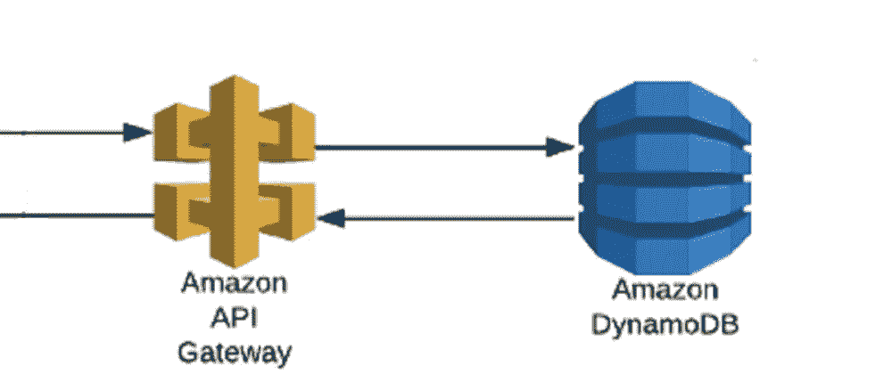
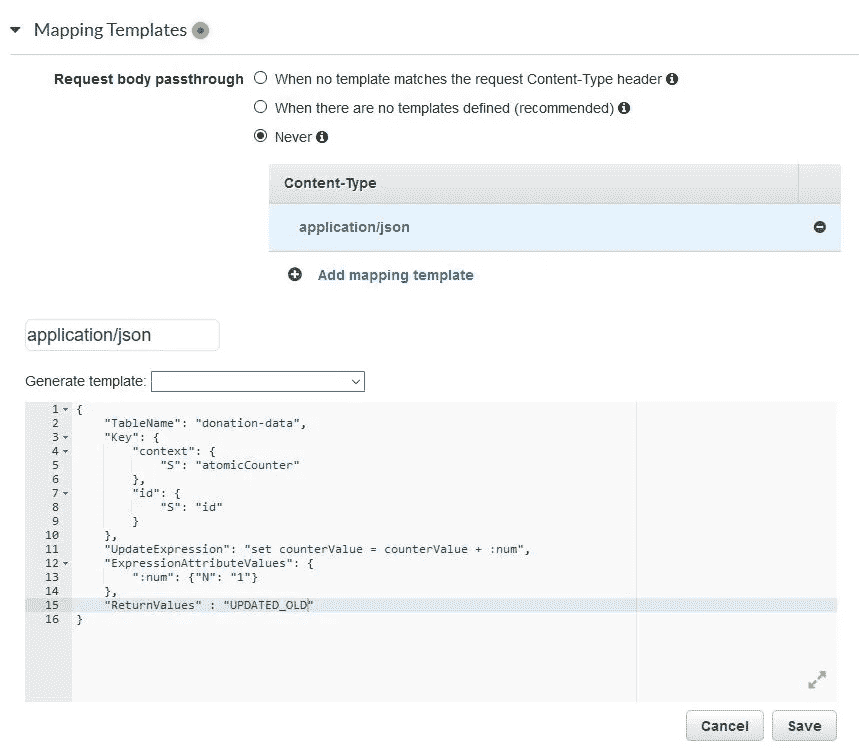
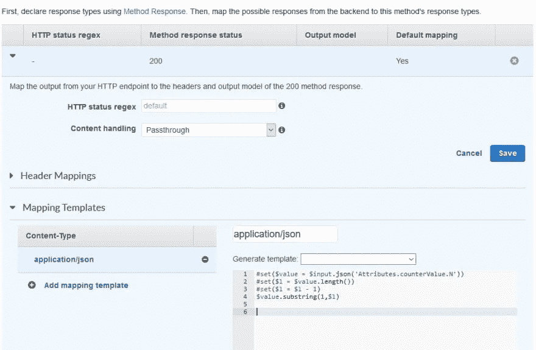

# 带有 DynamoDB 和 API 网关的简单原子计数器

> 原文：<https://itnext.io/simple-atomic-counter-with-dynamodb-and-api-gateway-e72115c209ff?source=collection_archive---------1----------------------->



web 应用程序通常需要一个中央计数器。我们有几个简单的用例，比如注册应用程序的成员 id。或者在销售应用程序上收集的金额——有很多我们都见过的。我们必须确保并发更新不会发生冲突，并且在此过程中不会丢失任何数据。当我们的应用程序在云上扩展得更大时——有数百万并发用户，这个问题会变得更加严重。

在大规模应用中，最好避免这样的用例。建议我们使用不需要原子计数器的设计——例如使用 UUID 而不是递增的数字。但是有些时候我们只需要计数器。当我发现自己处于这种情况时，这里有一个我用过的解决方案。它基于 API 网关— Dynamo DB 集成。它具有非常好的响应时间和最低的成本。

# DynamoDB

我们都知道什么是 DynamoDB。对于那些不知道，它是由 AWS 提供的美妙的无服务器 NoSQL 数据库。它可以无缝扩展到巨大的容量和吞吐量，保持极快的操作速度，延迟仅为个位数毫秒。它是任何人的理想数据库—初创企业或企业。DynamoDB 确保了所有更新的最终一致性。但是也有一种方法可以获得原子更新。

遵循“一个应用—一个表格”的理念，在表格中创建一个新项目。您可以根据您的数据设计选择“primaryKey”字段。

```
{
   primaryKey: "atomicCounter",
   counterValue: 0
}
```

所以我们有一个从 0 开始的计数器。现在，我们将它配置为自动递增并返回数字。DynamoDB API 提供了一种方法来实现这一点。为了调用它，我们必须配置 API 网关

# API 网关

API 网关是一种多功能服务，用于配置 API 并将其导出到外部世界。我们可以用它来调用 Lambda 函数，或者直接调用特定的 AWS 服务。我们将使用后者来直接调用 DynamoDB。

因此，我们转到 [API 网关控制台](https://dev.to/solegaonkar/!https://ap-south-1.console.aws.amazon.com/apigateway/)，创建一个新的 Rest API——或者只是在您现有的应用程序 API 中创建一个新的资源/方法。创建一个新的 API 和 resource，然后在其中添加一个 GET 方法。我们也可以使用帖子。但是，GET 更优雅，因为我们只获得计数器而不提供任何东西。

接下来，我们配置 API 集成来调用 DynamoDB。

# 请求集成


接下来，我们为请求提供一个集成映射。我们在这里完成—在请求集成页面的底部。



```
UpdateItem
{
    "TableName": "donation-data",
    "Key": {
        "context": {
            "S": "atomicCounter"
        },
        "id": {
            "S": "id"
        }
    },
    "UpdateExpression": "set counterValue = counterValue + :num",
    "ExpressionAttributeValues": {
        ":num": {"N": "1"}
    },
    "ReturnValues" : "UPDATED_OLD"
}
```

# 响应集成

类似地，我们必须将输出映射到响应上。单击响应集成链接，并将此映射添加到那里



```
#set($value = $input.json('Attributes.counterValue.N'))
#set($l = $value.length())
#set($l = $l - 1)
$value.substring(1,$l)
```

# 部署

我们已经完成了 API 的配置。现在，单击 Deploy API，选择一个阶段，就可以开始测试了。

从 Postman 调用 API。每次你调用它，你会看到数量增加。

我们使用的更新操作是原子性的，因此我们将始终拥有来自 API 的唯一编号。注意响应时间——一位数毫秒！