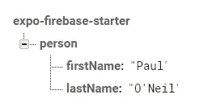
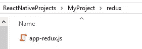

# React Native 中简单的 Firebase/Redux 集成

> 原文：<https://itnext.io/simple-firebase-redux-integration-in-react-native-32f848deff3a?source=collection_archive---------1----------------------->


[*点击这里在 LinkedIn 上分享这篇文章*](https://www.linkedin.com/cws/share?url=https%3A%2F%2Fitnext.io%2Fsimple-firebase-redux-integration-in-react-native-32f848deff3a)

在本教程中，我们将学习如何将 Redux 添加到 React 本机应用程序中，以及如何将其与 Firebase 集成。

在本教程结束时，您应该能够将数据从 Firebase 提取到 Redux 中，实时更新这些数据，并在屏幕和组件中显示这些数据。

# 设置

要使用本教程，您应该有一个正在运行的 React 本地应用程序，并且已经初始化了 Firebase。

# 安装库

我们将使用 3 个 Redux 库，您可以通过在项目目录的终端中键入以下命令来安装它们:

```
npm install -S redux react-redux redux-thunk
```

# 创建一些示例数据

前往 [Firebase 控制台](https://console.firebase.google.com/)并添加一些样本数据。



如果已经有数据，可以使用现有数据！

# 基本冗余基础设施

声明:这是我个人为简单应用程序设置 Redux 的方式。其他教程通常说要把不同的部分分成单独的文件。为了方便起见，我喜欢把所有东西都放在一个文件里。

## 创建 Redux 文件:

创建一个名为`redux`的新文件夹，并在其中创建一个名为`app-redux.js`的文件。



## 导入库:

在`app-redux.js`里面，导入几个我们很快会用到的 Redux 库。把火焰基地也扔进去，因为我们最终会需要它的。:)

```
import { createStore, applyMiddleware } from 'redux';
import thunkMiddleware from 'redux-thunk';
import * as firebase from 'firebase';
```

## 设置初始状态:

在那下面，为你的*初始状态*创建一小段代码:

```
//
// Initial State...
//const initialState = {
  personData: { },
}
```

这个数据结构代表了应用程序的初始状态。通常情况下，您会希望它为空或填充默认值。在我们的例子中，我们将从 Firebase 加载数据，所以我们只需要一个空对象作为开始。

## 设置减速器:

为您的*减速器*创建另一段代码:

```
//
// Reducer...
//const reducer = (state = initialState, action) => {
  return state;
}
```

减速器将接受一个`action`，并根据动作告诉它做的事情返回一个新的`state`。现在，由于我们没有任何动作，我们将返回原来的状态。

## 安装存储:

为您的*商店*创建另一段代码:

```
//
// Store...
//const store = createStore(reducer, applyMiddleware(thunkMiddleware));
export { store };
```

`store`是一个数据存储库，可以记录你的所有数据。注意，我们传入了之前创建的`reducer`。我们也在应用`thunkMiddleware`，稍后会有用。最后，我们`export`了`store`，这样我们就可以在其他文件中使用它。

# 将你的应用连接到 Redux

现在我们有了基本的 Redux 框架设置，我们需要将它连接到我们的应用程序。打开您的`App.js`并导入以下内容。注意，我们正在导入刚刚创建的`store`。

```
import { Provider } from 'react-redux'
import { store } from './redux/app-redux';
```

用`Provider`组件包围你的应用程序内容，并用我们的`store`提供给它。这是我的样子:

这将使您的应用程序可以访问我们创建的 Redux 商店。

# 将您的屏幕连接到 Redux

现在，我们需要将我们各自的屏幕连接到 Redux。您不必对所有的屏幕都这样做，只需要对那些您想访问 Redux 数据的屏幕这样做。

## 导入库:

首先，从`react-redux`导入`connect`:

`import { connect } from 'react-redux';`

## 创建存根函数:

然后，创建这两个函数(我们将在后面填充):

```
const mapStateToProps = (state) => {
 return { };
}const mapDispatchToProps = (dispatch) => {
 return { };
}
```

## 更改导出:

我的屏幕都被设置成这样导出:

`export default class HomeScreen extends React.Component {`

所以我们需要移除`export default`来得到这个(我们将把它导出到其他地方):

`class HomeScreen extends React.Component {`

## 通过连接导出:

最后，在文件的最底部，像这样导出您的类:

```
export default connect(mapStateToProps, mapDispatchToProps)(HomeScreen);
```

我们调用`connect`并传入我们创建的两个函数。然后我们将屏幕传递给那个调用的结果。

## 最终屏幕:

作为参考，我的屏幕看起来是这样的:

现在您的屏幕已经连接到 Redux，但是我们稍后会回来检索并显示数据。

# 行动

现在，我们将创建一些可以在 Redux 中使用的动作来更新我们的数据。

## 标准操作:

回到`app-redux.js`，为`Action Creators`创建另一段代码。`Action creators`发送到您的`reducer`并包含有关如何更新`state`的信息。这里我们将创建一个可以更新我们的`state.personData`对象的`action creator`。我们还将`export`它，以便在其他文件中可以访问它。

注意:你可以在返回对象中放入任何你想要的数据。但是总是有一个`type`属性是一个 Redux 约定。

```
//
// Action Creators
//const setPersonData = (personData) => {
  return {
    type: "setPersonData",
    value: personData
  };
};export { setPersonData };
```

由于`action creators`被发送到`reducer`，我们需要更新减速器来处理这个动作。向上滚动到您的`reducer`并像这样更新它:

```
const reducer = (state = initialState, action) => {
  switch(action.type) {
    case "setPersonData": 
      return { ...state, personData: action.value }; default: 
      return state;
  }
}
```

看我们在`action.type`上`switch-ing`怎么样？这就是为什么我们应该在我们的`action creators`中包含一个`type`酒店。

注意，当`type`为`"setPersonData"`时，我们返回一个新的`state`，其中`personData`变为`action.value`。这将更新我们的状态和应用程序中访问该数据的任何地方。

## Thunk:

按说，`action creators`只能返回对象。但是既然我们应用了`thunkMiddleware`，我们也可以有返回函数的`action creators`。这对于没有立即可用数据的操作(例如异步网络调用)或实时更新的数据(例如 Firebase 实时更新)来说至关重要。

让我们创建另一个动作来实时观察我们的 Firebase 数据。

```
const watchPersonData = () => {
  return function(dispatch) {
    firebase.database().ref("person").on("value", function(snapshot)
    { 
        var personData = snapshot.val();
        var actionSetPersonData = setPersonData(personData);
        dispatch(actionSetPersonData); }, function(error) { console.log(error); });
  }
};
```

这里，我们返回一个作为参数给出的`dispatch`的`function`。在函数内部，我们为数据库中的`"person"`节点调用 Firebase 的实时函数`.on("value")`。任何时候该函数成功(我们的数据被更新的时候)，我们将从`snapshot.val()`获取数据，得到一个`setPersonData`动作创建器，然后`dispatch`该动作到我们的`reducer`(它将更新`state`)。如果函数失败，我们只需在控制台中记录错误。

听起来很多吗？的确如此，但是在下一节中看看它们是如何联系在一起的。

PS:别忘了`export`你的新动作创作者！

`export { setPersonData, watchPersonData };`

# 在屏幕上查看数据

回到我们的`HomeScreen.js`，我们需要更新我们最初创建的那些函数，`mapStateToProps`和`mapDispatchToProps`。这些函数实际上会将`props`添加到您的屏幕/组件中，因此您可以访问它们来呈现数据。

在更新它们之前，让我们先`import`一下我们刚刚创建的`watchPersonData`动作创建器。

`import { watchPersonData } from './../redux/app-redux';`

## mapStateToProps:

现在更新`mapStateToProps`，让您的屏幕可以访问`state.personData`:

```
const mapStateToProps = (state) => {
  return { 
    personData: state.personData
  };
}
```

这将获取`state`(来自 Redux)并在您的屏幕中创建一个名为`personData`的属性，其值来自`state.personData`。现在，在你屏幕的任何地方，你都可以显示`personData`。试试吧！

```
<Text>{this.props.personData.firstName}</Text>
<Text>{this.props.personData.lastName}</Text>
```

## mapDispatchToProps:

现在唯一的问题是，我们从来没有开始观察数据！

更新您的`mapDispatchToProps`函数，向您的屏幕添加一个名为`watchPersonData`的属性。

```
const mapDispatchToProps = (dispatch) => {
  return { 
    watchPersonData: () => dispatch(watchPersonData())
  };
}
```

这现在向您的屏幕添加了一个名为`watchPersonData`的函数属性，当被调用时，它将`dispatch`执行`watchPersonData`操作(然后调用 Firebase API 来观察我们的`"person"`节点中的数据。

现在，在屏幕的构造函数中，调用`this.props.watchPersonData()`。

## 测试:

通过运行您的应用程序来测试它。您现在应该会看到屏幕上显示的`personData`。进入 Firebase 并更改数据，然后返回到您的应用程序。您应该会看到更新的数据！

# 完整代码参考

## App.js

## HomeScreen.js

## app-redux.js

# 参考

## 视频教程:

## Redux 库:

[](https://redux.js.org/) [## 读我

### 如果不使用模块捆绑器，也没问题。npm 包包括预编译的生产和开发…

redux.js.org](https://redux.js.org/) [](https://github.com/reactjs/react-redux) [## reactjs/react-redux

### react-Redux-Redux 的官方 React 绑定

github.com](https://github.com/reactjs/react-redux) [](https://github.com/gaearon/redux-thunk) [## gaearon/redux-thunk

### redux-thunk - Thunk 中间件

github.com](https://github.com/gaearon/redux-thunk)