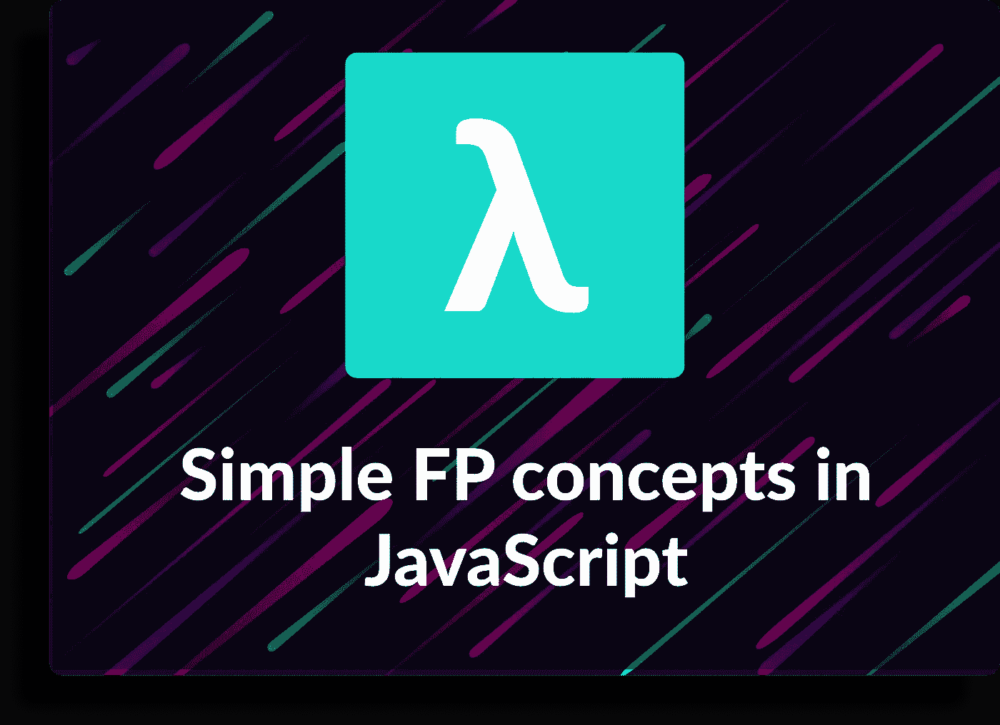
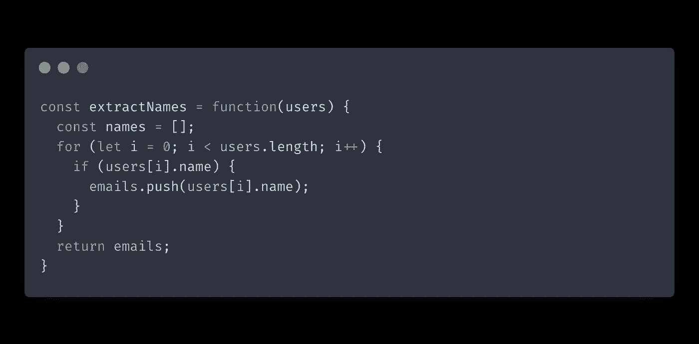
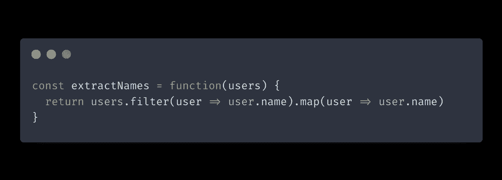
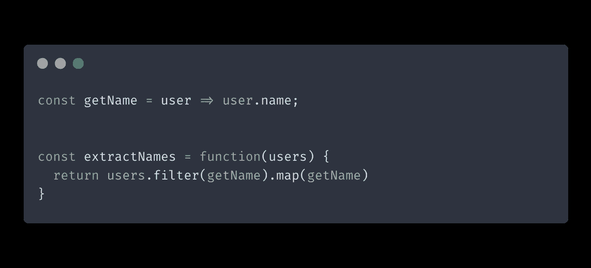
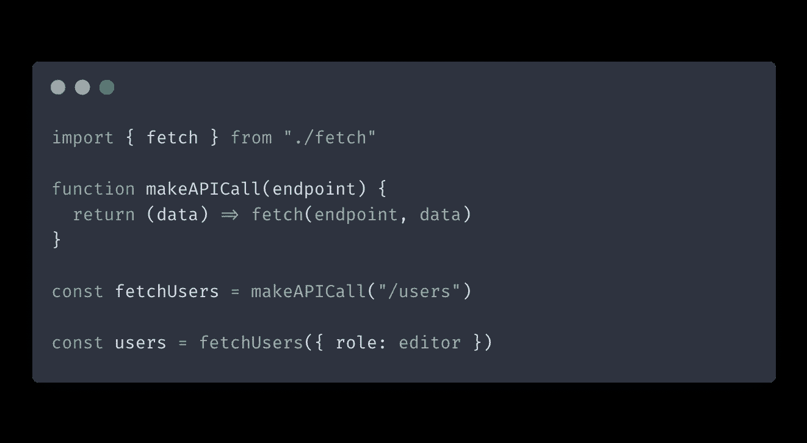

# JavaScript 中简单的函数式编程概念

> 原文：<https://itnext.io/simple-functional-programming-concepts-in-javascript-d6204324e0df?source=collection_archive---------9----------------------->

学习函数式编程可能具有挑战性。它涉及到单子、函子等概念。最重要的是，你的团队必须应用函数式编程来获得好处。

然而，有些课程你可以开始应用，而不需要理解更高级的概念，也不需要整个团队的认同。

这些来自函数式编程的技巧很容易理解，您可以马上开始使用它们来改进您的代码。

# 转换漏斗

这有助于从转换数据的漏斗而不是一组命令性操作的角度来考虑您的函数。输入进来，然后应用一组转换并返回转换后的输出。

这也是函数链发挥作用的地方。函数链接是指通过使用前一个函数的输出来调用下一个函数，从而将一行中的多个函数链接起来。这类似于面向对象编程中的[方法链](https://en.wikipedia.org/wiki/Method_chaining#:~:text=Method%20chaining%2C%20also%20known%20as,to%20store%20the%20intermediate%20results.)。

函数链通常会使你的代码更加整洁，减少重复。它在每一步都删除了额外的变量，这样你就不用为这些变量命名了。函数链通常对集合的转换非常有用，比如数组。

让我们来看看解决同一个问题的两种方法。让我们从使用`for`循环的命令式开始:

现在让我们看看使用函数链重写的同一个函数:

正如你所看到的，函数链接产生了更紧凑的代码，我们避免了中间的`names`变量。

不是所有的函数都适合函数链，这没关系。尽可能地应用它，避免为了适应模式而过度设计代码。

# 纯函数

纯函数是在给定相同输入的情况下总是返回相同输出的函数。另一个与众不同的特点是它们在功能范围之外不会引起[副作用](https://en.wikipedia.org/wiki/Side_effect_%28computer_science%29)。

纯函数与[不变性](https://en.wikipedia.org/wiki/Immutable_object#:~:text=In%20object%2Doriented%20and%20functional,modified%20after%20it%20is%20created.&text=Other%20benefits%20are%20that%20they,higher%20security%20than%20mutable%20objects.)的概念密切相关。由于变异输入对象显然是一种副作用，如果您希望您的函数是纯净的，您应该避免它。解决这个问题的一个方法是在改变输入参数之前复制它们。这样，原始输入参数保持不变。

纯函数的优点:

*   可靠性——在给定相同输入的情况下，您总是可以依靠纯函数返回相同的输出。
*   可测试性——因为纯函数不会产生任何副作用或改变输入，所以您可以在测试中多次运行它们，而不用担心状态。

# 无点风格

无点风格意味着函数的参数在被调用时不会被显式提及。

您通过与转换数据的更简单的函数组合来创建函数。因此，您的函数更加模块化，您的代码最终更具声明性。

本质上，您不需要描述函数如何工作，只需要描述它对输入做了什么。它还避免了可能导致混乱或错误的临时变量。

当与函数链接结合使用时，无指针风格工作得非常好。

让我们重写前面的函数链示例，并应用无指针样式:

注意我们是如何传递`getName`函数来映射和过滤，而没有显式指定它的输入参数。

当你发现无要点风格时，可能会很想开始到处使用它来使你的代码简洁。只要记住它也伴随着权衡。

如果走得太远，无指针会损害代码的灵活性。在某些情况下，由于微小的需求变化，您可能不得不完全重构您的功能。

# Currying

Currying 是一种转换技术，它将带有多个参数的函数转换成链式函数，每个函数接受一个参数。这样做允许通过提前应用一些参数来创建更专门化的函数。

当您有一个带有多个参数的函数，并且您发现自己多次重复一些参数时，您可以手动创建一个更专用的函数。

# 结论

在这篇文章中，我们回顾了一些你可以立即开始应用的函数式编程概念。

诚然，这篇文章的例子是为了让概念更容易理解。例如，我们手动创建了一个特定功能的定制版本，该版本通常无法扩展。

借助函数式编程实用程序库，例如 [Rambda.js](https://ramdajs.com) ，将函数式编程集成到您的项目中会容易得多。在许多其他有用的实用程序中，Rambda.js 有一个`curry`函数，可以帮助创建函数的可定制版本。

*原载于 2021 年 9 月 28 日 https://isamatov.com***。**