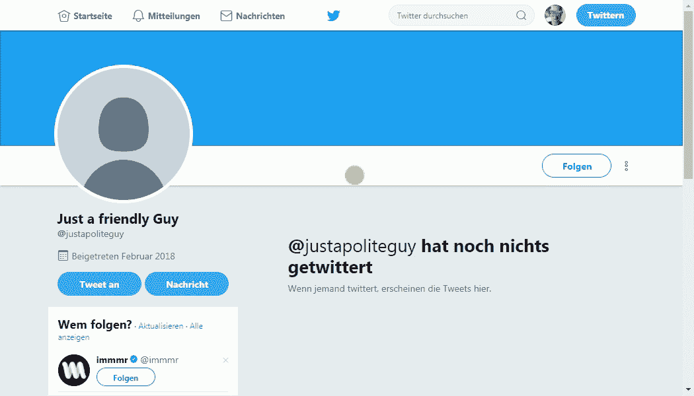
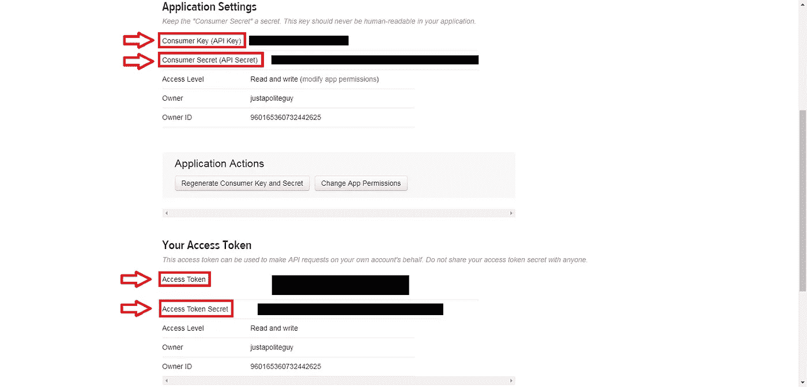
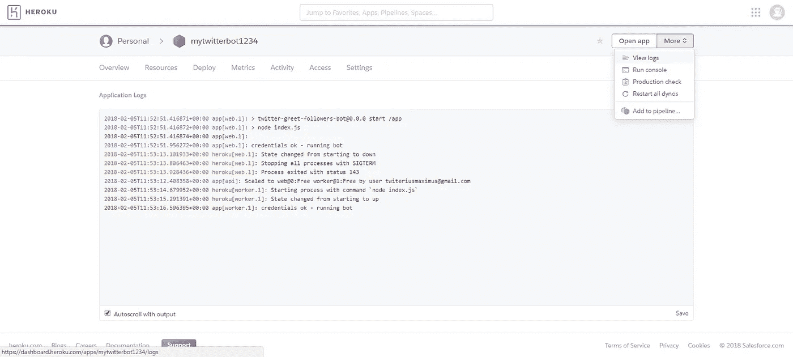

# 简单的 Javascript Twitter 机器人，以友好的信息问候新的追随者

> 原文：<https://itnext.io/simple-javascript-twitter-bot-to-greet-new-followers-with-a-friendly-message-f9ac7f589d2d?source=collection_archive---------0----------------------->

## Javascript — Twitter Api 教程



机器人的快速演示

[*点击这里在 LinkedIn* 上分享这篇文章](https://www.linkedin.com/cws/share?url=https%3A%2F%2Fitnext.io%2Fsimple-javascript-twitter-bot-to-greet-new-followers-with-a-friendly-message-f9ac7f589d2d)

如果你在 twitter 上很活跃，你可能会注意到有些人在你关注他们之后会通过机器人立即给你发问候信息**。如果您想告诉新的关注者他们可以在您的订阅源上找到什么样的内容，这可能特别有用。如果你的主要活动在不同的平台上，你可能也想让他们知道在哪里可以找到你，并给他们发送一个链接到你的个人资料。**

在本教程中，我将向你展示如何通过**几个简单的步骤**建立这样一个机器人。现在，如果你对编码不感兴趣，只想让机器人尽可能快地运行，你可能想直接跳到 [**库**](https://github.com/justadudewhohacks/twitter-greet-followers-bot) 并按照说明进行操作。然而，如果你对如何构建任何类型的 twitter 机器人感兴趣，我强烈推荐你阅读这篇文章。

# 它是如何工作的？

我们所要做的就是编写一些 javascript，调用 twitter API，并将代码推送给 heroku。你唯一需要的是 twitter API 的凭证和一个免费的 heroku 账户。

## 获取您的 Twitter API 证书

如果你还没有，你可以在这里 用你的 twitter 账号 [**创建一个 twitter 应用。请注意，为了使用 twitter API，您必须通过提供您的手机号码来验证您的 twitter 帐户。给你的应用起个名字，提供描述和网址(不必是现有的网址，你可以在这里输入类似*https://whatever.com*的东西)。切换到标签 ***键和*** 访问令牌，向下滚动点击 ***创建我的访问令牌*** 。就这样，现在您应该有了您的消费者密钥和消费者密码，以及您的访问令牌和访问令牌密码:**](https://apps.twitter.com/)



## **建立一个 heroku 账户**

只需创建一个 [**免费账号**](https://signup.heroku.com/) ，下载 heroku [**命令行界面**](https://devcenter.heroku.com/articles/heroku-cli#download-and-install) 。不需要输入任何信用卡信息。

# 使用 Twitter API

构建一个 twitter 机器人实际上很容易实现，至少比我预期的要容易。Twitter 免费提供了一个 **REST API** 和一个**流媒体 API** 。REST API 提供了各种各样的功能，比如搜索和过滤推文、推文和转发、收藏、关注他人、发送直接消息等。使用流媒体 API，您可以打开与其中一个流媒体端点的连接，并在**实时**获取推文或收听事件，这正是我们需要在有人跟踪我们时得到通知的内容。有兴趣的可以看看 twitter [**API 文档**](https://developer.twitter.com/en/docs) 。

我们的机器人将非常简单，只包含几行代码。实际上，我们唯一要做的就是通过一个流来监听事件，一旦有用户关注我们，就直接发送消息。听起来很简单，但为了更简单，我们将使用 [**twit**](https://www.npmjs.com/package/twit) ，这是一个 npm 包，允许我们通过 javascript 轻松地与 twitter API 交互。

# 给推特机器人编码

使用 **twit** ，我们可以如下设置 twitter 客户端:

不要在你的源代码中放入任何种类的凭证。我们将凭证作为环境变量传递，稍后我们将为 heroku 配置这些环境变量。

接下来我们要做的是编写一些助手函数来验证我们的凭证是否有效:

并且用于向用户发送直接消息:

**重要！！！**我们将始终使用字符串版本 ***id_str*** 的用户和 tweet ids，因为 javascript 无法处理大的整数值，因此无法将 id 表示为数字。

要发送直接消息，我们必须指定收件人的 id 和文本，这是我们的问候消息:

您可以调整模板来插入您的问候语。此外，如果你知道他们的 **utf-16 代码**，你可以发送表情符号(第 6 行)。查看这个网站 来查找表情符号的代码。

现在一切就绪，我们可以向**用户**端点打开一个流:

一旦我们确保了我们的凭证是有效的，我们将向流中添加一个监听器来捕捉任何 **follow** 事件。当某个用户关注我们以及我们关注其他人时，将触发 follow 事件。显然，我们只想在第一种情况下发送问候消息，因此我们检查该事件的发起者的用户 id(***源*** )是否不是我们自己的 ***account_id*** 。方便的是，我们账户的 id 从 ***账户/verify_credentials*** 端点返回。

就这样了。我们现在可以把我们的代码推到 heroku。

# 将机器人部署到 Heroku

如果您已经克隆了存储库，您可以简单地将 cd 放入克隆的文件夹中，否则请确保在您的工作目录中初始化一个新的 git 存储库:

```
git init
```

然后，我们可以从 CLI 创建一个 heroku 应用程序。这将友好地将别名为 ***heroku*** 的遥控器添加到您的 heroku 应用程序存储库中:

```
heroku app:create mytwitterbot1234
```

接下来我们要做的是配置 heroku 使用我们的 twitter API 凭证。要从 CLI 设置环境变量，请使用以下命令并填写您的凭据:

```
heroku config:set consumer_key=xxx
heroku config:set consumer_secret=xxx
heroku config:set access_token=xxx
heroku config:set access_token_secret=xxx
```

现在，您可以提交所有更改，例如编辑问候消息并将代码推送到 heroku，heroku 将构建并运行您的应用程序:

```
git add .
git commit -m "changed the greeting message"
git push heroku master
```

## 配置工作动态

默认情况下，任何部署到 heroku 的应用程序都将在 web dyno 中运行，这意味着您可以从外部通过 http 请求访问它。显然，我们不希望这样，我们只是希望我们的机器人作为后台任务运行。因此，我们将关闭 web dyno，并为我们的应用程序启动一个 worker dyno:

```
heroku ps:scale web=0 worker=1
```

为了生成 worker dyno，还需要将一个 Procfile 推送到 heroku 存储库中。只需在该文件中指定以下启动命令，就可以开始了:

```
worker: node index.js
```

如果一切顺利，你的机器人应该正在运行。你可以通过跟随来测试你的机器人:[**justapoliteguy**](https://twitter.com/justapoliteguy)，他会跟着你回去。检查您的问候信息是否已发送。您可以通过取消关注和再次关注来重试任意多次。

# 解决纷争

如果你的机器人似乎不工作，你可以打开你的应用程序的 heroku 仪表板，并通过点击右上角的**更多**按钮导航到**查看日志**:



如果您看到输出**凭证 ok——运行 bot** ，bot 应该已经启动，正在观察新的追随者。由于日志只显示几行，您也可以将日志转储到文本文件中:

```
heroku logs -a mytwitterbot1234 >> logs.txt
```

您可能需要检查的另一件事是，您的凭据是否设置正确。导航到**设置**选项卡，点击**显示配置变量**。在此检查并编辑您的凭据。

*如果你喜欢这篇文章，欢迎留下一些掌声，关注我的媒体和/或* [*twitter*](https://twitter.com/justadudewhohax) *:)。也可以随意在* [***github 资源库***](https://github.com/justadudewhohacks/twitter-greet-followers-bot) *上留下一颗星星。敬请关注更多教程！*