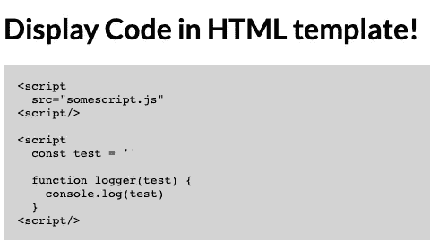
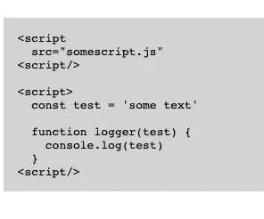

# 在 Html 中显示代码片段的简单方法——Angular

> 原文：<https://itnext.io/simple-method-to-display-code-snippets-in-html-angular-57b6edfa2f00?source=collection_archive---------1----------------------->



有几个包可以帮助显示 Angular 项目的 Html 代码片段。如果你不喜欢使用它们，这里有一个简单的方法，你可以使用。

演示:[https://stackblitz.com/edit/display-code-in-html-angular](https://stackblitz.com/edit/display-code-in-html-angular)

**使用前置&代码标记**

> 标签定义了预格式化的文本。
> 
> `<pre>`元素中的文本以固定宽度的字体显示，文本保留空格和换行符。文本将完全按照 HTML 源代码中的内容显示。
> 
> `<code>`标签用于定义一段计算机代码。里面的内容以浏览器默认的等宽字体显示。

因此，通过使用

```
 & ，您可以显示一个代码片段，比如 function。然而，有一个问题。
```

```
// app.component.ts
code = `
  <script
    src="somescript.js"
  <script/> <script>
    const test = '' function logger(test) {
      console.log(test)
    }
  <script/>
`// app.compoment.html
<pre>
   <code>{{code}}</code>
</pre>
```

这是一点点造型的结果。



我想这就是在 Angular 项目的 HTML 模板中显示代码片段所需的全部内容。