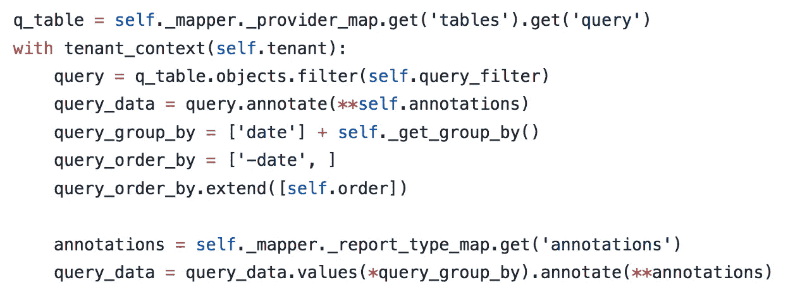
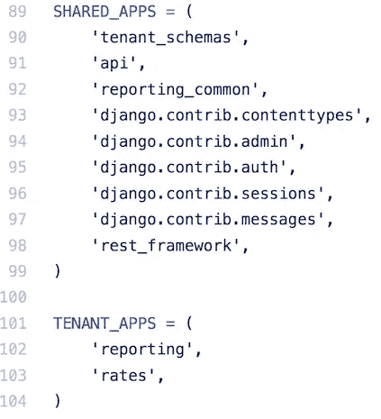
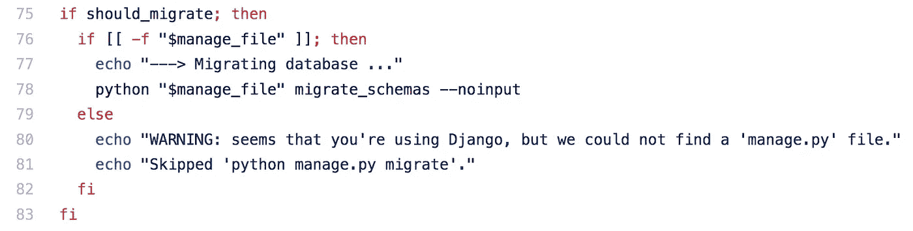
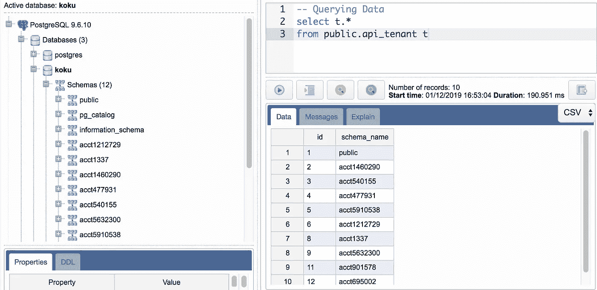

# Django 在 OpenShift 上运行的简单多租户

> 原文：<https://itnext.io/simple-multi-tenancy-with-django-running-on-openshift-b5859a94dd52?source=collection_archive---------1----------------------->

塞缪尔·泽勒在 [Unsplash](https://unsplash.com?utm_source=medium&utm_medium=referral) 上的照片

对多租户应用的需求并不新鲜，但是随着[软件即服务(SaaS)产品](https://financesonline.com/2018-saas-industry-market-report-key-global-trends-growth-forecasts/)的日益流行，如果你不认为这是一个核心需求，那你就错了。 [*多* - *租用*](https://en.wikipedia.org/wiki/Multitenancy) 在软件架构中，一个应用的单个实例服务于多个客户(每个客户称为一个*租户)*。客户可以是整个公司，或者是一个业务部门，或者是开发商 Todd。

照片由 [rawpixel](https://unsplash.com/@rawpixel?utm_source=medium&utm_medium=referral) 在 [Unsplash](https://unsplash.com?utm_source=medium&utm_medium=referral) 上拍摄

有许多方法可以解决这个问题。最常见的关注点是为租户存储的数据。方法包括从每个客户一个数据库到带有指定客户的列的共享表。利用数据库或表命名约定(即客户前缀等)允许开发人员继续以单个客户为中心进行思考，并在一定程度上将数据与其他客户数据隔离开来。基于客户列的方法基本上就是在所有内容中添加一个 WHERE 子句。每种都有自己的缺点；数据库创建可能需要很长时间，命名约定可能会增加代码的复杂性，并且基于列的方法可能会很快遇到性能问题，因为所有的客户数据都被强制放在一起。

# 多租户和后迁移 SQL

马修·斯皮特里在 [Unsplash](https://unsplash.com?utm_source=medium&utm_medium=referral) 拍摄的照片

PostgreSQL 是 [Django](https://www.djangoproject.com/) 应用程序最常用的数据库。 *Postgres* 有一个特性， [schemas](https://www.postgresql.org/docs/current/ddl-schemas.html) ，它利用了数据库/表驱动方法的优点，同时解决了一些复杂性和性能问题。模式提供了数据库的行为，但是创建起来更快。使用模式，每个租户的表可以是相同的，这降低了复杂性，但也可以与租户无关的共享数据一起驻留在同一个数据库中。这种数据分离还允许您避免基于列的方法的缺点，这种方法可能会遇到性能问题，并且还会带来一个问题，即只有少量数据的租户的查询速度会受到所有其他租户数据的影响。虽然模式是一个很好的特性，但它仍然不能让多租户变得简单。

幸运的是，开源社区已经帮助贡献了一些库，这些库确实使得使用*PostgreSQL*模式进行开发变得简单了。现在有各种各样的[库](http://books.agiliq.com/projects/django-multi-tenant/en/latest/third-party-apps.html)可用；我们的团队使用了 [django-tenant-schemas](https://github.com/bernardopires/django-tenant-schemas) 来帮助解决这个问题。 *django-tenant-schemas* 很好地融入了 *Django* 的生命周期。模式创建触发迁移运行，并允许您维护正常的 *Django* 开发过程。该模块还提供了一个[上下文管理器](http://book.pythontips.com/en/latest/context_managers.html)，使得选择想要与之交互的模式变得简单。

用于访问租户数据的上下文管理器

此外，您可以通过指定配置来区分共享数据和租户数据。

# Django 租户模式的应用

虽然[django-tenant-schemas 的文档](https://django-tenant-schemas.readthedocs.io/en/latest/index.html)相当不错，但我们并没有使用他们现成的标准实现。默认实现使用基于域 URL 创建租户架构的概念；例如，假设每个租户都有自己的子域来访问数据(即{tenant}.myapp.io)，并从该模式中导出模式名。虽然子域是一个很好的模式，但它可能不适合您的需要；它不符合我们的要求。

在我们的例子中，租赁可以由提供帐户信息的标题中的数据来确定。幸运的是，这是一个足够常见的模式，我们还找到了[示例文档](https://django-tenant-schemas.readthedocs.io/en/latest/advanced_usage.html#example-determine-tenant-from-http-header)来处理这个流程。虽然例子很多，但看到一个[工作应用](https://github.com/project-koku/koku)稍微复杂一点，我们有[多个共享应用和租户应用](https://github.com/project-koku/koku/blob/master/koku/koku/settings.py#L89)可能会有帮助。

共享和特定于租户的模式配置

您还可以深入我们的[租户中间件](https://github.com/project-koku/koku/blob/master/koku/koku/settings.py#L115)来查看我们的流程，不仅是[基于标题信息](https://github.com/project-koku/koku/blob/master/koku/koku/middleware.py#L56)创建租户，而且[创建与请求相关联的客户和用户对象](https://github.com/project-koku/koku/blob/master/koku/koku/middleware.py#L91)。

# 在 OpenShift 上部署源到映像(S2I)

既然我们已经探索了多租户 Django 应用程序的构建模块，我们必须考虑在为项目实施新的方面/功能时对持续部署和数据迁移的影响。如果你是一个经验丰富的 Django 开发者，你应该熟悉迁移流程。如前所述， *django-tenant-schemas* 适合于 *Django* 的生命周期，例如提供它自己的命令 [migrate-schemas](https://django-tenant-schemas.readthedocs.io/en/latest/use.html#migrate-schemas) ，以跨模式应用迁移。有了这些组件，如何最好地将它们融入您的持续部署策略？

 [## 如何创建一个 S2I 建设者形象-红帽 OpenShift 博客

### 源到图像(S2I)是一个独立的工具，在创建生成器图像时非常有用。S2I 也碰巧…

blog.openshift.com](https://blog.openshift.com/create-s2i-builder-image/) 

[OpenShift](https://www.openshift.com/) 提供了一个名为[源到映像(s2i)](https://github.com/openshift/source-to-image) 的构建/部署机制，用于将基础映像与来自源代码控制的代码结合起来(就像 [GitHub](https://github.com/) )。源代码到映像支持执行由基础映像在代码源代码下载后触发的[汇编](https://github.com/project-koku/koku/blob/master/openshift/s2i/bin/assemble)和[运行](https://github.com/project-koku/koku/blob/master/openshift/s2i/bin/run)脚本的标准流程。如果深入研究这些脚本，您可以看到它是如何根据提供的源代码准备容器的。

使用 s2i 进行模式迁移

上面的脚本显示了使用***migrate _ schemas***命令对 *run* 脚本进行修改以支持租户迁移的阶段。有了这些，您就可以迁移数据库结构，并在连续部署设置中的共享模式和租户模式中添加新表。

租户模式运行示例

# 摘要

在这个故事中，我们强调了在软件设计中考虑多租户的必要性，以及一些常见的实现模式。在 *Django* 开发世界中，我们发现*PostgreSQL*提供了模式，这允许在常见模式及其缺点的上下文中采用平衡的方法。更重要的是，开源社区通过 Django T21 让模式的使用变得简单了。最后，我们考虑了 s2i 对 Openshift 的迁移和持续部署的影响，并探讨了必要的更新。