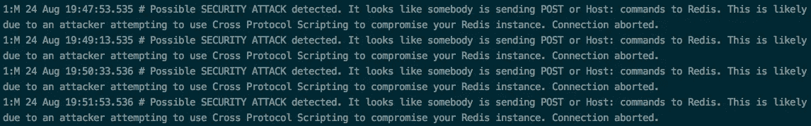
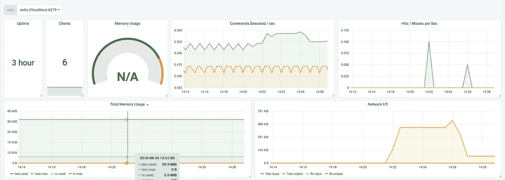

# Kubernetes 上的简单 Redis 缓存和普罗米修斯指标

> 原文：<https://itnext.io/simple-redis-cache-on-kubernetes-with-prometheus-metrics-8667baceab6b?source=collection_archive---------3----------------------->

我们有一个 ASP.NET 核心应用程序，它依靠 Redis 缓存来优化大负载响应。它被设计为容忍缓存故障(即它不能连接或获取键/值对)，这意味着非持久性和暂时不可用的缓存对我们来说不是什么大问题。所以我决定在我们的 Kubernetes 集群上部署一个基本的 Redis 实例，同时在 Elasticache Redis 上节省一些钱。下面是一个简单的教程来演示做了什么。

*我的 Redis 部署没有使用主/从复制策略。有关该部署策略的更多信息，Kubernetes 有一个很好的例子，您可以在这里找到***。**

# *配置演练*

*大多数神奇之处都在一个配置中。让我们来看看一些重要的部分。*

*Redis 配置*

## *修复安全警告*

*要注意的第一个重要的行是`prometheus.io/port`注释。您会注意到我们在服务和部署配置中都需要它。如果您没有包括这些 Prometheus 注释，您会注意到您的日志充满了以下安全警告:*

**

*这是因为 Prometheus 将试图清除您的服务所暴露的每个目标端口，并将向您的 Redis 实例在端口`6379`上发送`Host`命令。*

## *如果我们想要普罗米修斯的实际指标呢？*

*你可以在这里找到一个很棒的 Prometheus metrics exporter for Redis[，](https://github.com/oliver006/redis_exporter)我们把它部署在同一个 pod 上，把它作为边车运行。现在，有了您的`prometheus.io/port: "9121"`注释，我们将开始看到 Redis pod 的指标。在那里你还可以找到一个漂亮的 Grafana 仪表板。*

**

## *禁用透明大页面*

*您可能会得到一个类似于`WARNING you have Transparent Huge Pages (THP) support enabled in your kernel`的错误，这会影响您的 Redis pod 的性能。这一错误通过添加以下几行得以解决*

*你可以在这里了解关于这个错误[的更多信息。初始化容器是在主应用程序容器之前运行一些设置的好方法。在这种情况下，我们装入一个卷并运行一个简单的命令来禁用 THP。](https://stackoverflow.com/questions/45279477/disable-transparent-huge-pages-from-kubernetes)*

# *使用群集 DNS 解析服务 IP*

*对于主应用程序上的 Redis 连接字符串，我们所需要的就是下面的环境变量`REDISCONNECTIONSTRING: media-redis-svc.test.svc:6379`。你可以在这里阅读更多关于这个[的内容，但是基本格式是`{service-name}.{namespace}.svc`。*注意，Redis 服务可以部署在任何名称空间中。*](https://kubernetes.io/docs/concepts/services-networking/dns-pod-service/)*

*仅此而已。使用 Prometheus Metrics 将 Redis 部署到您的 Kubernetes 集群非常简单。你也可以`exec`进入你的吊舱，用`redis-cli monitor`监控 Redis。感谢阅读。*