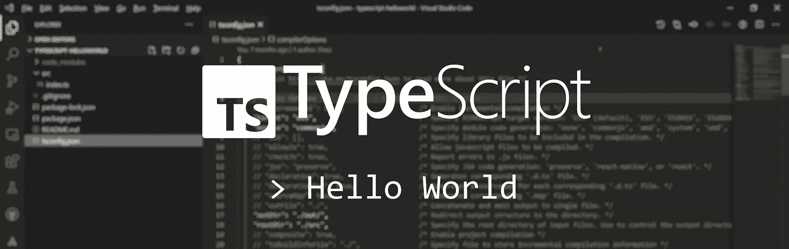
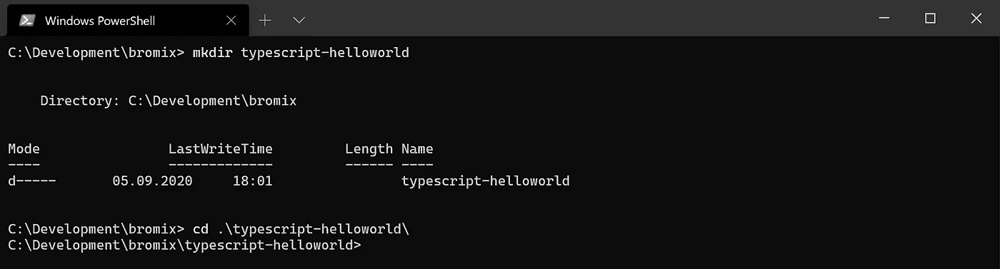
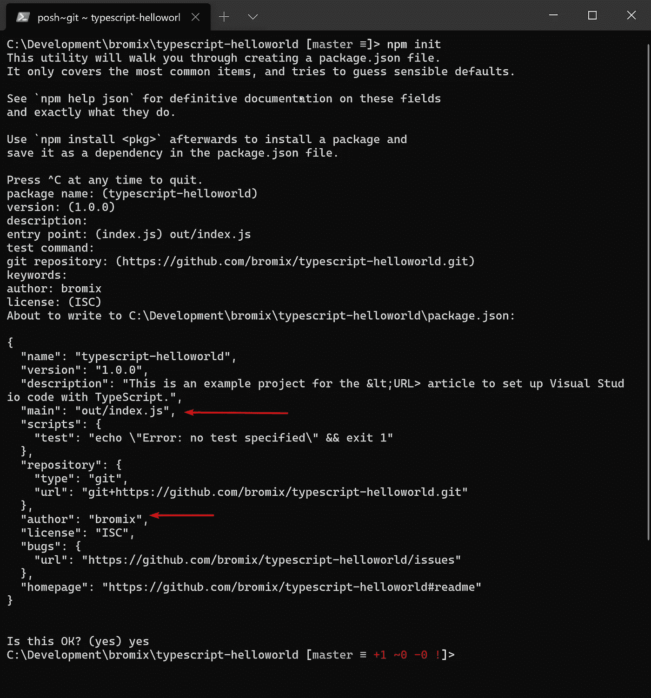
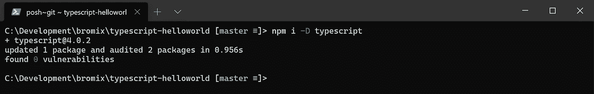
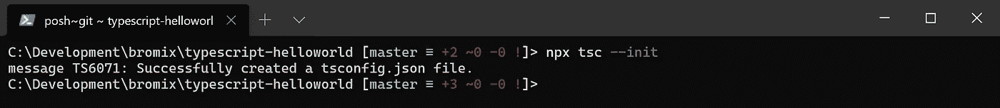
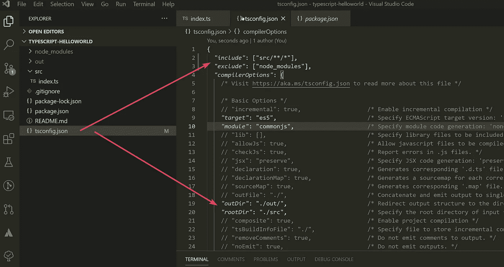
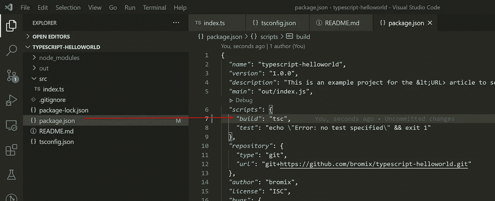
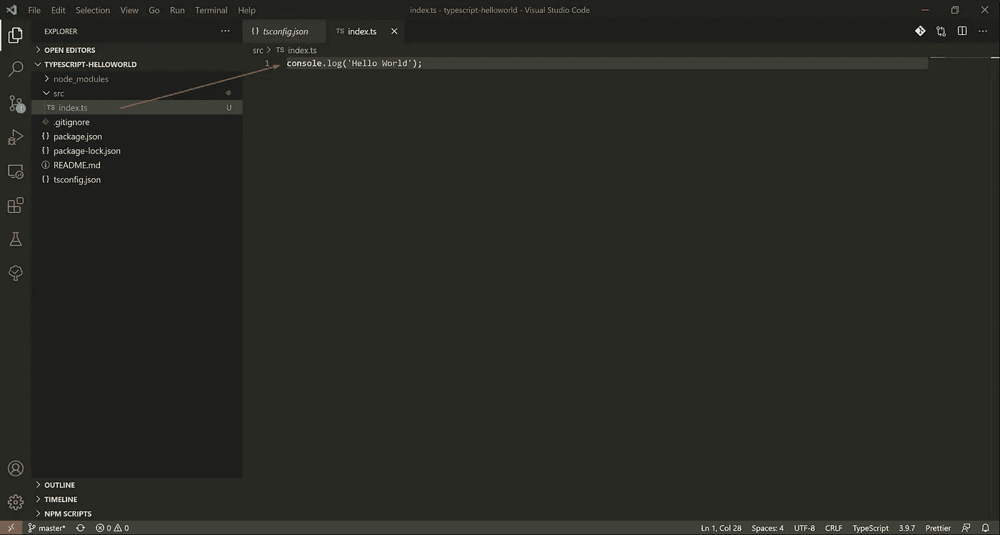
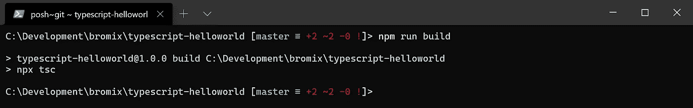
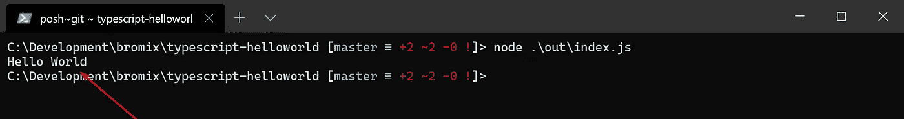

# 下一个 TypeScript 项目的简单设置

> 原文：<https://itnext.io/simple-setup-for-your-typescript-project-d96f66113b41?source=collection_archive---------1----------------------->

## 这是如何在 TypeScript 中建立一个项目的简单介绍。



## 2021 年 3 月 21 日更新

*   更新的次要依赖项

## *2021 年 1 月 17 日更新*

*根据你们在文章* [用 JEST in TypeScript](/testing-with-jest-in-typescript-cc1cd0095421) *中的反馈(感谢注释)，我也对本文中的构建脚本进行了调整。此外，项目中对*[*Github*](https://github.com/bromix/typescript-helloworld)*的依赖关系已经更新。*

在本文中，我将解释在 TypeScript 中创建新项目的简单的逐步过程。
本例要求具备 [Node.js](https://nodejs.org/) 、 [npm](https://www.npmjs.com/) 和 [Visual Studio 代码](https://code.visualstudio.com/)的基础知识。

# 准备

首先，我们需要一个项目目录。在本例中，我们创建了文件夹“typescript-helloworld ”,并在创建后将其更改为文件夹。



接下来，我们将创建一个 *package.json* ，它将描述我们的项目，并在以后帮助编译它。在工具 *npm* 的帮助下，我们将通过键入以下命令来创建文件:

```
npm init
```

您将被要求输入一些参数，但是对于这个例子，您只需要将 *main* 调整为“out/index.js ”,也许还有作者。



安装包. json

## 安装开发依赖项

接下来，我们只需要一个依赖项来处理 TypeScript，那就是 TypeScript 本身。为此，我们输入以下命令:

```
npm i -D typescript
```



## 配置 TypeScript 编译器

要从项目本地使用 TypeScript 编译器(我们将其安装为 devDependency)，我们可以使用工具 *npx* ，它与 Node.js 一起安装在 *npm* 旁边。

TypeScript 编译器可以帮助我们使用以下命令创建 tsconfig.json

```
npx tsc --init
```



设置 tsconfig.json

我们打开 Visual Studio 代码并调整 TypeScript 编译器的设置。因此我们打开项目根目录下的文件 *tsconfig.json* 。

首先我们定义项目的 **include** ，这样编译器就知道我们要编译哪些文件。我们还应该定义排除的**。这是基本 tsconfig 设置的推荐方式(参见:[什么是 tsconfig.json](https://www.staging-typescript.org/docs/handbook/tsconfig-json.html#examples) )。在后面关于测试用例的文章中，您将会看到为什么这样做是有意义的。**

接下来，我们设置 **outDir** ，这样编译器就知道在哪里写我们编译的 JavaScript 文件。除此之外，我们应该定义一下 **rootDir** 。 **rootDir** 与源文件无关，更多的是与 **outDir** 的文件夹结构有关。基于 **rootDir，**编译器将重新反映 **include** 的文件夹结构(在本例中 *src* 文件夹将被省略)。

有关 ts.config 的更多详细信息，请参见[ts config 参考简介](https://www.staging-typescript.org/tsconfig)。



## Package.json

我们仍然需要在我们的 *package.json* 中添加一个命令，以便 *npm* 知道如何创建项目。

因此，我们将以下命令添加到 package.json 中

```
...
"build": "tsc"
...
```



# 你好世界

现在是时候在 *src* 文件夹中创建一个 index.ts 文件并编写一个简单的 Hello World 了。



写一些代码

# 构建项目

要构建项目，我们可以简单地执行以下命令，该命令执行 TypeScript 编译器:

```
npm run build
```



将 index.ts 编译成 index.js

# 执行脚本

现在，我们可以在 node 的帮助下执行我们的脚本:

```
node ./out/index.js
```



运行脚本

# 结论

有些人可能想知道为什么我安装 TypeScript 作为 devDependency。根据我自己的经验，当 TypeScript 在全球范围内安装，并且您同时在几个项目上工作，这需要不同版本的 TypeScript 时，我会遇到问题。尤其是当功能被删除或名称被更改时。

本文只描述了一个可能的项目结构的创建，以及项目和编译器的相应配置。但是对于第一次尝试 TypeScript 的人来说，这应该是一个很好的起点。

完整的例子可以在 GitHub 上找到:
[https://github.com/bromix/typescript-helloworld](https://github.com/bromix/typescript-helloworld)

# 这可能也会让你感兴趣

*   [在打字稿中用 JEST 进行测试](https://bromix.medium.com/testing-with-jest-in-typescript-cc1cd0095421)
*   [使用 Vue 创建一个电子应用程序，并对其进行 Vue 化](/electron-application-with-vue-js-and-vuetify-f2a1f9c749b8)
*   [使用 Vue CLI 服务设置调试电子应用程序的 Visual Studio 代码](/setup-visual-studio-code-for-debugging-an-electron-application-with-the-vue-cli-service-c224600fc219)