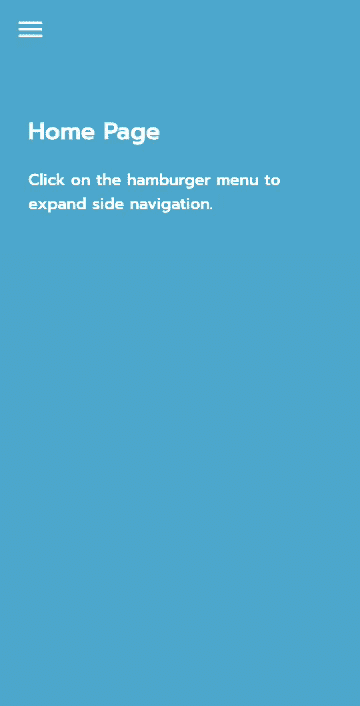
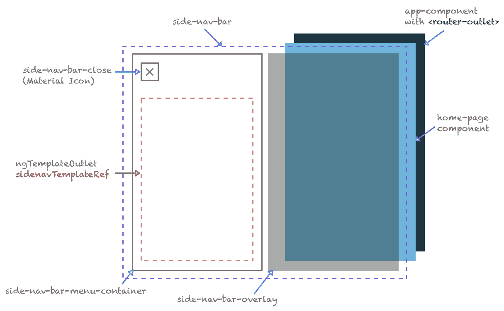
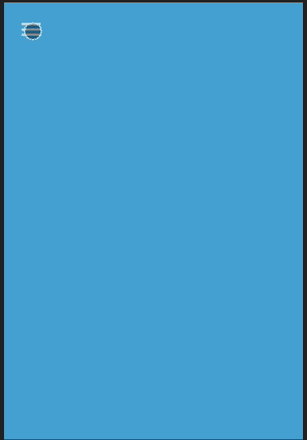
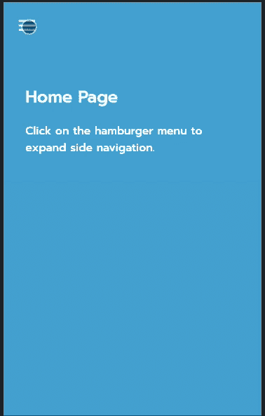
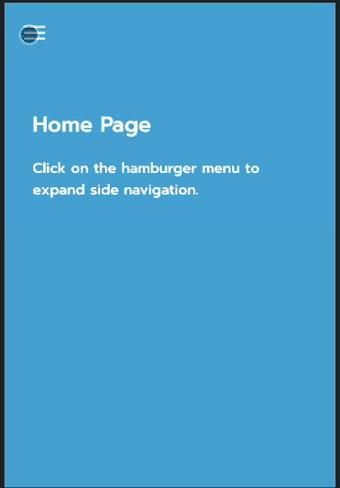

# 简单的滑动侧栏，方便您的网页应用

> 原文：<https://itnext.io/simple-sliding-side-bar-for-your-angular-web-apps-d54fef7c1654?source=collection_archive---------0----------------------->

您可以在 Angular 中创建一系列 Web 组件，避免为其导入整个库。在这篇文章中，我将为你的 Angular Web 应用程序和 pwa(渐进式 Web 应用程序)创建一个简单的滑动侧栏，你可以用它来隐藏你的菜单选项，并从应用程序的任何地方触发。
*任其滑，任其滑，任其滑！*。



> 依赖关系:[角度 CLI](https://cli.angular.io/)

让我们在 Angular 中构建一个简单而灵活的可配置滑动条(通常用于导航目的),同时学习一些重要的概念:

*   使用角度输入创建可配置组件，以增加其灵活性和可重用性
*   组件嵌入的简单模板技术
*   使用服务实现组件间高度解耦的通信
*   将 CSS 与角度指令结合使用，为角度组件创建代码最少的动画过渡

# **目标**

我们希望创建一个简单的滑动条，它具有以下功能:

*   允许用户提供从左侧或右侧滑动的选项
*   允许用户配置滑动条动画的速度
*   允许用户配置滑动条的宽度
*   允许用户配置滑动条的内容

开始吧！

# 创建项目

继续，通过 Angular CLI 使用命令创建项目

```
ng new simple-side-nav
```

在添加角度路由时选择**是**，并在项目创建过程中出现提示时选择 **SCSS** 作为样式表格式。

我将为这个项目使用[谷歌字体](https://fonts.google.com/),这样它看起来就不会那么无聊，而且我还将使用一些[网络材质图标](https://material.io/resources/icons/?style=baseline)(我将使用其中的一些图标),从 CDN 中引用它们。将下面的链接放在项目的**index.html**的 ***<头>*** 标签内。稍后我们将展示如何使用它们。

```
<link href="https://fonts.googleapis.com/icon?family=Material+Icons" rel="stylesheet"><link href="https://fonts.googleapis.com/css2?family=Alata&display=swap" rel="stylesheet">
```

你的应用程序的主 index.html 应该是这样的:

在项目的根目录下，在 **src/app** 文件夹中，我将为更好的项目结构创建几个目录。我将创建名为**组件、模型、页面**和**服务**的目录。你的结构应该看起来如下(从 ***src*** 根):

```
- src
  - app
    - components
    - pages
    - services
```

# 建立基金会

我们已经决定，我们将在这个应用程序中有几个页面和几个组件，以及路由，所以我们需要清理现有的应用程序组件页面(在项目创建期间生成)以适应这种变化。转到**app.component.html**文件，清除锅炉板内容并替换为:

我们使用 **<路由器出口>** 接入 Angular 的路由框架来显示页面。我们有两个占位符(一个用于侧边导航栏，一个用于标题——我们稍后会谈到它们)。现在，导航到 **app.component.scss** 并用以下内容替换它:

在项目的根目录下，在 src 文件夹中，项目生成一个 **styles.scss** 文件。此文件用于我们希望在全局级别应用并影响所有页面的样式，请始终小心您在此处放置的样式。在我们的例子中，我们希望让 body 标签伸展到边缘，如下所示:

> *我使用的策略是将最外层的容器(在我们的例子中是* ***，body 标签*** *)绝对定位并拉伸到页面的边缘(通过设置* ***顶部*** *，* ***右侧*** *，* ***底部*** *和*

# **创建服务**

我们需要一种方法让应用程序跟踪侧边导航栏的状态(当它打开或关闭时)，并提供一个 API 来允许感兴趣的组件利用功能，如订阅侧边导航栏的状态变化，以及改变导航栏状态的方法(以编程方式触发它打开/关闭)，所以让我们创建一个**服务**来处理这个问题。

导航到 src/app/services，并执行 Angular CLI 命令来创建服务:

```
> ng generate service navigation
***...or the short version:***
> ng g s navigation
```

这将创建一个名为 NavigationService 的服务，该服务在默认情况下是可注入的，并且可以通过依赖注入来使用。让我们用下面的代码替换它的内容:

让我们来剖析一下服务。注意在顶部我们已经创建了一个名为 **showNav$** 的**行为主体** ***私有*** 属性。这只是一个简单的 [BehaviorSubject](https://www.learnrxjs.io/learn-rxjs/subjects/behaviorsubject) 属性，它将允许用户通过该服务中提供的 API 订阅它，这样他们就可以访问它、订阅它并在该属性更改时接收通知。这是布尔型的**所以它只是一个简单的开关标志，开关状态。我们正在创建一个非常封装的服务，因此围绕它提供了以下入口点:**

*   ***getShowNav*** :该方法将 behavior subject**showNav $**公开为一个可观察对象，因此客户端可以订阅它，并在它发生变化时通过**得到通知。asObservable()** 行为主体的方法。
*   ***setShowNav*** :将 **showNav$** 设置为通过 **showHide** 参数提供的值。
*   ***toggleNavState***:简单切换数值(从真到假，反之亦然)。
*   **isNavOpen** :查询属性的当前状态(无论 **showNav$** 是真还是假)。

> 我总是喜欢创建围绕 **Observables** 和 **BehaviorSubject** 属性的方法——我建议这样做是出于可测试性的目的(远远超出了这个主题),当然也是为了提供进入这些属性的单一入口点，因此我将它创建为 private，这样访问它们的唯一方式就是通过所提供的方法。

# 创建组件

让我们通过发出 Angular CLI 命令，从主要组件—侧面导航栏开始:

```
> ng generate component side-nav
```

这为这个组件创建了我们需要的三个部分( *HTML* 、 *SCSS* 和 *TS* 文件)。我们稍后将回到这些，但首先我们要创建一个附加文件。在 **components/side-nav** 文件夹中，我将创建一个名为 **side-nav-direction.ts** 的附加文件，该文件将保存枚举**sidenav direction**——该枚举将表示侧面导航栏滑动动画的两个选项: ***左侧*** 和 ***右侧*** 。添加以下内容:

现在，让我们回到侧面导航栏组件。让我们从它的类型脚本逻辑开始。在生成的文件 **side-nav.component.ts** 中，我们删除以下内容:

我们来剖析一下这个组件。这个组件显然需要与我们在它的伙伴服务 **NavigationService** 中维护的状态保持同步，这也是我们注入它的原因。我们调用 NavigationService 的 ***getShowNav()*** ，这样我们就可以订阅返回的 **showNav$** 的 **Observable** 。

为了使该组件可配置且灵活，我们提供了四个输入属性:

*   ***sidenavTemplateRef***:这将为组件提供一个占位符，以便人们将其他子组件嵌入其中，使用 Angular 中的一个可用指令[**ngtemplateeoutlet**](https://angular.io/api/common/NgTemplateOutlet)。我们稍后再来讨论。
*   ***持续时间*** :设置侧面导航栏滑动动画的持续时间(秒)。默认值为 0.25 秒。
*   ***navWidth*** :设置侧面导航条的宽度(以像素为单位)。默认是窗口的宽度 ***innerWidth*** 。
*   ***方向*** :这里我们将使用前面创建的枚举，它将允许侧边导航栏滑出的方向。**默认为*左*右**。

除了输入之外，我们还提供了一个名为***onSideBarClose()***的便捷方法，通过服务的 **setShowNav()** 并传递 **false** 值来关闭侧边导航栏。

方法***getSideNavBarStyle()***从可观察对象 **showSideNav** 中获取展开的值，并构建一个对象，该对象馈入 Angular 的 ***ngStyle*** 的指令。我们设置一个具有三个属性的对象:

*   ***过渡*** :根据提供的**方向**和**持续时间**决定侧面导航条的过渡。
*   **width** :侧边导航条的宽度(提供或者默认为屏幕宽度)。
*   **方向**:注意我们是如何根据提供的方向动态创建 navBarStyle 对象的属性的。

```
**navBarStyle[this.direction] = 
   (showNav ? 0 : (this.navWidth * -1)) + 'px';**...which eventually turns into:**navBarStyle.left** ...or **navBarStyle.right**
```

现在让我们看看代码如何映射到
**side-nav.component.html**中的标记:

顶部容器( ***侧导航条*** )包装了覆盖层( ***侧导航条覆盖层*** )和主侧栏( ***侧导航条菜单容器*** )。

**侧导航条**在**显示侧导航条**为**真**时应用一个类(**侧导航条折叠**)。

覆盖图( **side-nav-bar-overlay** )在其背景颜色和可见性上有一个 CSS 过渡动画，该动画通过 **ngStyle** 指令基于持续时间开始，并且在 **showSideNav** 为真时添加一个类(**side-nav-bar-overlay-collapsed**)。我们想让覆盖图可点击，这样当用户点击覆盖图时，它也会关闭侧边导航条，因此也将 **onSidebarClose()** click 事件连接到它。

注意**侧导航条菜单容器**以及我们如何通过***getSideNavBarStyle***方法应用我们正在构建的 CSS 样式对象，并向该方法提供 **showSideNav** 属性的展开值。返回的对象(如前所示)也被送入 **ngStyle** 指令。

> **注意:**每次 **getSideNavBarStyle** 中的一个属性发生变化时，Angular 会重新调用它，重新生成 CSS ngStyle 对象，CSS 转换会再次启动。剩下的就交给你了。

我们添加了一个关闭按钮( **side-nav-bar-close** )来关闭边栏，边栏上有一个由 Google 的 Material Icons(之前添加的 CDN)提供的图标。

为了包装这个组件的标记，我们有一个容器(**side-nav-bar-content-container**)来包装(双关语)将显示在侧边导航栏中的内容。内容是一个使用 **ngTemplateOutlet** 选项的 **ng 容器**。一个 **NgTemplateOutlet** 只不过是一个占位符，让你动态地、编程地将内容嵌入其中。

现在，侧面导航栏的 CSS，在文件**side-nav-bar . component . scss**中:

# 应用的 CSS 技巧(和解释)

*   覆盖图的诀窍是*总是呈现* —通过使用 CSS 样式**可见性:折叠**我们允许它仍然留在原处*，同时不占用布局中的任何空间并完全隐藏元素* —点击事件仍然被覆盖图下面的元素捕获。当覆盖图可见时，它接收到隐藏侧栏的 click 事件，通过 CSS 转换，我们不仅淡化了它的背景色，还动画化了可见性，允许在折叠后继续点击。
*   让**侧边导航条**保持在顶部而不管页面滚动的诀窍是使用 position: fixed CSS 属性并给它一个高的 z-index，使它保持在顶部。
*   使用 CSS 过渡使**侧边导航栏菜单容器**具有动画效果的技巧是使其成为**位置:绝对**，因此它沿着将要发生过渡的坐标移动——在我们的例子中，是左*和右*坐标。**

这是组件的示意性外观:



你可以看到侧边导航条是如何放在边上的，而覆盖层就在那里；我们用 CSS 过渡将导航条滑入和滑出，并且我们淡化覆盖图的背景和它的可见性。侧边栏位于应用程序的顶部，而所有其他页面位于下方。

现在组件已经创建好了，让我们学习如何在应用程序中应用它。

# 我如何使用这个组件？

很简单！让我们回到 app.component.html，用以下内容更新这个组件:

请注意我们是如何通过自定义选择器 **app-side-nav** 在**app.component.html**的最顶端添加之前创建的侧面导航栏组件的，以及输入是如何提供给它的:

*   方向:右
*   导航宽度:280
*   持续时间:0.5

现在，看看我们是如何为侧边导航栏提供一个显示在其内部占位符 **sidenavTemplateRef** 中的模板的引用的:通过在标记( **ng-template #navContent** )中提供一个现有模板的 id，所发生的是 Angular 将通过 id **navContent** (实际上是这里的任何内容)获取 **ng-template** 的内容， 将其作为输入传递给 **sideNavTemplateRef** ，并将其嵌入到侧面导航栏中定义的**ngtemplateeoutlet**中，其中**ngtemplateeoutlet**引用具有相同的名称( **sideNavTemplateRef** )。 这是一种灵活的嵌入内容的方式。侧栏不知道模板出口中嵌入了什么内容——它所知道的是它得到了一些需要嵌入的内容。

# 现在我添加了它，我如何看到它的作用呢？

## 需要有人来触发它。

是啊，你说得对。为此，我们将创建一个简单的组件来表示该应用程序的标题。这样，我们将演示一个完全独立的组件如何触发侧栏的打开。

让我们发出 Angular CLI 命令，为标题创建一个新的简单组件:

```
ng generate component header
```

和往常一样，它生成了我们需要的三个部分(HTML、SCSS 和 TS 文件)。让我们从名为 **header.component.ts** 的类型脚本开始:

注意它是多么简单。它只是通过 *Angular 的依赖注入*系统将 **NavigationService** 注入其构造函数中，而在一个名为 **toggleSideNav()** 的方法内部只是调用 **setShowNav** 来 **true** 。这将触发一系列事件，将**behavior subject****show nav $**设置为 **true** ，任何订阅/收听此更改的人都将相应地采取行动。这就是异步、事件驱动编程的美妙之处！

**header.component.html**长这样:

这只是一个非常简单的布局结构，但值得一提的是，我们使用了一个 span 标签作为按钮，因为我们向它附加了一个 click 事件来触发 **toggleSideNav()** 事件，并添加了一个材质图标，使它看起来像一个汉堡包菜单(通常用于菜单)。

**header.component.scss** 的 SCSS 甚至更简单:

这些样式通过增加字体大小、添加一些填充和改变光标来改变材料图标的默认样式——使这种将图标导入应用程序的策略非常灵活和强大！

更新应用程序组件

现在我们已经创建了标题组件，现在我们有了一个可以触发侧边导航条打开的人！让我们更新 app.component.html 文件，并把标题放在正确的位置:

注意 **app-header** 选择器被放置在**主容器**容器的正内部，但也在包围**路由器出口**的部分的正上方。我们希望它总是显示在每个页面的顶部，这样无论我在哪个页面，它对整个应用程序都是全局的。

一旦所有东西都连接好了，它就会变成这样:



# 额外收获:添加主页

我创建了一个简单的组件，只是为了说明我的观点，即页面位于页眉之上，并通过应用程序组件的路由器出口显示。在 src/pages 文件夹中，我创建了名为 **home.component** 的页面组件，添加了 **app-routing.module.ts** 中所需的配置，因此它指向刚刚创建的 HomeComponent。

重新构建后，应用程序最终将如下所示:



# **额外奖励**:菜单内容的独立组件。

谈谈组件的解耦——现在我制作了一个单独的组件来容纳导航项目。我调用了组件 **side-nav-content** ，它包含了使用 Angular 路由器机制的整个应用程序的页面链接。点击链接后，它会导航到相应的页面，同时也隐藏了侧导航栏。更改后，应用程序将如下所示:



单击导航链接也会关闭侧面导航栏，但不会显式调用导航服务的 setShowNav()为 false

我如何在导航改变时关闭侧边导航条，而不显式调用 NavigationService 的 **setShowNav()** 为 false？在 **NavigationService 的**构造函数中，我注入 Angular 的 **Router** ，我监听***router.events***——任何导航动作(在我的例子中，导航改变到另一个页面)都将在附加到 Router . events 的订阅 I 中触发。

在我的 [Github Repo](https://github.com/romanejaquez/simple-side-nav) 上看到这个教程的完整实现。


就这样，我结束了这篇文章，希望这是一个对你有帮助的教程，告诉你如何利用 Angular 的力量，并带你踏上探索以下内容的旅程:

*   ***使用角度输入创建可配置组件以增加其灵活性和可重用性***——我们创建了一个简单的侧边导航栏、标题和导航链接组件，以高度解耦的方式无缝通信
*   ***用于组件嵌入的简单模板技术***——使用 NgTemplateOutlet，我们以简单而灵活的方式将组件和内容嵌入到其他组件中。
*   ***使用服务实现组件间高度解耦的通信***——使用异步、事件驱动的编程方法，使用服务与组件通信，触发事件。
*   ***使用 CSS 结合角度指令为您的角度组件*** 创建最少代码的动画过渡——我们使用 CSS 过渡结合角度指令( ***ngStyle，ngIf，ngClass*** )创建流畅简单的动画效果，使用最少的代码使您的应用程序更加完美。

同样，你可以在我的 [Github Repo](https://github.com/romanejaquez/simple-side-nav) 上看到这个教程的完整实现。

请在 Twitter [@drcoderz](https://twitter.com/drcoderz) 上关注我，看看我这些天都在做什么，别忘了在下面鼓掌以示感谢——看到掌声多少会激励我写作，所以请这样做吧！

滑的开心！