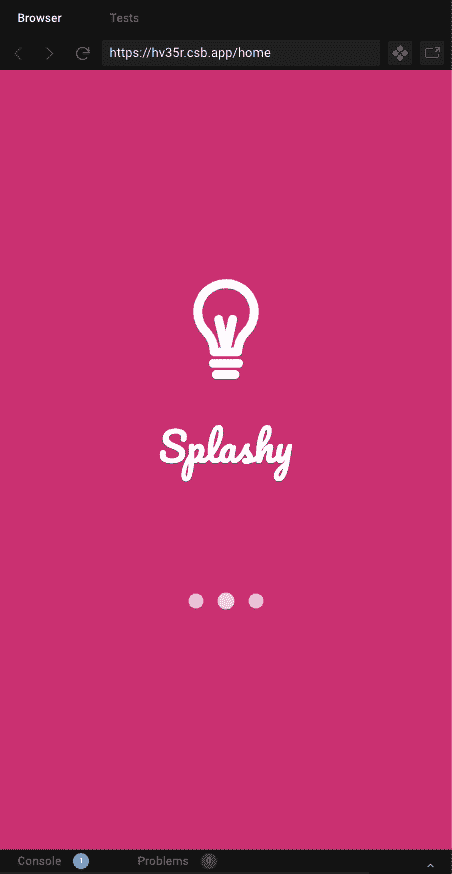
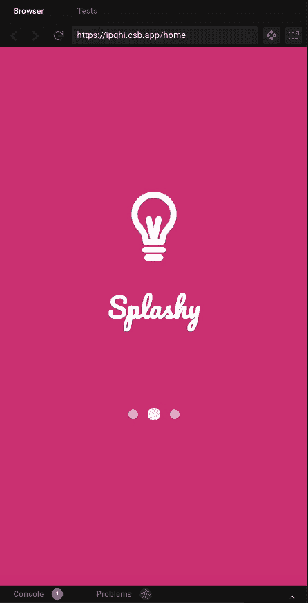

# 为您的 Angular Web 应用程序和 PWAs 提供简单的闪屏

> 原文：<https://itnext.io/simple-splash-screen-for-your-angular-web-apps-and-pwas-f4fbf897540b?source=collection_archive---------1----------------------->

您可以在 Angular 中创建一系列 Web 组件，避免为其导入整个库。在这篇文章中，我将创建一个简单而时尚的方法来为你的 Angular Web 应用程序和 PWAs(渐进式 Web 应用程序)添加闪屏，并避免你的用户在你的网站/移动应用程序加载时不得不盯着一个空白屏幕。



我讨厌盯着一个网页或网络应用一点一点加载。我宁愿通过一个漂亮的闪屏来让页面有一个漂亮优雅的介绍。这种闪屏方式在移动原生应用中更常见，但随着 web 应用和 pwa 成为一等公民，其中一些范例也在 web 上被采用。

几乎在我到目前为止构建的每个 Angular web 应用程序和基于 Angular 的 PWA 中，我都集成了闪屏，因为我的 web 应用程序更像移动应用程序，而不像网页，因此我整理了这篇文章，只是为了分享我是如何做到的，以及我是如何以一种非常简单的方式做到这一点的，而不必为了一个简单的闪屏而导入外部库。

> 从属关系:角度 CLI

# 创建项目

继续，通过 Angular CLI 使用命令创建项目

```
ng new simple-splash-screen
```

在添加角度路由时选择**是**，并在项目创建过程中出现提示时选择 **CSS** 作为样式表格式。你可以使用 LESS 或 SASS——在这篇文章中我将使用简单的 CSS 样式。

我想使用一个很酷的字体来加载，所以我将通过从 CDN 导入来导入和使用谷歌字体。将此链接放在项目的**index.html**的 ***<头>*** 标签内。稍后我们将展示如何使用它。

```
<link href=”https://fonts.googleapis.com/css2family=Pacifico&display=swap"rel=”stylesheet”/>
```

你的应用程序的主**index.html**应该是这样的:

在项目的根目录下，在 **src/app** 文件夹中，创建一个名为 **components** 的目录。在该文件夹中，我将通过在命令行中发出命令来创建闪屏组件:

```
ng generate component splash-screen
```

这就生成了有效闪屏组件所需的三个部分:HTML、CSS 和 Typescript 文件。

> 注意:记住你可以手动创建所有这些组件。通过 Angular CLI 创建它的好处在于文件创建的自动化，并导入到 **app.module.ts.**

在 splash-screen.component.html 文件中，我创建了一个非常简单的结构:外部启动页面容器( **app-splash-screen** )、将元素放在一起的内部容器( **app-splash-inner** )、徽标容器( **app-logo** ，为此我将导入一个 SVG)、标签和加载器容器( **app-loader** ，也指一个动画 SVG 加载器)。

我的 SVG 将被导入到一个名为 **src/assets** 的文件夹中，我将从那里引用图像。下面是闪屏的 CSS:

我希望在顶层使用 CSS 动画将闪屏滑动到左侧(注意上面的**app-闪屏**类中的**过渡:左侧 0.5s** 样式)。这将通过 CSS 来完成，每当我改变这个类的 left 属性时，它的改变将使用一个沿 x 轴的持续时间为 0.5 秒的过渡动画来发生。这就是我想要的默认动画。

我将它放置在页面上，方法是在页面上拉伸它，并将它的每一侧连接到屏幕的边缘(通过将它定位**固定**，并使用**位置** **左、上、右**和**底**到 **0** ，以及 100%的**宽度**和**高度**以及 100%的**z-索引**

对于类型脚本逻辑，以下是该文件:

查看上面的类型脚本文件。请注意，在上面的 HTML 文件中，我引用了属性 **windowWidth** ，这是激活应用程序闪屏容器上 CSS 过渡动画的驱动力，因此有了**[ng style]= " { left:window width } "**样式。

我还有一个名为 **showSplash** 的标志，它将在默认持续时间 0.5s(或 500 毫秒)后删除闪屏。

在 **ngOnInit()** 方法中，我们为要显示的整个闪屏动画设置了 3 秒(3000 毫秒)的超时，我们立即更改**窗口宽度**以触发屏幕左侧的 CSS 动画，方法是在显示闪屏时拾取屏幕的实际内部宽度，并将测量值转换为负值和像素，并将其分配给**窗口宽度**。这就是为什么闪屏会有向左滑动的效果。

```
this.windowWidth = “-” + window.innerWidth + “px”;
```

诀窍是在动画结束后闪屏不会保留在屏幕上，而是在动画结束后立即从屏幕上移除 CSS 转换的 0.5 秒在内部 **setTimeout** 中被考虑在内，我们只需将 **showSplash** 的值翻转为 false，这样 HTML 的 ngIf 结构指令就会选择更改并将其从屏幕上移除:

```
*ngIf=”showSplash”
```

保存您的更改。

让我们创建另一个快速简单的页面，为这个项目添加另一部分。通过在项目根目录下发出以下命令，创建一个单独的组件来表示该项目的主页或登录页面:

```
ng generate component home
```

这个页面没什么特别的，我只是在里面加了几个字符串。我创建这个单独页面的原因是，我们可以在应用程序的根目录下添加路由器出口，在 app.component.html 的**中，其他页面将通过路由器显示，而闪屏位于顶部。我们马上就到。**

现在，确保 SplashScreenComponent 和 HomeComponent 都正确导入到 **app.module.ts** 中。

确保 Home 组件是我们的 **app.routing.module.ts** 中的默认组件。这将确保我们编辑 app.component.html 并在那里添加路由器出口后，我们有一个显示出口的页面。请注意，我们将组件导入到它自己的路径中，并添加为默认路径。

现在，让我们确保在正确的地方使用闪屏。

# 使用闪屏组件

确保我们所有的部件都就位后，导航到**app.component.html**。删除该文件中的任何其他内容，只添加以下两行:

```
<splash-screen></splash-screen>
<router-outlet></router-outlet>
```

这意味着闪屏将位于应用程序的最顶端，每隔一页将通过路由器出口的视口显示。这就是为什么我们不把闪屏页面看作一个独立的页面，而是放在导航的路由器出口之上。所有页面都将位于 splash 下面，一旦动画完成，它将从视图中移除，不会影响任何其他页面。

如果您现在运行项目，您应该在 3 秒钟后看到闪屏从左侧滑动，一个 0.5 秒的平滑 CSS 动画移动到闪屏的左侧。整洁，对不对？

# 额外收获:给启动画面添加选项

如果你想让这个简单的闪屏更上一层楼，这样你就可以改变滑动动画向左或向右，或者淡出？改变载入的持续时间或者动画的持续时间怎么样？是的，你也可以这样做！

这种方法将依赖于添加一个文件来存储动画选项(在一个单独的文件中保存一个名为 **SplashAnimationType** 的枚举类型)，该文件保存了左右滑动以及淡出的选项。我创建了名为 **splash-animation-type.ts** 的文件，并存储了以下信息:

这些选项将通过**@输入**参数注入闪屏组件。下面是更新后的**闪屏:**

请注意两个新的属性 **splashTransition** 来保存将通过编程完成的过渡样式，而不是硬编码在 CSS 中，以及默认值为 1 的 **opacityChange** 来处理淡入淡出效果(也使用 CSS)并通过编程进行更改。

请注意为***animation duration***(默认为 0.5 秒)、 ***duration*** (默认为 3 秒)和***animation type***(类型为**splash animation type**enum，之前创建—默认为 **SlideLeft** )添加的三个 **@Input** 属性。)

> 提供默认值将允许您不必强制用户传递一个值来获得默认的闪屏行为—向左滑动持续 3 秒，动画持续 0.5 秒。同时非常方便灵活！

看看新引入的 switch 语句，它处理动画类型的每种情况，以及我们如何处理闪屏持续时间和动画持续时间的可配置时间，而其余的逻辑(几乎)保持不变。

现在来看看我们添加到 HTML 中的最小改动，这些改动只是为了处理新的输入和组件中包含的灵活性:

然后我更新了 CSS 文件中的 **app-splash-screen** 类，因为它不再需要 CSS 中的过渡选项，因为它们是由 Angular 通过 **ngStyle** 提供的:

```
.app-splash-screen {
   background: #d1367d;
   position: fixed;
   top: 0;
   left: 0;
   right: 0;
   bottom: 0;
   display: flex;
   justify-content: center;
   align-items: center;
   width: 100%;
   height: 100%;
   z-index: 100;
   opacity: 1;
}
```

然后，在**app.component.html**文件中，您可以将参数传递给 splash 组件，如下所示:

```
<splash-screen [animationType]=”’**slide-left**’” [duration]=”**2**" [animationDuration]="**0.5**"></splash-screen><router-outlet></router-outlet>
```

瞧啊！有了这些改变，你会得到一个更加灵活和可配置的闪屏。你可以更进一步，输入飞溅的背景颜色，图像的路径等等。天空才是极限！



这就是它的乡亲，希望你可以实现简单，但灵活的闪屏在一个简单的和有角度的方式，而不必导入额外的库，用最少的 CSS 和 Typescript。

查看[简单闪屏](https://github.com/romanejaquez/simple-splash-angular)的 Github repo 和带有[附加选项](https://github.com/romanejaquez/simple-splash-angular-with-options)的版本，或者通过 [CodeSandbox.io](https://codesandbox.io/s/nifty-cookies-ps9lf) 查看。

别忘了鼓掌(疯狂吧——免费的！)如果你觉得这篇帖子有用，就在社交媒体上关注我 [@drcoderz](https://twitter.com/drcoderz) 。

编码快乐！