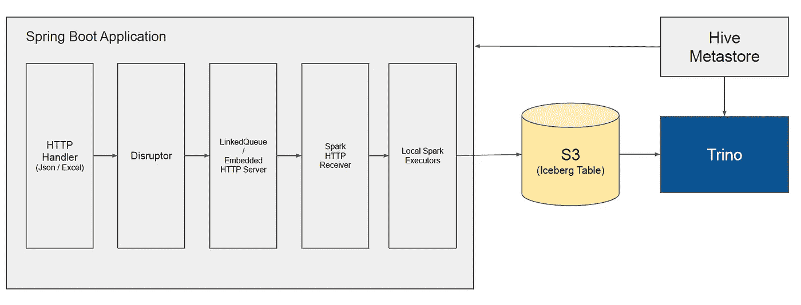

# 简单的流应用程序将 Json 导入 S3 的 Iceberg 表

> 原文：<https://itnext.io/simple-streaming-application-to-ingest-json-to-iceberg-table-in-s3-9e385c17d793?source=collection_archive---------1----------------------->


[西蒙·李](https://unsplash.com/@simonppt?utm_source=medium&utm_medium=referral)在 [Unsplash](https://unsplash.com?utm_source=medium&utm_medium=referral) 上的照片

如果你想像 S3 一样建立流媒体应用程序来将事件摄取到存储中，你可以考虑 kafka 这样的事件流媒体平台，以及 spark streaming application 这样的流媒体应用程序来消费来自 kafka 主题的事件，并将其转换和保存到 S3。

但是由于一些原因，如管理问题，如果您希望避免拥有如此庞大的 kafka 集群和 spark 流应用程序，这些应用程序需要在 kubernetes、mesos 和 yarn 等 orchestrators 上运行，您需要考虑更简单的方法来构建这样的摄取流应用程序。在这里，我将向你展示一个简单的方法。

为了理解这篇文章中的代码，复制下面的 git repo:[https://github.com/mykidong/iceberg-example](https://github.com/mykidong/iceberg-example)

# 简单摄取流应用程序的架构



一个简单的接收流应用程序基于 spring boot。

*   `Http Handler`处理传入的 json 事件和上传的 excel，它们将被转换成 json 数组。它会将 json 推送到`Disruptor`队列。
*   `Disruptor`队列将 json 转发给`LinkedQueue`。
*   `Embedded HTTP Server`正在处理来自`Spark Http Receiver`的请求，以从`LinkedQueue`获取 json。
*   `Spark HTTP Receiver`在 spark 上下文中运行将尝试向`Embedded HTTP Server`发送请求以获取 json。
*   `Local Spark Executor`在本地模式下运行将从`Spark HTTP Receiver`获取 json，并将 json 保存到 s3 中的 iceberg 表。
*   `Trino`将查询 iceberg 表中摄取的数据。

# 先决条件

在运行这个摄取应用程序之前，您需要以下内容。

*   Hive Metastore。
*   S3 桶和凭证。
*   崔诺。
*   Java 11。
*   Maven 3。

## 安装配置单元 Metastore

有许多方法可以安装 hive metastore。我将在 kubernetes 上安装 hive metastore。

安装舵操作器。

```
helm repo add dataroaster-helm-operator https://cloudcheflabs.github.io/helm-operator-helm-repo/
helm repo update

helm upgrade \
helm-operator \
--install \
--create-namespace \
--namespace trino-controller \
--version v1.1.1 \
dataroaster-helm-operator/dataroasterhelmoperator;
```

并为 hive metastore 安装 mysql。

```
cat <<EOF > hive-metastore-mysql.yaml
apiVersion: "helm-operator.cloudchef-labs.com/v1beta1"
kind: HelmChart
metadata:
  name: hive-metastore-mysql
  namespace: trino-controller
spec:
  repo: https://cloudcheflabs.github.io/mysql-helm-repo/
  chartName: dataroaster-mysql
  name: mysql
  version: v1.0.1
  namespace: hive-metastore
  values: |
    storage:
      storageClass: <storage-class>
      size: 2Gi
EOF

kubectl apply -f hive-metastore-mysql.yaml;
```

*   `<storage-class>`需要改。

最后，安装 hive metastore。

```
cat <<EOF > hive-metastore.yaml
apiVersion: "helm-operator.cloudchef-labs.com/v1beta1"
kind: HelmChart
metadata:
  name: hive-metastore
  namespace: trino-controller
spec:
  repo: https://cloudcheflabs.github.io/hive-metastore-helm-repo/
  chartName: dataroaster-hivemetastore
  name: hive-metastore
  version: v2.0.0
  namespace: hive-metastore
  values: |
    image: cloudcheflabs/hivemetastore:v3.0.0
    s3:
      bucket: <bucket>
      accessKey: <access-key>
      secretKey: <secret-key>
      endpoint: <endpoint>
EOF

kubectl apply -f hive-metastore.yaml;
```

您需要更改 s3 凭证，如`<bucket>`、`<access-key>`、`<secret-key>`和`<endpoint>`。

## 端口转发配置单元 metastore 服务

为了进行下面的演示，端口转发配置单元 metastore 服务。

```
kubectl port-forward svc/metastore 9083 -n hive-metastore
```

# 演示:Json 到冰山

对于这个简单的摄取流应用程序，您只需发送带有 http 请求的 json，然后这个摄取流应用程序会将 json 转换为 s3 中的 iceberg 表。

## HTTP REST 处理程序

主要的 http rest 处理程序是类`CollectController`。下面的代码将使用参数`schema`和`table`处理传入的 json。

```
 @PostMapping("/v1/event_log/create")
    public String create(@RequestParam Map<String, String> params) {
        return ControllerUtils.doProcess(() -> {
            String schema = params.get("schema");
            String table = params.get("table");
            String json = params.get("json");

            if(schema == null) {
                throw new NullPointerException("schema is null!");
            }
            if(table == null) {
                throw new NullPointerException("table is null!");
            }
            if(json == null) {
                throw new NullPointerException("json is null!");
            }

            // default catalog is iceberg.
            String catalog = "iceberg";

            // user.
            String user = bucket;

            // run spark streaming job.
            CollectController.singletonEventLogToIceberg(disruptorHttpReceiver,
                    user,
                    hiveMetastoreUrl,
                    bucket,
                    accessKey,
                    secretKey,
                    endpoint);

            // publish event log to disruptor.
            EventLogTranslator eventLogTranslator = new EventLogTranslator();
            eventLogTranslator.setUser(user);
            eventLogTranslator.setCatalog(catalog);
            eventLogTranslator.setSchema(schema);
            eventLogTranslator.setTable(table);
            eventLogTranslator.setJson(json);

            eventLogDisruptor.publishEvent(eventLogTranslator);

            return ControllerUtils.successMessage();
        });
    }
```

传入的 json 将被发布到`Disruptor`，在本地模式下运行的 spark streaming executors 将使用 spark http receiver 从`LinkedQueue`获取 json，并将 json 保存到 iceberg 表中。下面是在本地模式下运行的将 json 添加到 iceberg 表的 spark 流代码。

```
 private static Thread saveEventLogToIceberg(DisruptorHttpReceiver receiver,
                                                String user,
                                                String metastoreUrl,
                                                String bucket,
                                                String accessKey,
                                                String secretKey,
                                                String endpoint) {
        Thread t = new Thread(() -> {
            SparkStreamingInstance sparkStreamingInstance = SparkStreamingContextCreator.singleton(user, metastoreUrl, bucket, accessKey, secretKey, endpoint);
            JavaStreamingContext ssc = sparkStreamingInstance.getJavaStreamingContext();
            SparkSession spark = sparkStreamingInstance.getSpark();

            // receive event log from spark http receiver.
            JavaDStream<EventLog> eventLogDStream = ssc.receiverStream(receiver);

            eventLogDStream.foreachRDD(rdd -> {
                try {
                    List<EventLog> eventLogs = rdd.collect();
                    Map<String, List<String>> eventMap = new HashMap<>();
                    for (EventLog eventLog : eventLogs) {
                        String schema = eventLog.getSchema();
                        String table = eventLog.getTable();
                        String tableName = "hive_prod." + schema + "." + table;
                        String json = eventLog.getJson();

                        if (eventMap.containsKey(tableName)) {
                            eventMap.get(tableName).add(json);
                        } else {
                            List<String> jsonList = new ArrayList<>();
                            jsonList.add(json);
                            eventMap.put(tableName, jsonList);
                        }
                    }

                    for (String tableName : eventMap.keySet()) {
                        List<String> jsonList = eventMap.get(tableName);
                        StructType schema = spark.table(tableName).schema();
                        Dataset<String> jsonDs = spark.createDataset(jsonList, Encoders.STRING());
                        Dataset<Row> df = spark.read().json(jsonDs);

                        // write to iceberg table.
                        Dataset<Row> newDf = spark.createDataFrame(df.javaRDD(), schema);
                        newDf.writeTo(tableName).append();
                    }
                } catch (Exception e) {
                    e.printStackTrace();
                    System.err.println(e.getMessage());
                }
            });

            ssc.start();
            try {
                ssc.awaitTermination();
            } catch (InterruptedException e) {
                e.printStackTrace();
            }

        });
        t.start();

        return t;
    }
```

## Maven 构建

让我们构建所有的项目源。

```
cd <iceberg-example-src-root>;
mvn -e -DskipTests=true clean install;
```

## 运行简单的摄取流应用程序

导出 s3 凭据环境变量。

```
cd data-api;

# export s3 credential environment variables.
export S3_CREDENTIAL_BUCKET="<bucket>";
export S3_CREDENTIAL_ACCESS_KEY="<access-key>";
export S3_CREDENTIAL_SECRET_kEY="<secret-key>";
export S3_CREDENTIAL_ENDPOINT="<endpoint>";
```

您需要更改 s3 凭证，如`<bucket>`、`<access-key>`、`<secret-key>`和`<endpoint>`。

和运行应用程序。

```
mvn -e spring-boot:run;
```

该应用程序正在监听`8097`的端口。

## 使用 Trino 创建冰山表

在将 json 事件推送到这个摄取流应用程序之前，您需要创建 iceberg 表。让我们使用 trino 创建冰山表。

请注意，表列名必须是字母数字序列。

```
-- create schema.
CREATE SCHEMA IF NOT EXISTS iceberg.iceberg_db;

-- create table.
CREATE TABLE iceberg.iceberg_db.test_iceberg (
    baseproperties ROW(eventtype varchar, 
                       ts bigint, 
                       uid varchar, 
                       version varchar), 
    itemid varchar, 
    price bigint, 
    quantity bigint 
)
WITH (
    partitioning = ARRAY['itemid'],
    format = 'PARQUET'
);
```

## 将 json 事件推送到简单的摄取流应用程序

将 json 事件推送到摄取流应用程序的测试用例如下所示。

```
 @Test
    public void pushEventLogs() throws Exception {
        String host = System.getProperty("host", "http://localhost:8097");
        String eventCount = System.getProperty("eventCount", "1000");

        String schema = "iceberg_db";
        String table = "test_iceberg";
        String json = StringUtils.fileToString("data/test.json", true);
        String lines[] = json.split("\\r?\\n");

        String urlPath = host + "/v1/event_log/create";

        int MAX = Integer.valueOf(eventCount);
        int count = 0;
        while(true) {
            for (String jsonLine : lines) {
                FormBody.Builder builder = new FormBody.Builder();
                builder.add("schema", schema);
                builder.add("table", table);
                builder.add("json", jsonLine);

                // parameters in body.
                RequestBody body = builder.build();
                Request request = new Request.Builder()
                        .url(urlPath)
                        .addHeader("Content-Length", String.valueOf(body.contentLength()))
                        .post(body)
                        .build();
                RestResponse restResponse = ResponseHandler.doCall(simpleHttpClient.getClient(), request);
                count++;
            }
            try {
                //Thread.sleep(1000);
            } catch (Exception e) {
                e.printStackTrace();
            }
            if(count > MAX) {
                break;
            }
        }
    }
```

运行以下测试用例，将 json 事件推送到摄取流应用程序。

```
mvn -e -Dtest=EventLogClientTestRunner test;
```

## 用 trino 查询冰山表中的数据

您可以使用 trino 查询 iceberg 表中的 json 数据。

```
trino> select * from iceberg.iceberg_db.test_iceberg limit 10;
                           baseproperties                            |    itemid    | price | quantity
---------------------------------------------------------------------+--------------+-------+----------
 {eventtype=cart-event, ts=1527304486873, uid=any-uid0, version=7.0} | any-item-id0 |  1000 |        2
 {eventtype=cart-event, ts=1527304486873, uid=any-uid0, version=7.0} | any-item-id0 |  1000 |        2
 {eventtype=cart-event, ts=1527304486873, uid=any-uid0, version=7.0} | any-item-id0 |  1000 |        2
 {eventtype=cart-event, ts=1527304486873, uid=any-uid0, version=7.0} | any-item-id0 |  1000 |        2
 {eventtype=cart-event, ts=1527304486873, uid=any-uid0, version=7.0} | any-item-id0 |  1000 |        2
 {eventtype=cart-event, ts=1527304486873, uid=any-uid0, version=7.0} | any-item-id0 |  1000 |        2
 {eventtype=cart-event, ts=1527304486873, uid=any-uid0, version=7.0} | any-item-id0 |  1000 |        2
 {eventtype=cart-event, ts=1527304486873, uid=any-uid0, version=7.0} | any-item-id0 |  1000 |        2
 {eventtype=cart-event, ts=1527304486873, uid=any-uid0, version=7.0} | any-item-id0 |  1000 |        2
 {eventtype=cart-event, ts=1527304486873, uid=any-uid0, version=7.0} | any-item-id0 |  1000 |        2
(10 rows)

Query 20221210_090448_00014_ti52p, FINISHED, 1 node
Splits: 258 total, 258 done (100.00%)
2.29 [3.02K rows, 809KB] [1.32K rows/s, 353KB/s]
```

```
trino> select count(*) from iceberg.iceberg_db.test_iceberg;
 _col0
-------
  1008
(1 row)

Query 20221210_090643_00021_ti52p, FINISHED, 1 node
Splits: 93 total, 93 done (100.00%)
0.69 [1.01K rows, 217KB] [1.46K rows/s, 315KB/s]
```

好的，工作正常。

# 演示:超越冰山

将 excel 文件上传到该摄取流应用程序，然后该摄取流应用程序将 excel 转换为 json，并最终将 json 保存到 s3 中的 iceberg 表。对于这个 excel 上传案例，您不必事先创建 iceberg 表。这个摄取流应用程序将自动为您做。

## HTTP REST 处理程序

下面是 excel 上传处理程序，与上面提到的 json 事件处理程序非常相似。

```
 @RequestMapping(path = "/v1/excel/upload", method = POST, consumes = { MediaType.MULTIPART_FORM_DATA_VALUE })
    public String uploadExcel(@RequestParam Map<String, String> params, @RequestPart MultipartFile file) throws Exception{
        return ControllerUtils.doProcess(() -> {
            String schema = params.get("schema");
            String table = params.get("table");

            // default catalog is iceberg.
            String catalog = "iceberg";

            // schema name.
            String schemaName = "hive_prod." + schema;

            // table name.
            String tableName = schemaName + "." + table;

            // user.
            String user = bucket;
            // run spark streaming job.
            CollectController.singletonEventLogToIceberg(disruptorHttpReceiver,
                    user,
                    hiveMetastoreUrl,
                    bucket,
                    accessKey,
                    secretKey,
                    endpoint);

            SparkStreamingInstance sparkStreamingInstance = SparkStreamingContextCreator.singleton(user, hiveMetastoreUrl, bucket, accessKey, secretKey, endpoint);
            SparkSession spark = sparkStreamingInstance.getSpark();

            // convert excel to json list.
            List<Map<String, Object>> rowList = excelToJson(file.getInputStream(), schemaName, tableName, spark, true);

            for(Map<String, Object> row : rowList) {
                // publish event log to disruptor.
                EventLogTranslator eventLogTranslator = new EventLogTranslator();
                eventLogTranslator.setUser(user);
                eventLogTranslator.setCatalog(catalog);
                eventLogTranslator.setSchema(schema);
                eventLogTranslator.setTable(table);
                eventLogTranslator.setJson(JsonUtils.toJson(row));

                eventLogDisruptor.publishEvent(eventLogTranslator);
            }

            return ControllerUtils.successMessage();
        });
    }
```

## 将 excel 文件上传到摄取流应用程序

您可以将 excel 文件上传到摄取流应用程序，以便将 excel 数据添加到 iceberg 表中。

```
curl -XPOST \
http://localhost:8097/v1/excel/upload \
--form  "schema=iceberg_db" \
--form  "table=excel_to_json" \
--form  "file=@/home/opc/iceberg-example/data-api/src/test/resources/data/excel-to-json2.xlsx" \
;
```

您需要更改`file`参数，它是 excel 文件的路径。看看`schema`和`table`值，如果不存在，摄取流应用程序会自动创建这些值。

## 用 Trino 查询 Iceberg 表中的 Excel 数据

您可以使用 trino 查询 iceberg 表中上传的 excel 摄取的数据。

```
trino> select * from iceberg.iceberg_db.excel_to_json;
     name     | age  | address |    male
--------------+------+---------+-------------
 Hamsongro 63 | 20.0 | true    | Kidong Lee
 í<U+0095>¨ì<U+0086>¡ë¡<U+009C> 63    | 21.0 | false   | ì<U+009D>´ê¸°ë<U+008F><U+0099>
 í<U+0095>¨ì<U+0086>¡ë¡<U+009C> 63    | 21.0 | false   | ì<U+009D>´ê¸°ë<U+008F><U+0099>2
 í<U+0095>¨ì<U+0086>¡ë¡<U+009C> 63    | 21.0 | false   | ì<U+009D>´ê¸°ë<U+008F><U+0099>3
 í<U+0095>¨ì<U+0086>¡ë¡<U+009C> 63    | 21.0 | false   | ì<U+009D>´ê¸°ë<U+008F><U+0099>4
 í<U+0095>¨ì<U+0086>¡ë¡<U+009C> 63    | 21.0 | false   | ì<U+009D>´ê¸°ë<U+008F><U+0099>5
 í<U+0095>¨ì<U+0086>¡ë¡<U+009C> 63    | 21.0 | false   | ì<U+009D>´ê¸°ë<U+008F><U+0099>6
 Hamsongro 63 | 20.0 | true    | Kidong Lee2
 Hamsongro 63 | 20.0 | true    | Kidong Lee3
              | 20.0 | true    | Kidong Lee4
 í<U+0095>¨ì<U+0086>¡ë¡<U+009C> 63    | 21.0 | false   | ì<U+009D>´ê¸°ë<U+008F><U+0099>7
(11 rows)

Query 20221210_091713_00023_ti52p, FINISHED, 1 node
Splits: 2 total, 2 done (100.00%)
0.28 [11 rows, 3.78KB] [39 rows/s, 13.4KB/s]
```

```
trino> select count(*) from iceberg.iceberg_db.excel_to_json;
 _col0
-------
    11
(1 row)

Query 20221210_091746_00024_ti52p, FINISHED, 1 node
Splits: 11 total, 11 done (100.00%)
0.61 [11 rows, 2.92KB] [18 rows/s, 4.8KB/s]
```

正如现在所看到的，有一种简单的方法来构建这样的摄取流应用程序，以便将 json 摄取到 s3 中的 iceberg 表，而不必在集群模式下运行如此大的 kafka 集群和 spark 流应用程序。要横向扩展这个摄取流应用程序(它只是一个处理更多 json 请求和 excel 上传的 spring boot 应用程序),有一种方法可以让您在 kubernetes 上轻松地横向扩展这个摄取流应用程序。