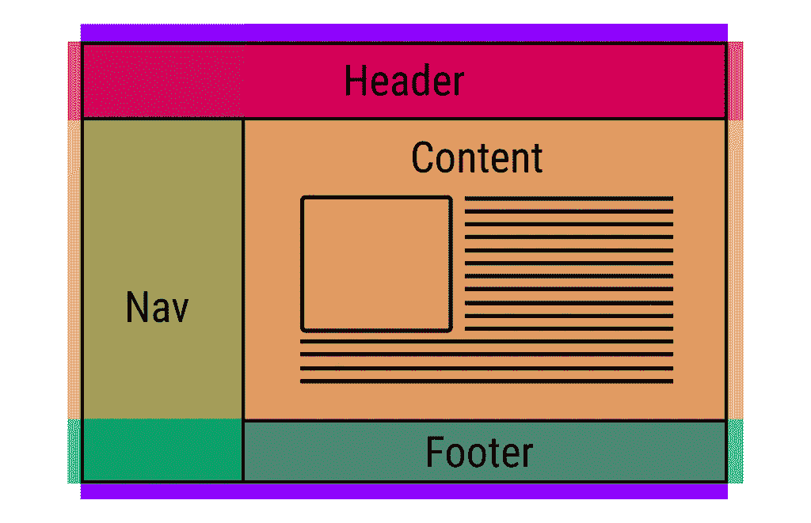

# 带有 CSS 网格的简单 Web 布局

> 原文：<https://itnext.io/simple-web-layout-with-css-grid-ec6be5086531?source=collection_archive---------3----------------------->



*图片来自谷歌开发者*

最近，我有机会使用 CSS 网格布局。老实说，我对在多种设备上操作网页布局的简单程度感到惊讶。

在没有任何框架的情况下，我只需要几行代码就可以确定桌面、平板和移动设备的布局。理解 HTML 和 CSS 的结构也非常容易。我们根本不需要改变 HTML 的结构。

HTML 结构总是一样的。

```
<div class="container">
  <header>HEADER</header>
  <nav>NAV</nav>
  <main>MAIN</main>
  <aside>ASIDE</aside>
  <footer>FOOTER</footer>
</div>
```

对于容器，我们只需要确定行数和列数。我真的不想讨论所有技术术语的细节。它在互联网上随处可见，比如来自 [Mozilla](https://developer.mozilla.org/en-US/docs/Web/CSS/CSS_Grid_Layout) 或 [GridbyExample](https://gridbyexample.com/learn/) 。

```
.container{
  display: grid;
  grid-template-rows: 1fr 5fr 1fr;
  grid-template-columns: 2fr 5fr 3fr;
  grid-template-areas: 
    "header header header"
    "nav main aside"
    "footer footer footer";
  grid-gap: .75em;
}
```

然后我们可以设置容器下所有元素的位置。

```
header{
    grid-area: header;
    background-color: teal;
}
nav{
    grid-area: nav;
    background-color: tomato;
}
main{
    grid-area: main;
    background-color: lightblue;
}
aside{
    grid-area: aside;
    background-color: orange;
}
footer{
    grid-area: footer;
    background-color: lightgreen;
}
```

对于不同设备上的不同布局，我们只需要重构行和列。

```
// For tablet viewers 
 [@media](http://twitter.com/media)(max-width: 768px){
    grid-template-rows: 1fr 1fr 5fr 1fr;
    grid-template-columns: 2fr 5fr 3fr;
    grid-template-areas: 
    "header header header"
    "nav nav nav"
    "main main aside"    
    "footer footer footer";
 }
```

而对于移动设备，我们其实什么都不用做。请记住，您总是首先为移动设备进行设计。

```
[@media](http://twitter.com/media)(max-width: 480px){
    display: block;
}
```

瞧啊。由于 CSS Grid 的强大功能，现在您有了一个非常简单的布局，只有几行代码。

你可以通过我的 Codepen 来玩这个。

尽管目前 CSS 网格不支持所有的浏览器，但是有很多方法可以改进。不要让它阻止你加入群体；)

[**在 Twitter**](https://twitter.com/dale_nguyen) 上关注我，了解 Angular、JavaScript & WebDevelopment 的最新内容👐